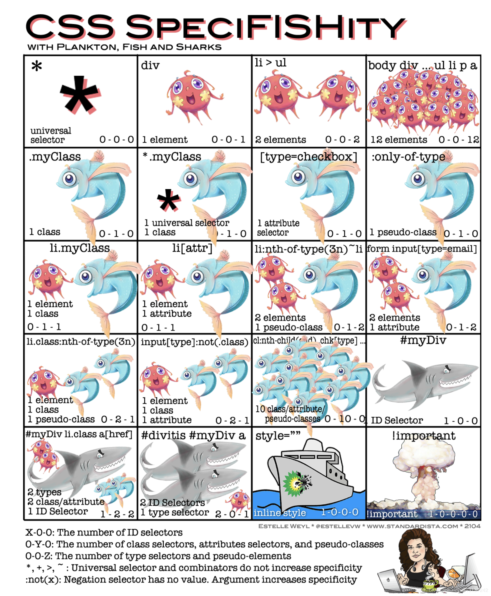
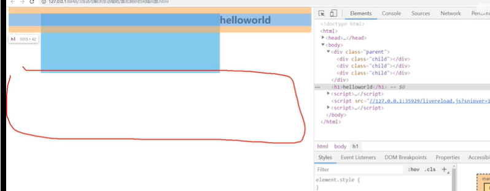
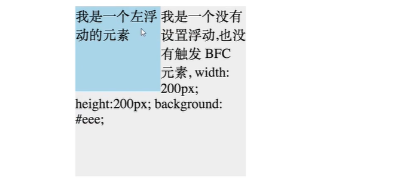
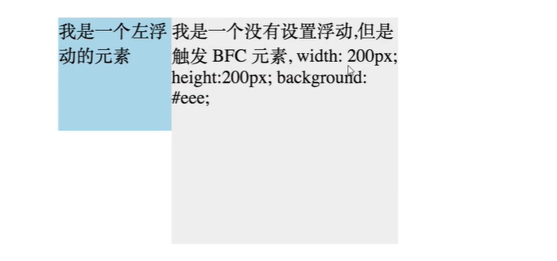

# 概念题

## 行内元素块级元素

## css选择器优先级

!important	>	内联	>	id	>	class	=	伪类	=	属性[attr]	>	标签tag	=	伪元素	>	通用选择器（*）、子选择器（>）、相邻选择器（+）、同胞选择器（~）




## 浏览器盒模型

CSS盒模型分为IE盒模型和标准盒模型,就是html元素渲染时所占据的空间布局，可以通过box-sizing来设置。

IE盒模型指的是在低版本IE下，元素的宽度包含border和padding

标准盒模型指的是content宽度，不包括padding和border。

box-sizing:content-box 标准

box-sizing:border-box 怪异

- padding-box                                                                                                                                                                                                                                                                                                                                                                                                                                                                                                                                                                                                                                                                                                                                                                                                                                                                                                                                                                                                                                                                                                                                                                                                                                                                                                                                                                                                                                                                                                                                                                                                                                                                                                                                                                                                                                                                                                                                                                                                                                                                                                                                                                                                                                                                                                                                                                                                                                                                                                                                                                                                                                                                                                                                                                                                                                                                                                                                                                                                                                                                                                                                                                                                                                                                                                                                                                                                                                                                                                                                                                                                                                                                                                                                                                                                                                                                                                                                                                                                                                                                                                                                                                                                                                                                                                                                                                                                                                                                                                                                                                                                                                                                                                                                                                                                                                                                                                                                                                                                                                                                

- margin-box 浏览器没有

## flex布局

## 浮动和清除浮动

浮动：可以设置元素脱离文档流，向左或者向右，靠近父元素的边缘或者是设置了浮动的其他元素的边缘靠拢

1. 给图片加浮动，浮动解决文字不能包围图片的问题
2. 给行内块元素加浮动，解决行内块元素间隔问题
3. 左右排版布局

缺点：子元素浮动后父元素的高度会塌陷。会使得父元素的兄弟元素跑上去，但是图片会被挤到浮动外面




解决方法

1. 父元素设置高度

2. 父元素添加一个子元素，给这个子元素clear:both

3. 父元素添加clearfix类

   ```css
   .clearfix::after{
       content:"";
       display:block;
       clear:both;
   
   }
   ```


## BFC是什么

**fc是格式上下文，BFC，IFC内联，GFCgrid布局 ,FFCflex布局。**

>BFC 就是块级格式上下文，是页面盒模型布局中的一种 CSS 渲染模式，相当于一个独立的容器，里面的元素和外部的元素相互不影响。创建 BFC 的方式有：
>
>1. html 根元素
>2. float 浮动
>3. 绝对定位
>4. overflow 不为 visiable
>5. display 为表格布局table-cell或者弹性布局，

我觉得就有点像作用域，块级格式化上下文，是一个独立的渲染区域。在于BFC内部的元素和外部隔离，使得内部和外部元素不会互相影响,内部无论怎么操作都不影响外部。

**规则**

- BFC内部box会在垂直方向，一个接一个地放置
- 在一个BFC中，两个相邻的块级盒子的垂直外边距会产生折叠。
- 在BFC中，每一个盒子的左外边缘（margin-left）会触碰到容器的左边缘(border-left)（对于从右到左的格式来说，则触碰到右边缘）
- `BFC` 的区域不会与 `float` 的元素区域重叠。浮动元素会移到bfc元素右边。
- 计算 `BFC` 的高度时，浮动子元素也参与计算
- 文字层不会被浮动层覆盖，环绕于周围

**应用**

- 防止同一容器内相邻元素外边距合并
- 清除容器内部浮动。
- 自适应两栏布局。
- 父元素bfc,元素塌陷

特性应用：

**1.同一bfc下外边距会折叠**

两个div元素在同一个bfc容器下(body元素)，所以会外边距重叠。如果想避免合并可以给他们外部分别包含两个bfc容器。

```html
<style>
  .container{
    overflow:hidden
  }
  p{
    margin:100px;
    width:100px;
    height:100px;
  }
</style>
<div class='container'>
  <p></p>
</div>
<div class='container'>
  <p>
    
  </p>
</div>
```

**2.BFC可以包含浮动元素( 解决父元素塌陷)**

父元素触发BFC，可以解决子元素脱离文档流造成父元素塌陷的问题

**3.BFC阻止元素被浮动元素覆盖**

```html
<div style='h100w100;float:left;'>
  我是个左浮动
</div>
<div style='w200h200'>
  我没有浮动
</div>
```



```html
<div style='h100w100;float:left;'>
  我是个左浮动
</div>
<div style='w200h200overflow:hidden'>
	我触发BFC
</div>
```



这种方式实现两列布局。

**垂直方向边距解决重叠:**

```css
father{
	overflow:hidden;
	margin-top:10px;
	children{
		margin-top:20px;
	}
}
```

**左固定右自适应:**

给右侧元素创建bfc,使得他和左侧float元素不重叠；

```
.container{
	left{
		float:left;
		width:100;
		height:100px;
	}
	right{
		height:110px;
		overflow：auto;
	}
}
```

**子元素浮动父元素高度塌陷:**

```
.float{
	float:left
}
.container{
	overflow:auto;
	//float:left;
}
```

```html
div.container
	>div.float
```

## 响应式布局

## div+css布局的好处

1. 代码精简，且结构与样式分离，易于维护 

2. 代码量减少了，减少了⼤量的带宽，⻚⾯加载的也更快，提升了⽤户的体验 

3. 对SEO搜索引擎更加友好，且H5⼜新增了许多语义化标签更是如此 

4. 允许更多炫酷的⻚⾯效果，丰富了⻚⾯

5. 符合W3C标准，保证⽹站不会因为⽹络应⽤的升级⽽被淘汰

缺点: 不同浏览器对web标准默认值不同，所以更容易出现对浏览器的兼容性问题。 

## 如何解决a标签点击后hover失效?

love hate,给女朋友买了lv包包，女朋友haha大笑   

`a:link`未访问的样式,省略成a。`a:visited`已经访问的样式

`a:hover`鼠标移动上的样式 `a:active`鼠标移开的样式

## calc,support,media各自含义和用法

- calc() 函数用于动态计算长度值。支持+-*/运算符前后都需要保留一个空格 `    width: calc(100% - 100px); `

- support:浏览器兼容性问题

  ```html
  @supports ((transition-property: color) or (animation-name: foo)) and (transform: rotate(10deg)) {
       /*自己的样式 */
  }
  ```

- media:通过媒体查询可以为不同大小和尺寸的媒体定义不同的css，适应相应的设备的显示。

  ```js
  @media (max-width: 700px) {
  
  }
  ```


## 过渡动画和关键帧动画的区别?

- 过渡动画需要有状态变化
- 关键帧动画不需要有状态变化，控制更精细，你可以控制他播放顺序等等。

## css sprite是什么？有什么优缺点？

- 概念：将多个小图片拼接到一个图片中。通过`background-position`和元素尺寸调节需要显示的背景图案。
- 优点：减少http请求次数，增加图片信息重复度，整体图片风格更换容易、
- 缺点：增大维护和设计难度，合并很麻烦