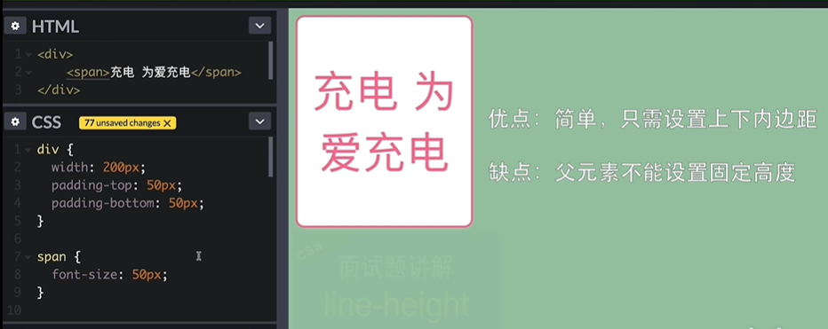
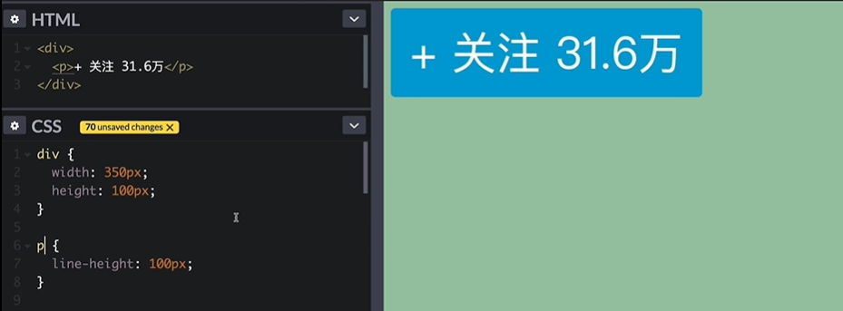
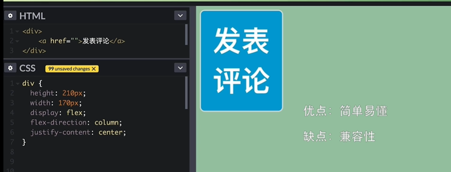
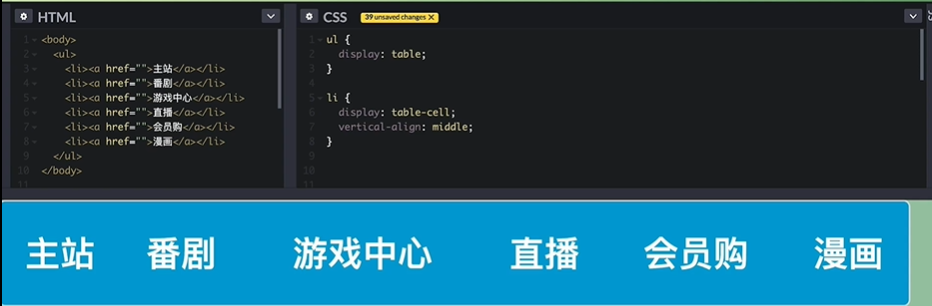
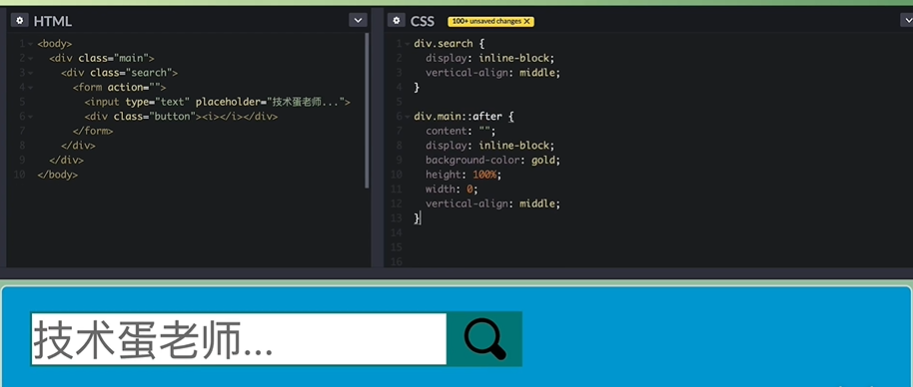
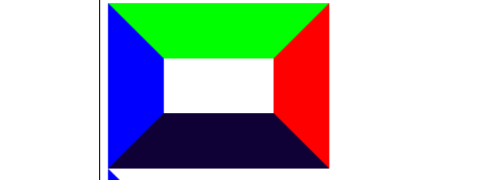
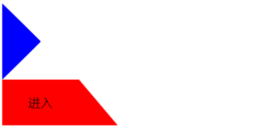
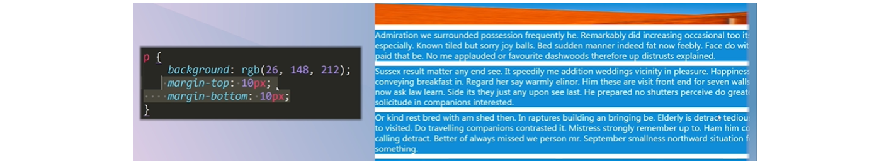

# css面试题

## css如何居中?

### 水平居中

1. margin:0 auto;   ie5和ie6:在body加text-align:center

2. absolute定位+left50%+margin-left负的宽度一般

3. absolute定位+left50%+transform:translateX(-50%)

4. flex布局，flex-direction为默认row时，水平主轴(main axis)使用 justify-content:center;主轴居中。

5. inline元素的父元素设置text-align:center;

6. 浮动元素居中

   ```css
   .square{
       float: left;
       position: relative;
       left: 50%;
       transform: translateX(-50%);
   }
   ```

   ```
   body>div.square+div.line
   ```

7. 绝对定位居中

   ```css
   span{
   	position:abslute;
   	left:0;
   	right:0;
   	margin:0 auto  
   }
   ```

   ```css
   span{
   	position:abslute;
   	left:0;
   	right:0;
   	widht:120px;
   	left:50%;
   	margin-left:-60px  //或者 transform: translateX(-50%);
   }
   ```

### 垂直居中

**文字垂直居中**

1. 内边距

   

2. 行内元素-line-height等于父元素的高。

   line-height是基线之间的距离，line-height和fontsize之差得到行距。当line-height等于父元素高度，就没有行距了，就变成一行了。但是p这种自带marigin就不行

   

3. 多行文字垂直居中  ie9+

   

4. 列表

   配合中线排列

   

5. gird

   ```css
   ul{
   	display:grid;
   	grid-template-colums:repeat(6,1fr);
   	align-items:center;
   	justify-content:center
   }
   ```

6. 定位

   ```
   position
   top:50%
   margin-top:自身宽高一般
   ```

7. 伪元素+利用行内元素基线对齐

   需要给他一个元素作为对比

   

   ```
   div{
   	display:inline-blick;
   	vertial-align:middle
   }
   div::after{
   	content:'';
   	display:inline-block;
   	width:0;
   	vertial-align:middle
   }
   ```


## css绘制三角形和直角梯形

css绘制三角形和梯形利用对角分割，边框会沿着对角线分布：



```css
#triangle {
    width:0;
    border:10px solid transparent;
    border-left-color:#f00
}
```

```css
#trapezoid {
	width:200px;
	border-bottom:50px solid #f00;
	border-right:20px solid transparent;
	height:0;
	line-height:50px;
	text-align:center;
}
```



## 三栏布局

**假设高度已知，请写出三栏布局，其中左栏，右栏宽度各300px,中间自适应**

简述:

>- 首先就是浮动，左右浮动；注意要把center放在right下面。
>
>浮动后脱离文档流，但是兼容性比较好，基本上淘宝呀，百度呀全是浮动
>
>- 其次是定位。
>
>好处是快捷，缺点是脱离文档流，导致子元素脱离文档流，有效性查
>
>- 再次是flex布局，他是比较完美的，特别是移动端基本都是flex布局
>
>- 最后是表格布局，他对SEO不友好，性能不行，但是他兼容性好，当使用flex不行的时候，可以使用这个，他其中的一个单元格高度超出，会使得其他的单元格高度跟着变
>- 还有就是grid布局，他是新出的技术，就像栅格布局960布局为宽度，12行12列，grid布局就把他标准化，不再使用模拟做网格布局。grid布局可以做很多复杂的事情，代码量少的多。

**方法1：**

左侧左浮动，右侧右浮动，中间的设置margin左右外边距

```css
.left {
  float: left;
  width: 300px;
  background: #ff0000;
}

.right {
  float: right;
  width: 300px;
  background: #00ff00;
}

.center {
  background: #0000ff;
}
```

```html
<div class="left">123</div>
<div class="right"></div>
<div class="center">
  <h1>浮动解决方案</h1>
</div>
```

**方法2：**

绝对定位

```css
div {
  position: absolute;
  height: 400px;
}

div.left {
  left: 0;
  width: 300px;
  background: #ff0000;
}

div.right {
  right: 0;
  width: 300px;
  background: #00ff00;
}
div.center{
  position: absolute;
  left: 300px;
  right: 300px;
  min-width: 300px;
  background: #0000ff;
}
```

```htm
<div class="left"></div>
<div class="right"></div>
<div class="center">aaaaaaaa</div>
```

**方法3**

flex-box

```css
.container{
    display:flex;
    .left,.right{
        width:300;
        background:red
    }
    .center{
        flex:1;
        background:yellow
    }
}
```

```html
<div class="container">
  <div class="left"></div>
  <div class="center"></div>
  <div class="right"></div>
</div>
```

**方法4**

table-cell 

>```
>row
>```

父元素display:table

子元素display:table-cell

```css
.container {
  width: 100%;
  display: table;
  height: 100px;
}
.container>div {
  display: table-cell;
}
.left {
  width: 300px;
  background: #0000ff;
}
.center {
  background: #ff0000;
}
.right {
  width: 300px;
}
```

```htm
<div class="container">
  <div class="left"></div>
  <div class="center">aaa</div>
  <div class="right"></div>
</div>
```

**方法5**

grid布局

```css
.container {
  display: grid;
  width: 100%;
  grid-template-rows: 100px;
  grid-template-columns: 300px auto 300px;
}
```

```html
<div class="container">
  <div class="left" style="background: #f00;"></div>
  <div class="center">aaa</div>
  <div class="right" style="background: #0000ff;"></div>
</div>
```

## 如果去掉高度已知

如果高度未知，表格布局和flex布局基本通用。


为什么浮动内容超出？

内容向左浮动时，被左侧块挡住，当内容超出他发现左边没有的话就会往左移动了。浮动脱离文档流但是不脱离文字流。 如果我不想。可以给中间创建bfc,或者中间的设置左右margin

## 谈谈你对CSS盒模型的认识

CSS盒模型分为IE盒模型和标准盒模型；

IE盒模型指的是在低版本IE下，元素的宽度包含border和padding

标准盒模型指的是content宽度，不包括padding和border。

box-sizing:content-box 标准

box-sizing:border-box 怪异

## JS如何获取宽高？

方法1：div.style.width/height获取DOM节点的内联属性的宽高。无法取到style节点和外链的

方法2：div.currentStyle.width/height获取到渲染以后的宽高。只有IE支持

方法3：window.getComputedStyle(dom).width/height 谷歌和火狐支持

方法4：div.getBoundingClinetRect().width/height：拿到left top width height四个属性；

## 外边距重叠解决？

外边距塌陷设计初衷：解决**块级元素**段落之间垂直方向的空隙,



**外边距计算**

1. 正数&&正数：最大的数
2. 负数&&负数/不设置：绝对值最大的数
3. 正数&&负数：相加的和

空元素是选择他的m-t和m-b最大值；

**父子元素**

A和B父子共享垂直方向的外边距，取两者更大的，所以相当于A距离兄弟C20px

解决方法： 

- 只要父子之间有东西间隔，不管是内边距边框文字或者高度都

- 子元素设置浮动，或者子元素inline-block,并且设置宽高

- 或者设置相对定位，并使用top而不是margin,

bfc方法:

父元素overflowhidden

父元素设置padding和margin,子元素不能设置margin。

父元素顶部设置边框,就会防止父子的margin合并

## BFC是什么？

块级格式化上下文，还有一个IFC内联元素格式化上下文；

**原理：**

- bfc垂直方向元素边距重叠(外边距重叠)
- bfc区域不会和浮动元素的box重叠(侧边栏不等高)
- bfc外面的元素和里面的元素不会互相影响
- 计算bfc高度，浮动元素也会计算。(用于清除浮动)

**创建bfc:**

- overflow不为visible;
- float不为none

- position不是relative或者static
- display:table-cell table

## **bfc使用场景**

**垂直方向边距解决重叠:**

```css
father{
	overflow:hidden;
	margin-top:10px;
	children{
		margin-top:20px;
	}
}
```

**左固定右自适应:**

给右侧元素创建bfc,使得他和左侧float元素不重叠；

```
.container{
	left{
		float:left;
		width:100;
		height:100px;
	}
	right{
		height:110px;
		overflow：auto;
	}
}
```

**子元素浮动父元素高度塌陷:**

```
.float{
	float:left
}
.container{
	overflow:auto;
	//float:left;
}
```

```html
div.container
	>div.float
```

