# 正则表达式

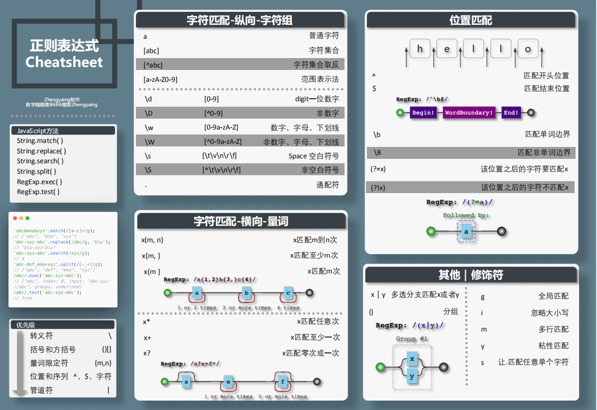

## js方法

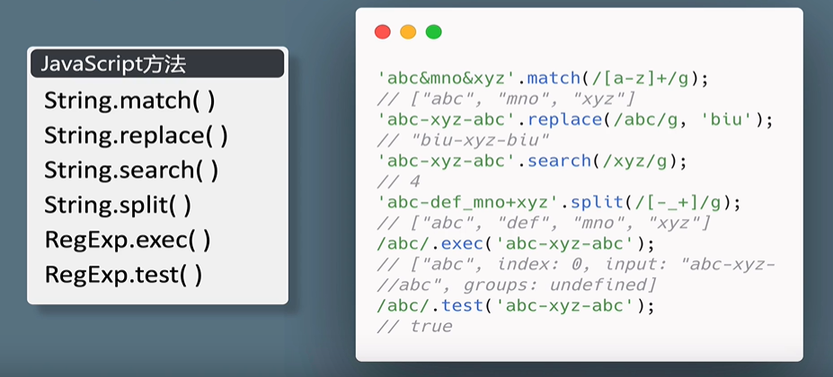

## 令人头大

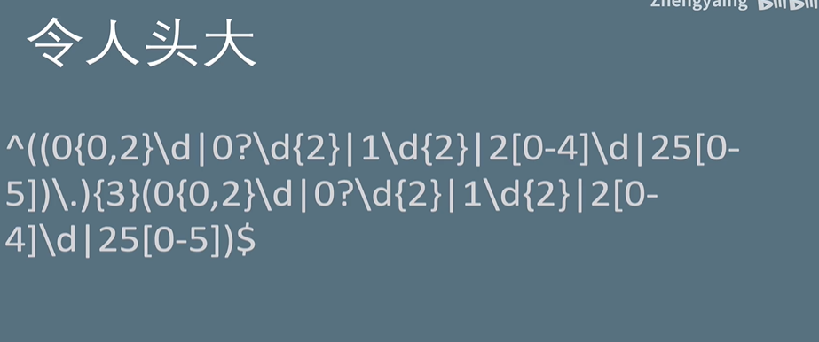

## 匹配模式

- 字符匹配
  - 纵向拓展
  - 横向拓展
- 位置匹配

## 字符匹配

### 字符匹配-纵向

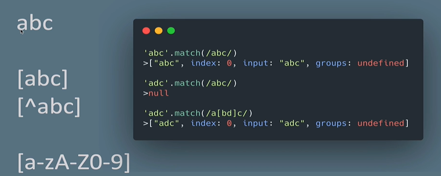

abc:匹配到abc连载一起

\[abc]:匹配abc任何一个

```
'abc'.match(/a[bd]c/) 满足
```

\[^abc]:匹配除了abc之外的任何字符

[a-zA-Z0-9]字母和数字

### 简写形式

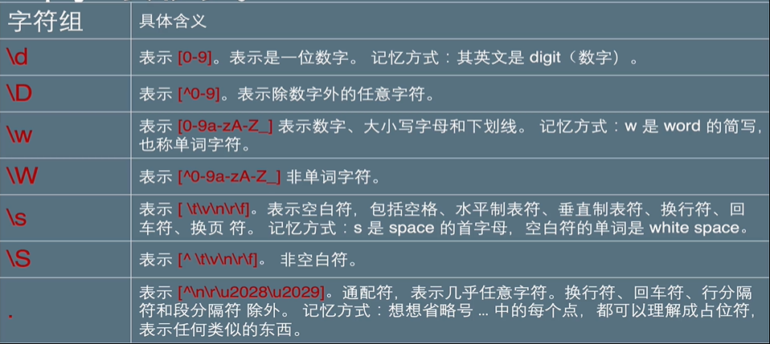

### 多选分支

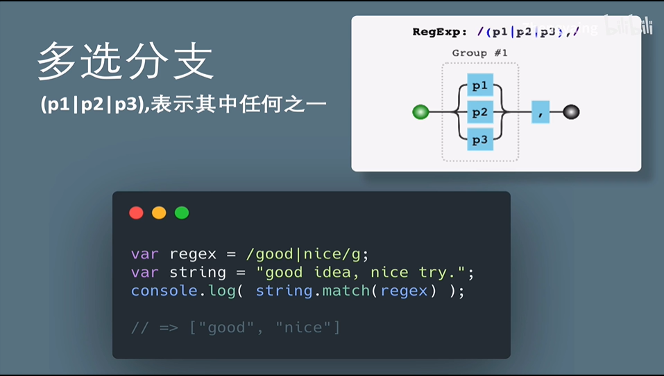

### 字符匹配-横向-量词

- 这种方式肯定很麻烦:

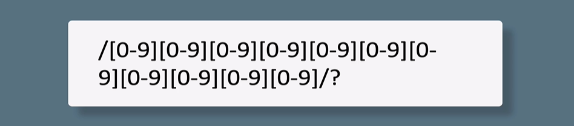

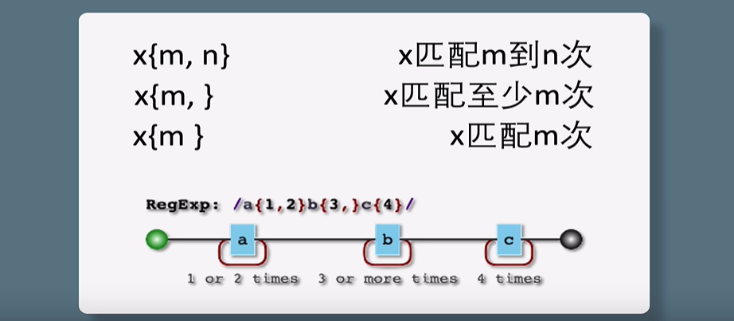

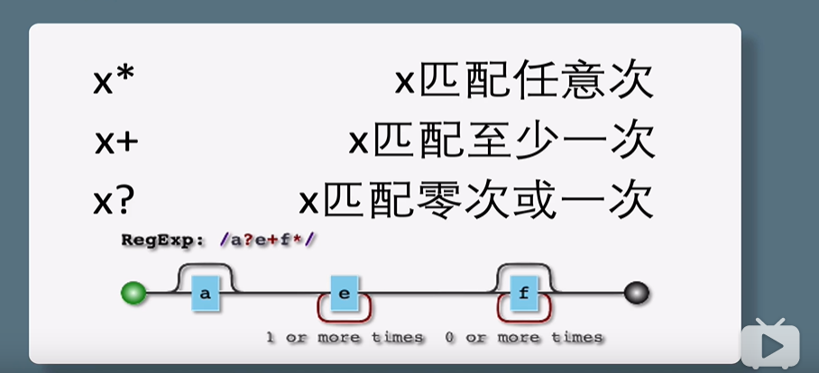

## 例子

16进制颜色

- 0-9 A-F
- #开头
- 6或3位

```js
reg= /#[0-9a-fA-F]{3}|#[0-9a-fA-F]/
```

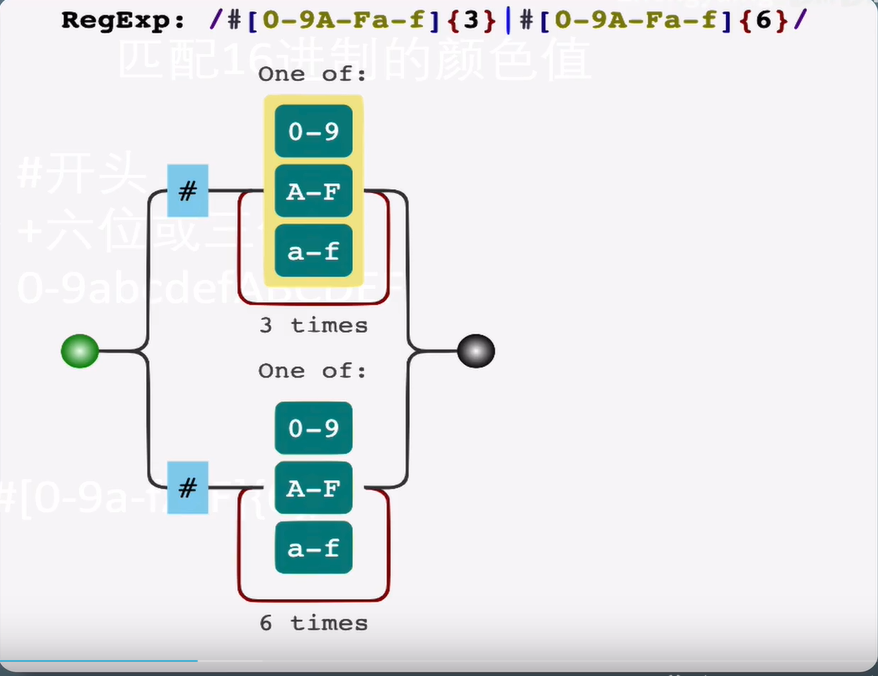

## 贪心非贪心

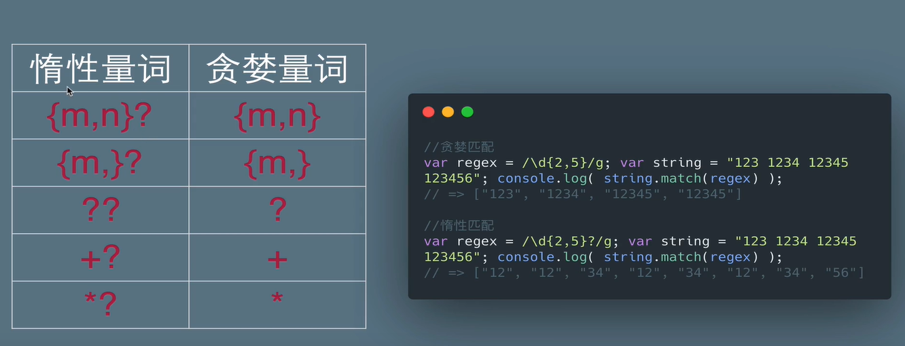

## 位置匹配

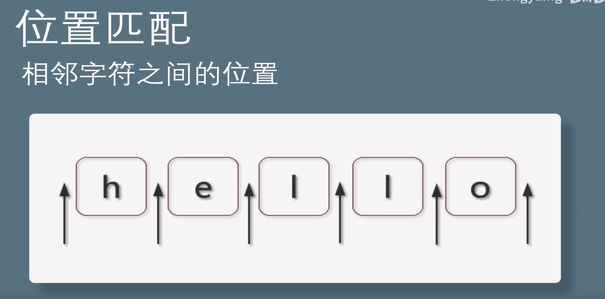

### 开始结束

^开头$结尾

```js
var result = 'hello'.replace(/^|&/g,'#');// '#hello#'
```

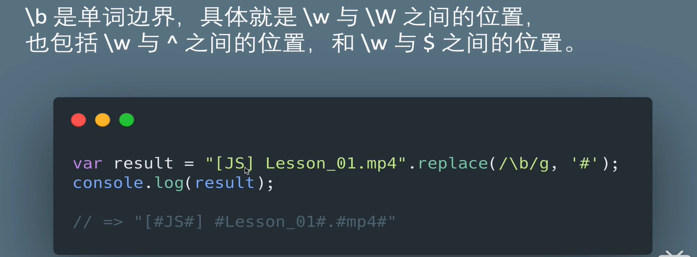

匹配了所有的单词边界，给他们两边添加了#

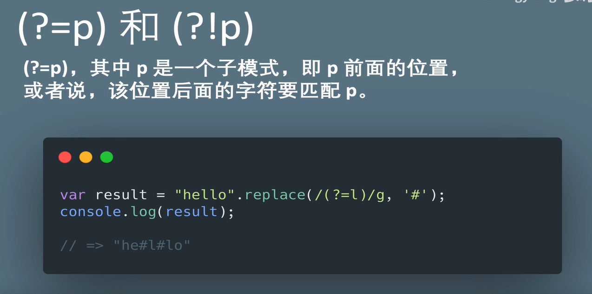

这里的p就是l,你选中的字符的后面要等于l；

## 栗子

数字千位分隔符表示

```js
var result = '12345678' .replace(/(?=\d{3}$)/g,',')
//=> '12345,6789'

//(?=(\d{3})+$)至少出现一次或者多次
var result = '123456789' .replace(/(?=(\d{3})+$)/g,',')
// ',123,456,789'

var result = '123456789'.replace(/(?!^)(?=(\d{3})+$)/);

```

## 优先级

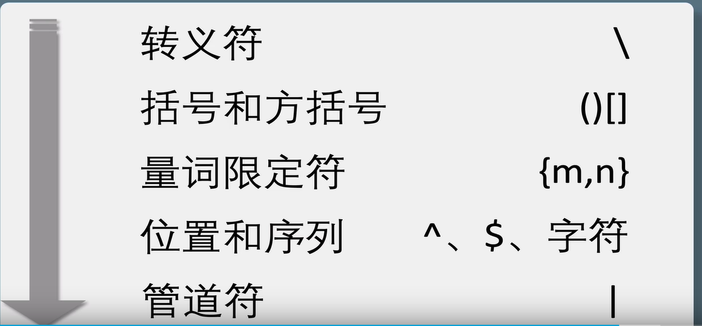

## 读

```js
/^(\d{15}|\d{17}[\dxX])$ /
\d{15}:15位连续数字
\d{17}[\dxX]：17位连续数字+最后一位是数字或者xX
^$ :以这个开头并且结尾，仅有他
```

## 写

ip地址

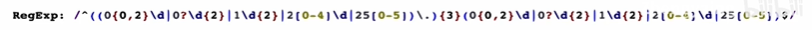

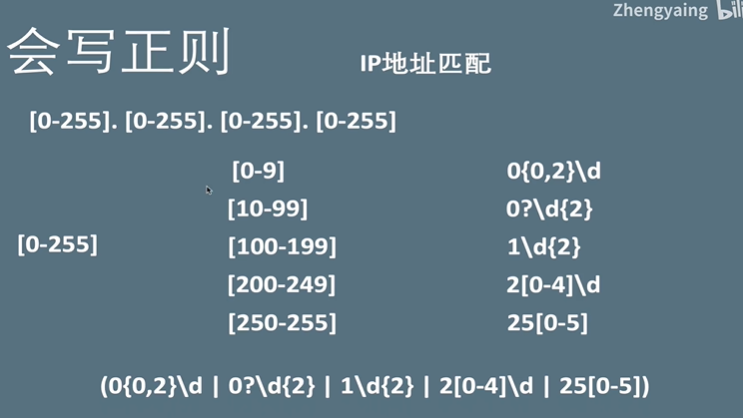

 