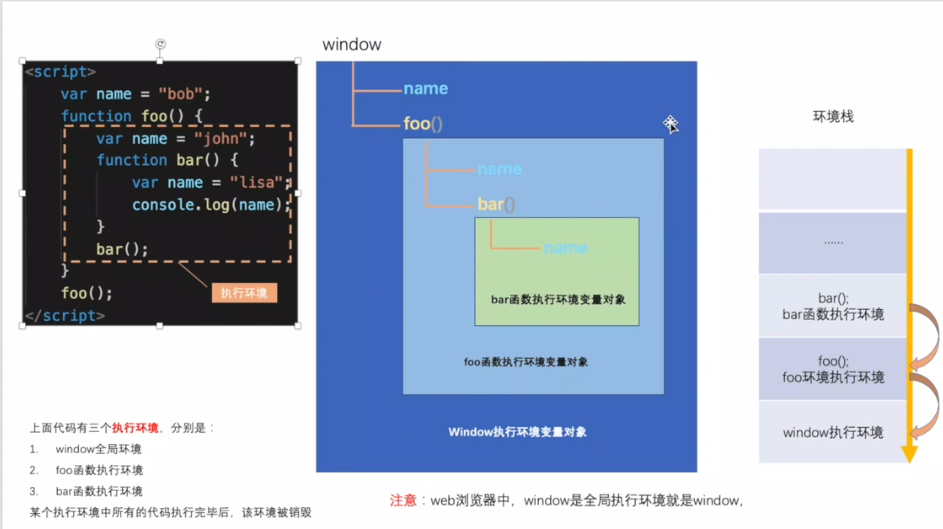
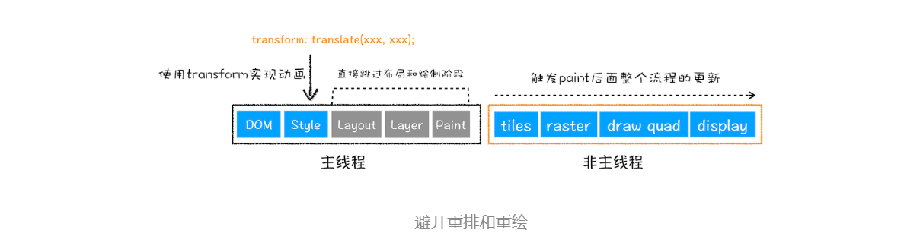

# JS概念题

[TOC]

## 数据类型有哪些？

- `JS` 中分为七种内置类型，七种内置类型又分为两大类型：基本类型和对象（`Object`）。
- 基本类型有七种： `null`，`undefined`，`boolean`，`number`，`string`，`symbol`，`bigint`。
- 其中数字类型是浮点型的，没有整型，并且浮点类型基于 `IEEE 754`标准实现，在使用中会遇到某些 Bug。`NaN` 也属于 `number` 类型，并且 `NaN` 不等于自身。
- 原始类型没有函数调用，但是`'1'.toString()` `'abc'.length`被自动转换对象。

## typeof

- `typeof` 对于基本类型，除了 `null` 都可以显示正确的类型。
- `typeof` 对于对象，除了`function`都会显示 `object`。

在 JS 的最初版本中使用的是 32 位系统，为了性能考虑使用低位存储变量的类型信息，`000`开头代表是对象，然而`null`表示为全零，所以`typeof`将它错误的判断为`object`。但是后来因为null本身表示空的对象，所以并未进行修改。

## 转换类型的转换方法

Number()

parseInt()

parseFloat()

## 类型转换

**转Boolean**

- 在条件判断时，除了`undefined`，`null`，`false`，`NaN`，`''`，`0`，`-0`，其他所有值都转为`true`，包括所有对象。

**对象转原始类型**

- 对象在转换类型的时候，会调用内置的`[[ToPrimitive]]`函数，对于该函数来说，算法逻辑一般来说如下：

  - 如果已经是原始类型了，那就不需要转换了

  - 调用`x.valueOf()`，如果转换为基础类型，就返回转换的值

  - 调用`x.toString()`，如果转换为基础类型，就返回转换的值

  - 如果都没有返回原始类型，就会报错。

  - 重写

    ```js
    let a = {
      valueOf() {
        return 0
      },
      toString() {
        return '1'
      },
      [Symbol.toPrimitive]() {
        return 2
      }
    }
    1 + a // => 3
    ```

**四则运算符**

- +运算
  - 运算中其中一方为字符串，那么就会把另一方也转换为字符串
  - 如果一方不是字符串或者数字，那么会将它转换为数字或者字符串
  - 但是 `i='1',i++ =2`,纯粹的数学运算。
- 其他运算，只要其中一方是数字，那么另一方就会被转为数字

- ```js
  1 + '1' // '11' ，触发特点一，所以将数字1转换为字符串，得到结果'11'
  true + true // 2 ，触发特点二，所以将true转为数字1
  4 + [1,2,3] // "41,2,3" ，触发特点二，所以将数组通过toString转为字符串1,2,3，得到结果41,2,3
  'a' + + 'b' // -> "aNaN"    +'b'为NaN, +'1'快速获取Number类型
  4 * '3' // 12
  4 * [] // 0
  4 * [1, 2] // NaN
  ```

> 对于加号需要注意这个表达式 `'a' + + 'b'`

- ```js
  'a' + + 'b' // -> "aNaN"
  // 因为 + 'b' -> NaN
  // 你也许在一些代码中看到过 + '1' -> 1
  ```

**比较运算符**

1. 如果是对象，就通过`toPrimitive`转换对象
2. 如果是字符串，就通过`unicode`字符索引来比较

```js
let a = {
  valueOf() {
    return 0
  },
  toString() {
    return '1'
  }
}
a > -1 // true
```

**逻辑运算**

||  表示或者,前边成立给前边，前边不成立给后边 

&& 表示并且前边成立给后边，前边不成立给前边

## null和undefined的区别?

1995年 JavaScript 诞生时，最初像 Java 一样，只设置了`null`表示"无"。根据 C 语言的传统，`null`可以自动转为`0`。

```js
Number(null) // 0
5 + null // 5
```

上面代码中，`null`转为数字时，自动变成0。

但是，JavaScript 的设计者 Brendan Eich，觉得这样做还不够。首先，第一版的 JavaScript 里面，`null`就像在 Java 里一样，被当成一个对象，Brendan Eich 觉得表示“无”的值最好不是对象。其次，那时的 JavaScript 不包括错误处理机制，Brendan Eich 觉得，如果`null`自动转为0，很不容易发现错误。

因此，他又设计了一个`undefined`。区别是这样的：`null`是一个表示“空”的对象，转为数值时为`0`；`undefined`是一个表示"此处无定义"的原始值，转为数值时为`NaN`。

```js
Number(undefined) // NaN
5 + undefined // NaN
```

## 如何判断数据类型?

typeof 

instanceof  判断一个构造函数的原型是否在某个实例的原型链上。

constructor 一个实例继承了构造函数原型的constructor.

Object.prototype.toString.call()

## JS隐式装箱

[] + [] = ""
 step1:( [].valueOf() = [] => [].toString() => "" 是字符串类型，也就是原始值，返回 "" )
 所以 ToPrimitive([]) => ""
 step2: ToString(ToPrimitive([])).concat(ToString(ToPrimitive([]))) = "" + "" = ""

[] + {} = "[object Object]"
 step1:( [].valueOf() = [] => [].toString() => "" 是字符串类型，也就是原始值，返回 "" )
 所以 ToPrimitive([]) = ""
 step2:( {}.valueOf() = {} => [].toString() => "[object Object]" 是字符串类型，也就是原始值，返回 "[object Object]" )  所以 ToPrimitive({}) = "[object Object]"
 step3: ToString(ToPrimitive([])).concat(ToString(ToPrimitive({}))) = "" +"[object Object]" = "[object Object]"

{} + [] = 0
 step1: 前面的 {} 会被当做空代码块忽略，所以只剩下 + [] 一个单目运算符，所以直接执行ToNumber([]) = 0

{} + {} = "[object Object][object Object]"


## [判等](https://developer.mozilla.org/zh-CN/docs/Web/JavaScript/Equality_comparisons_and_sameness)

严格相等===：两个被比较的值在比较前都不进行隐式转换。如果两个值都是 number 类型，当两个都不是 NaN，并且数值相同，或是两个值分别为 +0 和 -0 时，两个值被认为是全等的。

非严格相等==：`ToNumber(A)` 尝试在比较前将参数 A 转换为数字，这与 +A（单目运算符+）的效果相同。`ToPrimitive(A)`通过尝试调用 A 的`A.toString()` 和 `A.valueOf()` 方法，将参数 A 转换为原始值（Primitive）。

同值相等：same-value进行比较。同值相等由 [`Object.is`](https://developer.mozilla.org/en-US/docs/Web/JavaScript/Reference/Global_Objects/Object/is) 方法提供。

零值相等：与同值相等类似，不过会认为 +0 与 -0 相等。

|          x          |          y          |  `==`   |  `===`  | `Object.is` |
| :-----------------: | :-----------------: | :-----: | :-----: | :---------: |
|     `undefined`     |     `undefined`     | `true`  | `true`  |   `true`    |
|       `null`        |       `null`        | `true`  | `true`  |   `true`    |
|       `true`        |       `true`        | `true`  | `true`  |   `true`    |
|       `false`       |       `false`       | `true`  | `true`  |   `true`    |
|       `"foo"`       |       `"foo"`       | `true`  | `true`  |   `true`    |
|         `0`         |         `0`         | `true`  | `true`  |   `true`    |
|        `+0`         |        `-0`         | `true`  | `true`  |   `false`   |
|         `0`         |       `false`       | `true`  | `false` |   `false`   |
|        `""`         |       `false`       | `true`  | `false` |   `false`   |
|        `""`         |         `0`         | `true`  | `false` |   `false`   |
|        `"0"`        |         `0`         | `true`  | `false` |   `false`   |
|       `"17"`        |        `17`         | `true`  | `false` |   `false`   |
|       `[1,2]`       |       `"1,2"`       | `true`  | `false` |   `false`   |
| `new String("foo")` |       `"foo"`       | `true`  | `false` |   `false`   |
|       `null`        |     `undefined`     | `true`  | `false` |   `false`   |
|       `null`        |       `false`       | `false` | `false` |   `false`   |
|     `undefined`     |       `false`       | `false` | `false` |   `false`   |
|  `{ foo: "bar" }`   |  `{ foo: "bar" }`   | `false` | `false` |   `false`   |
| `new String("foo")` | `new String("foo")` | `false` | `false` |   `false`   |
|         `0`         |       `null`        | `false` | `false` |   `false`   |
|         `0`         |        `NaN`        | `false` | `false` |   `false`   |
|       `"foo"`       |        `NaN`        | `false` | `false` |   `false`   |
|        `NaN`        |        `NaN`        | `false` | `false` |   `true`    |

## 循环方法有哪些？

for in循环:循环遍历对象键值对，适用break和continue。会遍历原型链属性

***\*Object.keys()\**** **自身可枚举属性**

## 谈谈你对作用域链的理解?



作用域链，原型链，还有冒泡我觉得都是js的一个共有的特性吧，都是自己里面找不到，就去他父亲那里找。

作用域链就是根据词法作用域，自己作用域找不到这个变量，就沿着作用域链去他父级的作用域找这个变量，直到查找到全局下，如果木有，说明这个变量不存在。

## 闭包是什么？

函数和对其周围状态(也就是函数定义时所在的词法环境)的引用捆绑在一起形成了闭包。

根据词法作用域规则，闭包可以让你从内部函数访问外部函数作用域。在 JavaScript 中，每当函数被创建，就会在函数生成时生成闭包。

在函数外部执行时，维持了一个对这个函数创建环境的引用。根据引用计数的规则，当有引用指向时，这个词法环境不被销毁。因此闭包缓存了他的周围状态。

```js
function makeAdder(x) {
  return function(y) {
    return x + y;
  };
}

var add5 = makeAdder(5);
var add10 = makeAdder(10);

console.log(add5(2));  // 7
console.log(add10(2)); // 12
```

`add5` 和 `add10` 都是闭包。它们共享相同的函数定义，但是保存了不同的词法环境。在 `add5` 的环境中，`x` 为 5。而在 `add10` 中，`x` 则为 10。

**闭包作用:**

首先的话闭包可以从外部访问到函数内部的变量，并且这些被访问到的变量会被缓存起来。并且使得内部变量不会被污染。但是闭包函数因为一直有引用指向他所以会一直存在内存

##

## 原型以及原型链

每个函数都有一个prototype指向构造函数的原型，我们可以把方法放在原型上，从而减少内存占用。

每个原型都有个constructor属性指向构造函数。

构造函数通过new实例化出一个对象，对象的__proto__属性指向构造函数的原型。

原型链就和作用域链，还有事件冒泡差不多的一个概念，当访问实例的属性方法时，如果他没有，就去原型上找，，如果还是找不到就去原型的原型找，直到找到Object的原型，在网上找就是null了。

## this指向问题

**this的绑定只受最靠近成员的引用的影响，是他执行时的this而不是定义时的this,是调用他的this**。

**new>bind>call(apply)> 隐式绑定>obj.func()>默认绑定**

**this绑定主要有默认绑定，隐式绑定 ,隐式丢失，new绑定，显示绑定。**

箭头函数绑定了父级作用域的上下文

**默认绑定**:全局，函数独立调用，闭包

**隐式绑定**:`obj1.foo();//this是obj1,obj1.obj2.foo();//this是obj2`

**隐式丢失**

```js
(p.foo = o.foo)(); //此时this是全局   var bar = (p.foo = o.foo)
```

```js
p.foo = o.foo;  
p.foo();//4 此时this指向p。
```

```js
(obj.foo = obj.foo)();//window 立即执行
(false || obj.foo)();//window
(1,obj.foo)();//window
```

**显示绑定**

 通过call()、apply()、bind()方法把对象绑定到this上，叫做显示绑定。对于被调用的函数来说，叫做间接调用

显示绑定无法解决隐式丢失问题。bind是永久绑定，之后再怎么调用都不会起作用.

```js
function f(){
  return this.a;
}

var g = f.bind({a:"azerty"});
console.log(g()); // azerty

var h = g.bind({a:'yoo'}); // bind只生效一次！
console.log(h()); // azerty

var o = {a:37, f:f, g:g, h:h};
console.log(o.f(), o.g(), o.h()); // 37, azerty, azerty
```

**迭代api绑定**

javascript中新增了许多内置函数，具有显式绑定的功能，如数组的5个迭代方法：`map()`、`forEach()`、`filter()`、`some()`、`every()`

**new 绑定**

**严格模式**

- 独立调用的函数的this指向undefined
- 使用call和apply时，null和undefined不会转换成全局对象，如果不指定的话会出错

## DOM操作

1. 获取元素方法

   ```js
   getElementById //Id重复了获取第一个 ie6-7会把表单name作为id
   getElementsByTagName//获取所有标签名为div的
   getElementsByClassName //ie678不兼容
   getElementsByName //ie浏览器只对表单元素name起作用
   querySelector
   querySelectorAll  //不兼容ie6-8 没有dom映射  获取到的是 NodeList 对象而不是HTMLElemen 的实例
   
   ```


## 节点操作

1. **新建节点**

   ```js
   document.createElement('div')  //新建元素节点
   document.createArrtibute('src')  //新建一个属性节点
   document.createTextNode("文本内容") // 创建一个文本节点
   document.createDocumentFragment() // 新建一个 DOM 片段
   ```

2. **添加、移除、替换、插入**

   ```js
   appendChild() // 向节点的子节点末尾添加新的子节点
   removerChild() // 移除
   parentNode.replaceChild(newChild, oldChild );用新节点替换父节点中已有的子节点
   insertBeform() // 在已有的子节点前插入一个新的子节点
   ```

3. **查找**

   ```js
   document.getElementById() // 通过元素 id 查找,唯一性 
   document.getElementByClassName() // 通过 class 名称查找 
   document.getElementsByTagName() // 通过标签名称查找 
   document.getElementsByName() // 通过元素的 Name 属性的值查找
   ```

## DOM 回流、重绘 

1. 更新了元素的几何属性（重排/回流reflow）


如果你通过 JavaScript 或者 CSS 修改元素的几何位置属性，例如：页面中的元素增加、删除、大小、位置的改变，那么浏览器会触发重新布局，分层，绘制，解析之后的一系列子阶段，这个过程就叫**重排**。无疑，**重排需要更新完整的渲染流水线，所以开销也是最大的**。

2. 更新元素的绘制属性（重绘）

   

如果修改了元素的背景颜色，那么布局阶段将不会被执行，因为并没有引起几何位置的变换，所以就直接进入了绘制阶段，然后执行之后的一系列子阶段，这个过程就叫**重绘**。相较于重排操作，**重绘省去了布局和分层阶段，所以执行效率会比重排操作要高一些**。

3. 直接合成



使用了 CSS 的 transform 来实现动画效果，这可以避开重排和重绘阶段，直接在非主线程上执行合成动画操作。这样的效率是最高的，因为是在非主线程上合成，并没有占用主线程的资源，另外也避开了布局和绘制两个子阶段，所以**相对于重绘和重排，合成能大大提升绘制效率**。

在 JS 中把设置样式和获取样式的两种操作分来来写， 设置样式的操作放在 一起，读取样式的操作放在一起，这样可以有效的减少 DOM 的回流和重绘；

## JS盒子模型

```js
client系列：clientWidth，clientHeight，clientLeft，clientTop；

offset系列： offsetWidth，offsetHeight，offsetLeft，offsetTop，offsetParent

scroll系列：scrollWidth，scrollHeight，scrollLeft，scrollTop
```

// client offset scroll width height left top 

// clientWidth 内容宽度 + 左右 padding 

// offsetWidth clientWidth + 左右 border 

// offsetTop 当前盒子的外边框到上级参照物的内边框的偏移量 

// offsetParent 上级参照物：有定位的上级（包含 父级，祖父，曾祖父...） 

元素，所有所有上级都没有定位， 则参照物就是 body 

// scroll 内容不溢出 等同于 client 

// 内容溢出时 没有设置 overflow 值是内容宽高 + 上或左 padding 

// 内容溢出时 有设置 overflow 时 值是内容宽高 + 上下或左右 padding 

// scrollTop 卷去内容的高度 

// 13 个属性 只有 scrollTop 和 scrollLeft 时可以设置值的， 其他的都是只读 

属性

## DOM事件

**DOM事件级别是什么？**

DOM0  div.onclick = function(){}

DOM2  div.addEventListener('click',function(){},false)

DOM3  div.addEventListener('keyup',function(){},false)  多了一些鼠标和键盘事件

IE标准DOM2：div.attachEvent('')

**事件的传播机制(事件模型)**：

先冒泡，然后是目标阶段 然后再去捕获，我们可以利用事件的冒泡来进行事件委托，、也就是可以在父元素上绑定事件，通过事件对象 e 来判断点击的具体元素；可以提高性能；

我们可以利用的 e.stopPropagation()来阻止冒泡；利用 e.preventDefault()来阻止默认事件 

**DOM事件流？**

一个完整的事件流分三个阶段，事件通过捕获到达目标元素，然后从目标元素冒泡到window对象。

**描述DOM事件捕获具体流程？**

因为DOM是windows下的一个属性，所以说首先是从window对象开始，然后传递到他的子属性document对象，之后传递到html对象也就是 document.documentElement,然后传递到body,之后就按照body内部的结构传递最后传递到目标元素。

window>document>html(js里如何获取html? document.documentElement)>body>按照html结构来传。

## Event对象的常见应用是什么？

```js
event.preventDefault();   //.prevent
event.stopPropagation(); //阻止冒泡 vue里是.stop
  event.stopImmediatePropagation();  //如果注册了两个事件a,b，在a点击不执行b,在a里加这句话,b就不被执行;  事件响应优先级
event.currentTarget === this;  
event.target  //事件委托/代理。  实际被点击的元素。 e.srcElement;
```

```
document.body.onclick = function(e){
    e = e || window.event;
    t = e.target || e.srcElement;
    var url = t.href;
    load_page(url);
};

```

## 你会自定义事件吗？

按钮不是常规click事件而不是回调

```js
//创建事件, Event是无法传递参数的
var event = new Event('build');
//创建事件, CustomEvent是可以传递参数的
var event = new CustomEvent('build', { detail: elem.dataset.time });

// 监听事件Listen for the event.
elem.addEventListener('build', function (e) { //... }, false);

// 分发/触发事件Dispatch the event.
elem.dispatchEvent(event);
```

new Event无法加数据，

CustomEvent('name',object);

```js
var eve = new Event('test');
div1.addEventListener('test', function () {
  console.log('触发')
})
setTimeout(() => {
  div1.dispatchEvent(eve);
}, 1000)
```

## document.write()和innerHTML区别

|          | document.write()                 | innerHTML            |
| -------- | -------------------------------- | -------------------- |
| 类型     | document对象下的方法             | element对象的属性    |
| 插入位置 | 脚本元素script的位置             | 指定元素内           |
| 拼接方法 | 可以多次调用拼接                 | 利用+=拼接           |
| 覆盖问题 | 文档解析load完在调用后悔覆盖文档 | 直接调用会覆盖原内容 |

## 面向对象是什么？

函数产生了一个对象，这个函数就是类。

## 数组常用方法有哪些？

增删改的方法:push pop shift unshift splice

数组查询和拼接的方法: slice和concat

转换字符串的方法:toString和join

检测是否有某项的方法:indexOf includes

数组排序方法：sort reverse

数组遍历方法：forEach map some every filter find 

es6的方法 :Array.of Array.from   find findIndex  fill填充  entires keys values flat includes flatMap....................

## 0.1+0.2 =?

计算机无法处理十进制，只能处理2进制。js采用IEEE754 64位双精度标准。十进制的0.1转换成2进制，0.1*2=0.2，整数部分是0 。。。。0.8 *2 =1.6整数部分是1， 0.6 * 2 = 1.2........这是个无线循环的小数。然后会使用二进制位科学计数法表示他，但是js有长度限制，所以二进制位科学计数法表示的是一个省略了小数点十位后的结果，因此做加法时会有误差。

(0.1+0.2).toFixed(5)*1 //保留五位小数

## 