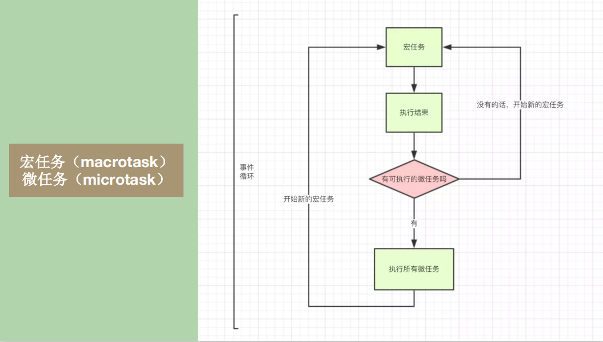

# JS面试题

## 类型转换

```js
!(!"Numbesdsda");// 字符串进行布尔转换

isNaN(parseInt(new Date())) + Number([1]) + typeof undefined 
//parseInt(new Date()) =>new Date.tostring=>"Tue Aug 18 2020 19:51:26 GMT+0800 (中国标准时间)"=>NaN
//true + 1 是数学运算,2;
//2 + 'undefined' =>	'2undefined'

Boolean(Number('')) + !isNaN(Number(null)) + Boolean('parseint([])') + typeof !(null)
// false + true = 1
// '2boolean'

parseFloat("1.6px") + parseInt("1.2px") +typeof parseInt (nu11);
// 1.6 + 1 + 'Number'

isNaN(Number(!!Number(parseInt('0.8'))))
//false

!typeof parseFloat('0')
//false

Number('')
//0

typeof 'parseInt(null)' + 12 + !! Number(NaN)
//'string' + 12 + false
//

!typeof (isNaN('')) + parseInt(NaN)
// isNaN('')=> ''=>0 => isNaN(0)=>false
// false + NaN = NaN

typeof !parseInt(null) + !isNaN(null)
//parseInt(null) => parseInt('null') => NaN
// 'boolean'  +  true;
```

## 运算符优先级

自己写的文章：https://juejin.im/post/6862524907524358152

**连等开始前会把所有引用保存,连等时不会变**

```js
let a = {
  n:1
}
let b = a
a.x = a = {//
  n:2
}
console.log(a.x) //这个a.x已经不是前面的那个a.x了
console.log(b) 

//. 操作符的优先级比赋值高，所以先确定了a.x。
//连续赋值的时候，a.x作为一个指针已经确定，即使右侧先进行了替换a的复制，a.x的主语依然是原来的a，所以之后的b应该是{n:1,x:{n:2}}
```

```js
连续赋值：
a = b = 3
相当于
a = 3；
b = a；
```

2.栈溢出

```js
let a = {n:1};
let b = a;
a.x = b; //会无限循环，形成堆嵌套，溢出。
```

3.字符串拼接

```js
var a = 'abc'+123+456
var b = '456'-'123'
var c = 100+true+21.2+null+undefined+'Tencent'+[]+null+9+false
console.log(a,b,c);
// 'abc123456'
// 333
// 'NaNTencentnull9false'
```

4.能输出字符串"1"的有哪些？

```js
alert(1)
console.log(parseInt(1.3))
console.log(1)
console.log(isNaN(1))
console.log(parseInt('1'))
```

5.下面结果是undefined的是

```js
console.log(alert(1));  // alert(1)返回undefiend
typeof undefined //'undefined'
console.log(parseInt(undefined));// =>'undefined'=>'NaN'
console.log(parseInt(''));// NaN,从左到右找。
isNaN(undefined)//undefined转换数字是NaN, 所以是true

//Number:字符串查看是否包含非有效数字字符
//布尔 10
//null->0 undefined->NaN
//引用类型先转换字符串再转换数字。

//parseInt需要把值转换成字符串然后查找
```

## 对象属性名问题

```js
var name = 10;
var obj = {
  name:'a',
  12:100,
  ['age']:100 ;//
}
obj[name] //obj[10] = undefined
```

>知识点
>
>- 对象属性名不能重复
>
>- 数字属性名 == 字符串属性名
>
>- Symbol属性名
>
>- undefined属性名，会以undefined作为属性名
>
> ```
> obj = {undefined:1}
> obj['undefined']  = 100
> obj['undefined']  //100
> obj[undefined] //100
> 运行时转换，存储时不转换
> ```
>
>- null属性名
>- 引用类型值作为属性名需要变成字符串进行存储。对象会调用toString转换成"[object Object]"
>- ['a']转换成 'a'。

```js
//1
let a = {}, b = '0' , c=0;
a[b] = '特'        
a[c] = '朗普'
console.log(a[b])  

//2
let a = {};
let b = Symbol("1");
let c = Symbol("1")
a[b] = '特'     
a[c] = '朗普'	
//{Symbol(1): "特", Symbol(1): "朗普"}
console.log(a[b])；

//3
let a = {};
let b = {n:'1'};
let c = {m:'2'};
a[b] = '特';     
a[c] = '朗普';	
console.log(a[b]); //朗普
```

## console.log(a+a+a)

```js
/*
  console.log(a + a + a); // 打印'abc'
*/
```

解法1: Object.defineProperty() 外部变量

```js
var value = 'a';
Object.defineProperty(this,'a',{
    get(){
        let result = value;
        if(value ==='a'){
            value ='b'
        }else if(value==='b'){
            value ='c'
        }
        return result;
    }
})
console.log(a+a+a)
```

解法2： [Symbol.toPrimitive] >valueOf() > toString 

```js
let index = 0;
let a = {
    valueOf(){
        return ["valueOf", "b", "c"][index++];
    },
    toString (){
         return ["toString", "b", "c"][index++];
    },
    [Symbol.toPrimitive](){
        return ["toPrimitive", "b", "c"][index++];
    }
}
```

## typeof String('aa')

```js
typeof String('aa') //string
typeof new String('aa') //object
1..toString() // '1'
1.toString()  //thorw Error
```


## try..catch

在try..catch执行完成前执行的才会被抛出。

- prmosie的异常不会抛出，他内部已经有

**敲黑板了： 不要用 try catch 包裹 Promise , Promise 很强大，不用担心异常会往上抛！我们只需要给 Promise 增加 Promise.prototype.catch 就 OK 了**

## 原型链题目

```js
function Fn(){
  this.x = 100;
  this.y = 200;
  this.getX = function(){
    console.log(this.x)
  }
}
Fn.prototype = {
  y:400,
  getX:function(){
    console.log(this.x)
  },
  getY:function(){
    console.log(this.y)
  },
  sum:function(){
    console.log(this.x+this.y)
  }
}
var f1 = new Fn();
var f2 = new Fn;
console.log(f1.getX ===f2.getX)
console.log(f1.getY ===f2.getY)
console.log(f1.__proto__.getY ===f2.__proto__.getY )
console.log(f1.__proto__.getX ===f2.__proto__.getX )
console.log(f1.getX ===Fn.prototype.getX)
console.log(f1.constructor)
console.log(Fn.prototype.__proto__.constructor)
f1.getX();
f1.__proto__.getX()
f2.getY()
Fn.prototype.getY()
f1.sum()
Fn.prototype.sum()

```

## event Loop

```javascript
（1）首先，将"执行栈"最开始的所有同步代码(宏任务)执行完成；
（2）检查是否有微任务，如有则执行所有的微任务；
（3）取出"任务队列"中事件所对应的回调函数(宏任务)进入"执行栈"并执行完成；
（4）再检查是否有微任务，如有则执行所有的微任务；
（5）主线程不断重复上面的（3）（4）步。
```




setTimeout循环嵌套5层，并且延迟不到4ms,才会变成4ms,1ms和0ms一样

```js
//1 0 2
setTimeout(() => {
    console.log(2)
}, 2)

setTimeout(() => {
    console.log(1)
}, 1) 

setTimeout(() => {
    console.log(0)
}, 0)
```

```js
async function async1() {
    console.log('1');
    await async2(); 
    console.log('2'); // promise.then
}
async function async2() {
    console.log('3');
}
console.log('4');                                         
setTimeout(function () {
    console.log('5');
}, 0);
async1();
new Promise(function (resolve) {
    console.log('6');
    resolve();
}).then(function () {
    console.log('7');
});
console.log('8');
```

```js
setTimeout(function () {
    console.log('2');
    new Promise(function (resolve) {
        console.log('3');
        resolve();
    }).then(function () {
        console.log('4')
    })
})                                                                    
new Promise(function (resolve) {
    console.log('5');
    resolve();
}).then(function () {
    console.log('6')
})

setTimeout(function () {
    console.log('7');
    new Promise(function (resolve) {
        console.log('8');
        resolve();
    }).then(function () {
        console.log('9');
    })
})
```

```js
console.log('1');

process.nextTick(function () {
    console.log('2');
});

setTimeout(function () {
    console.log('3');
    process.nextTick(function () {
        console.log('4');
    });
}, 0);

new Promise(function (resolve, reject) {
    console.log('5');
    resolve();
}).then(function () {
    console.log('6');
});

console.log('7');
```

```js
console.log('1');

process.nextTick(function () {
    console.log('2');
});

setTimeout(function () {
    console.log('3');
    process.nextTick(function () {
        console.log('4');
    });
}, 0);

new Promise(function (resolve, reject) {
    console.log('5');
    resolve();
}).then(function () {
    console.log('6');
});

console.log('7');
```

```js
async function foo(){
  // await 前面的代码
  await bar(); // promise.then
  // await 后面的代码
}
async function bar(){
}
foo();

// 转化成
function foo(){
  Promise.resolve(bar()).then(()=>{
    // await 后面的代码
  })
}
function bar(){
}
foo();
```

## 大厂部分面试题

```js
//百度
var a = {n:1};
var b = a; 
a.x = a = {n:2}  
console.log(a.n,b.n);
console.log(a.x,b.x);
//操作对象属性的优先级高于赋值操作。
// 先 a.x = {n:2} 然后 a = {n:2} 。此时a的指针指向变化，所以a.x就没有了。

// 2, 1
// undefined {n:2}
```

```js
//美团
var obj = {
  fn2: function () {
    console.log(fn2)
  }
}
obj.fn2()
//找不到，报错

var fn = function () {
  console.log(fn)
}
fn()
//fn赋值为函数，所以输出一个函数。。 ƒ (){console.log(fn)}
```

```js
//腾讯
var name = 'world';
; (function () {
  if (typeof name === 'undefined') {
    var name = 'Jack'
    console.log(name)
  } else {
    console.log(name)
  }
})()
```

```js
//阿里
function Person() {
  getAge = function () {
    console.log(10)
  }
  return this
}
Person.getAge = function () {
  console.log(20)
}
Person.prototype.getAge = function () {
  console.log(30)
}
var getAge = function () {
  console.log(40)
}
function getAge() {
  console.log(50)
}
Person.getAge()   //20

getAge()   //40
Person().getAge()  //10
getAge() //10
new Person.getAge() //20
new Person().getAge()  //30  
new new Person().getAge() 


//new Person.getAge()  无参数列表 new优先级高，从右到左，因此是 Person,getAge() 然后new
// new Person().getAge() 带参数列表， 优先级相同，new无关联性， 但是链式调用是从左到右，因此先执行.运算符左边的 result = new Person()  然后执行result.getAge();
// new new Person().getAge()===> new ((new Person()).getAge())==>new xx.getAge() 
//  =>new fff
```

## this面试题

```js
var name = 'global';
var obj = {
    name: 'local',
    foo: function(){
        this.name = 'foo';   //this->window
    }.bind(window)
};
var bar = new obj.foo(); //new>bind>call(apply)> 隐式绑定>obj.func()>默认绑定
// bar = {name:'foo'}
setTimeout(function() {
    console.log(window.name);  //global
}, 0);
console.log(bar.name); //'foo'
  
var bar3 = bar2 = bar;
bar2.name = 'foo2'; 
console.log(bar3.name);  //foo2

//顺序 'foo'  'foo2'  'global'
```

## 点击一个Input依次触发的事件

```js
const text = document.getElementById('text');
text.onclick = function (e) {
  console.log('onclick')
}
text.onfocus = function (e) {
  console.log('onfocus')
}
text.onmousedown = function (e) {
  console.log('onmousedown')
}
text.onmouseenter = function (e) {
  console.log('onmouseenter')
}
```

```js
'onmouseenter'
'onmousedown'
'onfocus'
'onclick
```


