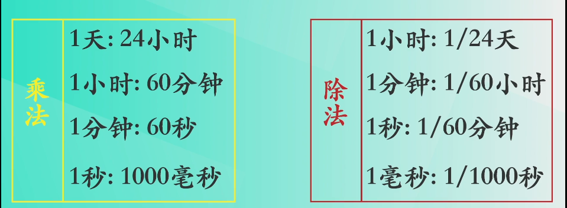
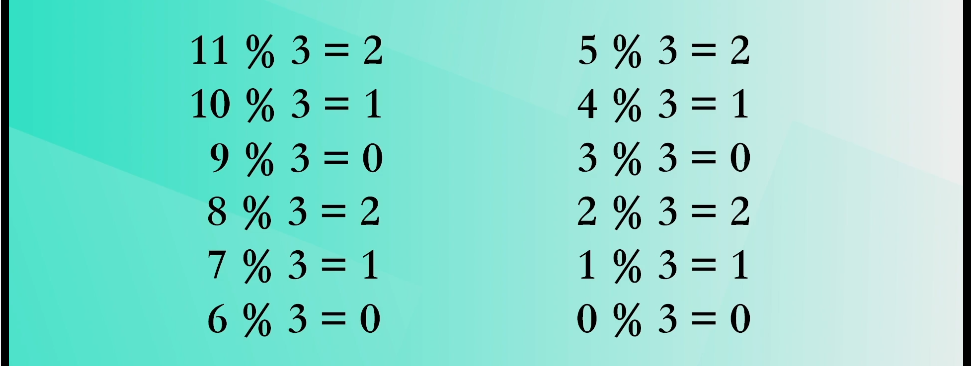

# js笔试题

[TOC]

## 手写防抖

https://blog.csdn.net/hupian1989/article/details/80920324

> 在滚动事件中需要做个复杂计算或者实现一个按钮的防二次点击操作。可以通过函数防抖动来实现

```js
function debounce(fn, delay,immediate) {
    var timer = null
    return function (...args) {

        clearTimeout(timer)
        timer = setTimeout(() => {
            fn.apply(this)
        }, delay)

    }
}
oBtn.onclick = debounce(function(){
    console.log(this)
},200);
```

```js
/**
 * underscore 防抖函数，返回函数连续调用时，空闲时间必须大于或等于 wait，func 才会执行
 *
 * @param  {function} func        回调函数
 * @param  {number}   wait        表示时间窗口的间隔
 * @param  {boolean}  immediate   设置为ture时，是否立即调用函数
 * @return {function}             返回客户调用函数
 */
_.debounce = function(func, wait, immediate) {
    var timeout, args, context, timestamp, result;

    var later = function() {
      // 现在和上一次时间戳比较
      var last = _.now() - timestamp;
      // 如果当前间隔时间少于设定时间且大于0就重新设置定时器
      if (last < wait && last >= 0) {
        timeout = setTimeout(later, wait - last);
      } else {
        // 否则的话就是时间到了执行回调函数
        timeout = null;
        if (!immediate) {
          result = func.apply(context, args);
          if (!timeout) context = args = null;
        }
      }
    };

    return function() {
      context = this;
      args = arguments;
      // 获得时间戳
      timestamp = _.now();
      // 如果定时器不存在且立即执行函数
      var callNow = immediate && !timeout;
      // 如果定时器不存在就创建一个
      if (!timeout) timeout = setTimeout(later, wait);
      if (callNow) {
        // 如果需要立即执行函数的话 通过 apply 执行
        result = func.apply(context, args);
        context = args = null;
      }

      return result;
    };
  };
```

## 事件循环防抖

实现一个debounce函数，要求能够对一个事件循环内的所有调用进行防抖。例如

````js
function F(x,y){
    console.log(x,y)
}
G = debounce(F);
function A(){
    G();
    G();
    G();
}
A() //只打印一次


//-----
setTimeout(G,0);
G();
//打印两次

````

```js
function debounce(fn){
    let isExecuted = false;
    return function(...rest){
        let self = this;
        if(!isExecuted){//如果没有执行
            isExecuted = true;
            let res;
            new Promise(function(resolve,reject){
                res = fn.apply(self,args) 
                resolve()
            }).then(()=>{isExecuted= false})
            return res;
        }
    }
}
```

## 手写节流

> 防抖动和节流本质是不一样的。防抖动是将多次执行变为最后一次执行，节流是将多次执行变成每隔一段时间执行

```js
function throttle(fn, delay) {
  let timer = null;
  return function () {
    let contentText = arguments;
    let self = this;
    if (timer) {
      return
    }
    timer = setTimeout(() => {
      fn.apply(self, contentText)  //直接执行e会报错
      timer = null;
    },200)
  }
}
div1.addEventListener('drag', throttle(function (e) {
  console.log(e.offsetX, e.offsetY)
}))
```

```js
function throttle(fn, delay) {
    var startTime = 0;
    return function () {
        if (Date.now() - startTime > delay) {
            fn.call(this);
            startTime = Date.now();
        }
    }
}
document.onmousemove = throttle(function () {
    console.log(Date.now())
    console.log(this);
}, 1000);
```


## 类数组转换成数组方法有哪些？

```js
let list = Array.from(hdList);
```

```js
let list = Array.prototype.slice.call(hdList);
```

```js
let list = [...hdList];
```

## 数组去重

```js
//方式1 遍历
function unique(arr){
  let res = []
  arr.forEach(item=>{
    if(!res.includes(item)){
      res.push(item)
    }
  })
  return res;
}

//方式2 Set+Arrayfrom/扩展运算符
function unique (arr) {
  // return [...new Set(arr)]
  return Array.from(new Set(arr))
}

//方式3 双层for循环
function unique(arr){
  for(var i=0;i<arr.length;i++){
    for(var j =i+1;j<arr.length;j++){
      if(arr[j]===arr[i]){
        arr.splice(j,1);
        j--
      }
    }
  }
  return arr;
}

//方式4 对象属性不相同
如果对象的属性名没有这个i,就把i放入
function unique(arr) {
    var arrry= [];
    var  obj = {};
    for (var i = 0; i < arr.length; i++) {
        if (!obj[arr[i]]) {
            arrry.push(arr[i])
            obj[arr[i]] = 1
        } 
    }
    return arrry;
}
```

## 数组生成树

```js
var locationList = [
    {id:0,name:'中国'},
    {id:1,pid:0,name:'北京市'},
    {id:2,pid:1,name:'昌平区'},
    {id:3,pid:1,name:'海淀区'},
]
trans(locationList)
let obj = {
    id:0,
    name:'中国',
    sub:[
        {	
            id:1,
            name:'北京',
            pid:0,
            sub:[
                {id:2,pid:1,name:昌平区}
            ]
        }
    ]
}
```

```js
function trans(arr){
    let map = {}
    arr.forEach(item=>map{})
}
```


## 数组扁平化flatten

```js
var arr = [1,2,3,[4,5,6,[7,8,9]]]
// es6
var flatArr = arr.flat(Infinity)

//toString
var flatArr = arr.toString().split(',').map(item=>item*1)

//concat 拍平一层
function arrFlatern(arr){
  while(arr.some(item=>Array.isArray(item))){
    arr = [].concat(...arr)
  }
  return arr
}
```

## 手写深冻结

```js
// 深冻结函数.
function deepFreeze(obj) {

  // 取回定义在obj上的属性名
  var propNames = Object.getOwnPropertyNames(obj);

  // 在冻结自身之前冻结属性
  propNames.forEach(function(name) {
    var prop = obj[name];

    // 如果prop是个对象，冻结它
    if (typeof prop == 'object' && prop !== null)
      deepFreeze(prop);
  });

  // 冻结自身(no-op if already frozen)
  return Object.freeze(obj);
}

obj2 = {
  internal: {}
};

deepFreeze(obj2);
obj2.internal.a = 'anotherValue';
obj2.internal.a; // undefined
```

## 手写深拷贝

```js
//浅拷贝
let obj2 = {};
//方法1
Reflect.ownKeys(obj).forEach(key=>{
    obj2[item] = obj[key]
})

//方法2
var initalObj = Object.assign({}, obj);

//方法3
let arr2=arr.concat();    
let arr3 = arr.slice();
```

```js
//递归实现深拷贝
function deepClone(obj) {
  if (typeof obj !== "object" || obj == null)  return obj
  
  let newObj = ({}).toString.call(obj) === '[object Object]' ? {} : [];
  
  Reflect.ownKeys(obj).forEach(key=>newObj[key]= deepClone(obj[key]))
  
  return newObj
}

//JSON
JSON.parse(JSON.stringify(obj))

//lodash
var obj2 = _.cloneDeep(obj1);
```

## 实现双向数据绑定

```html
<input id="input"/>
```

```js
const data = {};
const input = document.getElementById('input');
Object.defineProperty(data, 'text', {
  set(value) {
    input.value = value;
    this.value = value;
  }
});
input.onChange = function(e) {
  data.text = e.target.value;
}
```


## 手写isEqual

```js
function isEqual(obj1, obj2) {
    function isObject(obj) {
        //({}).toString.call([])
        return typeof obj === 'object'
    }
    // 如果两者有一个不是引用类型
    if (!isObject(obj1) || !isObject(obj2)) {
        // 
        return obj1 === obj2
    }
    // 如果是一个
    if (obj1 === obj2) {
        return true
    }
    // 两个都是对象或者数组
    const obj1Keys = Object.keys(obj1);
    const obj2Keys = Object.keys(obj2);
    if (obj1Keys.length !== obj2Keys.length) {
        return false
    }
    for (let key in obj1) {
        const res = isEqual(obj1[key], obj2[key]);
        if(!res){
            return false
        }
    }

    // 3.全相等
    return true
}
```

## setTimeout实现setInterval

```js
function interval(){
	console.log(1)
	setTimeout(interval,1000)
};
interval()
```

## 实现repeat函数

```js
const repeatFn = repeat(console.log,4,2000);
repeatFn('hello world'); //四次 每次2000ms后执行
```

```js
function repeat(fn,n,delay){
    return (rest)=>{
        for(var i=0;i<n;i++){
            setTimeout(fn,delay*i,rest)
        }
    }
}
```

## 实现sleep函数

```js
function sleep(numberMillis) {
    var start = new Date().getTime();
    while (true) {
        if (new Date().getTime() - start > numberMillis) {
            break;
        }
    }
}

sleep(3000)
alert("停顿了3秒钟")
```


## 函数柯里化

实现以下代码

```js
add(1,2,3,4)//10
add(1)(2)(3)(4)//10
add(1,2)(3,4)//10
add(1,2,3)(4)//10
```

```js
function currying(fn,length){
  length = length||fn.length
  return function(...args){
    if(args.length>=length){
      return fn(...args)
    }
    return currying(fn.bind(null,...args),length-args.length)
  }
}
function add(n1,n2,n3,n4){
  return n1+n2+n3+n4
}
add = currying(add,4)

console.log(add(1)(2)(3)(4))
```

## 数组重组

```js
let arr = [
  {name:1,age:2,number:1,son:'son1'},
  {name:2,age:23,number:2,son:'son2'},
  {name:1,age:22,number:3,son:'son3'},
  {name:1,age:12,number:4,son:'son4'},
  {name:1,age:42,number:5,son:'son5'},
]
fn(ary) //结果为
[{name:1,list:[{number:1,son:'son1'},{numbe}]}]
```

## 实现继承

### 原型链继承

父类的实例作为子类的原型，并把这个实例的constructor指向改为他。**实现的本质是重写对象，代之以一个新类型的属性。**

缺点：原型对象的所有属性被所有实例共享，无法向父类构造函数传参。

```js
function Super(){
    this.value = true;
}
function Sub(){};
Sub.prototype = new Super();
Sub.prototype.constroctor = Sub;
```

### 构造函数继承

```js
function Super() {
    this.colors = ['red', 'green', 'blue'];
}
function Sub(){
		Super.call(this);
}
```

### 组合继承

```js
function Super(name){
    this.name = name;
    this.colors = ['red','blue','green'];
}
function Sub(name,age){
    Super.call(this,name);
    this.age = age;
}
Sub.prototype = new Super();
Sub.prototype.constructor = Sub;
```

### 寄生组合式继承

```js
function Parent(name){
  this.name = name;
}
function Child(name,age){
  Parent.call(this,name);
  this.age = age
}
Child.prototype = Object.create(Parent.prototype);
Child.prototype.constructor = Child;
```

## 编写一个通用的事件监听函数

## 动态时间

```html
var div = document.querySelector('div')
    var time = function () {
      var date = new Date();
      var y = date.getFullYear()
      var m = date.getMonth() + 1
      var d = date.getDate()
      var h = date.getHours()
      var M = date.getMinutes()
      var S = date.getSeconds()
      function addZero(n) {
        return n < 10 ? '0' + n : n
      }
      span.innerText = y + '年' + addZero(m) + '月' + addZero(d) + '日';
      div.children[1].innerText = `${addZero(h)}时${addZero(M)}分${addZero(S)}秒`;
    }
    time();
    setInterval(time, 1000)
```

## 数据类型检测方法封装

```js
let _obj = {}, toString=_obj.toString
```

## 京东618倒计时

618-当前时间=剩余时间



余数就是被除数减1，到0之间的数字

**这里被除数是3，余数就是0-2的范围** 

我们利用这个特性，使得秒数按照59到0的区间转换。且时间戳是毫秒数



```html
<span class='daySpan'></span>
<span class='hourSpan'></span>
<span class='minuteSpan'></span>
<span class='secondSpan'></span>
<script>
  let daySpan = document.querySelector('.daySpan')
  let hourSpan = document.querySelector('.hourSpan')
  let minuteSpan = document.querySelector('.minuteSpan')
  let secondSpan = document.querySelector('.secondSpan')
  // 截止日期
  deadLine = new Date('2020-6-18 00:00')

  function countDown() {
    const now = new Date(), timeRemaining = deadLine - now;
    let day, hour, minute, second;

    if (timeRemaining < 0) { return 0 }
    second = Math.floor(timeRemaining / 1000 % 60) + '秒'
    minute = Math.floor(timeRemaining / 1000 / 60 % 60) + '分'
    hour = Math.floor(timeRemaining / 1000 / 60 / 60 % 24) + '时'
    day = Math.floor(timeRemaining / 1000 / 60 / 60 / 24) + '天'

    daySpan.innerHTML = day
    hourSpan.innerHTML = hour
    minuteSpan.innerHTML = minute
    secondSpan.innerHTML = second
    setTimeout(countDown, 1000);
  }
  countDown()
</script>

```

