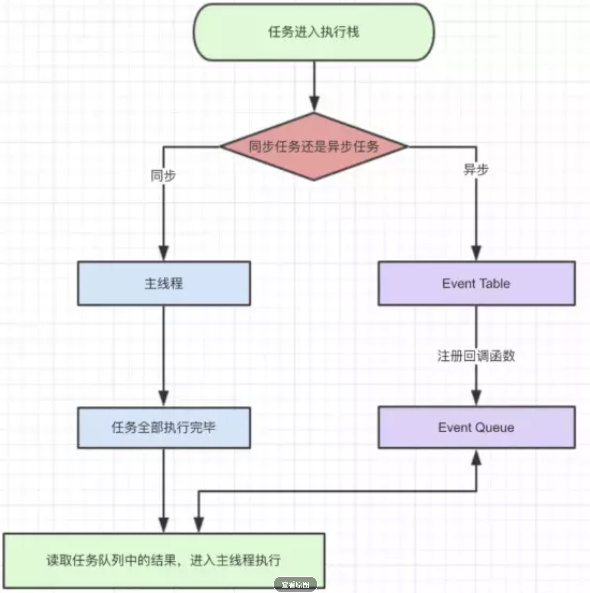
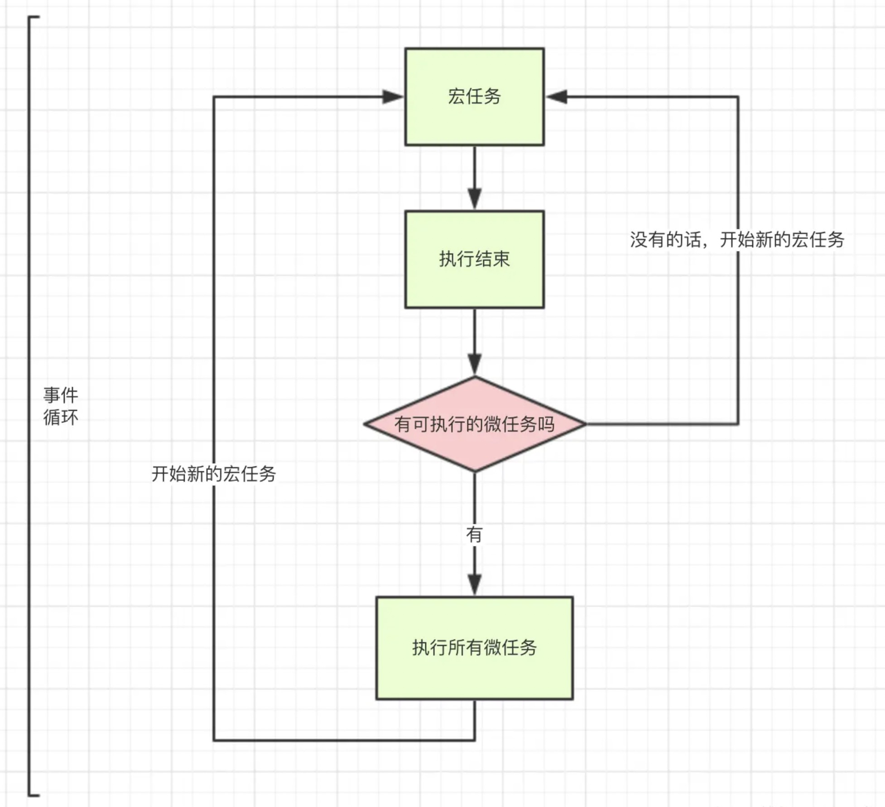

# 异步编程
[[toc]]
[TOC]
## 1.ajax5个面试题

### ajax

- 创建XMLHttpRequest实例xhr
- 调用实例的open方法,open(method,url,true/false)
- 调用onreadystatechange监听状态变化
- 调用send方法发送请求，并把请求体传入

```js
let xhr = new XMLHttpRequest
xhr.open('get',url,true)
xhr.send(null)
xhr.onreadystatechange= ()=>{
    //readyState记录状态
    // 0实例创建 1调用open 2调用send,头部和状态获取 3下载中 4下载完成
    // xhr.status:http状态码 200成功 301永久 302临时 304走缓存 400 401 404 500 503
    if(xhr.readyState===4&&(xhr.status===200)){
        let result = xhr.responeText;
        console.log(result)
    }
}
```

**XMLHttpRequest.readyState** 属性返回一个 XMLHttpRequest 代理当前所处的状态。一个 XHR 代理总是处于下列状态中的一个：

| 值   | 状态               | 描述                                                |
| ---- | ------------------ | --------------------------------------------------- |
| `0`  | `UNSENT`           | 代理被创建，但尚未调用 open() 方法。                |
| `1`  | `OPENED`           | `open()` 方法已经被调用。                           |
| `2`  | `HEADERS_RECEIVED` | `send()` 方法已经被调用，并且头部和状态已经可获得。 |
| `3`  | `LOADING`          | 下载中； `responseText` 属性已经包含部分数据。      |
| `4`  | `DONE`             | 下载操作已完成。                                    |

- UNSENT

  XMLHttpRequest 代理已被创建， 但尚未调用 open() 方法。

- OPENED

  open() 方法已经被触发。在这个状态中，可以通过 [setRequestHeader()](https://developer.mozilla.org/en-US/docs/Web/API/XMLHttpRequest/setRequestHeader) 方法来设置请求的头部， 可以调用 [send()](https://developer.mozilla.org/en-US/docs/Web/API/XMLHttpRequest/send) 方法来发起请求。

- HEADERS_RECEIVED

  send() 方法已经被调用，响应头也已经被接收。

- LOADING

  响应体部分正在被接收。如果 `responseType` 属性是“text”或空字符串， `responseText` 将会在载入的过程中拥有部分响应数据。

- DONE

  请求操作已经完成。这意味着数据传输已经彻底完成或失败。

### ajax有几个方法

8个

### get和post区别

GET系列：get delete head options

POST系列：post put

在向服务器传递信息时，get基于URL的问号传参，post系列都是在请求体里.

>- get请求会被浏览器缓存（你在地址栏输入就能看见），post不会
>- get会有大小限制，post理论上没有限制
>- （记住）get在浏览器回退时没有影响，如果post请求，他可能会重复提交
>- 


1. （记住）get请求会被浏览器主动缓存（你在地址栏输入就能看见），post不会
2. （记住）get请求只能进行url编码，post支持多种编码方式
3. get请求参数会被完整保存在历史记录，post不会保存。防止csrf攻击，可以使用post。
4. （记住）get请求有长度限制，不同浏览器限制不一样，所以get请求的url不可以太长。否则会截断，post无限制。
5. get只接受ASCII字符，POST无限制
6. GET会暴露在URL上，不能传递敏感信息
7. （记住）GET参数放在url,地址栏能看见，POST放在请求体。

### 常见的状态码和区别

200 

301永久

302/307临时

304缓存

400参数错误

401没权限,token失效

404 没有这个页面

500 服务器错误，一般不会告诉前端服务器的错误。

503 超负荷

### 常见传输数据的格式

+ form-data 文件上传/表单提交

```js
let form1 = new FormData()
form1.append('lx',0)
xhr.send({
    form-data
})
```

- x-www-form-urlencoded 和问好参数一致

```js
xhr.setRequestHeader('Content-Type','application/x-www-form-urlencoded')

xhr.send('a=0&b=1')
```

- raw 字符串 JSON/txt

```js
xhr.send(JSON.stingify({name:1,age:2}))

//mime application/json
xhr.setRequestHeader('Content-Type','application/json')
xhr.send(JSON.stingify({name:1,age:2}))
```

### $.ajax,axios,fetch区别

- $ajax和axios使用的XMLhttpRequest
  - axios使用的是promise,链式调用，不会有回调深渊
  - $ajax是jq封装的方法，使用回调方式。
- fetch不使用xmlhttprequest。和axios用法差不多。
  - 兼容性差。。

## 2.fetch

- fetch里的无论返回什么状态码，都代表成功，只要服务器有响应。
- 服务器没有任何响应，比如断网会失败。

```js
fetch(url,{
    method:'GET',
    headers:{
        'x-token':'xxx'
    }
}).then(res=>{
    if(res.status>=300){
        switch(res.status){
                case 400
                ....
        }
    }
    return res.json()
}).then(res=>{
    console.log(res)
})

fetch(url,{
    method:'POST',
    headers:{
        'x-token':'xxx',
        'Content-Type':'application/x-www-form-urlplant'
    },
    body:'x=0&c=1'
}).then(res=>{
    return res.json()
}).then(res=>{
    console.log(res)
})
```

## 3.跨域

- webSocket可以不需要进行跨域

- jsonp
- cors:跨域资源共享，浏览器和服务器之间有安全限制，默认不允许跨域请求，但是我们可以绕过安全限制，服务器里允许指定源可以向当前服务器发请求
- proxy

cors:

- 客户端基于CORS跨域时，首先会先发送一个试探请求options验证是否连接成功。

```js
//使用*不能传输cookie等。

//单一源：可以允许携带资源凭证 Access-Control-Allow-Credentials:true

//fetch需要额外设置
fetch(url,{
    //include 跨域时允许携带
    credentials:'same-origin'//同源才能携带凭证  
})
a2
```

proxy代理

- 向本地的一个服务器发起请求，由本地服务帮我们代理到真实服务器，服务器和服务器之间数据交互不存在跨域。浏览器和本地服务器没有跨域

- 生产环境下
  - 直接修改ngix三行配置
  - 或者iis

jsonp

- 只能支持get请求。

  ```html
  <script>
  	function fn(res){
          console.log(res)
      }
  </script>
  <script>
  	fn({name:'zs',age:18})
  </script>
  ```


## 4. promise常用api

- Promise.prototype.then() then里的函数return出的东西就是下一个promise接收的。

- Promise.prototype.catch **catch可以捕获他之前的所有promise的错误。**

- Promise.prototype.finally  **es9,不管结果如何都会执行，本质是then方法的特例**

  ```js
  promise.finally(() => {});// 等同于
  promise.then(result =>{return result;},error =>{ throw error;});
  ```

- Promise.all([p1,p2,p3])  **接收一个具有Interator接口的参数。如果全部成功，会返回一个返回结果组成的数组，**

  ```js
  var promise1 = Promise.resolve(3);var promise2 = 42;
  var promise3 = new Promise(function(resolve, reject) {
    setTimeout(resolve, 100, 'foo');
  });
  Promise.all([promise1, promise2, promise3]).then(function(values) {
    console.log(values);
  });
  // expected output: Array [3, 42, "foo"]
  ```


## promise常见问题

1. 如何改变promise状态？

   - resolve(value):如果当前是pending就变成resolved状态

   - reject(val):如果当前是pending就变为rejected

   - 抛出异常：如果当前是pending就变为rejected

     ```js
     new Promise(res,rej=>{
       throw new Error('出错')
     })
     ```

2. 一个promise指定多个成功/失败回调函数, 都会调用吗?

   - 当promise改变为对应状态时都会调用

     ```js
     let a = new Promise()
     a.then(...)
     a.then(...)
     ```

## 头条-Promise并发数限制

- promise.all会并发执行所有promise

- 我们想控制**同一时刻只执行两个promise**,有一个promise空下来再执行下一个promise。

请实现如下需求:

```js
class Scheduler {
    add(promiseCreator) {
    }
}

const timeout = time => new Promise(resolve => setTimeout(resolve, time))

const scheduler = new Scheduler()

const addTask = (time, order) => {
    scheduler.add(() => timeout(time).then(() => console.log(order)))
}

addTask(1000, 1)
addTask(500, 2)
addTask(300, 3)
scheduler.start();
```


题目解释：

```js
//timeout函数返回一个promise实例，通过传递的time参数控制执行时间来模拟并发
const timeout = time => new Promise(resolve => setTimeout(resolve, time))

//创建并发控制实例
const scheduler = new Scheduler()
const addTask = (time, order) => {
    scheduler.add(() => timeout(time).then(() => console.log(order)))
}

//添加任务，第一个1000ms后执行，第二个500ms后执行，第三个300ms后执行。
//此时执行顺序应该是 2 3 1 因为2执行500ms完毕后执行3,3执行完毕后1并没有执行完毕。
addTask(1000, 1)
addTask(500, 2)
addTask(300, 3)
```

解答

```js
class Scheduler {
    constructor(){
        this.list = [];
        this.maxNum = 2;
        this.workingNum = 0
    }
    add(promiseCreator) {
        this.list.push(promiseCreator)
    }
    start(){
        for(var i=0;i<this.maxNum;i++){
            this.doNext()
        }
    }
    doNext(){
        if(this.list.length&&this.workingNum<this.maxNum){
                    // 正在执行的任务数+1

            this.workingNum++;
            this.list.shift()().then(res => {
                // 完成后，正在执行的任务数减1
                // 然后继续执行下一步此任务。
                this.workingNum--;
                this.doNext()
            })
        }
    }
}

const timeout = time => new Promise(resolve => setTimeout(resolve, time))

const scheduler = new Scheduler()

const addTask = (time, order) => {
    scheduler.add(() => timeout(time).then(() => console.log(order)))
}

addTask(1000, 1)
addTask(500, 2)
addTask(300, 3)
scheduler.start();
```

## 头条:异步串行 | 异步并行

```js
// 字节面试题，实现一个异步加法
function asyncAdd(a, b, callback) {
    setTimeout(function() {
        callback(null, a + b);
    }, 500);
}

// 解决方案
// 1. promisify
const promiseAdd = (a, b) => new Promise((resolve, reject) => {
    asyncAdd(a, b, (err, res) => {
        if (err) {
            reject(err)
        } else {
            resolve(res)
        }
    })
})

// 2. 串行处理
async function serialSum(...args) {
    return args.reduce((task, now) => task.then(res => promiseAdd(res, now)), Promise.resolve(0))
}

// 3. 并行处理
async function parallelSum(...args) {
    if (args.length === 1) return args[0]
    const tasks = []
    for (let i = 0; i < args.length; i += 2) {
        tasks.push(promiseAdd(args[i], args[i + 1] || 0))
    }
    const results = await Promise.all(tasks)
    return parallelSum(...results)
}

// 测试
(async() => {
    console.log('Running...');
    const res1 = await serialSum(1, 2, 3, 4, 5, 8, 9, 10, 11, 12)
    console.log(res1)
    const res2 = await parallelSum(1, 2, 3, 4, 5, 8, 9, 10, 11, 12)
    console.log(res2)
    console.log('Done');
})()
```

## 异步串行2

输出以下代码运行结果，为什么？如果希望每隔 1s 输出一个结果，应该如何改造？注意不可改动 square 方法

```js
const list = [1, 2, 3]
const square = num => {
  return new Promise((resolve, reject) => {
    setTimeout(() => {
      resolve(num * num)
    }, 1000)
  })
}

function test() {
  list.forEach(async x=> {
    const res = await square(x)
        console.log(res)
  })
}
test()
```

方法1

```js
async function test() {
  for (let i = 0; i < list.length; i++) {
    let x = list[i]
    const res = await square(x)
    console.log(res)
  }
}
```

方法2

```js
async function test() {
  for (let x of list) {
    const res = await square(x)
    console.log(res)
  }
}
```

方法3

```js
function test() {
  list.forEach(async (x,i) => {
    const res = await square(x)
    setTimeout(()=>{
     console.log(res) 
    },i*1000)
  })
}
```

方法4

```js
let promise = Promise.resolve()
function test(i = 0) {
  if (i === list.length) return
  promise = promise.then(() => square(list[i]))
  test(i + 1)
}
test()
```

## 手写promise

# Promise原理解析与实现

[TOC]

`Promise` 是 `JavaScript` 异步编程的一种流行解决方案，掌握 `Promise` 的使用是我们不可或缺的一项基本技能。但是要想熟练掌握并深入的理解它，还是必须要知道它的实现原理的。这节课就是从具体使用角度出发，使用原生手写方式一步一步的带你实现 `Promise` 库，而且不仅仅只是包含了 `Promise` 目前通用的功能，还有 `Promise` 的一些新的特性和未来即将支持的特性的介绍与实现

## Promise 类

`Promise` 的构造函数必须接收一个函数参数（也就是需要执行异步任务的函数），该函数将在传入以后立即调用，并传入 `Promise` 对象下的两个方法 `resolve` 和 `reject` 

## Promise 状态

每一个 `Promise` 对象都存在以下三种状态：

- PENDING : 进行中，`Promise` 对象的初始状态
- FULFILLED : 已成功
- REJECTED : 已失败

> 每一个 `Promise` 对象只能由 `PENDING` 状态变成 `FULFILLED` 或 `REJECTED`，且状态发生变化以后就能再改变了 ---- 记住这个特性

一个 `Promise` 对象状态的变化并不由 `Promise` 对象本身来决定，而应该是由我们传入的异步任务完成情况来决定的，`Promise` 提供了两个用来改变状态的方法

## promise.resolve 方法

将 `Promise` 对象的状态从 `PENDING` 变为 `FULFILLED`，并执行成功后的注册任务

> 注意：如果当前状态已经改变过了，则直接 `return`


## promise.reject 方法

将 `Promise` 对象的状态从 `PENDING` 变为 `REJECTED`，并执行失败后的注册任务

> 注意：如果当前状态已经改变过了，则直接 `return`

## promise.then 方法

`then` 是 `Promise` 对象提供的一个方法，它接收两个函数作为参数，分别注册到 `resolve` 和 `reject`  方法执行后的任务队列中，我们需要在 `Promise` 中维护两个队列

- fulfilledQueues
- rejectedQueues

### 添加任务

把 `then` 方法中接收到的两个函数分别添加到对应的任务队列中

### 执行任务

在 `Promise.resolve` 和 `Promise.reject` 方法中调用执行对应的任务队列的所有注册函数

### 宏任务 & 微任务





- 异步任务
  - 微任务
  - 宏任务

`then` 方法是一个微任务

- setTimeout(fn, 0);
- postMessage
- MutationObserver

### 结果传递

在调用 `reslove` 或者 `reject` 方法的时候，我们还可以通过传入一些值，在后续的 `then` 方法中，可以通过对应的函数接收到该结果

> 如果在一个 `Promise` 对象的状态改变后调用`then` 则会立即执行添加的对应函数，所以需要注意必须根据当前 `Promise` 的状态来做不同的处理
>
> - PENDING : 添加到对应的任务队列
> - FULFILLED / REJECTED : 不用添加到队列，而是立即执行任务

### 返回值

`then` 方法在执行最后必须返回一个新的 `Promise` 对象

> <span style="color:red">重点（难点）</span>
>
> 返回 `Promise`对象会立即调用并执行，如果这个时候，直接去执行该对象的 `resolve` 或者 `reject` 方法都会导致后续的 `then` 也立即被调用
>
> 我们需要对原 `fulfilledHandler` 和 `rejectedHandler` 进行包装，把它们和新 `Promise` 对象的 `resolve` 和 `reject` 方法分别放置到新的函数中，并把这个新的函数添加到原有任务队列中调用
>
> 简而言之：把新返回的 `Promise` 对象的 `resolve` 和 `reject` 与 `then` 中执行的 `fulfilledHandler` 和 `rejectedHandler` 添加到一个任务队列中执行，这样才能使用原有的 `then` 执行完成以后才执行新的 `Promise` 中的 `then`

上面是默认情况下的处理情况，其实 `then` 方法的处理更为复杂

> 当一个[`Promise`](https://developer.mozilla.org/zh-CN/docs/Web/JavaScript/Reference/Global_Objects/Promise)完成（fulfilled）或者失败（rejected），返回函数将被异步调用（由当前的线程循环来调度完成）。具体的返回值依据以下规则返回：
>
> - 如果then中的回调函数没有返回值，那么then返回的Promise将会成为接受状态，并且该接受状态的回调函数的参数值为 undefined。
> - 如果then中的回调函数返回一个值，那么then返回的Promise将会成为接受状态，并且将返回的值作为接受状态的回调函数的参数值。
> - 如果then中的回调函数抛出一个错误，那么then返回的Promise将会成为拒绝状态，并且将抛出的错误作为拒绝状态的回调函数的参数值。
> - 如果then中的回调函数返回一个已经是接受状态的Promise，那么then返回的Promise也会成为接受状态，并且将那个Promise的接受状态的回调函数的参数值作为该被返回的Promise的接受状态回调函数的参数值。
> - 如果then中的回调函数返回一个已经是拒绝状态的Promise，那么then返回的Promise也会成为拒绝状态，并且将那个Promise的拒绝状态的回调函数的参数值作为该被返回的Promise的拒绝状态回调函数的参数值。
> - 如果then中的回调函数返回一个未定状态（pending）的Promise，那么then返回Promise的状态也是未定的，并且它的终态与那个Promise的终态相同；同时，它变为终态时调用的回调函数参数与那个Promise变为终态时的回调函数的参数是相同的。


## promise.catch 方法


## promise.finally 方法

<u>ECMA2018 Added</u>


## Promise.resolve 方法


## Promise.reject 方法


## Promise.all 方法


## Promise.race 方法


## Promise.allSettled 方法

[（TC39第4阶段草案）](https://tc39.es/proposal-promise-allSettled/)

ECMA 2020 新增


