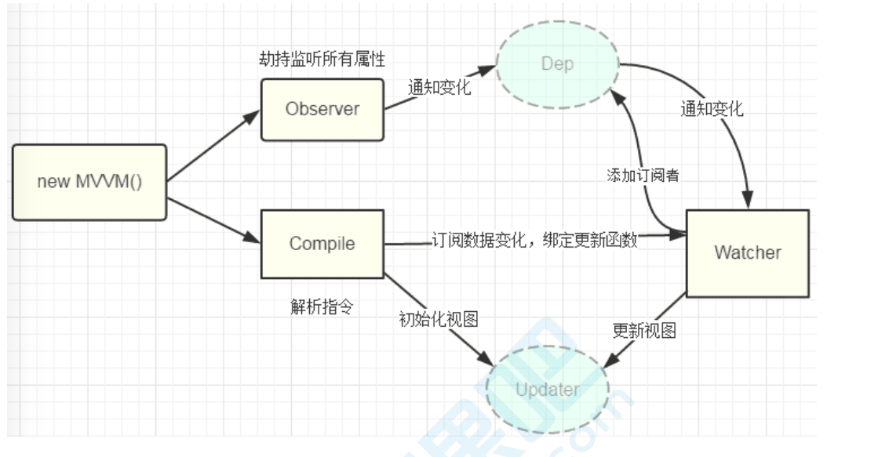
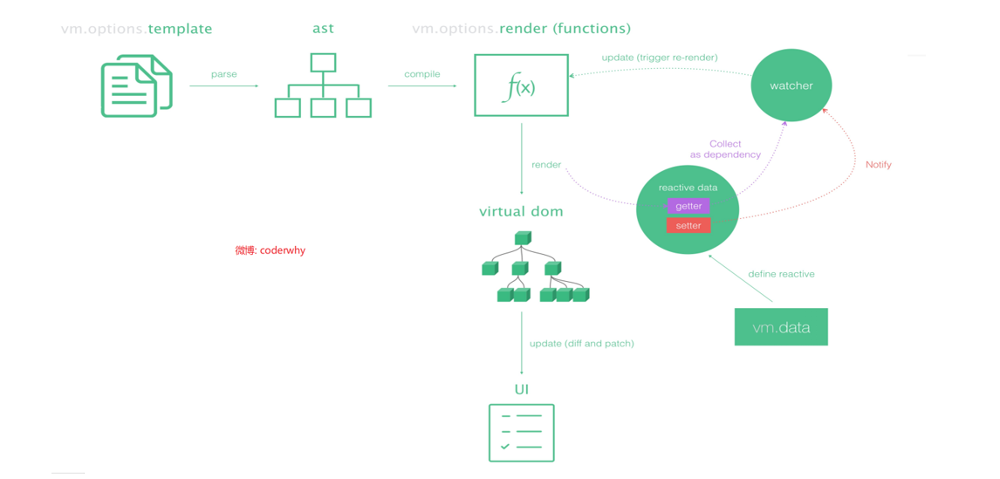
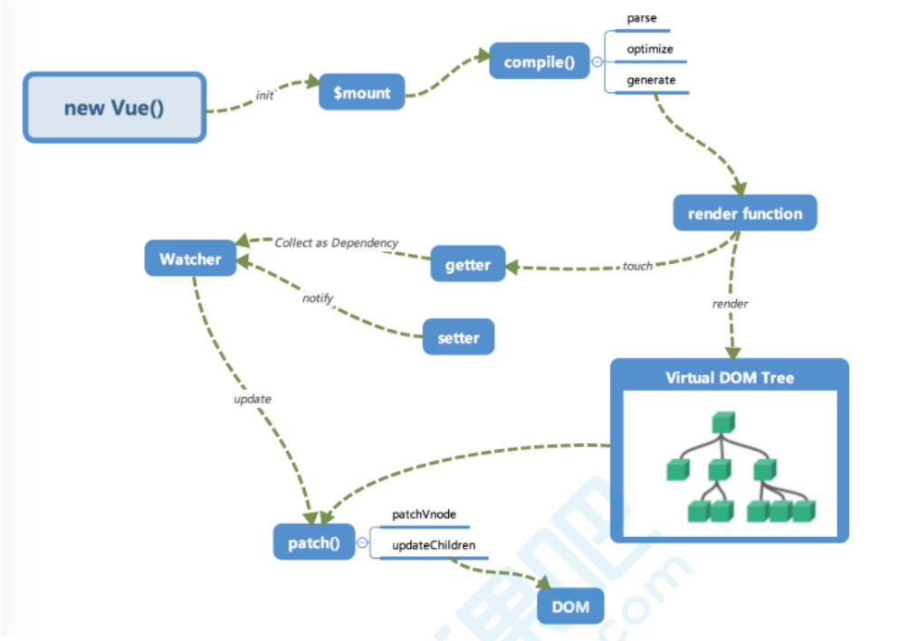
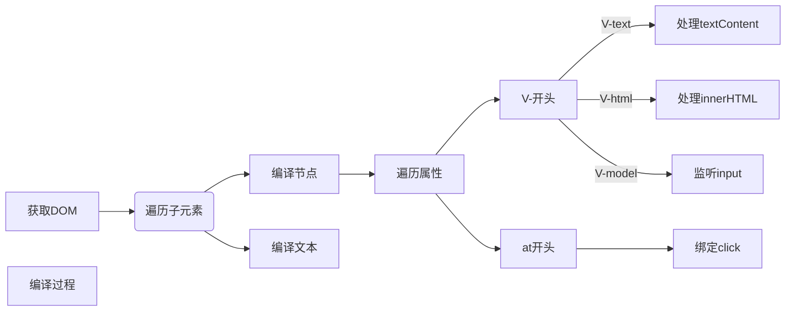

# vue源码简单实现

## 几种实现双向绑定的方法

所谓的双向数据绑定其实就是给表单控件添加了input事件，动态的修改value值。所以所谓的双向绑定其实就是一个语法糖。

**数据劫持:**vue采用数据劫持结合发布-订阅的方式，通过getter和setter来实现依赖收集和派发更新。在数据变化时发布消息给订阅者，然后出发响应回调。

Observer类：劫持监听所有的属性，存放setter和getter。外界出发setter,就把Watcher放到Dep，通知当前变化属性的观察者去更新视图，我们有多少个属性就创建多少个观察者去监听属性，这一堆放到Dep订阅器里。把Dep和Observer关联，一旦setter出发就通知Dep找到对应Watcher发生变化，然后通知Watcher去更新视图。





## 实现一个指令解析器Compile

实现解析指令和初始化视图

```js
const compileUtil = {
  //getVal用于获取参数expr对应的值,比如v-text='msg',msg:'data'就获取到msg对应的值data
  getVal(expr, vm) {
    //person.msg .split('.')==>[person msg]
    return expr.split('.').reduce((data, currentVal) => {
      return data[currentVal]
    }, vm.$data)
  },
  // node是当前节点
  // expr v-text='expr'
  // vm就是组件实例
  text(node, expr, vm) {//expr:msg msg:'啊啊啊' <div v-text='person.msg'
    let value
    if (expr.indexOf('{{') !== -1) {
      // {{a}}--{{b}}
      value = expr.replace(/\{\{(.+?)\}\}/g, (...args) => {
        return this.getVal(args[1], vm)
      })

    } else {
      value = this.getVal(expr, vm)
    }
    this.updater.textUpdater(node, value);

  },
  html(node, expr, vm) {
    const value = this.getVal(expr, vm)
    this.updater.htmlUpdater(node, value);

  },
  model(node, expr, vm) {
    const value = this.getVal(expr, vm)
    this.updater.modelUpdater(node, value);

  },
  // <node v-on:eventName=expr></div>
  on(node, expr, vm, eventName) {
    let fn = vm.$options.methods[expr];
    // this绑定到vm
    node.addEventListener(eventName, fn.bind(vm), false)
  },
  bind(node, expr, vm, attrName) {//<div v-bind:src='value'
    const value = this.getVal(expr, vm);
    node.setAttribute(attrName, value)
  },
  //更新函数
  updater: {
    textUpdater(node, value) {
      node.textContent = value;
    },
    htmlUpdater(node, value) {
      node.innerHTML = value;
    },
    modelUpdater(node, value) {
      node.value = value;
    }
  }
}
class Compile {
  constructor(el, vm) {
    this.el = this.isElementNode(el) ? el : document.querySelector(el);
    this.vm = vm;
    // 1.获取文档碎片对象放入内存以减少DOM操作
    const fragment = this.node2Fragment(this.el);
    // 2.编译模板fragment
    this.compile(fragment)
    // 3.追加子元素到根元素
    this.el.appendChild(fragment)

  }
  isElementNode(node) {
    return node.nodeType === 1;
  }
  node2Fragment(el) {
    const fragment = document.createDocumentFragment()
    while (el.firstChild) {
      fragment.appendChild(el.firstChild);
    }
    return fragment;
  }

  compile(fragment) {
    // 1.获取子节点
    [...fragment.childNodes].forEach(child => {
      if (this.isElementNode(child)) {
        //是元素节点就要编译他
        if (child.childNodes) {
          this.compile(child);
        }
        this.compileElement(child)
      } else {
        //文本节点
        this.compileText(child)
      }
    })
  }

  //编译元素
  compileElement(node) {
    // v-text处理文本 v-html处理html v-model处理表单
    const attr = node.attributes;
    [...attr].forEach(attr => {
      const { name, value } = attr;
      if (this.isDirective(name)) {//如果是一个指令 v-text v-html v-model v-on:click
        const directive = name.slice(2);
        const [dirName, eventName] = directive.split(':') //html==>['html'] text==>['text'] on:click==>['on','click'] 
        //compileUtil.text(node,'aaa',this.vm)
        //compileUtil.on(node,'handleClick',this.vm,'click')

        // 数据驱动视图
        compileUtil[dirName](node, value, this.vm, eventName)

        //删除有指令的标签的属性
        // node.removeAttribute('v-' + directive)
        node.removeAttribute(name)
      } else if (name.startsWith('@')) {//@click='handlcikck'
        let [, eventName] = name.split('@');
        compileUtil['on'](node, value, this.vm, eventName)
      } else if (name.startsWith(':')) {//:href='xx'
        let [, attrName] = name.split(':');
        compileUtil['bind'](node, value, this.vm, attrName)
      }
    })
  }
  compileText(node) {
    const content = node.textContent
    if (/\{\{(.+?)\}\}/.test(content)) {
      compileUtil['text'](node, content, this.vm)
    }
  }
  isDirective(attrName) {
    return attrName.startsWith('v-')
  }
}


class CVue {
  constructor(options) {
    this.$el = options.el;
    this.$data = options.data
    this.$options = options
    if (this.$el) {
      // 1.实现Observer

      // 2.实现Compiler解析指令
      new Compile(this.$el, this)
    }
  }
}
```


## 实现一个数据的监听器Observer

```js
//CVue.js

class CVue {
  constructor(options) {
    this.$el = options.el;
    this.$data = options.data
    this.$options = options
    if (this.$el) {
      //实现数据观察者
			new Observer(this.$data)
      new Compile(this.$el, this)
    }
  }
}
```

## 实现观察者watcher和依赖收集dep


## 实现一个Watcher去更新视图

## 实现Proxy代理

## 如何描述响应式原理


vue本质上就是一个用 Function 实现的 Class，然后它的原型 prototype 以及它本身都扩展了一系列的方法和属性。

## 初始化

在`new Vue()`之后，Vue会调用`_init()`方法进行初始化,会合并配置，初始化生命周期，初始化事件methods，初始化data,props,computed和watch等。其中最主要的就是通过设置属性的getter和setter来实现依赖收集和派发更新。在初始化的最后，检测到如果有 `el` 属性，则调用 `vm.$mount` 方法挂载 `vm`，挂载的目标就是把模板渲染成最终的 DOM，$mount创建了根组件。

下图是在运行时+编译器环境下。

简单版本:

入口







```
// new Compile()
```


## 											Vue手写


