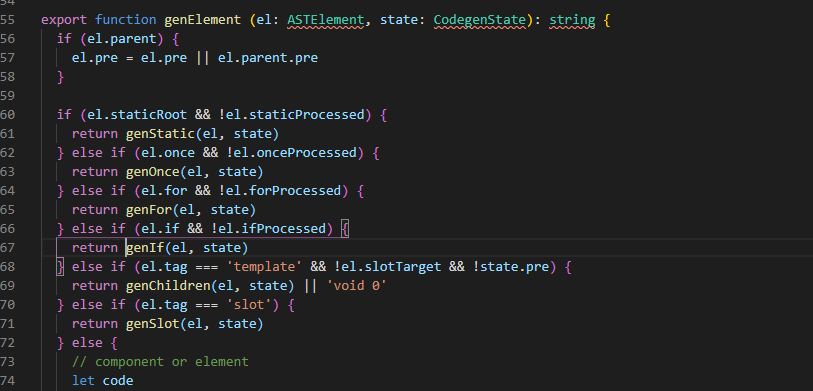

# vue面试题1

## v-if和v-for优先级哪个更高？

v-for更高，因为他是先进行if else判断的。 vue在进行props判断时会先判断静态，然后判断once,之后判断for,然后才会进行if的判断。

如果两者同时出现，那样将来v-if生成的每一项item都会包含一个v-if的判断。这样会浪费性能。

解决方法：

- 如果只需对列表整体进行条件判断，可以在外部包围一层template进行条件判断
- 如果每一项都会进行条件判断，可以使用计算属性filter一下，然后循环输出满足条件的

```js
ctrl+p compiler/codegen/index.js   genElement
```



## vue组件data为什么是函数？

>Vue组件会有多个实例，使用对象形式定义data,会共用一个引用，状态的变更就会互相影响，使用工厂函数，每次执行initData检测到是函数，会执行并返回全新的data实例，多个组件实例间就不会互相影响。并且也无法被检测通过
>
>根实例只有一个，单例情况下不存在互相影响，没有必要检测。

我们可以欺骗vue，让每个组件实例共享一个堆内存地址。

```js
const cheatData = {msg:0}
export default {
    data(){
        return cheatData
    }
}
```

这样所有的组件实例会共享一个状态，当一个组件的状态变更也会影响其他组件的状态。

源码：

```
ctrl+p src\core\instance\state   initData
```

```js
function initData (vm: Component) {
  let data = vm.$options.data
  //data是函数就执行一下这个函数，并把结果作为data的值

  data = vm._data = typeof data === 'function'
    ? getData(data, vm)
    : data || {}
  if (!isPlainObject(data)) {
    data = {}
  	//。。。。
  }

}
```

## 你对key的理解

这里是我自己总结的，感觉网上那些笔试题都不对：

> 我认为key就是给vue的就地更新/复用策略擦屁股的。
>
> 当 Vue 正在更新使用 `v-for` 渲染的元素列表时，它默认使用“就地更新”的策略。如果数据项的顺序被改变，Vue 将不会移动 DOM 元素来匹配数据项的顺序，而是就地更新每个元素，并且确保它们在每个索引位置正确渲染。这个默认的模式是高效的，但是**只适用于不依赖子组件状态或临时 DOM 状态 (例如：表单输入值) 的列表渲染输出**。
>
> key用于虚拟dom的diff算法时**准确判断新旧两个节点是否相同**。如果不用key,vue会就地更新/复用相同类型的元素，而使用key,vue会基于key的变化排列元素顺序，这样在元素的插入删除等操作时就不会把后面的所有的元素都进行更新或者移除了。
>
> 没有key时key默认为undefined,就会就地复用相同的标签，省的创建新的DOM，大部分情况下这样做会更高效的渲染。但是这样会带来一些bug(不触发组件生命周期、过渡动画，或者切换Input时输入内容会保留)，并且在长列表的中间插入删除操作时会把列表后面的元素全部更新。
>
> 并且使用key可以通过oldVnode = oldVnodes[newVnode.key]的形式快速拿到对应节点，而不是通过遍历的形式。

官网回答

>`key` 的特殊 attribute 主要用在 Vue 的虚拟 DOM 算法，在新旧 nodes 对比时辨识 VNodes。如果不使用 key，Vue 会使用一种最大限度减少动态元素并且尽可能的尝试就地修改/复用相同类型元素的算法。而使用 key 时，它会基于 key 的变化重新排列元素顺序，并且会移除 key 不存在的元素。

源码

```
src\core\vdom\patch.js - updateChildren()
```


网上一些笔试题：

使用key时会通过映射的方式找到对应的老节点，而不是遍历。

key是每一个vnode的唯一标识，通过key,可以更快、更准确的拿到oldVnode中对应的vnode节点，从而更高效的更新虚拟DOM。

**更快：**

有key的情况下，vue在patch过程中,头尾交叉对比没有结果时，会根据新节点的key去对比旧节点数组的key,

通过oldVnodes[newVnode.key]的映射方式获取到对应的老节点，显然比没有key而使用遍历方式获取的更快。

并且在中间插入元素情况下只会进行一次插入操作而不是把后面所有元素进行更新。

```js
// vue项目  src/core/vdom/patch.js  -488行
// 以下是为了阅读性进行格式化后的代码

// oldCh 是一个旧虚拟节点数组
if (isUndef(oldKeyToIdx)) {
    oldKeyToIdx = createKeyToOldIdx(oldCh, oldStartIdx, oldEndIdx)
}
if(isDef(newStartVnode.key)) {
    // map 方式获取
    idxInOld = oldKeyToIdx[newStartVnode.key]
} else {
    // 遍历方式获取
    idxInOld = findIdxInOld(newStartVnode, oldCh, oldStartIdx, oldEndIdx)
}
```

**更准确**

没有key的情况下，key就是undefined,无法通过undefined进行新旧节点对比，所以会使用就地复用，因为带key就不是`就地复用`了，在sameNode函数 `a.key === b.key`对比中可以避免就地复用的情况。所以会更加准确，避免了就地复用带来的副作用。

## 你对diff算法的理解

1. diff算法是用于虚拟DOM进行新旧对比时的优化算法，通过比较新旧virtualDOM,把变化更新到真实DOM上，此外，此外diff算法高效的执行对比过程使得时间复杂度从树节点对比的O(n^3)降低到O(n)。

2. Vue中，每个组件只有一个Watcher,Vue的diff算法可以精准查找的变化的地方	

3. 当我们修改数据时，Vue的响应式触发了setter,setter会尝试把watcher添加到异步更新队列，每次事件循环结束后会清空这些队列，清空队列的过程中，watcher尝试执行update函数，这些更新函数执行时会调用组件的渲染和更新函数，会重新渲染最新的虚拟DOM，执行更新函数，此时diff算法触发，新旧对比的过程称为patch。
4. diff过程整体遵循深度优先、同层比较的策略；两个节点之间比较会根据它们是否拥有子节点或者文 本节点做不同操作；比较两组子节点是算法的重点，首先假设头尾节点可能相同做4次比对尝试，如果 没有找到相同节点才按照通用方式遍历查找，查找结束再按情况处理剩下的节点(批量删除和更新)；借助key通常可以使用map映射的方式非常精确找到相同节点，因此整个patch过程非常高效。

源码分析1：必要性，lifecycle.js - mountComponent() 

一个组件一个watcher,为了知道哪一个变化了，必须使用diff算法

组件中可能存在很多个data中的key的变化，执行diff算法，

```js
export function mountComponent (
vm: Component,
 el: ?Element,
 hydrating?: boolean
): Component {

    if (process.env.NODE_ENV !== 'production' && config.performance && mark) {


    } else {
        updateComponent = () => {
            // 用户$mount时，调用mouentCompoent ,
            vm._update(vm._render(), hydrating)
        }
    }

    new Watcher(vm, updateComponent, noop, {
        before () {
            if (vm._isMounted && !vm._isDestroyed) {
                callHook(vm, 'beforeUpdate')
            }
        }
    }, true /* isRenderWatcher */)
    hydrating = false

    // manually mounted instance, call mounted on self
    // mounted is called for render-created child components in its inserted hook
    if (vm.$vnode == null) {
        vm._isMounted = true
        callHook(vm, 'mounted')
    }
    return vm
}
```

源码分析2：执行方式，patch.js - patchVnode() 

patchVnode是diff发生的地方，整体策略：深度优先，同层比较，最后比较两者

```js
  // 是否是元素
    if (isUndef(vnode.text)) {
      // 是否都有孩子
      if (isDef(oldCh) && isDef(ch)) {
        // 比孩子，递归
        if (oldCh !== ch) updateChildren(elm, oldCh, ch, insertedVnodeQueue, removeOnly)
      } else if (isDef(ch)) {  //新节点有孩子
        if (process.env.NODE_ENV !== 'production') {
          checkDuplicateKeys(ch)
        }
        //清空老节点文
        if (isDef(oldVnode.text)) nodeOps.setTextContent(elm, '')
        // 创建孩子并追加
        addVnodes(elm, null, ch, 0, ch.length - 1, insertedVnodeQueue)
      } else if (isDef(oldCh)) {//只有老节点有孩子，就清空老节点
        removeVnodes(oldCh, 0, oldCh.length - 1)
      } else if (isDef(oldVnode.text)) {
        // 老节点有文本就清空
        nodeOps.setTextContent(elm, '')
      }
    } else if (oldVnode.text !== vnode.text) {//都是文本，更新文本
      nodeOps.setTextContent(elm, vnode.text)
    }
```

源码分析3：高效性，patch.js - updateChildren()

```js
- 首尾猜测都没有
- 如果有key，就根据key进行映射查找
- 没有key就遍历查询
- 处理剩下节点
```

## 对Vue组件化的理解

- 组件系统是 Vue 核心特性之一，它使开发者使用小型、独 立和通常可复用的组件构建大型应用；

- Vue的组件就是Vue的一个个实例，他们都继承于vue.
- 组件带来了很多便利性，我们可以把页面分成一个个的组件，开发时专注于相应组件的开发即可，最后通过组件的一些传参方式，比如props,自定义事件,总线,vuex等等进行交互通信。
- Vue的组件传值遵循单项数据流的原则，子组件接受父组件的props后不可以随意的修改他。

```
vue-loader会编译template为render函数，最终导出的依然是组件配置对象。
```

## 对Vue的理解

- vue1:新世纪福音战士,vue2:攻壳特工队,vue3:海贼王

[尤雨溪专访](https://gitee.com/gitee-stars/14)

- Vue在法语里是视野的意思，这也是vue的核心：视图view。此外这也是'尤'的一个谐音

- 尤雨溪认为Vue的设计理念就是**确保的是当用户不需要一个功能的时候，那么这个功能就不应该给用户造成额外的心智负担。**从框架层面来说，这也体现在 Vue 的 “渐进式” 设计理念里面，比如如果你不需要客户端路由，那么你甚至不需要知道 vue-router 的存在。但对于需要这些功能的用户而言，这些功能都是包含在框架之内的，包括vue3的按需引入等等。
- Vue代码追求简约轻量，比如双绑，vue会使用v-model帮你实现，还有一些模板语法的简写形式等等3
- Vue的响应式系统、基于HTML的模板语法和基于options的组件系统使得我们只需要关注核心业务，不需要操作DOM。
- 高效性：Vue的虚拟DOM和diff算法使得项目的性能有很大提升。

## vue的发展历程

Vue 的发展历程，从最初的实验阶段（2013 年中到 2014 年 2 月），0.x 阶段 (2014 年 2 月到 2015 年 10 月)，1.x 阶段 (2015 年 10 月到 2016 年 9 月)，到现在的2.x 阶段 (2016 年 9 月至今)，加上正式对外发布之前的时间，到今天已经有 足足5 年多的时间了。 0.x - 1.0 的改动主要集中在模版语法上，在 1.0 之后，模版语法就相对稳定，没有再经历过特别大的改动了。2.0 的改动则专注于内部的渲染机制变化，引入了 Virtual DOM，从而获得了服务端渲染、原生渲染、手写渲染函数等能力。 3.0 主要集中于利用 ES2015 的新特性、改进内部架构和性能优化上。

## 对MVC MVP MVVM的理解

这三者都是框架模式，它们设计的目标都是为了解决Model和View的耦合问题。

MVC是一种后端设计模式，Model层和数据库打交道，View层决定视图的展示，Controller层提供的一些方法决定要从Model层拿什么养的数据给视图。它的优点是分层清晰，缺点是数据流混乱，灵活性带来的维护性问题。

MVP模式在是MVC的进化形式，Presenter作为中间层负责MV通信，解决了两者耦合问题，但P层 过于臃肿会导致维护问题。

MVVM模式在前端领域有广泛应用，它不仅解决MV耦合问题，还同时解决了维护两者映射关系的 大量繁杂代码和DOM操作代码，在提高开发效率、可读性同时还保持了优越的性能表现。

## vue性能优化

页面展示方面：

- 路由懒加载，chunk

- 使用SSR

- 如果是一些博客或者文档，可以使用vuepress或者vitepress生成静态网页的特性来编写。

- keep-alive缓存页面

- v-lazy实现图片懒加载

- v-show复用DOM

- v-for避免使用v-if

- 长列表性能优化

  - 如果列表是纯粹的数据展示，不会有任何改变，就不需要做响应化

  ```js
  export default {
      data: () => ({
          users: []
      }),
      async created() {
          const users = await axios.get("/api/users");
          this.users = Object.freeze(users);
      }
  };
  ```

  - 如果是大数据长列表，可采用虚拟滚动，只渲染少部分区域的内容

    ```vue
    <recycle-scroller
    class="items"
    :items="items"
    :item-size="24"
    >
    <template v-slot="{ item }">
    <FetchItemView
    :item="item"
    @vote="voteItem(item)"
    />
    </template>
    </recycle-scroller>
    
    ```

- 定时器及时销毁

  ```js
  created() {
  	this.timer = setInterval(this.refresh, 2000)
  },
  beforeDestroy() {
  	clearInterval(this.timer)
  }
  
  ```

  ## 组件模板为什么只有一个根实力
  
  