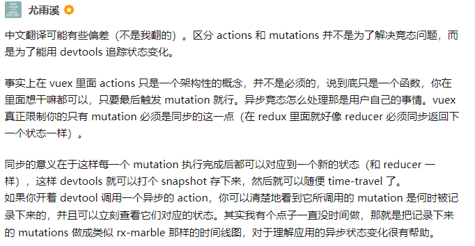

# vue面试题2

## Vue中hash模式和history模式的区别

1. 最明显的就是显示上，哈希模式的url会有#,而history5模式没有
2. hash模式是通过监听hashchange,然后获取location.hash再splice(1),而history模式则是依靠h5的history新增的pushState()这个栈方法改变url地址而不发送请求，replace

## route和router

route:

```js
// 字符串
router.push('home')
// 对象
router.push({ path: 'home' })
// 命名的路由
router.push({ name: 'user', params: { userId: '123' }})
// 带查询参数，变成 /register?plan=private
router.push({ path: 'register', query: { plan: 'private' }})

router.push({ name: 'user', params: { userId }}) // -> /user/123
router.push({ path: `/user/${userId}` }) // -> /user/123
// 这里的 params 不生效
router.push({ path: '/user', params: { userId }}) // -> /user
```

## 路由传参的方式有哪些？

>路由传参大约有三种方式，首先就是字符串的形式传参，这种方式需要在路由配置里的path里添加:/xx，然后直接在router-link to=''传参后面加上你要传的参数或者在编程式导航的path属性进行同样的配置。最后通过this.$route.params.xx接收
>
>其次是对象+params形式，这种方式的前提是给路由配置里添加对应的name，这种方式如果不在路由配置的path里加:xx,刷新后数据就找不到了。
>
>最后就是query形式传参，这种方式通过?xx=的方式显示在地址栏。通过this.$route.query.xx接收参数。

| 声明式                    | 编程式             |
| ------------------------- | ------------------ |
| `<router-link :to="...">` | `router.push(...)` |

**第一种：字符串+parmas形式，页面刷新数据不丢失。**

可以看出需要在path中添加/:id来对应 $router.push 中path携带的参数。在子组件中可以使用来获取传递的参数值

```js
this.$router.push({
  path: `/particulars/${id}`,
})
```

需要对应的路由配置如下：

```js
const routes = [
  {
    path: '/particulars/:id',
    name: 'particulars',
    component: particulars
  }
]
```

另外页面获取参数如下

```js
this.$route.params.id
```

**第二种：对象+params形式，页面刷新丢失 命名路由**

通过路由属性中的name来确定匹配的路由，通过params来传递参数。

> 这种方式可以在路由path里传递参数这样就不会丢失了

```js
this.$router.push({
  name: 'particulars',
  params: {
    id: id
  }
})
```

对应路由配置: 注意这里不能使用:/id来传递参数了，因为组件中，已经使用params来携带参数了。

```css
 {
     path: '/particulars',
     name: 'particulars',
     component: particulars
   }
```

子组件中: 这样来获取参数

```js
this.$route.params.id
```

**第三种方法:使用path来匹配路由，然后通过query来传递参数**

这种情况下 query传递的参数会显示在url后面?id=？

```js
this.$router.push({
  path: '/particulars',
  query: {
    id: id
  }
})
```

对应路由配置：

```css
{
     path: '/particulars',
     name: 'particulars',
     component: particulars
   }
```

对应子组件: 这样来获取参数

```kotlin
this.$route.query.id
```

## 编程式导航是什么？

 `router.push`、 `router.replace` 和 `router.go` 跟 [`window.history.pushState`、 `window.history.replaceState` 和 `window.history.go`](https://developer.mozilla.org/en-US/docs/Web/API/History)好像， 实际上它们确实是效仿 `window.history` API 的。

还有值得提及的，Vue Router 的导航方法 (`push`、 `replace`、 `go`) 在各类路由模式 (`history`、 `hash` 和 `abstract`) 下表现一致。

## 谈一谈路由守卫是什么？

路由守卫有点类似生命周期吧，他就是在某种情况下会触发这个守卫。

·全局守卫

**路由独享守卫**

你可以在路由配置上直接定义 `beforeEnter` 守卫：

```js
const router = new VueRouter({
  routes: [
    {
      path: '/foo',
      component: Foo,
      beforeEnter: (to, from, next) => {
        // ...
      }
    }
  ]
})
```

这些守卫与全局前置守卫的方法参数是一样的。

```js
const router = new VueRouter({
  routes: [
    {
      path: '/foo',
      component: Foo,
      beforeEnter: (to, from, next) => {
        // ...
      }
    }
  ]
})
```

## 什么是vuex

一个网站有很多共享的数据，比如用户的名称头像等信息。vuex就是用来专门管理这些公用数据的。

Vuex遵循单向数据流，全局有一个State存放数据，这个State是响应式的。需要通过mutations才能commit到state的数据，mutations还可以和devtools进行交互。

一些异步操作或者批量更新操作需要走Action,action需要通过mutations才能和devtools交互，根据state变化修改数据

## vuex有什么?

```js
import Vue from 'vue'
import Vuex from 'vuex'

Vue.use(Vuex)

export default new Vuex.Store({
  state: {
    userInfo: {},
    num:0
  },
  // 修改数据/状态的方法
  mutations: {
    getUserInfo(state,msg) {
      state.userInfo = msg
    },
    increment(state,payload){
      state.num = payload.amount
      state.obj = { ...state.obj, newProp: 123 }
    }
  },
  //异步修改数据。
  actions: {
    getAsyncUserInfo({commit,state},msg){
      setTimeout(() => {
        commit('getUserInfo',msg)
      }, 1000)
    }
  },
  modules: {
  }
})
```

```js
//调用mutations方法
this.$store.commit('getUserInfo', 10)
this.$store.commit({
  type: 'increment',
  amount: 10
})

//actions
this.store.dispatch('increment')
```

## vuex辅助函数

```js
import { mapState } from 'vuex'
import { mapGetters } from 'vuex'
import { mapMutations } from 'vuex'
import { mapActions } from 'vuex'


export default {
  //state----------------------------
  computed: mapState(['count']),
  computed: mapState({
    count: state => state.count,
    countAlias: 'count',
    countPlusLocalState (state) {
      return state.count + this.localCount
    }
  }),

  computed: {
    // 使用对象展开运算符将此对象混入到外部对象中
    ...mapState({
      // ...
    })
  }
	//Getter----------------------------------------
  computed: {
  // 使用对象展开运算符将 getter 混入 computed 对象中
  ...mapGetters([ 'doneTodosCount','anotherGetter' ])，
  ...mapGetters({ doneCount: 'doneTodosCount'})
	}
  
  // mutations-----------------------------
  methods: {
    ...mapMutations([
      'increment', // 将 `this.increment()` 映射为 `this.$store.commit('increment')`

      // `mapMutations` 也支持载荷：
      'incrementBy' // 将 `this.incrementBy(amount)` 映射为 `this.$store.commit('incrementBy', amount)`
    ]),
      ...mapMutations({
      add: 'increment' // 将 `this.add()` 映射为 `this.$store.commit('increment')`
    })
  }
	//actions..........
  methods: {
    ...mapActions([
      'increment', // 将 `this.increment()` 映射为 `this.$store.dispatch('increment')`
      // `mapActions` 也支持载荷：
      'incrementBy' // 将 `this.incrementBy(amount)` 映射为 `this.$store.dispatch('incrementBy', amount)`
    ]),
    ...mapActions({
      add: 'increment' // 将 `this.add()` 映射为 `this.$store.dispatch('increment')`
    })
  }

}
```

## vuex模块

```js
import { createNamespacedHelpers } from 'vuex'

const { mapState, mapActions } = createNamespacedHelpers('some/nested/module')

export default {
  computed: {
    // 在 `some/nested/module` 中查找
    ...mapState({
      a: state => state.a,
      b: state => state.b
    })
  },
  methods: {
    // 在 `some/nested/module` 中查找
    ...mapActions([
      'foo',
      'bar'
    ])
  }
}
```

## vuex中为什么把把异步操作封装在action，把同步操作放在mutations？



## vue打包

新建vue.config.js

```js
module.exprots	= {
	//相对路径
	publicPath:'./'
}
```

