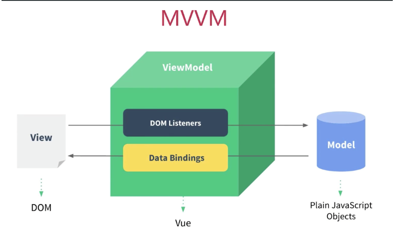

---
sidebarDepth:2
---

# vue面试题

## mvvm设计模式？

### mvp模式

**这种模式会频繁的操作DOM**

jq实现todilist

当视图改变，控制器的代码会执行，执行后调用模型层发送ajax请求，然后通过DOM操作改变视

```html
<input id='input' type='text'>
<button id='btn'>
    提交
</button>
<ul id='list'>
    
</ul>
```

```js
function Page() {

}
$.extend(Page.prototype,{
	init:function(){
		this.bindEvents();
	},
	bindEvents:function(){
		var btn = $('#btn');
		btn.on('click',$proxy(this.handleBtnClick,this))
	},
	handleBtnClick:function(){
        var inputValue = $('#input').val();
        var ulElem = $("#ul");
        ulElem.append('<li>'+inputValue+'</li>')
        $('#input').val('');
	}
})
var page = new Page()
page.init()
```

### MVVM

当我们写代码时并没有任何DOM操作，

M层指的就是data里的数据，vm就是vue，他监听视图和data的数据变化。

我们的注意力面向数据，而不是面向DOM。



VUE如何监听视图的改变？又是怎么主动改变视图的？通过虚拟DOM和defineproperty；

## 什么是前端组件化？

一个页面有很多部分组成，比如轮播、模态框等等。我们把一个页面分成一个个组件，页面由一个整体切分成一个个部分。组件化使得页面的维护性有极大的提高。

## 说一下vue的生命周期

## 你知道计算属性和侦听器吗？

计算属性是data里多个属性的变化影响他，并且计算属性是有缓存的，比如说我们在{{fullName()}},如果有多个，他会执行多次，但是如果是计算属性，就会执行一次。如果你依赖的响应式属性变化了，他才会进行变化。计算属性可以用来做prop原始值的转换。

```js
computed: {
    // 仅读取
    aDouble: function () {
      return this.a * 2
    },
    // 读取和设置
    aPlus: {
      get: function () {
        return this.a + 1
      },
      set: function (v) {
        this.a = v - 1
      }
    }
  }
```

侦听器就相当于属性描述符里的存取描述符，是当某个data属性变化，类似存取描述符。Vue 实例将会在实例化时调用 `$watch()`，遍历 watch 对象的每一个属性。

侦听器可以做异步操作中间状态，比如监听输入内容的改变，然后搜索相应信息等等。侦听器如果想多层监听需要设置deep：true,当然也可以传入一个数组。里面的函数会被逐一调用。

**不应该使用箭头函数来定义 watcher 函数** 。箭头函数绑定了父级作用域的上下文，所以 `this` 将不会按照期望指向 Vue 实例。

## vue的样式绑定是什么样的?

**class绑定**

对象绑定

```js
:class="{activated: isActived}"
```

数组绑定

```js
:class="[activeClass]"
data:{
	  activeClass: 'active',

}
```

数组配合对象

```js
<div v-bind:class="[{ active: isActive }, errorClass]"></div>
```

当在一个自定义组件上使用 `class` 属性时，这些 class 将被添加到该组件的根元素上面。这个元素上已经存在的 class 不会被覆盖。

**style绑定**

对象绑定

```html
<div v-bind:style="{ color: activeColor, fontSize: fontSize + 'px' }"></div>
data:{
	
}
```

```html
<div v-bind:style="styleOjb"></div>
data:{
	styleOjb:{
		color:"red",
	}
	click(){
		this.styleobj.color = this.styleobj.color==="black"? "red":"black"
	}
}
```

数组绑定

```html
<div v-bind:style="[baseStyles, overridingStyles,{fontSize:'20px'}]"></div>

```

## v-if和v-show的区别

v-if是从dom中添加或者移除，v-show是控制元素的display,

v-if是惰性的，如果初始化时默认false,就不会加载v-if里的内容。

v-if切换时会重新触发过渡和生命周期钩子。

vue在去重新渲染时会尽量复用已经存在的DOM,如果发现页面已经有Input,就会被复用，他的内容不会被自动清空，所以可以给每个input加一个key,这样复用时只复用key值相同的。

## v-for

- v-if的优先级低于v-for,因此两者不能在同一个标签使用。

- v-for不能把Index为key值，如果中间删除一个元素，那么index会发生变化，那么后面的节点的key值就会变化，更新就达不到复用的目的
- key是给每个元素添加唯一id,这样在进行新旧节点对比时，他会优先查看key，如果key没有变化就被复用，而且这样做如果元素进行删除或者交换位置，不会重新渲染，而是根据key进行dom移动。

## key有什么用？

一个是解决v-if这样的复用带来的问题，还有一个是能够更加准确高效的更新DOM

当 Vue 正在更新使用 `v-for` 渲染的元素列表时，它默认使用“就地更新”的策略。如果数据项的顺序被改变，Vue 将不会移动 DOM 元素来匹配数据项的顺序，而是就地更新每个元素，并且确保它们在每个索引位置正确渲染。这个类似 Vue 1.x 的 `track-by="$index"`。

这个默认的模式是高效的，但是**只适用于不依赖子组件状态或临时 DOM 状态 (例如：表单输入值) 的列表渲染输出**。

为了给 Vue 一个提示，以便它能跟踪每个节点的身份，从而重用和重新排序现有元素，你需要为每项提供一个唯一 `key` 属性

建议尽可能在使用 `v-for` 时提供 `key` attribute，除非遍历输出的 DOM 内容非常简单，或者是刻意依赖默认行为以获取性能上的提升。

因为它是 Vue 识别节点的一个通用机制，`key` 并不仅与 `v-for` 特别关联。后面我们将在指南中看到，它还具有其它用途。

不要使用对象或数组之类的非基本类型值作为 `v-for` 的 `key`。请用字符串或数值类型的值。

`key` 的特殊属性主要用在 Vue 的虚拟 DOM 算法，在新旧 nodes 对比时辨识 VNodes。如果不使用 key，Vue 会使用一种最大限度减少动态元素并且尽可能的尝试就地修改/复用相同类型元素的算法。而使用 key 时，它会基于 key 的变化重新排列元素顺序，并且会移除 key 不存在的元素。

有相同父元素的子元素必须有**独特的 key**。重复的 key 会造成渲染错误。

- 最常见的用例是结合 `v-for`：

- 它也可以用于强制替换元素/组件而不是重复使用它。当你遇到如下场景时它可能会很有用：
  - 完整地触发组件的生命周期钩子
  - 触发过渡

  例如：

```
<transition>
  <span :key="text">{{ text }}</span>
</transition>
```

当 `text` 发生改变时，`<span>` 总是会被替换而不是被修改，因此会触发过渡。 

## vue改变数组

- 直接改变数组的引用
- 调用push pop
- 调用Vue.set

## 为什么组件内data必须是函数

## 多页应用和单页应用

多页应用：

优点：首屏时间快，SEO效果好

缺点：页面切换慢，每次跳转都要发请求。随着网速的发展，单页应用是大势所趋。

单页应用：

JS渲染

优点：页面切换快。

缺点：首屏时间慢，SEO差，需要服务端渲染优化