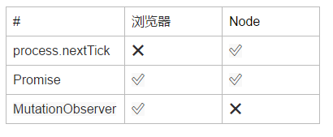
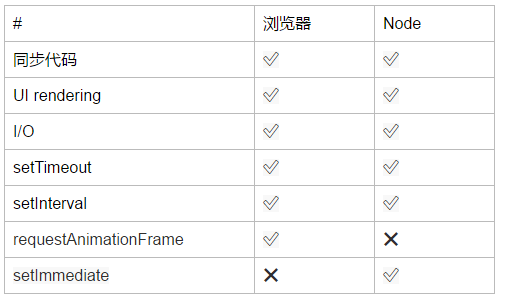

# 珠峰一线面试题汇总

## 1.需要掌握的技术栈

- html5
  - 语义化标签
  - 音视频处理
  - canvas/webGL
  - historyAPI
  - requestAnimationFrame
  - 地理位置
  - websocket
  
- css3
  - 常规样式属性，
  - 动画
  - 盒子模型
  - 响应式布局

- js
  
  - 堆栈内存和闭包作用域
    
    - 数据了下
    - 堆栈内存
    - 变量提升
    - 作用域
    - 闭包 保存保护
    - 惰性函数柯里化函数 高阶函数
    
  - 面向对象和this
    
    - 单例模式
    - 类和实例
    - 原型
  - new
    - call apply bind
    - this五大
    - typeof instanceof constructor Object.toString
    - 继承方案
      - 原型继承
      - 混合继承
      - 寄生组合式继承
    
  - DOM bom
  
    - DOM/BOM核心操作
  
      - getByid className byName document.documentElement document.body document.head
  
        queryselect queryselectall
  
      - 节点属性 childNodes, firstChild lastChild previousSbiling nextSibiling
  
      - 盒子模型属性
  
        - clinetWidth /Height /Top /Left
        - offsetWidth/Height /Top /Left /Parent
        - scrollWidth/Height /Top /Left
        - getBoundingClientRect
  
      - 发布订阅
  
      - 事件对象，鼠标事件对象键盘事件对象
  
      - 拖拽和封装
  
      - 事件传播
  
      - 移动端事件touch/gesture
  
      - 底层DOM
  
      - DIALOG封装
  
- es6

  - promise
  - async await
  - generator
  - interator
  - letconst
  - 解构 拓展运算符 字符串模板 箭头函数
  - 微任务和宏任务
  - 巴拉巴拉

- 网络通讯
  - ajax/fetch/axios
  - http
  - tcp
  - 跨域
  - 性能优化
  
- hybird或者app小程序
  - hybird
  - uni-app
  - rn
  - flutter
  - 小程序mpvue
  - weex
  - pwa
  
- 工程化
  - webpack
  - git
  - linux/ngix
  
- 全栈
  - node
  - express
  - koa2
  - mongodb
  - nuxt.js

- 框架
  - vue
    - 基础
    - 核心
    - vue-router
    - vue-cli
    - vuex
    - element ui
    - vant
    - cube
    - ssr
    - 优化
  - react
    - 基础
    - 核心
    - react-router-dom
    - redux
    - react-redux
    - dva
    - umi

## 2.H5和CSS3

### 垂直水平居中五大方案

- 定位
- display:flex
- display:table-cell

## 3.JS

### 堆栈内存和闭包作用域

#### 闭包

```js
var test = (function(i){
    return function(){
        alert(i*=2)   //i=2
    }
})(2)
test(5)
// 4
```

内部重写自身，但是作用域查找还是遵循定义时的作用域。

```js
var a=0,b=0;
function A(a){
	A = function(b){  //重写全局A  形成闭包 
		alert(a + b++)    //这个函数没有a,去他上级作用域找 ，这个函数在A(a)里创建，所以a就是闭包
	}
	alert(a++)   //先输出1 然后 +1
}
A(1)  //'1'   
A(2)  //'4'
```

```
全局
a = 0 b = 0 A => "A=Function(a)...."
A(1)  
a = 1 A => 'functon(b).....'
```

#### 深克隆和浅克隆

vuex就是深克隆

```js
let obj = {
	a:100,
	b:[10,20,30],
	c:{
		x:10
	},
	d:/^\d+$/
}
let arr = [10,[100,200],{
    x:10,
    y:20
}]
//浅拷贝
let obj2 = {};
Reflect.ownKeys(obj).forEach(key=>{
    obj2[item] = obj[key]
})

//深拷贝
function deepClone(obj){
    if(typeof obj!=='object' || obj == null){
        return obj;
    }
    //let newObj = new Obj.constructor;  考虑继承；
	Object.prototype.toString.call(obj)==='[object Object]'? newObj ={}: newObj = [];
    Reflect.ownKeys(obj).forEach(key=>{
        newObj[key] = deepClone(obj[key])
    })
    return newObj
}
//JSON.parse(JSON.stringify(obj))
```

### 面向对象面试题

```js
function Foo() {
    getName = function () {
        console.log(1);
    };
    return this;
}
Foo.getName = function () {
    console.log(2);
};
Foo.prototype.getName = function () {
    console.log(3);
};
var getName = function () {
    console.log(4);
};
function getName() {
    console.log(5);
}
Foo.getName();
getName();
Foo().getName();
getName();
new Foo.getName();  // 无参数 new …
					// new优先级高于成员访问，并且执行顺序是从右往左.foo作为对象的getName。
new Foo().getName(); //带参数列表new … ( … )从左到右。 foo的实例下的getName
new new Foo().getName(); //和typeof typeof a 一样 先算右边的   //3
//new Foo() 实例
=>new xx.getName()  =>先成员访问
```

### 同步异步

事件队列

```js
async function async1() {
	console.log('async1 start');
	await async2();
	console.log('async1 end');  //await后面的是微任务
}
async function async2() {
	console.log('async2');
}
console.log('script start');  
setTimeout(function () {
	console.log('setTimeout');异步
}, 0)    
async1();  
new Promise(function (resolve) {  
	console.log('promise1');  
	resolve();
}).then(function () {
	console.log('promise2');
});
console.log('script end');  
```

**

**宏任务**



### 题目

箭头函数的区别

- 箭头函数绑定的父级上下文，
- 箭头函数没有原型链，所以他没有原型属性，他不能new

```js
function A(){
    alert(1);
}
function Fn() {
    A=function(){
       alert(2);
    };
    return this;
}
Fn.A=A;
Fn.prototype={
    A:()=>{
       alert(3);
    }
};
A();  //'1'
Fn.A(); // '1'
Fn().A(); // '2'
new Fn.A(); // '2'
new Fn().A();  //'3'
new new Fn().A(); // 实例.A()  调用他原型的A方法，箭头函数不能被new
```

```js
var x=2;
var y={
    x:3,
    z:(function(x){ 
        this.x*=x;  //全局x = 4
        x+=2;    //x = 4
        return function(n){ 
            this.x*=n;   
            x+=3;     
            console.log(x);
        }
    })(x)  //外层x是全局x
};
var m=y.z;  //this指向全局
m(4);  
y.z(5);  //this指向y
console.log(x, y.x);
```

```js
var a = ?;
if (a == 1 && a == 2 && a == 3) {
    console.log(1);
}
//方法1：
var a = {
    i:1;
    toString(){ //valueOf()  // [Symbol.toPrimitive]()
        return this.i++
    }
}
//方法2
var index = 1;
Object.defineProperty(this,'a',{
    get(){
       return index++;
    }
})
//方法3
var a = [1, 2, 3];
a.toString = a.shift;
if (a == 1 && a == 2 && a == 3) {
	console.log(1);
}
```

```js
var x=0,
    y=1;
function fn(){
    x+=2; 
    fn=function(y){
        console.log(y + (--x));  
    };
    console.log(x, y);  
}
fn(3);  
fn(4);	
console.log(x, y);
// 2, 1
//5
 //1,1
```

```js
setTimeout(() => {
    console.log(1);
}, 20);
console.log(2);     
setTimeout(() => {
    console.log(3);
}, 10);
console.log(4);
console.time('AA');
for (let i = 0; i < 90000000; i++) {
    // do soming
}
console.timeEnd('AA'); //=>AA: 79ms 左右   所以在79ms后 上面的异步任务已经完成了，
console.log(5);
setTimeout(() => {
    console.log(6);
}, 8);
console.log(7);
setTimeout(() => {
    console.log(8);
}, 15);
console.log(9);
```

## 4.vue

### vue双向数据绑定

```html
<body>
    姓名：<span id="spanName"></span>
    <br>
    <input type="text" id="inpName">

    <!-- IMPORT JS -->
    <script>
        let obj = {
            name: ''
        };
        let newObj = {
            ...obj
        };
        Object.defineProperty(obj, 'name', {
            get() {
                return newObj.name;
            },
            set(val) {
                newObj.name = val;
                observe();
            }
        });

        function observe() {
            spanName.innerHTML = newObj.name;
        }
        inpName.oninput = function () {
            obj.name = this.value;
        };
    </script>
</body>
```

```html
<body>
    姓名：<span id="spanName"></span>
    <br>
    <input type="text" id="inpName">

    <!-- IMPORT JS -->
    <script>
        let obj = {
            name: ''
        };
        obj = new Proxy(obj, {
            get(target, prop) {
                return target[prop];
            },
            set(target, prop, value) {
                target[prop] = value;
                observe();
            }
        });

        function observe() {
            spanName.innerHTML = obj.name;
        }
        inpName.oninput = function () {
            obj.name = this.value;
        };
    </script>
</body>
```

vuex刷新就没了。

cookie有大小限制，localStorage不让。cookie容易被干掉比如清除记录

服务器设置session(cookie的过期时间),服务器返回给客户端的响应头信息带着set-cookie ='connect sid'这是客户端和服务器建立唯一标识的id,客户端把信息放入本地的cookie的httponly。客户端再次发送信息，会默认在请求头cookies把这个sessionid传递给服务器，服务器验证后就。


