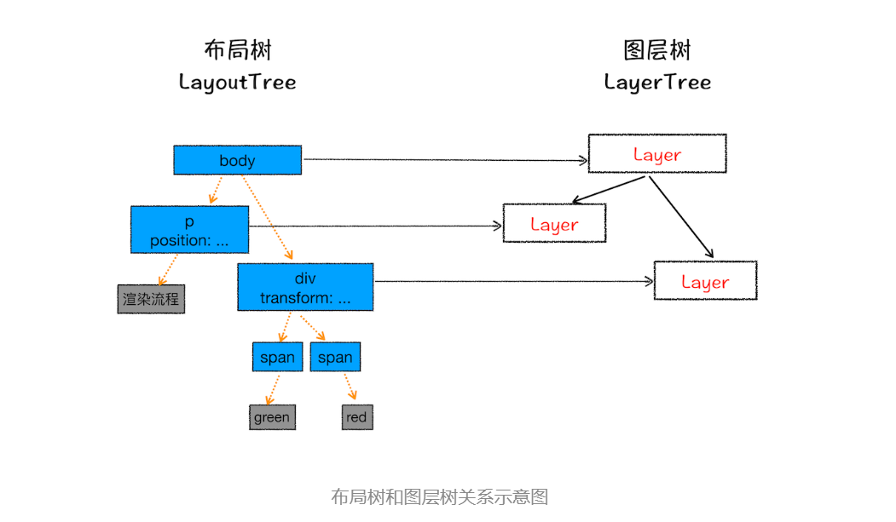
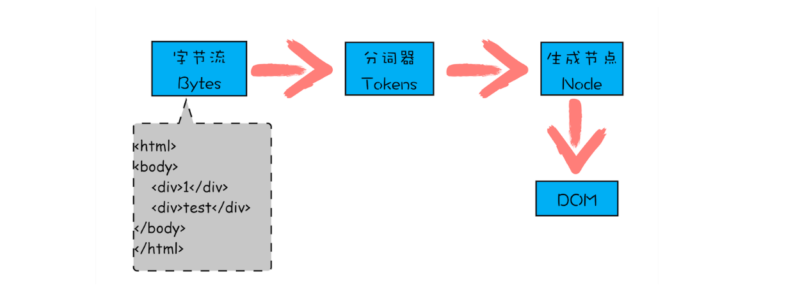

# 浏览器工作原理

## 1.chrome浏览器打开一个页面为什么四个进程？

**进程和线程**

进程是程序运行实例，是一块内存区域

1. 进程中的任意一线程执行出错，都会导致整个进程的崩溃。

2. 线程之间共享进程中的数据。

3. 当一个进程关闭之后，操作系统会回收进程所占用的内存。

4. 进程之间的内容相互隔离。进程间通信（IPC）

**单进程浏览器**


## 2. 输入一个url

这个过程主要分为两个方面，一个是导航流程，也就是输入url到浏览器获取到资源的部分，一个是渲染流程，也就是浏览器把获取到的资源渲染到页面的部分。

**导航流程**

首先是导航流程，当用户在地址栏中输入一个查询关键字时，地址栏会判断输入的关键字是**搜索内容**，还是**请求的 URL**。如果是搜索内容，地址栏使用浏览器默认搜索引擎合成带搜索关键字的url，如果判断输入内容符合 URL 规则，就会根据规则添加协议合成完整的url,比如输入baidu.com,浏览器会加上https://www。当用户按下回车后，标签页图标进入加载状态，但是页面内容并未替换，需要等待提交文档阶段才会替换。

之后浏览器进程通过IPC进程间通信把url请求发送到网络进程，网络进程接收后，会先在浏览器缓存中查询是否有要请求的文件。如果资源已经缓存，会检测是否是强缓存，主要通过expires和cache-control控制。

>- HTTP1.0提供Expires，值为一个绝对时间表示缓存新鲜日期比如1M
>- HTTP1.1增加了Cache-Control: max-age=,值为以秒为单位的最大新鲜时间

如果命中强缓存就从浏览器读取， 否则命中协商缓存或者没有缓存时，进入网络请求流程。因为如果想要把数据发送到对方电脑，我们需要知道对方的IP地址和端口号，才能使用TCP协议建立连接。而IP地址是通过DNS解析域名得出。所以浏览器会请求DNS返回域名的对应IP

>1. 浏览器缓存
>2. 本机缓存
>3. hosts文件
>4. 路由器缓存
>5. ISP DNS缓存
>6. DNS递归查询（可能存在负载均衡导致每次IP不一样）本地DNS服务器, 
>7. 本地迭代查询
>8. 根DNS服务器(13台)
>9. 顶级域名服务器(.com)
>10. 权威域名服务器(qq.com)

拿到 IP 之后，接下来就需要获取端口号了。通常情况下，如果 URL 没有特别指明端口号，那么 HTTP 协议默认是 80 端口。

当TCP/IP需要的IP和端口获取完毕后浏览器会组装成一个get请求报文。

由于Chrome机制，同一域名最多6个tcp连接，如果当前请求数量小于6，会进入tcp连接，否则需要等待tcp队列。排队等待结束后，建立tcp连接。

>- 客户端发送SYN=1(请求同步),seq=x(客户端序列号)到服务器
>
>- 服务器返回SYN=1(同意建立连接)，seq=y(服务端序列号),ACK=1(你的请求已确认),ack=x+1(期望序列号)
>- 客户端发送ACK=1(你的请求我已经接收),seq=x+1(客户端序列号)，ack=y+1(我已经接收，期望你发送y+1

```
ACK 0 确认序号无效 1  确认序号成立（请求建立连接）
SYN 1 new connection 建立连接
FIN 1 close 关闭连接
RST 1 distory connection 当前连接异常
PSH 1 数据无需缓存直接给进程
URG 0 紧急指针无效 1 禁忌之中有效，这个包不需要排队，直接进入缓存
```

连接建立之后，浏览器端会构建请求行、请求头等信息，并把和该域名相关的 Cookie 等数据附加到请求头中，然后向服务器发送构建的请求信息。如果是post命令还会构建请求体

>GET /index.html HTTP1.1

如果头信息中有

```
Connection:Keep-Alive 
```

则 TCP 连接在发送后将仍然保持打开状态，这样浏览器就能继续通过这个连接发送请求。

之后断开连接

>1. 主动方发送**Fin=1， Ack=Z， Seq= X**报文
>2. 被动方发送**ACK=X+1， Seq=Z**报文
>3. 被动方发送**Fin=1， ACK=X， Seq=Y**报文
>4. 主动方发送**ACK=Y， Seq=X**报文

服务器接收到请求信息后，会根据请求信息生成响应数据（包括响应行、响应头和响应体等信息），并发给网络进程。等网络进程接收了响应行和响应头之后，就开始解析响应的内容了。

网络进程如果发现响应行的状态码是301或者302(301会把重定向的地址缓存，也就是永久重定向)，说明网址变更，需要重定向到其他url,根据响应头的loaction字段信息重定向。如果是200或者304(etag没变说明文件哈希值没变，或者Last-Modified最后修改时间没变)，表示浏览器可以继续处理这个请求。之后通过content-type字段告知浏览器如何处理这个请求。详细内容可以在w3c搜mime，那里一大堆。如果 Content-Type 字段的值被浏览器判断为**下载类型，那么该请求会被提交给浏览器的下载管理器，同时该 URL 请求的导航流程就此结束**。但如果是**HTML，那么浏览器则会继续进行导航流程**。由于 Chrome 的页面渲染是运行在渲染进程中的，所以接下来就需要准备渲染进程了。

打开一个新页面采用的**渲染进程策略**就是：

- 通常情况下，打开新的页面都会使用单独的渲染进程；
- 如果从 A 页面打开 B 页面，且 A 和 B 都属于**同一站点**的话，那么 B 页面复用 A 页面的渲染进程；如果是其他情况，浏览器进程则会为 B 创建一个新的渲染进程。

渲染进程准备好之后，还不能立即进入文档解析状态，因为此时的文档数据还在网络进程中，并没有提交给渲染进程，所以下一步就进入了提交文档(“文档”是指 URL 请求的响应体数据)阶段。

- “提交文档”的消息是由浏览器进程发出的，渲染进程接收到“提交文档”的消息后，会和网络进程建立传输数据的“**管道**”。
- 等文档数据传输完成之后，渲染进程会返回“**确认提交**”的消息给浏览器进程。
- 浏览器进程在收到“确认提交”的消息后，会**更新浏览器界面状态**，包括了安全状态、地址栏的 URL、前进后退的历史状态，并更新 Web 页面。

一旦文档被提交，渲染进程便开始页面解析和子资源加载,页面生成完成，渲染进程会发送一个消息给浏览器进程，浏览器接收到消息后，会停止标签图标上的加载动画。之后进入渲染阶段。

按照渲染的时间顺序，流水线可分为如下几个子阶段：构建 DOM 树、样式计算、布局阶段、分层、绘制、分块、光栅化和合成。

**构建DOM树dom**

浏览器无法直接使用HTML，需要把HTML转化为浏览器可以理解的DOM树结构。

构建 DOM 树的**输入内容**是一个非常简单的 HTML 文件，然后经由 HTML 解析器解析，最终输出树状结构的 DOM,和 HTML 不同的是，DOM 是保存在内存中树状结构，可以通过 JavaScript 来查询或修改其内容。

DOM树构建完毕后就进入节点样式计算

**样式计算style**

样式计算的目的是为了计算出 DOM 节点中每个元素的具体样式，这个阶段大体可分为三步来完成。

首先是**把 CSS 转换为浏览器能够理解的stylesheets**,这个过程先把字节流转换成Tokenizing标记，根据标记创建节点，最后根据节点组成stylesheets，之后**转换样式表中的属性值，使其标准化**，因为CSS 文本中有很多属性值，如 2em、blue、bold，这些类型数值不容易被渲染引擎理解，所以需要将所有值转换为渲染引擎容易理解的、标准化的计算值,比如2em 被解析成了 32px，red 被解析成了 rgb(255,0,0)，bold 被解析成了 700等等。最后**计算出 DOM 树中每个节点的具体样式**，比如继承规则，font-size的继承，color的继承，还有层叠优先级规则。这个阶段最终输出的内容是每个 DOM 节点的样式。

**布局layout**

计算出 DOM 树中可见元素的几何位置，我们把这个计算过程叫做布局。

首先是**创建布局树**,遍历 DOM 树中的所有可见节点，并把这些节点加到布局中；而不可见的节点会被布局树忽略掉，如 head 标签下面的全部内容，再比如 body.p.span 这个元素，因为它的属性包含 dispaly:none，所以这个元素也没有被包进布局树。之后进行**布局计算**,布局的计算过程非常复杂，我们这里先跳过不讲，等到后面章节中我再做详细的介绍。计算布局树节点的坐标位置。在执行布局操作的时候，会把布局运算的结果重新写回布局树中，所以布局树既是输入内容也是输出内容，这是布局阶段一个不合理的地方，因为在布局阶段并没有清晰地将输入内容和输出内容区分开来。针对这个问题，Chrome 团队正在重构布局代码，下一代布局系统叫 LayoutNG，试图更清晰地分离输入和输出，从而让新设计的布局算法更加简单。

**分层layer**

元素有了层叠上下文的属性或者需要被剪裁(文字溢出、文字内容有滚动条)，满足这任意一点，就会被提升成为单独一层。

如一些复杂的 3D 变换、页面滚动，或者使用 z-indexing 做 z 轴排序等，为了更加方便地实现这些效果**，**渲染引擎还需要为特定的节点生成专用的图层，并生成一棵对应的图层树（LayerTree）。



如上图中的 span 标签没有专属图层，那么它们就从属于它们的父节点图层。但不管怎样，最终每一个节点都会直接或者间接地从属于一个层。

**图层绘制(paint)**

渲染引擎把一个图层的绘制拆分成很多小的**绘制指令**，然后再把这些指令按照顺序组成一个待绘制列表。所以在图层绘制阶段，输出的内容就是这些待绘制列表。

**分块**

当图层的绘制列表准备好之后，主线程会把该绘制列表**提交（commit）**给合成线程，绘制列表生成后，**合成线程**会把图层划分成一个个的图块。

**栅格化（raster）操作**

出于性能考虑，绘制出所有图层内容的话，会产生太大的开销，而且用户也不一定完全浏览完一个网页，所以合成线程会优先选择viewport视口附近的图块，把这些图块生成位图。栅格化就是把图块生成位图的过程。图块则是栅格化进行的最小单位，通常栅格化过程是用gpu加速生成的。

**合成显示**

一旦所有图块都被光栅化，合成线程就会生成一个绘制图块的命令——“DrawQuad”，并把这个命令提交给浏览器进程，浏览器进程里面有一个叫 viz 的组件，用来接收合成线程发过来的 DrawQuad 命令，然后根据 DrawQuad 命令，将其页面内容绘制到内存中，最后再将内存显示在屏幕上。

而我们平时说的重排，需要重新触发布局layout之后的一系列流水线，重绘则是跳过了布局和分层，从绘制开始触发后面的一系列流水线。而使用css3的一些属性，则是会直接跳过布局分层绘制。

重排


重绘


## **3.DOM 树如何生成**

在渲染引擎内部，有一个叫**HTML 解析器（HTMLParser）**的模块，它的职责就是负责将 HTML 字节流转换为 DOM 结构。HTML 解析器并不是等整个文档加载完成之后再解析的，**网络进程加载了多少数据，HTML 解析器便解析多少数据**。



**第一个阶段，通过分词器将字节流转换为 Token。**

过分词器先将字节流转换为一个个 Token，分为 Tag Token 和文本 Token。


Tag Token 又分 StartTag 和 EndTag，比如`<body>`就是 StartTag ，`</body>就是EndTag`，分别对于图中的蓝色和红色块，文本 Token 对应的绿色块。。

**至于后续的第二个和第三个阶段是同步进行的，需要将 Token 解析为 DOM 节点，并将 DOM 节点添加到 DOM 树中。**

HTML 解析器维护了一个**Token 栈结构**，该 Token 栈主要用来计算节点之间的父子关系，在第一个阶段中生成的 Token 会被按照顺序压到这个栈中。具体的处理规则如下所示：

- 如果压入到栈中的是**StartTag Token**，HTML 解析器会为该 Token 创建一个 DOM 节点，然后将该节点加入到 DOM 树中，它的父节点就是栈中相邻的那个元素生成的节点。
- 如果分词器解析出来是**文本 Token**，那么会生成一个文本节点，然后将该节点加入到 DOM 树中，文本 Token 是不需要压入到栈中，它的父节点就是当前栈顶 Token 所对应的 DOM 节点。
- 如果分词器解析出来的是**EndTag 标签**，比如是 EndTag div，HTML 解析器会查看 Token 栈顶的元素是否是 StarTag div，如果是，就将 StartTag div 从栈中弹出，表示该 div 元素解析完成。

## 4.JavaScript 是如何影响 DOM 生成的

**JavaScript 文件的下载过程会阻塞 DOM 解析**，而通常下载又是非常耗时的，会受到网络环境、JavaScript 文件大小等因素的影响。

不过 Chrome 浏览器做了很多优化，其中一个主要的优化是**预解析操作**。当渲染引擎收到字节流之后，会开启一个预解析线程，用来分析 HTML 文件中包含的 JavaScript、CSS 等相关文件，解析到相关文件之后，预解析线程会提前下载这些文件。

再回到 DOM 解析上，我们知道引入 JavaScript 线程会阻塞 DOM，不过也有一些相关的策略来规避，比如使用 CDN 来加速 JavaScript 文件的加载，压缩 JavaScript 文件的体积。另外，如果 JavaScript 文件中没有操作 DOM 相关代码，就可以将该 JavaScript 脚本设置为异步加载，通过 async 或 defer 来标记代码

async 和 defer 虽然都是异步的，不过还有一些差异，使用 async 标志的脚本文件一旦加载完成，会立即执行；而使用了 defer 标记的脚本文件，需要在 DOMContentLoaded 事件之前执行。

```
            div1.innerText = 'time.geekbang' // 需要 DOM
div1.style.color = 'red'  // 需要 CSSOM
```

该示例中，JavaScript 代码出现了 `div1.style.color = ‘red'` 的语句，它是用来操纵 CSSOM 的，所以在执行 JavaScript 之前，需要先解析 JavaScript 语句之上所有的 CSS 样式。所以如果代码里引用了外部的 CSS 文件，那么在执行 JavaScript 之前，还需要等待外部的 CSS 文件下载完成，并解析生成 CSSOM 对象之后，才能执行 JavaScript 脚本。

而 JavaScript 引擎在解析 JavaScript 之前，是不知道 JavaScript 是否操纵了 CSSOM 的，所以渲染引擎在遇到 JavaScript 脚本时，不管该脚本是否操纵了 CSSOM，都会执行 CSS 文件下载，解析操作，再执行 JavaScript 脚本。

所以说 JavaScript 脚本是依赖样式表的，这又多了一个阻塞过程。至于如何优化，我们在下篇文章中再来深入探讨。

我们知道了 JavaScript 会阻塞 DOM 生成，而样式文件又会阻塞 JavaScript 的执行，所以在实际的工程中需要重点关注 JavaScript 文件和样式表文件，使用不当会影响到页面性能的。

## 5.渲染流程下的CSS

当渲染进程接收 HTML 文件字节流时，会先开启一个**预解析线程**，如果遇到 JavaScript 文件或者 CSS 文件，那么预解析线程会提前下载这些数据。对于上面的代码，预解析线程会解析出来一个外部的 theme.css 文件，并发起 theme.css 的下载。这里也有一个空闲时间需要你注意一下，就是在 DOM 构建结束之后、theme.css 文件还未下载完成的这段时间内，渲染流水线无事可做，因为下一步是合成布局树，而合成布局树需要 CSSOM 和 DOM，所以这里需要等待 CSS 加载结束并解析成 CSSOM。

**那渲染流水线为什么需要 CSSOM 呢？**

和 HTML 一样，渲染引擎也是无法直接理解 CSS 文件内容的，所以需要将其解析成渲染引擎能够理解的结构，这个结构就是 CSSOM。和 DOM 一样，CSSOM 也具有两个作用，**第一个是提供给 JavaScript 操作样式表的能力，第二个是为布局树的合成提供基础的样式信息**。这个 CSSOM 体现在 DOM 中就是`document.styleSheets`。具体结构你可以去查阅相关资料，这里我就不过多介绍了，你知道 CSSOM 的两个作用是怎样的就行了。

有了 DOM 和 CSSOM，接下来就可以合成布局树了。等 DOM 和 CSSOM 都构建好之后，渲染引擎就会构造布局树。布局树的结构基本上就是复制 DOM 树的结构，不同之处在于 DOM 树中那些不需要显示的元素会被过滤掉，如 display:none 属性的元素、head 标签、script 标签等。复制好基本的布局树结构之后，渲染引擎会为对应的 DOM 元素选择对应的样式信息，这个过程就是**样式计算**。样式计算完成之后，渲染引擎还需要计算布局树中每个元素对应的几何位置，这个过程就是**计算布局**。通过样式计算和计算布局就完成了最终布局树的构建。再之后，就该进行后续的绘制操作了。

解析 DOM 的过程中，如果遇到了 JavaScript 脚本，那么需要先暂停 DOM 解析去执行 JavaScript，因为 JavaScript 有可能会修改当前状态下的 DOM。

不过在执行 JavaScript 脚本之前，如果页面中包含了外部 CSS 文件的引用，或者通过 style 标签内置了 CSS 内容，那么渲染引擎还需要将这些内容转换为 CSSOM，因为 JavaScript 有修改 CSSOM 的能力，所以在执行 JavaScript 之前，还需要依赖 CSSOM。也就是说 CSS 在部分情况下也会阻塞 DOM 的生成。

在接收到 HTML 数据之后的预解析过程中，HTML 预解析器识别出来了有 CSS 文件和 JavaScript 文件需要下载，然后就同时发起这两个文件的下载请求，需要注意的是，这两个文件的下载过程是重叠的，所以下载时间按照最久的那个文件来算。

后面的流水线就和前面是一样的了，不管 CSS 文件和 JavaScript 文件谁先到达，都要先等到 CSS 文件下载完成并生成 CSSOM，然后再执行 JavaScript 脚本，最后再继续构建 DOM，构建布局树，绘制页面。

缩短白屏时长，可以有以下策略：

- 通过内联 JavaScript、内联 CSS 来移除这两种类型的文件下载，这样获取到 HTML 文件之后就可以直接开始渲染流程了。
- 但并不是所有的场合都适合内联，那么还可以尽量减少文件大小，比如通过 webpack 等工具移除一些不必要的注释，并压缩 JavaScript 文件。
- 还可以将一些不需要在解析 HTML 阶段使用的 JavaScript 标记上 sync 或者 defer。
- 对于大的 CSS 文件，可以通过媒体查询属性，将其拆分为多个不同用途的 CSS 文件，这样只有在特定的场景下才会加载特定的 CSS 文件。

## 4.JS解析过程

1. 浏览器创建Document对象并解析HTML，将解析到的元素和文本节点添加到文档中，此时**document.readystate为loading**
2. HTML解析器遇到**没有async和defer的script时**，将他们添加到文档中，然后执行行内或外部脚本。这些脚本会同步执行，并且在脚本下载和执行时解析器会暂停。这样就可以用document.write()把文本插入到输入流中。**同步脚本经常简单定义函数和注册事件处理程序，他们可以遍历和操作script和他们之前的文档内容**
3. 当解析器遇到设置了**async**属性的script时，开始下载脚本并继续解析文档。脚本会在它**下载完成后尽快执行**，但是**解析器不会停下来等它下载**。异步脚本**禁止使用document.write()**，它们可以访问自己script和之前的文档元素
4. 当文档完成解析，document.readState变成interactive
5. 所有**defer**脚本会**按照在文档出现的顺序执行**，延迟脚本**能访问完整文档树**，禁止使用document.write()
6. 浏览器**在Document对象上触发DOMContentLoaded事件**
7. 此时文档完全解析完成，浏览器可能还在等待如图片等内容加载，等这些**内容完成载入并且所有异步脚本完成载入和执行**，document.readState变为complete，window触发load事件