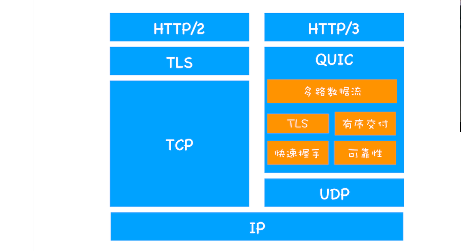

# 计算机网络面试题

## http协议特点是什么？

- 简单快速

> 只需要输入这个uri然后回车就可以访问到。

- 灵活

> HTTP支持传输任意类型的数据，通过首部的content-type字段传入的mime类型使得浏览器分辨传入的数据并进行对应的解析

- 无状态

> 如果每台电脑的访问信息服务器都要记录状态，服务器就崩溃了，所以说HTTP是无状态的。只从http协议无法区分，上次连接和下次连接的状态，但是服务端加session这种不算。

- 无连接

> 不会保持连接

虽然HTTP实现持久连接，但是也是有时间限制的，这样使得服务器每次只处理一条信息，会减少资源消耗，

## 常见的http状态码有哪些？

**1XX**：指示信息

**2xx**:

200  ok

206 pARTIAL Content ：客户端发送了一个带有Range头的GET请求，服务器完成了他，响应体只有Range头指定的内容，这种情况下使用音视频播放的时候

**3xx**:重定向

301：永久重定向

302：临时重定向

304：服务器告诉客户端，你有缓存了，你直接从浏览器取就行了。

**4xx**:客户端错误

400:客户端语法错误

401：请求没有授权

403：资源不允许被访问，比如你只能通过服务器访问

404：not Found

**5xx**:服务器错误

500:服务器错误

503：服务器过载了

## http有几种请求方法？

- `GET`方法
  - 发送一个请求来取得服务器上的某一资源
- `POST`方法
  - 向`URL`指定的资源提交数据或附加新的数据
- `PUT`方法
  - 跟`POST`方法很像，也是想服务器提交数据。但是，它们之间有不同。`PUT`指定了资源在服务器上的位置，而`POST`没有
- `HEAD`方法
  - 只请求页面的首部
- `DELETE`方法
  - 删除服务器上的某资源
- `OPTIONS`方法
  - 它用于获取当前`URL`所支持的方法。如果请求成功，会有一个`Allow`的头包含类似`“GET,POST”`这样的信息
- `TRACE`方法
  - `TRACE`方法被用于激发一个远程的，应用层的请求消息回路
- `CONNECT`方法
  - 把请求连接转换到透明的`TCP/IP`通道

## http0.9-http3的特点是什么？


| 版本     | 时间 | 内容                                                         | 发布现状           |
| -------- | ---- | ------------------------------------------------------------ | ------------------ |
| HTTP/0.9 | 1991 | 基于TCP,只有一个请求行,没有数据包传输，只有GET请求，返回内容是ASCII形式。 | 不是正式标准       |
| HTTP/1.0 | 1996 | 传输格式不限，增加PUT,PATCH,HEAD,OPTIONS,DELETE命令，引入状态码，提供cache,请求头加入用户代理字段 | 作为标准           |
| HTTP/1.1 | 1997 | 改进keep-live，节约带宽，HOST域，管道机制，分块传输编码      | 2015年前使用最广泛 |
| HTTP/2   | 2015 | 多路复用，服务器推送，头信息压缩，二进制协议。               | 逐渐覆盖市场       |

多路复用：单一连接请求发起多重请求-响应信息，多个请求流共享一个tcp连接，实现多留并行而不是依赖TCP。比如发快递，可以一件一件发，也可以一次性发过去。

### http1.1

- 改进持久连接

  随着浏览器普及，单个页面中的图片文件越来越多，所以重复经历断开连接和连接的过程开销很大，所以http1.1增加了持久连接，**它的特点是在一个 TCP 连接上可以传输多个 HTTP 请求，只要浏览器或者服务器没有明确断开连接，那么该 TCP 连接会一直保持**。持久连接在 HTTP/1.1 中是默认开启的，如果你不想要采用持久连接，可以在 HTTP 请求头中加上`Connection: close`。目前浏览器中对于同一个域名，默认允许同时建立 6 个 TCP 持久连接。

- 不成熟的管线化

  持久连接减少TCP次数，但是需要等待请求返回后才进行下一次请求，如果某个请求没有及时返回就会导致队头阻塞。HTTP/1.1 中试图通过管线化的技术来解决**队头阻塞**的问题。HTTP/1.1 中的管线化是指将多个 HTTP 请求整批提交给服务器的技术，虽然可以整批发送请求，不过服务器依然需要根据请求顺序来回复浏览器的请求。但是chrome和firefox最后还是放弃了管线化技术。

- 提供虚拟主机支持

  HTTP/1.0 中，每个域名绑定了一个唯一的 IP 地址，因此一个服务器只能支持一个域名，

  1.1增加了host字段，用来表示当前的域名地址，这样服务器就可以根据不同的 Host 值做不同的处理。

- 支持动态生成的内容

  http1.0里你需要手动设置响应头数据大小，比如`Content-Length: 901`，这样浏览器就可以根据设置的数据大小来接收数据,但是随着技术发展，很多内容是动态生成，所以传输时不知道数据大小。

  HTTP/1.1 通过引入**Chunk transfer 机制**来解决这个问题，服务器会将数据分割成若干个任意大小的数据块，每个数据块发送时会附上上个数据块的长度，最后使用一个零长度的块作为发送数据完成的标志。这样就提供了对动态内容的支持。

- 客户端cookie、安全机制

### http2

>影响 HTTP/1.1 效率的三个主要因素：TCP 的慢启动、多条 TCP 连接竞争带宽和队头阻塞。
>
>HTTP/2 是如何采用多路复用机制来解决这些问题的。多路复用是通过在协议栈中添加二进制分帧层来实现的，有了二进制分帧层还能够实现请求的优先级、服务器推送、头部压缩等特性，从而大大提升了文件传输效率。

#### http1.1的缺点

影响 HTTP/1.1 效率的三个主要因素：TCP 的慢启动、多条 TCP 连接竞争带宽和队头阻塞。

- **第一个原因，TCP 的慢启动。**

  一旦一个 TCP 连接建立之后，就进入了发送数据状态，刚开始 TCP 协议会采用一个非常慢的速度去发送数据，然后慢慢加快发送数据的速度，直到发送数据的速度达到一个理想状态，我们把这个过程称为慢启动。

  慢启动用于减少网络拥塞，无法改变，一些关键资源文件本来就不大，这些文件在tcp连接后就需要发起请求，但是由于慢启动，会推迟首屏加载

- **第二个原因，同时开启了多条 TCP 连接，那么这些连接会竞争固定的带宽。**

  带宽不足时，这些 TCP 连接又会减慢发送或者接收的速度。比如一个页面有 200 个文件，使用了 3 个 CDN，那么加载该网页的时候就需要建立 6 * 3，也就是 18 个 TCP 连接来下载资源；在下载过程中，当发现带宽不足的时候，各个 TCP 连接就需要动态减慢接收数据的速度。这样就会出现一个问题，因为有的 TCP 连接下载的是一些关键资源，如 CSS 文件、JavaScript 文件等，而有的 TCP 连接下载的是图片、视频等普通的资源文件，但是多条 TCP 连接之间又不能协商让哪些关键资源优先下载，这样就有可能影响那些关键资源的下载速度了。

- **第三个原因，HTTP/1.1 队头阻塞的问题。**

  持久连接虽然能公用一个 TCP 管道，但是在一个管道中同一时刻只能处理一个请求，在当前的请求没有结束之前，其他的请求只能处于阻塞状态。这意味着我们不能随意在一个管道中发送请求和接收内容。

#### HTTP/2 的多路复用

前面我们分析了 HTTP/1.1 所存在的一些主要问题：慢启动和 TCP 连接之间相互竞争带宽是由于 TCP 本身的机制导致的，而队头阻塞是由于 HTTP/1.1 的机制导致的。

一个域名只使用一个 TCP 长连接和消除队头阻塞问题

HTTP/2 使用了多路复用技术，可以将请求分成一帧一帧的数据去传输，这样带来了一个额外的好处，就是当收到一个优先级高的请求时，比如接收到 JavaScript 或者 CSS 关键资源的请求，服务器可以暂停之前的请求来优先处理关键资源的请求。

#### **多路复用如何实现?**

**通过引入二进制分帧层，就实现了 HTTP 的多路复用技术**。


HTTP/2 添加了一个**二进制分帧层**

- 首先，浏览器准备好请求数据，包括了请求行、请求头等信息，如果是 POST 方法，那么还要有请求体。
- 这些数据经过二进制分帧层处理之后，会被转换为一个个带有请求 ID 编号的帧，通过协议栈将这些帧发送给服务器。
- 服务器接收到所有帧之后，会将所有相同 ID 的帧合并为一条完整的请求信息。
- 然后服务器处理该条请求，并将处理的响应行、响应头和响应体分别发送至二进制分帧层。
- 同样，二进制分帧层会将这些响应数据转换为一个个带有请求 ID 编号的帧，经过协议栈发送给浏览器。
- 浏览器接收到响应帧之后，会根据 ID 编号将帧的数据提交给对应的请求。

#### http2其他特性

- 设置请求优先级。按照重要程度处理请求

- 服务器主动推送。

  HTTP/2 还可以直接将数据提前推送到浏览器。

  当用户请求一个 HTML 页面之后，服务器知道该 HTML 页面会引用几个重要的 JavaScript 文件和 CSS 文件，那么在接收到 HTML 请求之后，附带将要使用的 CSS 文件和 JavaScript 文件一并发送给浏览器，这样当浏览器解析完 HTML 文件之后，就能直接拿到需要的 CSS 文件和 JavaScript 文件，这对首次打开页面的速度起到了至关重要的作用。

- 头压缩

### http3

HTTP/2 的一个核心特性是使用了多路复用技术，因此它可以通过一个 TCP 连接来发送多个 URL 请求。多路复用技术能充分利用带宽，最大限度规避了 TCP 的慢启动所带来的问题，同时还实现了头部压缩、服务器推送等功能，使得页面资源的传输速度得到了大幅提升。在 HTTP/1.1 时代，为了提升并行下载效率，浏览器为每个域名维护了 6 个 TCP 连接；而采用 HTTP/2 之后，浏览器只需要为每个域名维护 1 个 TCP 持久连接，同时还解决了 HTTP/1.1 队头阻塞的问题。

#### http2缺点

- TCP 的队头阻塞、建立 TCP 连接的延时、TCP 协议僵化等问题。

#### quic协议

HTTP/2 存在一些比较严重的与 TCP 协议相关的缺陷，但由于 TCP 协议僵化，我们几乎不可能通过修改 TCP 协议自身来解决这些问题，那么解决问题的思路是绕过 TCP 协议，发明一个 TCP 和 UDP 之外的新的传输协议。但是这也面临着和修改 TCP 一样的挑战，因为中间设备的僵化，这些设备只认 TCP 和 UDP，如果采用了新的协议，新协议在这些设备同样不被很好地支持。因此，HTTP/3 选择了一个折衷的方法——UDP 协议，基于 UDP 实现了类似于 TCP 的多路数据流、传输可靠性等功能，我们把这套功能称为**QUIC 协议**。

- **实现了类似 TCP 的流量控制、传输可靠性的功能**。虽然 UDP 不提供可靠性的传输，但 QUIC 在 UDP 的基础之上增加了一层来保证数据可靠性传输。它提供了数据包重传、拥塞控制以及其他一些 TCP 中存在的特性。
- **集成了 TLS 加密功能**。目前 QUIC 使用的是 TLS1.3，相较于早期版本 TLS1.3 有更多的优点，其中最重要的一点是减少了握手所花费的 RTT 个数。
- **实现了 HTTP/2 中的多路复用功能**。和 TCP 不同，QUIC 实现了在同一物理连接上可以有多个独立的逻辑数据流。实现了数据流的单独传输，就解决了 TCP 中队头阻塞的问题。
- **实现了快速握手功能**。由于 QUIC 是基于 UDP 的，所以 QUIC 可以实现使用 0-RTT 或者 1-RTT 来建立连接，这意味着 QUIC 可以用最快的速度来发送和接收数据，这样可以大大提升首次打开页面的速度。




## post和get区别

- （记住）get在浏览器回退时没有影响，如果post请求，他可能会重复提交
- get产生的url地址可以被收藏
- （记住）get请求会被浏览器主动缓存（你在地址栏输入就能看见），post不会
- （记住）get请求只能进行url编码，post支持多种编码方式
- get请求参数会被完整保存在历史记录，post不会保存。防止csrf攻击，可以使用post。
- （记住）get请求有长度限制，不同浏览器限制不一样，所以get请求的url不可以太长。否则会截断，post无限制。
- get只接受ASCII字符，POST无限制
- GET会暴露在URL上，不能传递敏感信息
- （记住）GET参数放在url,地址栏能看见，POST放在请求体。

## 什么是持久连接?

http协议使用非keep-alive时，每个请求和响应都需要建立连接，完成后断开（无连接协议

HTTP1.1版本支持持久连接，使用keep-alive时，当出现后续请求，keep-alive避免了重新建立连接

## 什么是管线化?

在使用持久连接情况下，某个连接上消息的传递类似于

请求1->响应1->请求2->响应2->请求3->响应3

管线化：通道持久建立，但是不是请求一次响应一次，而是打包请求，打包响应。把一条条请求变成一个管子那种，打包传过去

我了解他怎么用！！！但是没有深入研究。问他有什么好的资料可以补充细节。

**特点**

- 管线化机制通过持久连接完成，这个只能HTTP1.1支持这个技术
- get和head请求才能进行管线化，post有所限制
- 第一次创建连接不要启动管线机制，因为对方服务器不一定支持
- 管线化不影响响应返回的顺序
- 开启管线化不一定开启大幅度提升！！！因为服务器端对他的支持性不一定那么好

## https

https就是套了一层ssl协议的http。

http:无状态，无连接，基于请求-响应，简单快速，明文传输。

https:

- 内容加密
- 验证身份
- 保存数据

## CDN相关面试题

内容分发网络。

网站需要CDN服务需要付费给CDN,比如加速服务，为了解决距离问题，CDN给ISP付费，这样把CDN服务器安排在ISP的数据中心，ISP是最靠近用户的 运营商。这样基本上就相当于把web服务器放在靠近用户的位置，

比如访问视频网站，cdn靠近网站，就降低了加载时间，因为缓存就在附近，不需要去访问更远的地方。客户端不需要不断访问web服务器，服务器压力减小，客户端的接收压力也会减少

CDN缓存服务器代替web服务器保存一部分数据，比如说最近的一些热播电视剧，会被放在缓存服务器，当客户端。

当客户登录网页，如果没有DNS缓存，先询问DNS服务器，如果这台DNS服务器属于CDN，那么他就会 告诉客户端最近的CDN服务器在哪，也就是DNS重定向，网站提前给CDN服务器内容。

有了CDN，CDN就可以防范网络攻击，比如 cdos攻击，cdn也会搜索用户的各种信息

## 通信以及跨域相关面试题

限制从一个源加载的文档如何和与另一个源的资源进行交互，这是一个用于隔离潜在恶意文件的关键安全机制。

源：协议域名端口号

- ajax请求无法发送
- fetch请求无法发送
- 无法获得DOM
- cookie、LocalStorage和IndexDB无法获取

### 前后端如何通信

- Ajax
- websocket 不限制同源策略
- cors 支持跨域通信，是一个新的通信标准

### ajax创建

```
const xhr = new XMLHttpRequest();
xhr.open('GET','./data/test.json',true);  
xhr.send();
xhr.onreadtstatechange= function(){
	if(xhr.readyState===4&&xhr.status ===200){
		JSON.parse(xhr.responseText)
	}
}
```

```
const xhr = new XMLHttpRequest();
xhr.open('POST','./login',true);  //
xhr.send(JSON.stringfy({name:'zs',age:18}));
xhr.onreadtstatechange= function(){
	if(xhr.readyState===4&&xhr.status ===200){
		JSON.parse(xhr.responseText)
	}
}
```

## 跨域通信

- jsonp

  > script标签的src属性不受跨域限制。

  返回的内容是一个script块，这个块里有一个内容

  ```
  script src = http://www.aaa.com/?callback=www&&data=name
  ```

  ```
  接收:
  jsonp({
  	data:{
  		
  	}
  })
  ```

- hash 

  > url的#后面的东西,hash变动页面不会刷新,search改变会刷新所以search不能做跨域通信

  页面A通过iframe嵌入了跨域页面B,需求：在a页面获取c页面的数据。

  - 思路:a给c传一个hash值，c收到hash值后，c把hash值传递给b，b把结果放到a的hash中

    > 访问a.html会加载c.html，并把值放在c的iframe的hash中，
    > 然后c载入后，会加载b.html，并把值放在b的iframe的hash中，
    > 而a和b是同域的，那么也就是说b的hash可以直接复制给a的hash，这样a就得到了c的值

  ```js
  var b = getElement..ifreameB
  b.src = b.src+'#'+ 'data';
  window.onhashchange = function (){
  	var data = window.location.hash
  }
  ```

- postMessage

  > h5处理跨域通信

  ```js
        // 窗口A(http:A.com)向跨域的窗口B(http:B.com)发送信息
        Bwindow.postMessage('data', 'http://B.com');
        // 在窗口B中监听
        Awindow.addEventListener('message', function (event) {
            console.log(event.origin);//http:A.com只接受a
            console.log(event.source);//引用a窗口对象
            console.log(event.data);//接收的数据
        }, false);
  ```

- WebSocket

  > 不受同源策略限制

  ```js
  var ws = new WebSocket('wss://echo.websocket.org');
  ws.onopen = function (evt) {
      console.log('Connection open ...');
      ws.send('Hello WebSockets!');
  };
  ws.onmessage = function (evt) {
      console.log('Received Message: ', evt.data);
      ws.close();
  };
  ws.onclose = function (evt) {
      console.log('Connection closed.');
  };
  ```

- Cors 跨域资源共享

  > 支持跨域的ajax,在http头加一个origin允许你

  浏览器会拦截ajax请求，他觉得这个请求是跨域的会在http头加一个origin

  ```js
  fetch('/some/url/', {
      method: 'get',
  }).then(function (response) {
  
  }).catch(function (err) {
    // 出错了，等价于 then 的第二个参数，但这样更好用更直观
  });
  ```

## csrf

站点请求伪造。

**原理**

用户登录网站A，A把cookie发送给A,保存在浏览器

- 网站的接口存在漏洞
- A登录了这个网站

用户在登录了A时访问病毒网站B，B里有某个引诱图片或者文字，指向A连接的某个接口，网站并不知道这个cookie是否是用户的，比如新浪微博之前那个添加粉丝关注用户那个攻击。

**防御**

- token验证：访问网站会向你本地存储token,如果你访问接口没有带token,就不能通过验证，引诱链接不会自动携带token
- referer验证：判断页面来源是我的站点的页面,通过验证Referer，可以判断请求的合法性，如果Referer是其他网站的话，就有可能是CSRF攻击，则拒绝该请求。
- 隐藏令牌：类似token,把令牌隐藏在http头里，不是在链接上。

## xss

跨站脚本攻击。

**向你的页面里注入JS去运行，JS函数体里做他想做的**

他不需要登录认证，核心原理是向你页面注入脚本。 

评论区里嵌入一个srcipt标签或者img标签等等。