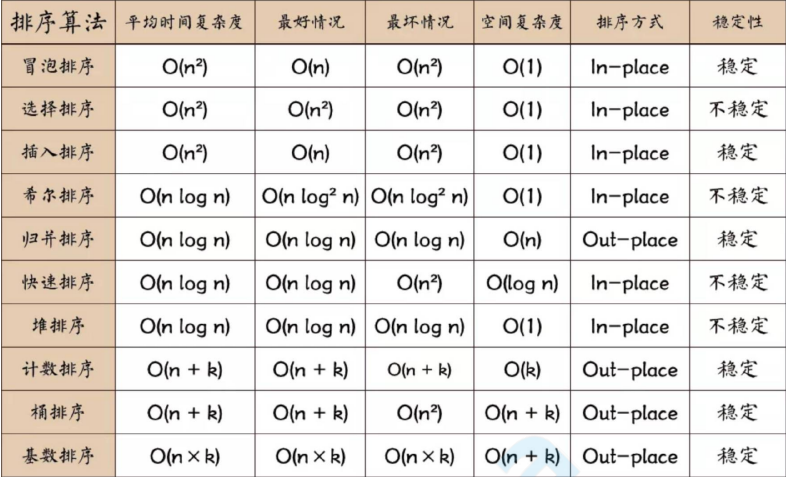

# 排序和搜索算法

[TOC]



## 排序和搜索

**JS的排序和搜索**

- 排序:sort方法。
- 搜索:数组的indexOf(x)!=-1方法,但是采用的是严格相等===
- 搜索:数组的includes(a,开始搜索的索引)方法

排序算法

冒泡、选择、插入排序算法效率不高O(n^2)，只能入门

归并排序、快速排序O(nlogn)

搜索算法

- 顺序搜索：O(n)
- 二分搜索：O(logn)

## 两数调换位置

```js
let c =a
a = b;
b = c
```

```js
a = a^b;
b = a^b;
a = a^b;
//b = a^b^b;==>b^b=0 a^0=a
//a = a^b^a;==>a^a=0 b^0=b
```

```js
a = a+b;//1+2
b = a-b// 1;
a = a-b;
```

```js
a=[b,b=a][0]; 
```

```js
a = [a,b];
b = a[0];
a = a[1]
```

```js
[a,b]=[b,a]
```

```js
a = {a,b};
b = a.b;
a = a.a;
```

## 排序算法

### 冒泡排序


- 最简单
- 性能不好

思路

- 比较相邻元素，如果第一个比第二个大就交互
- 一轮下来最大的肯定是最后一个。
- 需要执行n-1轮，每次排序，区间都应该变小

```js
T:O(n^2),两层for循环
S:0
var bubbleSort = function(arr){
  for(var i=0;i<arr.length-1;i++){
    for(var j=0;j<arr.length-1-i;j++){
      if(arr[j]>arr[j+1]){
        [arr[j],arr[j+1]]=[arr[j+1],arr[j]]
      }
    }
  }
  return arr;
}
bubbleSort([1,3,7,4,9,7,5])
```

### 选择排序

**寻找第i小数的位置，放到第i项。**

- 找到数组最小值放在第一位
- 找到数组第二小的值放在第二位

需要在外层循环套一个index作为当前循环的最小值存放位置；

O(n^2)


```js
function selectitonSort(arr) {
  var minIndex;
  for(var i=0;i<arr.length-1;i++){
     minIndex = i;
    for(var j=i+1;j<arr.length;j++){
      if(arr[j]<arr[index]){
        minIndex =j;
      }
    }
    [arr[i],arr[minIndex]]=[arr[minIndex],arr[i]]
  }
  return arr
}
```

### 插入排序

- O(n^2)
- 小型数组的排序，插入排序的性能比较好。

思路：

- 从第二个数开始往前比。
- 比他大的往后排。
- 依此类推到最后一个数

```
将3插入到[1，2，6，8]，则插入后的数组为：[1，2，3，6，8]
每次循环都这样插入，从index=0开始；
```


```js
T= O(n^2)； 因为有两层嵌套循环
function insertionSort(arr) {
  for (var i = 1; i < arr.length; i++) {
    for (var j = i; j > 0; j--) {
      if (arr[j] < arr[j - 1]) {
        [arr[j], arr[j - 1]] = [arr[j - 1], arr[j]]
      } else {
        break;
      }
    }
  }
  return arr;
}
```

### 归并排序

归并排序是一种稳定的排序方法。和选择排序一样，归并排序的性能不受输入数据的影响，但表现比选择排序好的多，因为始终都是O(nlogn）的时间复杂度。代价是需要额外的内存空间。

- 性能比前面的好
- O(n*logn),火狐浏览器Sort使用归并


思路

- 把数组劈成两半，再递归的对子数组进行'分'操作，知道分成一个个子数组。
- 把两个数合并为有序数组，再对有序数组进行合并，直到全部子数组合并成一个完整数组。

合并两个有序数组

- 新建空数组
- 比较数组的头，较小者出队推入空数组
- 如果两个数组还有值重复第二步

**步骤**

- 分
  - 把数组

```js
function mergeSort(arr) {
    if (arr.length === 1) { return arr; }
    const mid = Math.floor(arr.length / 2);
    const left = arr.slice(0, mid)
    const right = arr.slice(mid)
    const orderLeft = mergeSort(left);
    const orderRight = mergeSort(right);
    const res = []
    while (orderLeft.length || orderRight.length) {
      if (orderLeft.length && orderRight.length) {
        res.push(orderLeft[0] < orderRight[0] ? orderLeft.shift() : orderRight.shift())
      } else if (orderLeft.length) {
        res.push(orderLeft.shift())
      } else {
        res.push(orderRight.shift())
      }
    }
    return res;
}

console.log(mergeSort([1, 3, 7, 4, 9, 7, 5]))
```

```js
function mergeSort(arr) {
    const length = arr.length;
    if (length === 1) { //递归算法的停止条件，即为判断数组长度是否为1
        return arr;
    }
    const mid = Math.floor(length / 2);
   
    const left = arr.slice(0,  mid);
    const right = arr.slice(mid, length);
  
    return merge(mergeSort(left), mergeSort(right)); //要将原始数组分割直至只有一个元素时，才开始归并
}

function merge(left, right) {
    const result = [];
    let il = 0;
    let ir = 0;

    //left, right本身肯定都是从小到大排好序的
    while( il < left.length && ir < right.length) {
        if (left[il] < right[ir]) {
            result.push(left[il]);
            il++;
        } else {
            result.push(right[ir]);
            ir++;
        }
        
    }

    //不可能同时存在left和right都有剩余项的情况, 要么left要么right有剩余项, 把剩余项加进来即可
    while (il < left.length) { 
        result.push(left[il]);
        il++;
    }
    while(ir < right.length) {
        result.push(right[ir]);
        ir++;
    }
    return result;
}
```

### 快速排序

```js
function quickSort(arr){
  if(arr.length<=1) return arr;
  var pivotIndex = Math.floor(arr.length/2);
  var pivot = arr.splice(pivotIndex,1)[0];
  var left = [],right =[];
  for(var i=0;i<arr.length;i++){
    if(arr[i]<pivot){
      left.push(arr[i])
    }else{
      right.push(arr[i])
    }
  }
  return [...quickSort(left),pivot,...quickSort(right)]
}
```

### 挨揍排序

```js
function fuckSort(arr){
  var newList = []
  arr.forEach(item=>{
    setTimeout(()=>{
      newList.push(item);
    },item*4)
  })
  return newList;
}
```


## 顺序搜索

- 很低效

思路

1. 遍历数组
2. 找到和目标值相等的就返回下标
3. 找不到就返回-1

代码

```js
//时间复杂度O(n)
//空间复杂度O(1)
Array.prototype.sequentialSearch=function(target){  
	for(let i =0;i<this.length;i++){
    if(this[i]===target){
      return i
    }
  }
  return -1
}
```

## 二分搜索

从有序数组查找。

- 从中间元素开始，
- 如果目标值大于或小于中间元素就去大于或小于目标元素的中间元素

```js
//时间复杂度:O(logN) 劈成两半都是这个
function BinarySearch (arr, target) {
    let from = 0;//从0开始
    let to = arr.length - 1 //到最后一个
    let mid；
    while (from <= to) { //如果第一个小于最后一个
        mid = Math.floor((from + to)/2) //从他俩中间找
        if (arr[mid] > target) { //如果中间这个大于目标
            to = mid - 1 //说明最大值小于中间，把mid设为mid-1;
        } else if (arr[mid] < target) {//如果中间数字比目标数字小
            from = mid + 1//说明最小值应该设为中间数字+1；
        } else {
            return mid
        }
    }
			//如果找不到就返回-1
    return -1
}
```

## 力扣21-合并两个有序链表

难度简单

将两个升序链表合并为一个新的 **升序** 链表并返回。新链表是通过拼接给定的两个链表的所有节点组成的。 

**示例：**

```
输入：1->2->4, 1->3->4
输出：1->1->2->3->4->4
```

步骤

- 新建链表作为返回结果 
- 指针遍历两个链表，比较当前节点，较小者先接入新链表，并把指针后移一步
- 遍历结束返回新链表

代码

```js
// 时间复杂度:O(N),while循环体两个链表之和
// 空间复杂度:O(1),因为只有常量级别的指针变量完成操作。
var mergeTwoLists = function(L1,L2){
  var L3 = new ListNode(0);
  //需要一个指针不停指向新链表最后一个节点
  let p = L3;
  
  let p1 = L1;
  let p2 = L2;
  
  while(p1&&p2){
    if(p1.val<p2.val){
      p.next = p1;//接入p1
    	p1 = p1.next;//p1下移
    }else{
      p.next = p2;
      p2 = p2.next;
    }
    p = p.next;
  }
  if(p1){
    p.next =p1;
  } else if(p2){
    p.next = p2
  }
  return L3.next;
}
```

## 力扣374-猜数字大小

```js

```

## 力扣69-x的平方根

实现 `int sqrt(int x)` 函数。

计算并返回 *x* 的平方根，其中 *x* 是非负整数。

由于返回类型是整数，结果只保留整数的部分，小数部分将被舍去。

**示例 1:**

```
输入: 4
输出: 2
```

**示例 2:**

```
输入: 8
输出: 2
说明: 8 的平方根是 2.82842..., 
     由于返回类型是整数，小数部分将被舍去。
```

思路

二分搜索

- 边界：0,1的平方根是0,1
- 大于1的情况

```js
var mySqrt = function(x) {
    let left = 0,right = x,mid;
    while(left <= right){
         mid = parseInt((left+right)/2); 
         if(mid*mid == x){
             return mid;
         } else if(mid*mid < x){
             left = mid + 1;
         } else{
             right = mid - 1
         }
    }
    return right;
};
```


## JSSort的算法

数组长度不超过10时，使用插入排序。长度超过10使用快速排序

| 浏览器             | JavaScript引擎 | sort()排序算法                                               |
| ------------------ | -------------- | ------------------------------------------------------------ |
| Google Chrome      | Google V8      | 6.0.0内核： 数组长度 < 11 插入排序 数组长度 > 11 快速排序  7.0.0内核及以上 Timsort排序 |
| Mozilla Firefox    | SpiderMonkey   | 归并排序                                                     |
| Microsoft Edge和IE | Chakra         | 快速排序                                                     |
| Safari             | Nitro          | 桶排序和归并排序                                             |