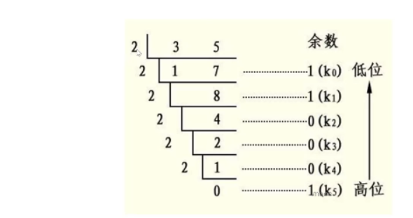
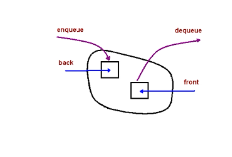
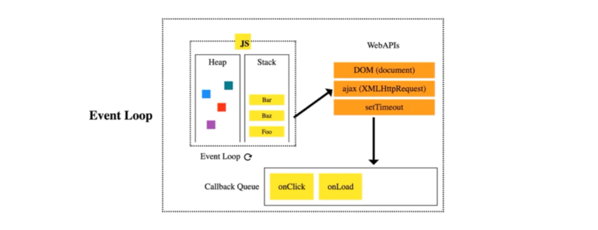

# 数据结构

## 栈stack

### 栈要点

- 后进先出
- push,pop,stack[stack.length-1]

### 应用场景

- 十进制转二进制
- 有效括号
- 函数调用栈

**十进制转二进制**

- 35-->100011

  1

  ```js
  
  ```

**有效括号**

- 越靠后的左括号对应的右括号越靠前 
- 左括号入栈右括号出栈
- 从左到右遍历，遇到左括号入栈右括号出栈

```js
((((()))))
(())
(((((((()))
(((()()))
```

**函数调用堆栈**

- 最后被调用的函数最先**执行完**
- js解释器使用栈控制函数调用顺序

```js
function a(){
  b()
}
function b(){
  
}

a()
```

### 十进制转二进制

```js
function dec2bin(num){
  var stack = [];
  while(num>0){
    stack.push(num%2);
    num = math.floor(num/2)
  }
  var str = ''
  while(stack.length!=0){
    str+=stack.pop()
  }
  return str*1
}
```

### 有效的括号(leetcode 20)

给定一个只包括 `'('`，`')'`，`'{'`，`'}'`，`'['`，`']'` 的字符串，判断字符串是否有效。

有效字符串需满足：

1. 左括号必须用相同类型的右括号闭合。
2. 左括号必须以正确的顺序闭合。

注意空字符串可被认为是有效字符串。

```
输入: "()"
输出: true
```

```
输入: "()[]{}"
输出: true
```

```
输入: "([)]"
输出: false
```

**思路**:

- 扫描字符串，左括号进栈，如果是右括号，就判断和栈顶是否匹配。如果匹配就出栈，不匹配直接return false
- 栈空就合法 。

```js
//时间复杂度O(n)
//空间复杂度O(n)
var isValid = function (s) {
  if (s.length % 2 === 1) { return false; }
  const stack = [];
  for (var i = 0; i < s.length; i++) {
    const c = s[i];
    if (c === '(' || c === '{' || c === '[') {
      stack.push(c)
    } else {
      const t = stack[stack.length - 1];
      if (
      (  t === '(' && c === ')') ||
      (  t === '{' && c === '}') ||
       ( t === '[' && c === ']')
      ) {
        stack.pop()
      } else {
        return false
      }
    }
  }

  return stack.length === 0
}
```

## 队列queue

### 队列要点

- 先进先出

- JS没有队列但是可以使用array实现

- 常用操作:push shift queue[0]

- ```js
  const queue = []
  queue.push(1);
  queue.push(2);
  let item1 = queue.shift()
  let item2 = queue.shift()
  ```



### 应用场景

- 排队打饭
- JS异步的任务队列
  
- 使用任务队列先后处理异步任务
  
- 计算最近请求次数

  返回从 3000 毫秒前到现在的 `ping` 数。

  ```js
  输入 inputs = [[],[1],[100],[3001],[3002]] //每个请求发起的时刻 1ms 100ms 3001 3002
  输出 [null,1,2,3,3]
  3001ms时最近3000ms有三个请求，所以1ms也被算进去。3001-1 === 3000;
  
  ```

  - 有新请求就入队，3000ms前的请求出队
  - 队列长度就是最近请求次数

### 约瑟夫环

```js
function passgame(nameList,num){
  let copy = [...nameList]
  while(nameList.length>1){
    // 开始数数字，不是num的时重新添加到末尾，是num的删除
    for(var i =0;i<num-1;i++){
      nameList.push(nameList.shift())
    }
    nameList.shift()
  }    
  return copy.indexOf(nameList.shift())
}
```

### 最近请求次数([leetcode 933](https://leetcode-cn.com/problems/number-of-recent-calls/))

写一个 `RecentCounter` 类来计算最近的请求。

它只有一个方法：`ping(int t)`，其中 `t` 代表以毫秒为单位的某个时间。

返回从 3000 毫秒前到现在的 `ping` 数。

任何处于 `[t - 3000, t]` 时间范围之内的 `ping` 都将会被计算在内，包括当前（指 `t` 时刻）的 `ping`。

保证每次对 `ping` 的调用都使用比之前更大的 `t` 值。

**示例：**

```
输入：inputs = ["RecentCounter","ping","ping","ping","ping"], inputs = [[],[1],[100],[3001],[3002]]
输出：[null,1,2,3,3]
```

**提示：**

1. 每个测试用例最多调用 `10000` 次 `ping`。
2. 每个测试用例会使用严格递增的 `t` 值来调用 `ping`。
3. 每次调用 `ping` 都有 `1 <= t <= 10^9`。

**解题思路**

- 越早发出的请求越早不再最近3000ms
- 考虑队列

**解题步骤**

- 有新请求就入队，3000ms前的请求出队
- 队列长度是最近请求次数

```js
时间复杂度是 O(n); n是需要被踢出队的请求个数。
空间复杂度 O(n)
var RecentCounter = function() {
	this.queue = []
};

/** 
 * @param {number} t
 * @return {number}
 */
RecentCounter.prototype.ping = function(t) {
	this.queue.push(t)
  while(this.queue[0]<t-3000){
    this.queue.shift()
  }
  return this.queue.length
};

/**
 * Your RecentCounter object will be instantiated and called as such:
 * var obj = new RecentCounter()
 * var param_1 = obj.ping(t)
 */
```

### 前端-任务队列



## 链表linkedlist

### 链表要点

- 链表元素存储不是连续的，通过next连接。

- JS可以通过Object模拟链表
- 链表操作：修改next增删，使用指针遍历链表

数组和链表的区别

- 数组中间增删元素需要移动元素
- 链表在非首尾增删，不需要移动元素只需要改next指针

前端

- JS原型链沿着`__proto__`属性走
- 使用遍历链表的算法获取Json的节点值。

**js实现链表**

```js
  const a = { val: 'a' };
  const b = { val: 'b' };
  const c = { val: 'c' }
  const d = { val: 'd' }
  a.next = b;
  b.next = c;
  c.next = d;

  // 遍历链表
  let p = a;
  while (p) {
    // console.log(p)
    p = p.next;
  }

  // 中间插入  把e前面的链表的next指向e,e指向e后面的链表

  let e = {
    val: 'e'
  }
  b.next = e;
  e.next = c

  p = a;
  while (p) {
    // console.log(p)
    p = p.next;
  }


  // 删除
  b.next = c
  console.log(a)
```

###  [力扣237](https://leetcode-cn.com/problems/delete-node-in-a-linked-list/)-删除链表的节点

请编写一个函数，使其可以删除某个链表中给定的（非末尾）节点，只给你被要求删除的那个节点。除此之外没其他信息。

现有一个链表 -- head = [4,5,1,9]，它可以表示为:


 

**示例 1:**

```
输入: head = [4,5,1,9], node = 5
输出: [4,1,9]
解释: 给定你链表中值为 5 的第二个节点，那么在调用了你的函数之后，该链表应变为 4 -> 1 -> 9.
```

**示例 2:**

```
输入: head = [4,5,1,9], node = 1
输出: [4,5,9]
解释: 给定你链表中值为 1 的第三个节点，那么在调用了你的函数之后，该链表应变为 4 -> 5 -> 9.
```

**说明:**

- 链表至少包含两个节点。
- 链表中所有节点的值都是唯一的。
- 给定的节点为非末尾节点并且一定是链表中的一个有效节点。
- 不要从你的函数中返回任何结果。

思路:

- 把下一节点赋值当前节点，然后让当前节点指向下一节点的下一节点

4 5 1 9 我们删除1，那么就把9赋值给1，然后删除最后一个节点9

```js
var deleteNode = function(node) {
  node.val = node.next.val;
  node.next = node.next.next;
};

```


### 力扣206-翻转链表

思路   

- 翻转某两个节点：n+1的next指向n
- 翻转多个节点：用双指针遍历链表，重复上述操作。 
  - 一个指针指向2，一个指针指向1。 

步骤

- 双指针一前一后遍历链表
- 翻转，把第一个指针指向第二个指针。

代码

```js
//时间复杂度On
//空间复杂度O1	
var reverseList = function(head) {
    let [prev, curr] = [null, head];
    while (curr) {	 // cur指针推进到null节点，则退出循环
        let nextCur = curr.next;    // 1. 暂存cur的下一节点
        curr.next = prev;       // 2. 将cur的next指针指向prev
        prev = curr;            // 3. 将prev更新为cur节点
        curr = nextCur;             // 4.将cur指针推进一个节点
    }
    return prev;
};

```

### 两数相加[2](https://leetcode-cn.com/problems/add-two-numbers/)

给出两个 **非空** 的链表用来表示两个非负的整数。其中，它们各自的位数是按照 **逆序** 的方式存储的，并且它们的每个节点只能存储 **一位** 数字。

如果，我们将这两个数相加起来，则会返回一个新的链表来表示它们的和。

您可以假设除了数字 0 之外，这两个数都不会以 0 开头。

**示例：**

```
输入：(2 -> 4 -> 3) + (5 -> 6 -> 4)
输出：7 -> 0 -> 8
原因：342 + 465 = 807
```

步骤

```js
1.新建空链表
2.遍历被相加的两个链表，个位数追加，十位数留在下一位相加
```

代码

```js
/**
 * Definition for singly-linked list.
 * function ListNode(val) {
 *     this.val = val;
 *     this.next = null;
 * }
 */
/**
 * @param {ListNode} l1
 * @param {ListNode} l2
 * @return {ListNode}
 */
var addTwoNumbers = function (l1, l2) {
    let l3 = new ListNode(0);//创建一个头部节点
    let p3 = l3;
    let carry = 0;//十位数
    while (l1 || l2) {
      
        const val1 = l1 ? l1.val : 0;		输入：(2 -> 4 -> 3) + (5 -> 6 -> 4)
																				输出：7 -> 0 -> 8
        const val2 = l2 ? l2.val : 0;
        const val = val1 + val2 + carry;
        carry = Math.floor(val / 10);   // 取十位数
        p3.next = new ListNode(val % 10); //取个位数
        if (l1) l1 = l1.next;
        if (l2) l2 = l2.next;
        p3 = p3.next

    }
    if(carry){ //如果最后两位相加也是十位数还需要添加一个链表 
        p3.next = new ListNode(carry)
    }
    return l3.next；
};
```

### 删除排序链表的重复元素 [leetCode83](https://leetcode-cn.com/problems/remove-duplicates-from-sorted-list/) 

给定一个排序链表，删除所有重复的元素，使得每个元素只出现一次。

**示例 1:**

```
输入: 1->1->2
输出: 1->2
```

**示例 2:**

```
输入: 1->1->2->3->3
输出: 1->2->3
```

```js
/**
 * Definition for singly-linked list.
 * function ListNode(val) {
 *     this.val = val;
 *     this.next = null;
 * }
 */
/**
 * @param {ListNode} head
 * @return {ListNode}
 */
T = O(N)
K = O(1);//没有存储其他变量。

var deleteDuplicates = function (head) {
    let p = head;
    while (p && p.next) {
        if (p.val === p.next.val) {
            p.next = p.next.next;
        }else{
            p = p.next;//下下个元素还相同的话就不需要再赋值。[1,1,1]
        }
    }
    return head
};
```

### [leetCode141](https://leetcode-cn.com/problems/linked-list-cycle/) 环形链表

给定一个链表，判断链表中是否有环。

为了表示给定链表中的环，我们使用整数 `pos` 来表示链表尾连接到链表中的位置（索引从 0 开始）。 如果 `pos` 是 `-1`，则在该链表中没有环。

**示例 1：**

```
输入：head = [3,2,0,-4], pos = 1
输出：true
解释：链表中有一个环，其尾部连接到第二个节点。
```


**示例 2：**

```
输入：head = [1,2], pos = 0
输出：true
解释：链表中有一个环，其尾部连接到第一个节点。
```


**示例 3：**

```
输入：head = [1], pos = -1
输出：false
解释：链表中没有环。
```


 

**进阶：**

你能用 *O(1)*（即，常量）内存解决此问题吗？

```js

```

**思路**

- 两个人跑步 速度快的人肯定会超过速度慢的人。

- 使用一快一慢两个指针遍历链表。 如果能够相逢说明有圈

```js
T:O(n);
S:O(1)
/**
 * Definition for singly-linked list.
 * function ListNode(val) {
 *     this.val = val;
 *     this.next = null;
 * }
 */

/**
 * @param {ListNode} head
 * @return {boolean}
 */
var hasCycle = function(head) {
    let p1 = head;
    let p2 = head;
    while(p1&&p2&&p2.next){//必须p2.next有值才能继续走，否则next.next报错
        p1 = p1.next;
        p2 = p2.next.next; 
        if(p1 === p2){
            return true;
        }
    }
    return false;
};
```

### 前端与链表：原型链面试题

- 原型链本质是链表
- 原型链上的节点就是各种原型对象，比如。Function.prototype, Object.prototype
- 原型链通过\__proto__属性连接各种原型对象；相当于next

- 箭头函数不属于原型链。 

**原型链知识点:**

A沿着原型链能找到B.prototype,那么A instanceof B 为 true, A是B的实例。

如果A对象没有X属性就沿着原型链去查找X属性

**面试题:instanceof原理**

- 遍历A的原型链,如果找到B.prototype,返回true,否则返回false

```js
const _instanceof = (A,B)=>{
  let p = A;
  while(p){
    if(p === B.prototype){
      return true
      p = p.__proto__;
    }
    return false
  }
```

### 前端与链表:用链表指针获取json节点值

```js
const json = {
  a:{ b:{c:1}},
  d:{e:2}
}
const str = 'a.b.c'
const path = str.split('.')

let p = json
path.forEach(k=>{
  p = p[k]
})
```

```js
'user.username'
str.split('.').reduce((data,key)=>{
  return data[key]
},this.vm.$data)
```


## 集合Set

### 集合要点和操作

- 无序，唯一的数据结构。
- 常用操作：去重，判断某元素是否在集合中、求两个集合的交集(1,2,3)和(2,3,4)的交集 （2，3）

```js
//去重
const arr = [1,1,2,2];
const arr2 = [...new Set(arr)];
```

```js
// 判断元素是否在集合里
const set = new Set([1,2])
const has = set.has(1)//true
```

```js
//交集
const set1 = newSet([1,2])
const set2 = newSet([2,3])
const set3 = newSet([...set1].filter(item=>set2.has(item)));
```

### 两个数组的交集(349)

```js
var intersection = function(nums1, nums2) {
    let s1 = new Set(nums1),
    s2  = new Set(nums2);
    let res =[...s1].filter(item=>s2.has(item))
    return res
};
```

```js
// T = O(m*n) 两层循环
// S = O(n)  去重后的num长度
var intersection = function(nums1, nums2) {
  return [...new Set(nums1)].filter(i=>nums2.includes(i))
};
```

### 前端与集合:ES6的Set

set操作

- 使用Set对象：new、add、delete、has、size
- 迭代Set:多种迭代方法，和Array转换，交集，差集
- Set的NaN等于自身。使用的算法叫做“Same-value-zero equality”，和===区别是Set算法的NaN等于NaN
- ES6 提出“Same-value equality”（同值相等）算法，用来解决这个问题。`Object.is`就是部署这个算法的新方法。它用来比较两个值是否严格相等，与严格比较运算符（===）的行为基本一致。

```js
let s = new Set();
s.add(1);//1
s.add(2);//1 2
s.add(2);//1 2
s.add({a:1,b:2});
S.delete(5);

```

迭代方法

Set方法的key和Value是一样的。

- `Set.prototype.keys()`：返回键名的遍历器
- `Set.prototype.values()`：返回键值的遍历器，
- `Set.prototype.entries()`：返回键值对的遍历器
- `Set.prototype.forEach()`：使用回调函数遍历每个成员

Set和Array互转

```js
Set转Array
const arr = [...set];
const arr = Array.from(set);

Array转Set
const set = new Set(arr)
```

Set求交集or和差集not

```js
//交集
const intersection = new Set ([...s1].filter(x=>s2,has(x)))

//差集 [1,2]和[2,3] ==> 1
const intersection = new Set ([...s1].filter(x=>s2.has(x)))

```

## 字典Map

### 要点

map是映射的意思。

- 字典是存储唯一key的数据结构，但是是以键值对方式存储。
-  ES6的Map
- 操作：键值对增删改查 set get delete clear

```js
  const m = new Map()

  //增
  m.set('a','aa');//{ a:'aa'}
  // 改。
  m.set('a','bb');//{ a:'bb'}

  // 删
  m.delete('b')
  m.clear();

  // 查
  m.get('a') //'aa'
```

### 两个数组的交集(349)

[1,2,3],[2,4,6]

- 新建字典遍历nums1,填充字典。
- 遍历nums2,遇到字典的值就选出来并从字典删除防止重复。

```js
//T = O(m+n) nums1长度+nums2长度
//N = O(m) 临时变量内存消耗是字典。
var intersection = function(nums1,nums2){
  const map = new Map()
  nums1.forEach(n=>{
    map.set(n,true);
  })
  const res = []
  nums2.forEach(n=>{
    if(map.get(n)){
      res.push(n);
      map.delete(n)
    }
  })
  return res
}
```

### 有效的括号优化(leetcode 20)

```js
//时间复杂度O(n)
//空间复杂度O(n)
var isValid = function (s) {
  if (s.length % 2 === 1) { return false; }
  const stack = [];
  const map = new Map();
  map.set('(',')')
  map.set('[',']')
  map.set('{','}')
  for (var i = 0; i < s.length; i++) {
    const c = s[i];
    if (map.has(c)) {
      stack.push(c)
    } else {
      const t = stack[stack.length - 1];
      if ( map.get(t) === c) { //map.get('(')===')'
        stack.pop()
      } else {
        return false
      }
    }
  }

  return stack.length === 0
}
```

### 两数之和(1)

给定一个整数数组 `nums` 和一个目标值 `target`，请你在该数组中找出和为目标值的那 **两个** 整数，并返回他们的数组下标。

你可以假设每种输入只会对应一个答案。但是，数组中同一个元素不能使用两遍。

**示例:**

```
给定 nums = [2, 7, 11, 15], target = 9

因为 nums[0] + nums[1] = 2 + 7 = 9
所以返回 [0, 1]
```

**思路**

- 假如我们选的是2，已知结果是9，那么我们需要找7；
- 我们把2的下标和自己存起来。然后

```js
//时间复杂度 O(N)
// 空间复杂度 O(n)
var twoSum = function(nums, target) {
    var map = new Map();
    for(var i = 0 ; i<nums.length;i++){
        const n2 = target-n;//
        if(map.has(n2)){  
            return [map.get(n2),i];
        }
        map.set(nums[i],i)
    }
};
```

```js

```


### 无重复字符最长子串([3](https://leetcode-cn.com/problems/longest-substring-without-repeating-characters/))

给定一个字符串，请你找出其中不 含有重复字符的 **最长子串** 的长度。

**示例 1:**

```
输入: "abcabcbb"
输出: 3 
解释: 因为无重复字符的最长子串是 "abc"，所以其长度为 3。
```

**示例 2:**

```
输入: "bbbbb"
输出: 1
解释: 因为无重复字符的最长子串是 "b"，所以其长度为 1。
```

**示例 3:**

```
输入: "pwwkew"
输出: 3
解释: 因为无重复字符的最长子串是 "wke"，所以其长度为 3。
     请注意，你的答案必须是 子串 的长度，"pwke" 是一个子序列，不是子串。
```

**思路:**

- 先找出所有不包含重复字符的子串
- 找出最大的字符返回长度

步骤

- 用双指针维护一个滑动窗口，用来剪切子串。
-  不断移动右指针，遇到重复字符就把左指针移动到重复字符的下一位

- 记录所有窗口的长度

```js
输入'abcabcbb'
第一步:左指针指向a,右指针向后移动，当遇到重复字符a时，左右指针的窗口长度是slice(左，右);

```

代码

```js
  /**
 * @param {string} s
 * @return {number}
 */
var lengthOfLongestSubstring = function(s) {
    var left = 0;
    var res =0;
    const map = new Map()
    for(let r=0;r<s.length;r++){
        let currentStr = s[r] //右指针指向
        if(map.has(currentStr) &&map.get(currentStr)>=left){ //如果字典里有重复的
                                                
            left = map.get(currentStr)+1;//左指针加1
        }
        res = Math.max(res,r-left+1);//最大者是当前窗口长度:右边减左边+1
        //如何知道是重复字符? 把当前的值作为字典的索引。利用索引的不重复性。
        map.set(currentStr,r)
    }
    return res;
};
```

### 最小覆盖子串76

给你一个字符串 S、一个字符串 T 。请你设计一种算法，可以在 O(n) 的时间复杂度内，从字符串 S 里面找出：包含 T 所有字符的最小子串。

**示例：**

```
输入：S = "ADOBECODEBANC", T = "ABC"
输出："BANC"
```

**提示：**

- 如果 S 中不存这样的子串，则返回空字符串 `""`。
- 如果 S 中存在这样的子串，我们保证它是唯一的答案。

通过次数70,544

提交次数182,758

思路

- 找包含T的子串
- 找出长度最小的子串

步骤

- 用双指针维护滑动窗口,
- while判断右指针和length 移动右指针，找到包含T的子串，移动左指针，减少包含T的长度 。
- 使用字典存需要的字符和个数
- 循环，找到最小。

ADOBECODEBANC


