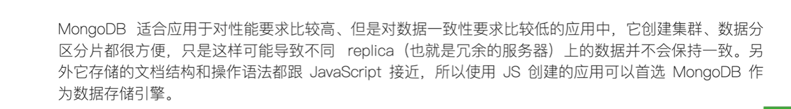
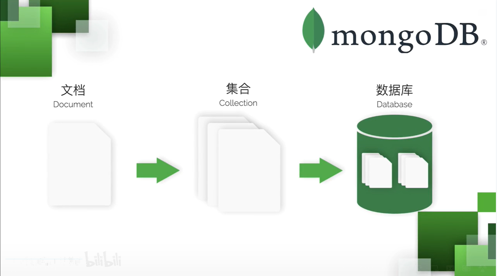
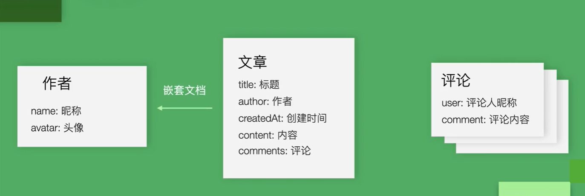
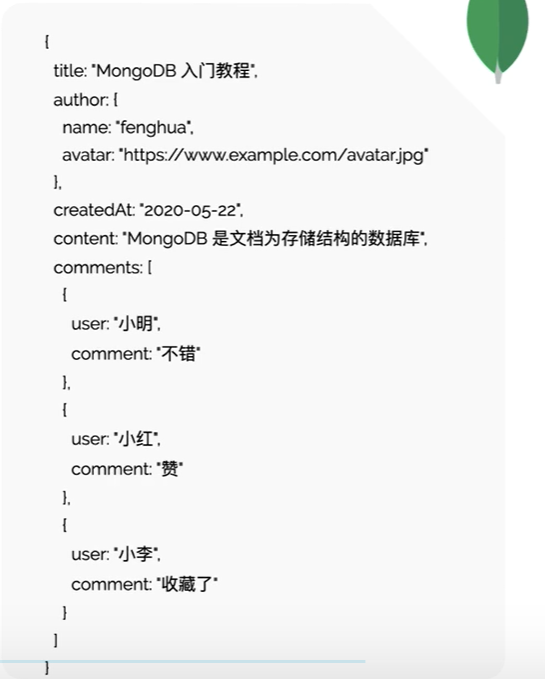

# Mongodb

mongodb是以json文档为存储结构的数据库，类似json。

是一个非关系型数据库

特点：

- 高可用
- 高性能
- 可伸缩



## MongoDB存储结构



关系形数据库的集合当成表，文档当成表中的记录

## BSON文档简介

BSON全称 BinaryJSON，和json基本一样，只是除了数字布尔数组，还支持ObjectID,Double,Date等类型

## 下载安装

```js

```

## 启动

## 连接到MongoDB

## DB操作

```js
use myblog	//创建
db
```

## 增删改查操作

假设博客内容。





```js
//如果不存在自动创建 xx集合
db.xx.insertOne({  //返回新添加文档的ID
  title:'x',
  xxxxx
})
```

查询数据

```js
//所有数据
db.xx.find({})

//查找有title:'x'的数据
db.xx.find({title:'x'})

db.xx.find({"author.name":"fenghua"})
```

更新数据

```js
//把title:入门教程改成 啊啊啊
db.xx.updateOne({title:'MongoDB 入门教程'},{$set:{title:"MongoDBxxx"}}) 更新一条
 
db.xx.updateMany() 更新所有匹配项
```

删除

```powershell
//_id是新增文档时mongodb自动为我们生成的唯一标识
db.xx.deleteOne({_id:ObjectId("esadasafdxcxcx")})

db.xx.deleteMany({_id:ObjectId("esadasafdxcxcx")})
```

## rub3t

