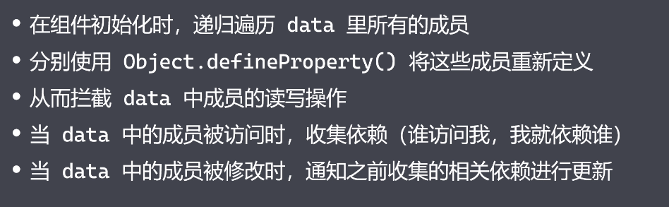
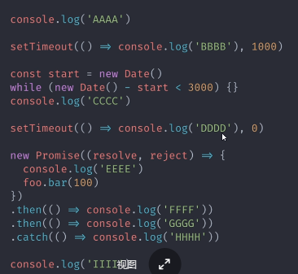

# vue面试题

## 首屏渲染

输入URL时

- 使用CDN加速请求，可能在全国各地放置一些CDN服务器。

  我的网站买的是青岛的CDN，所以山东境内看的可能比较快。

  我在黑龙江上学时，哈尔滨好像有个叫红房的地方，每年优酷都会提供数千万上亿的资金在这个地方放置他们的CDN服务器。

- 缓存
  - 强缓存
    - 不向服务器发信息
    - 响应头 cache-control :max-age:31536000  (秒 一年31536000秒)。在一年内不需要向服务器发送请求，他的优先级更高
    - 响应头 Expires 一个日期，时间戳
    -  cache-control 设置了max-age会使得expires失效
  - 协商缓存
    - `Last-Modified`:
- HTTP2
- 预加载

渲染流程

- SSR
- SSG
  - 请求之前生成的静态页面。
  - Gatsby
  - Gridsome
  - 不专门做SSG
    - 

## 对JS异步编程的理解

foo没有，会抛出异常后被捕获