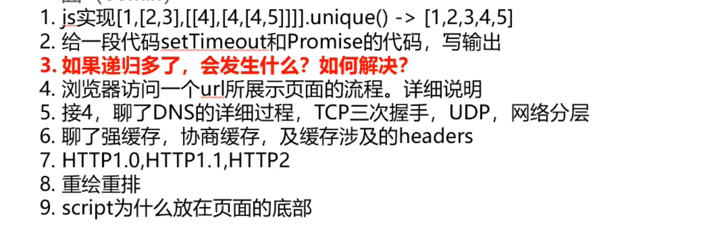

# 头条面经

## 字节跳动1

1.重排重绘
2.requestAnimationfranme 和定时器区别 ：考官说答错了，是在下一次浏览器重绘之前执行。
3.position，和transform translate的区别,直接合成阶段。。。
4.跳台阶。
5.接收请求后 如果取不到结果 继续 发送请求，取到结果停止发送请求，轮寻间隔，使用setinterval 使用settimeout分别做这个事情。 使用async必须等这个请求完毕才执行下一次请求。
6.写一个加法函数(sum)，使他可以同时支持sum(x,y)和sum(x)(y)两种调用方式。 我用的...扩展运算符。
7给定一个数组，元素包含：一堆负数 + 一堆 0 + 一堆正数，求最后一个出现的负数和第一个出现的正数的位置，从 1 开始计数。要求时间复杂度最好为 O(logN)，最差为 O(logN + N)。例子：数组 [-2，-1，0，0，0，0，4，5] 最后一个负数出现的位置为 2，第一个正数出现的位置为 7。
8 webpack loader 和 plugin区别

9.vue结尾的文件如何解析成js css html的? 我以为让我说原理，我说不知道。。答案:引入vue-loader  原来考点是webpack       
10.flex布局 详解。
11.rem原理 你的项目的rem原理 ，监听宽度，分成6.4份
12.vue3 proxy和vue2 defineprototype 区别;   defineProperty转换对象属性时，操作很昂贵。js引擎喜欢你对象的结构越稳定越好，defineProperty劫持属性，使得对象的结构不稳定。proxy只是监听。
14 vue如何对数组方法进行监听 我答的是 vue利用object.create方法的array的prototype下的push等属性，目的是为了不污染原方法。。。。。

## 字节跳动2



2

```js
//递归实现
```

## 