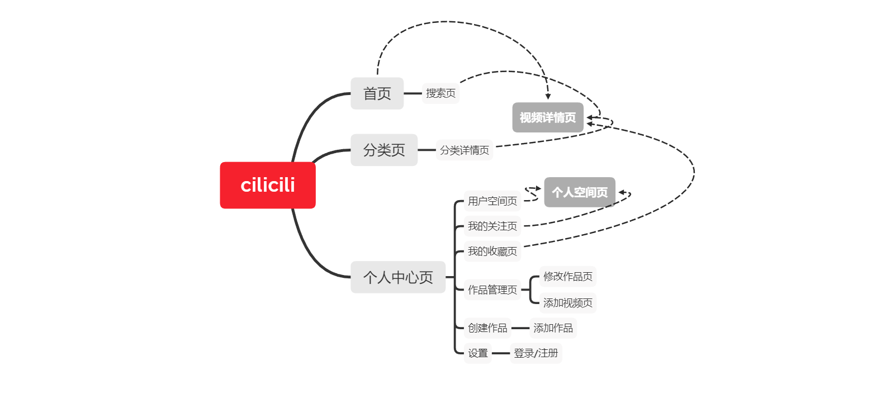

# 项目介绍

- 本项目是由`uni-app`开发的弹幕视频网站。

- 前端使用`uni-app`进行开发，使用`iconfont`、`animate`、`bootstrap.css`进行使用`vuex`结合本地存储管理状态，`app`端使用`subnvue`实现自定义播放器，目前开放安卓端和app端，小程序端正在兼容。
- 后端采用`egg.js`进行开发，使用`mysql`配合`sequelize`进行存储，使用`crypto`进行加密，`egg-jwt`进行鉴权，使用`redis`进行状态缓存等等。
- 项目已部署到阿里云并完成备案，并采用TencentVod云点播进行视频转储和分发加速。