# 部署

## test信息

| username       | guanchazhewang |               |
| -------------- | -------------- | ------------- |
| guanchazhewang | guanchazhewang | guanchazhewan |
|                |                |               |
|                |                |               |


## 服务器购买

- 阿里云学生机9.5/月，但是只能选择内地的，需要备案部署，
- 腾讯云点播有优惠，10块钱一个月，没有找到删除接口。
- 华为云免费三个月

## 安全组配置

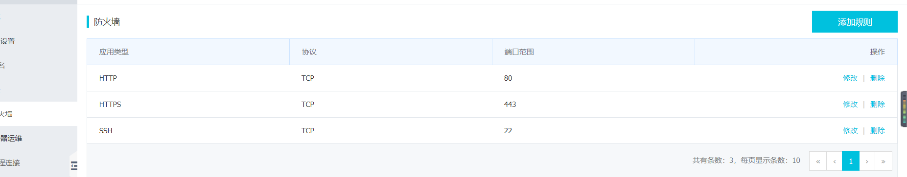

## 安装环境

1. 进行远程连接

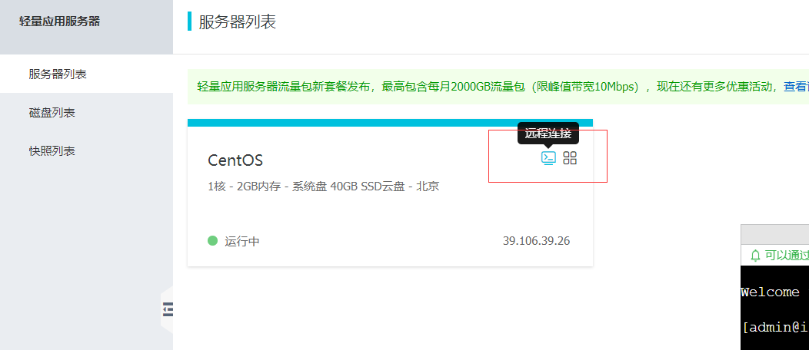

2. 切换root账号，密码改密

   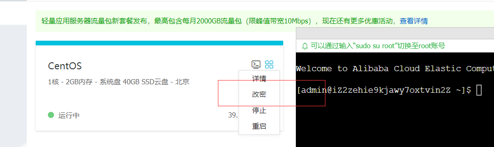

3. 输入用户名密码后安装宝塔

https://www.bt.cn/bbs/thread-19376-1-1.html

```bash
su root
输入密码
yum install -y wget && wget -O install.sh http://download.bt.cn/install/install_6.0.sh && sh install.sh
```

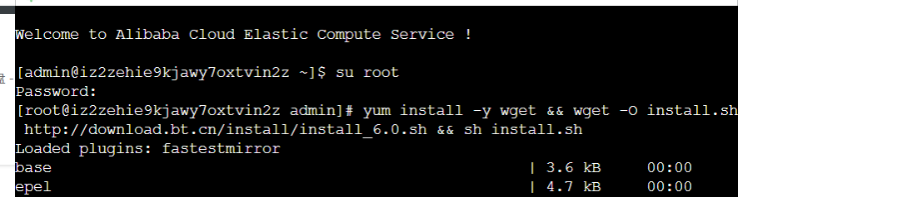

4. 直接输入y进行下一步


5. 

进入当前服务器，

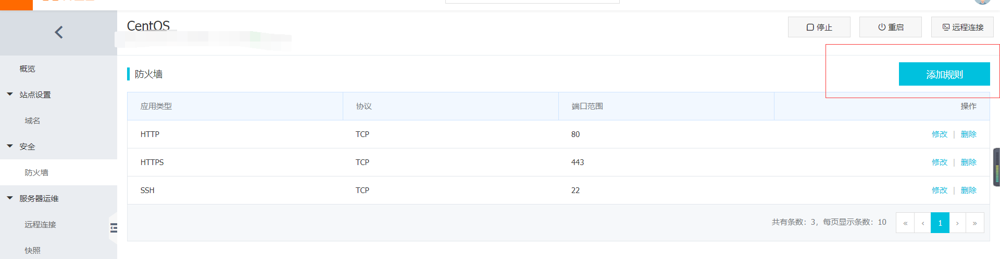

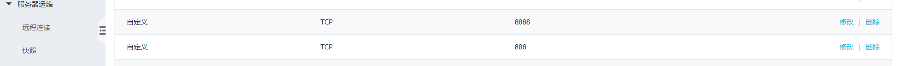

6. 如果关闭了控制台，需要重新转到root

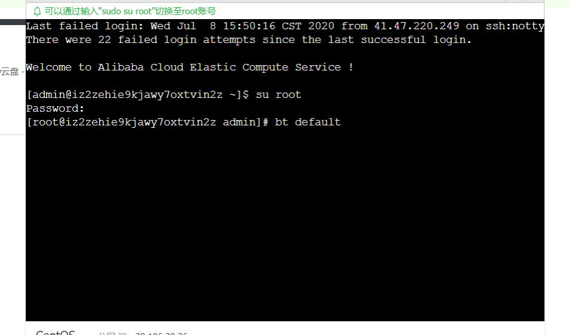

7. 进入这个url,输入密码用户，进入宝塔面板

   

8. 配置如下进行安装

   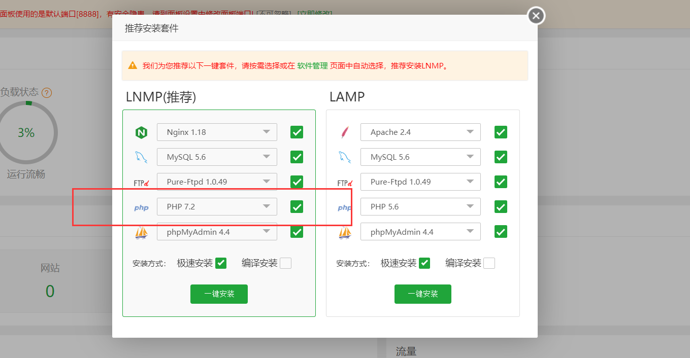

## 后端部署

第一步：解析域名，创建网站。
第二步：上传解压
第三步：安装pm2（node环境），切换node版本到最新版本，安装redis。
第四步：阿里云打开命令行，切换到根目录下。
第五步：如果是国内服务器，先切换镜像： 

```bash
npm config set registry https://registry.npm.taobao.org
```

第六步：

```js
npm install --unsafe-perm //如果npm install出错，执行这个命令
```

第七步：导入sql文件到数据库中。
第八步：修改配置信息：
        config/config.default.js
            sequelize配置
	    vod点播配置，参考课时118上传视频签名api实现
第九步：npm start
第十步：添加反向代理
第十一步：修改前端项目的 /common/lib/config.js和manifest.json里面的域名即可

**1. 添加域名**

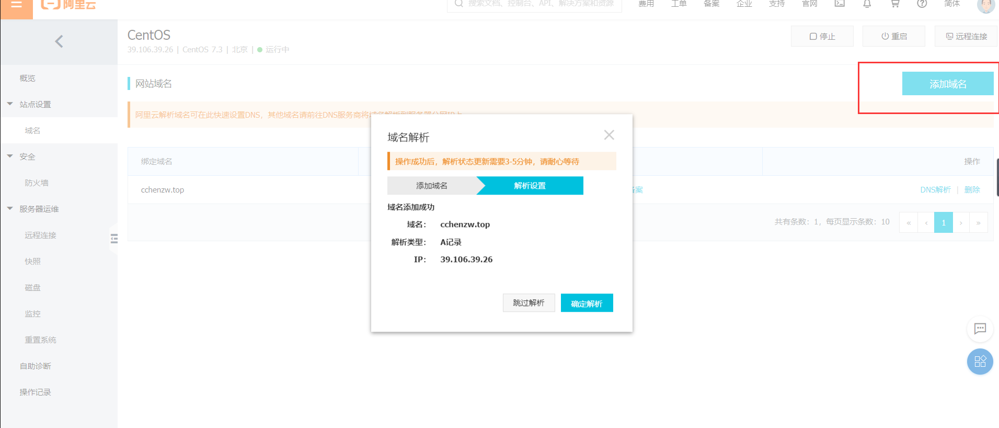

**2. 宝塔添加站点**

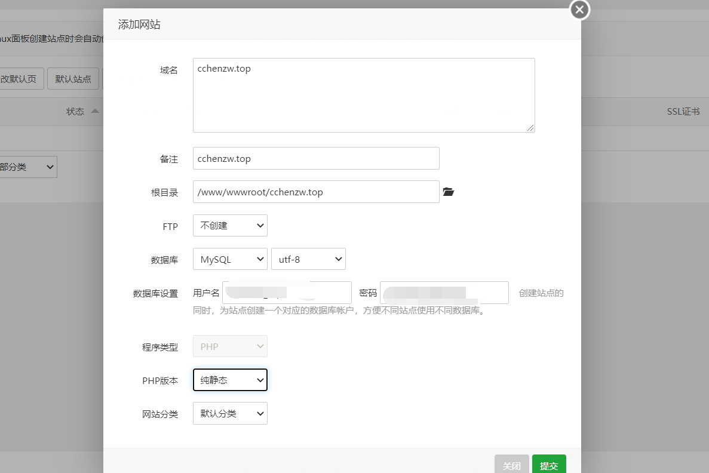

**3. 上传解压**

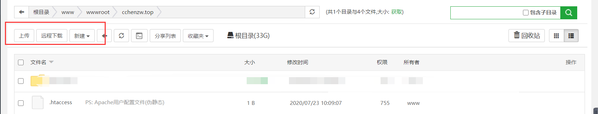

**4.软件商店安装环境**

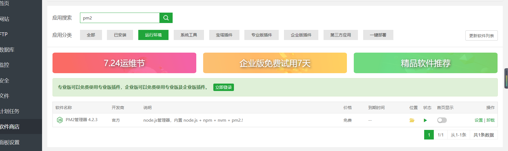

- 安装pm2,设置node版本
- 安装redis

### **阿里云控制台配置**

```bash
su root
password
cd /www/wwwroot/cilicili.cchenzw.top
npm config set registry https://registry.npm.taobao.org
npm install
```

**导入sql文件**

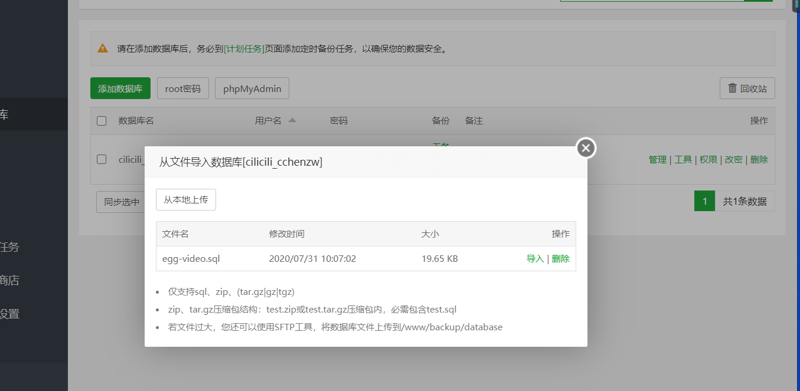

配置config.default.js。

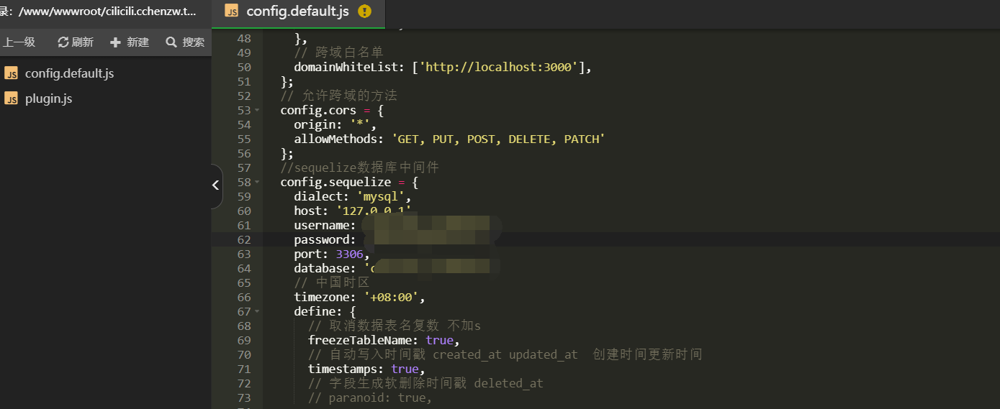

- 阿里云控制台执行npm start

如果端口占用需要配置packagejson的端口


**添加反向代理**

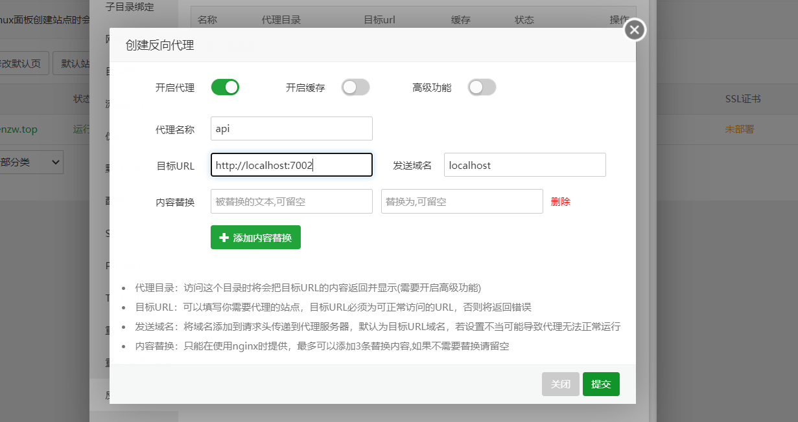

```js
执行代码
http://cilicili.cchenzw.top/video_search/1?keyword=前端
```

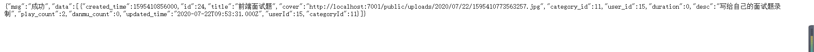

## h5端配置

配置manifest.json和request.js。

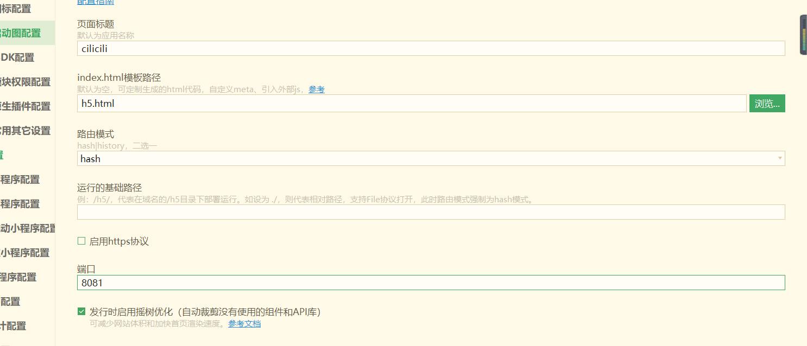

修改源码视图

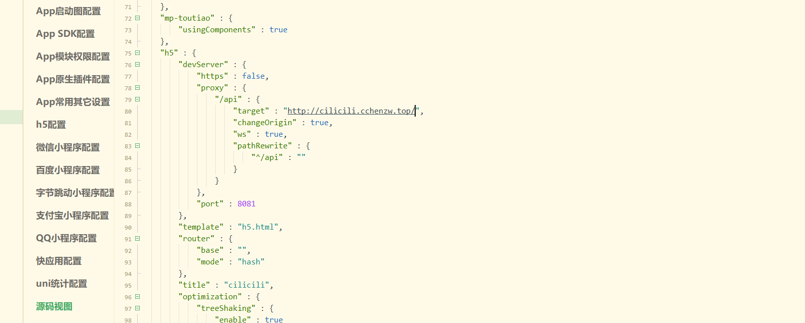

修改ajax配置

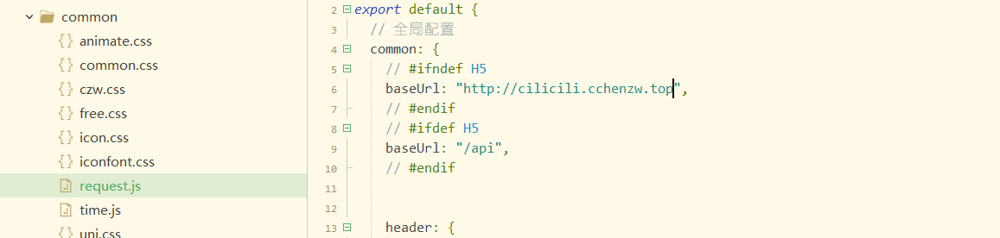

发行

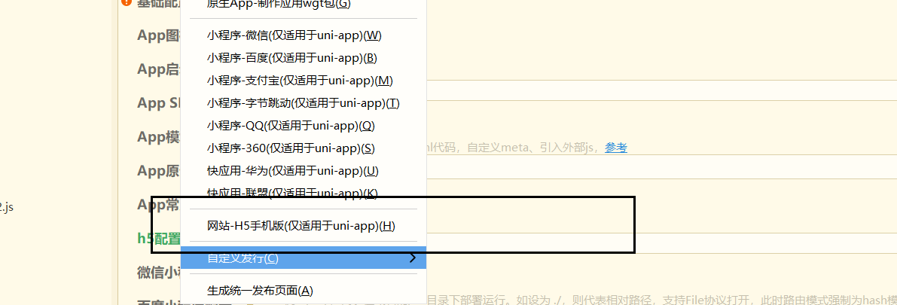

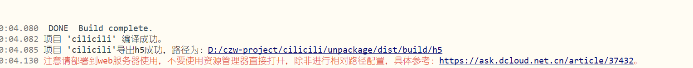

压缩

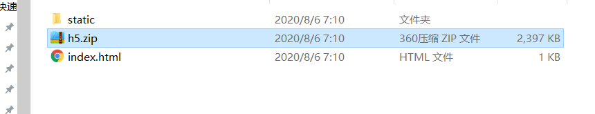

绑定域名

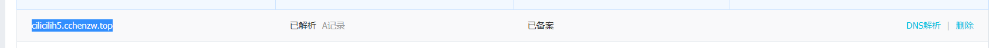

创建站点

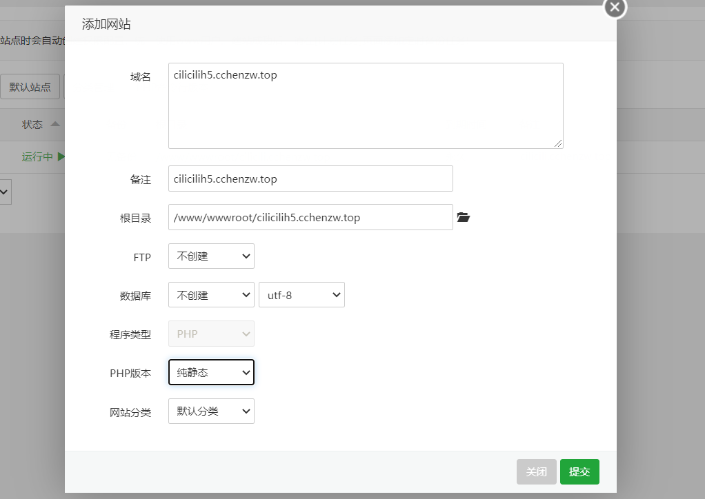

 解压

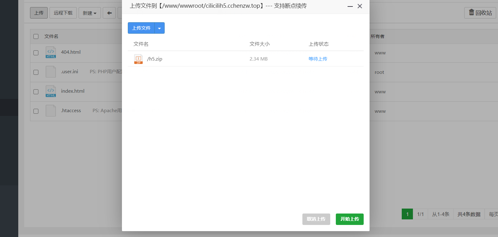

 配置代理，注意是后端api服务器

/api对应的是反向代理的/api

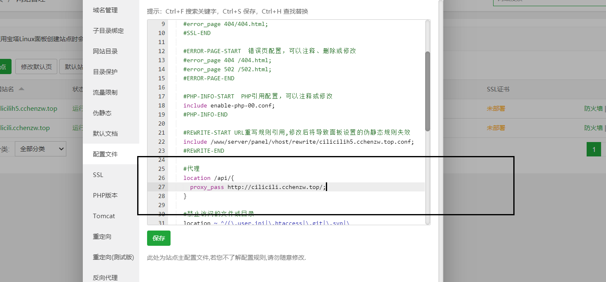

