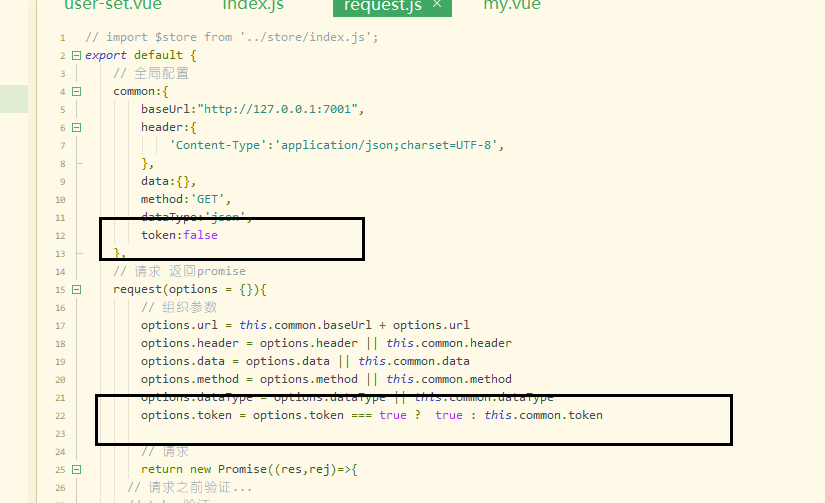
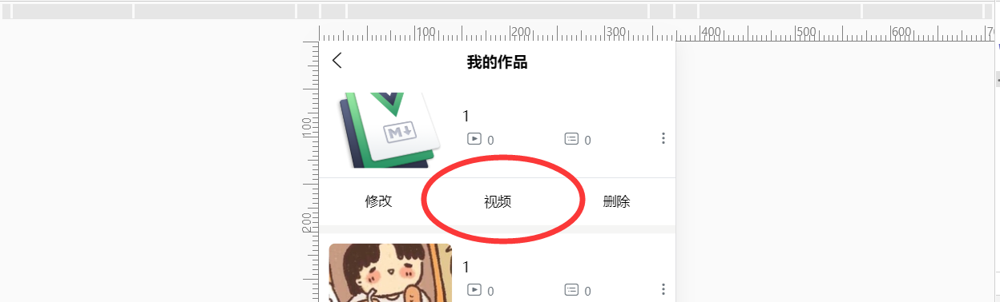
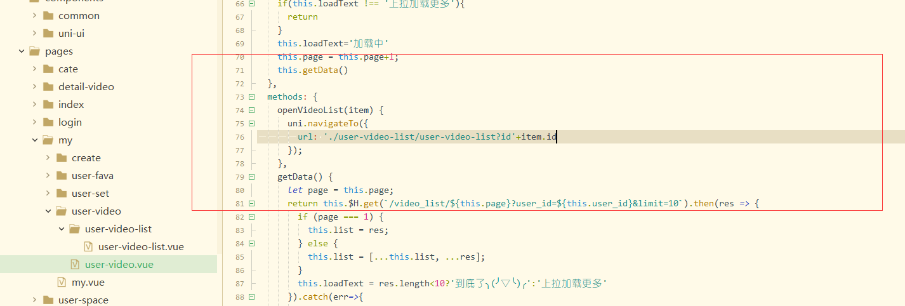
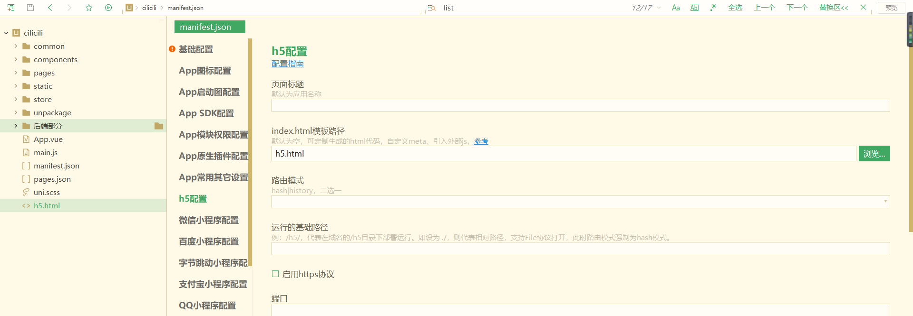
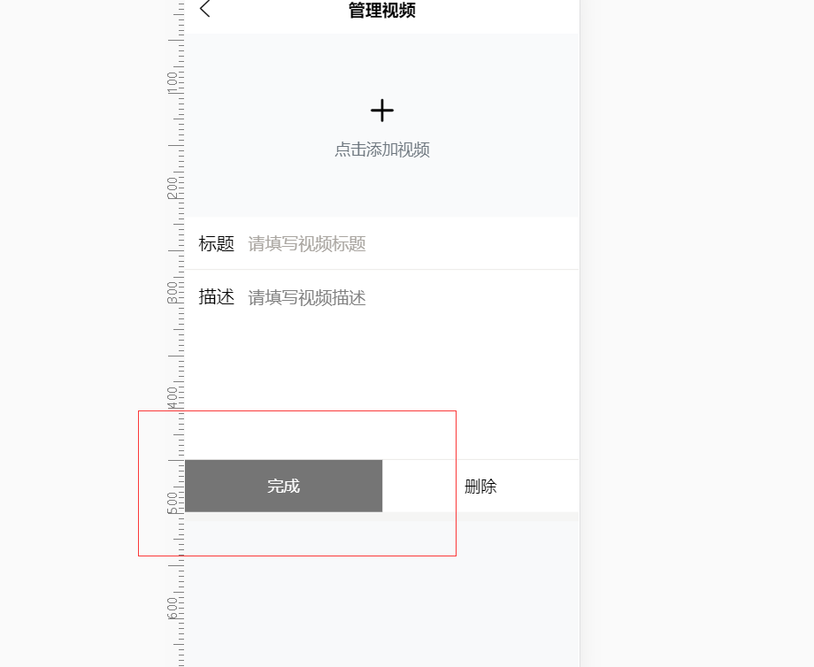
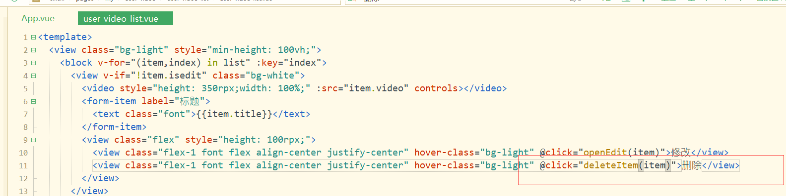
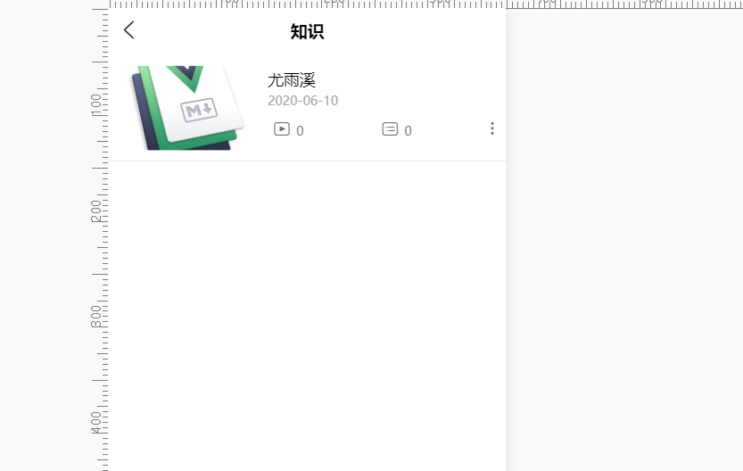
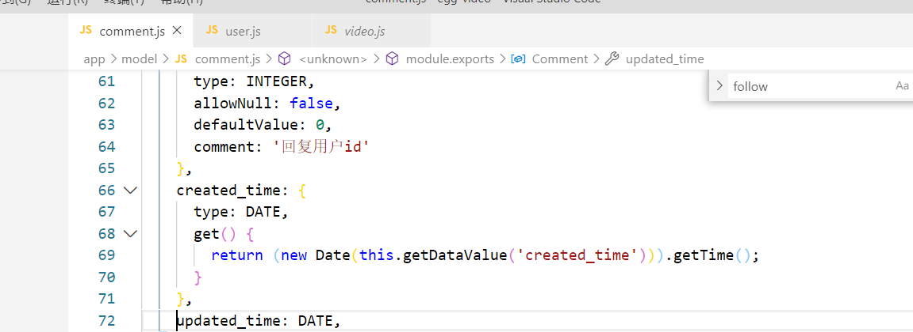
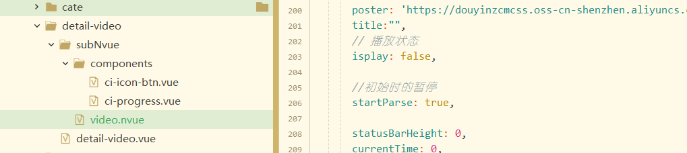

配置

## H5端交互跨域问题

manifest.json


利用webpack devServer,通过/api代理这个域名

```json
"h5" : {
  "devServer" : {
    "https" : false,
    "proxy" : {
      "/api" : {
        "target" : "http://localhost:7001/",
        "changeOrigin" : true,
        "ws" : true,
        "pathRewrite" : {
          "^/api" : ""
        }
      }
    }
  }
}
```

## vuex配置

```js
//store/index.js
import Vue from 'Vue';
import Vuex from 'vuex'
Vue.use(Vuex)

export default new Vuex.Store({
	state:{

	},
	actions:{
	
	}
})
```

```js
//main.js
import store from './store/index.js'
Vue.prototype.$store = store
const app = new Vue({
  store,
  //....
})
```

## 注册交互

1. 引入request.js 官方的uni.requestAPI接口的二次封装

```js
data(){
  return {
    registerForm: {
      username: '',
      password: '',
      repassword: ''
    },
  }
},
submit() {
  if (this.type === 'reg') {
    this.$H.post('/reg', this.registerForm).then(res => {
      uni.showToast({
        title: '注册成功',
        duration	:1000
      });
      setTimeout(()=>{
        this.changeType()
      },1000)
    });
  }
}
```

### 初始化登录状态

```js
//store/index.js
actions:{
  initUser({state}){
    let u = uni.getStorageSync('user')
    if(u){
      u = JSON.parse(u)
      state.user = u;
      state.token = u.token
    }
  }
```

```vue
<script>
	
export default {
	onLaunch: function() {
		//初始化用户登录
			this.$store.dispatch('initUser');
	},
```

### 退出登录

token封装



```js
//request.js封装
token:false
options.token = options.token === true ?  true : this.common.token
return new Promise((res, rej) => {
  // 请求之前验证...
  // token验证
  if (options.token) {
    let token = $store.state.token
    // 往header头中添加token
    options.header.token = token
  }
}
```

```js
actions:{
  logout({state}){
			// 传递第三个参数token
			$H.post('/logout',{},{
				token:true
			})
			state.user = false
			state.token = false
			// clear是清除所有 我们后面有可能有需要用到的其他内容
			uni.removeStorageSync('user')
			
		}
```

## 分类页

```js
<template>
	<view>
		<!-- #ifdef MP -->
		<!-- 导航栏 -->
		<view class="flex align-center fixed-top" style="height: 44px;">
			<!-- 搜索框 -->
			<view class="mx-2 flex align-center flex-1 rounded-circle px-1" style="background-color: #F6F7F8;color: #959FA0;">
				<text class="iconfont iconsousuokuang"></text>
				<text>点此搜索</text>
			</view>
		</view>
		<view style="height: 44px;"></view>
		<!-- #endif -->
		
		<card title="热门分类" :showRefresh="false">
			<scroll-view scroll-x="true" class="scroll-row">
				<icon-cate v-for="(item,index) in list" :key="index"
				:item="item" :index="index"></icon-cate>
			</scroll-view>
		</card>
		<view class="f-divider"></view>
		<card title="全部分类" :showRefresh="false">
			<icon-cate v-for="(item,index) in list" :key="index"
			:item="item" :index="index"></icon-cate>
		</card>
	</view>
</template>

<script>
	import card from '@/components/common/card.vue';
	import iconCate from '@/components/common/icon-cate.vue';
	export default {
		components: {
			card,
			iconCate
		},
		data() {
			return {
				list:[]
			}
		},
		onLoad() {
			this.getCategoryData()
		},
		methods: {
			getCategoryData(){
				uni.showLoading()
				this.$H.get('/category').then(res=>{
					this.list = res;
					uni.hideLoading()
				}).catch(err=>{
					uni.hideLoading()
				})
			}
		}
	}
</script>

<style>

</style>

```

### 下拉刷新

```js
{
  "path": "pages/cate/cate",
    "style": {
      "enablePullDownRefresh":true,
        "app-plus": {
          "titleNView": {
```

```js
methods:{
  getCategoryData(){
    return this.$H.get('/category').then(res=>{
    }).catch(err=>{
    })
  }
}
onPullDownRefresh() {
			this.getCategoryData().then(res=>{
				uni.showToast({
					title:'刷新成功',
					icon:'none'
				})
				uni.stopPullDownRefresh()
			}).catch(err=>{
				uni.stopPullDownRefresh()
			})
		},
```

## 分类列表页

```json
{
  "path" : "pages/cate/list/list",
  "style" : {
    "navigationBarTitleText":"列表",
    "enablePullDownRefresh":true
  }
}
```

## 个人中心权限验证


## 发布作品功能

```js
actions:{
		//登录
		login({state},user){
			state.user = user
			state.token = user.token
			uni.setStorageSync('user',JSON.stringify(user))
			uni.setStorageSync('token',user.token)
		},

		// 退出登录
		logout({state}){
			// 传递第三个参数token
			$H.post('/logout',{},{
				token:true
			})
			state.user = false
			state.token = false
			// clear是清除所有 我们后面有可能有需要用到的其他内容
			uni.removeStorageSync('user')
			uni.removeStorageSync('token')
			
		}
	}
```

```js
//request.js
upload(url, data, onProgress = false) {
  return new Promise((result, reject) => {
    // 上传之前验证
    let token = uni.getStorageSync('token')
    if (!token) {
      uni.showToast({ title: '请先登录', icon: 'none' });
      // token不存在时跳转
      return uni.navigateTo({
        url: '/pages/login/login',
      });
    }

```

## 我的作品功能交互

user-video

```js
computed: {
  ...mapState({
    user_id: state => {
      return state.user ? state.user.id : 0;
    }
  })
},
  methods: {
    getData() {
      let page = this.page;
      return this.$H.get(`/video_list/${this.page}?user_id=${this.user_id}&limit=10`).then(res => {
        if (page === 1) {
          this.list = res;
        } else {
          this.list = [...this.list, ...res];
        }
        this.loadText = res.length<10?'到底了╮(╯▽╰)╭':'上拉加载更多'
      }).catch(err=>{
        if(	this.page>1){
          this.page--
        }
        this.loadText='上拉加载更多'
      })
    }
  }
onReachBottom() {
  if(this.loadText !== '上拉加载更多'){
    return
  }
  this.loadText='加载中'
  this.page = this.page+1;
  this.getData()
},
  onPullDownRefresh() {
    this.page = 1;
    this.getData()
      .then(res => {
      uni.showToast({
        title: '刷新成功',
        icon: 'none'
      });
      uni.stopPullDownRefresh();
    })
      .catch(err => {
      uni.showToast({
        title: '刷新失败',
        icon: 'none'
      });
      uni.stopPullDownRefresh();
    });
  },
```

## 数据统计交互

用户相关/统计相关数据

因为这个数据会加载多次，可能需要在onShow生命周期

## 我的作品修改交互

- 修改完毕返回后需要刷新

## 视频上传交互

>调用指定作品下的视频分级列表接口
>
>/video_detail/1  

### 获取我的视频列表

进入我的视频，点击进入视频上传页面





```html
/pages/my/user-video/user-video-list/user-video-list.vue

```

### 上传视频

uni-app前端部分：

```js
参考文档：
小程序和app端：
https://cloud.tencent.com/document/product/266/18177
H5端：
https://cloud.tencent.com/document/product/266/9239
import VodUploader from '@/common/vod-wx-sdk-v2.js';

uni.chooseVideo({
    count: 1,
    sourceType: ['camera', 'album'],
    success: (res)=> {
        // 获取签名
        // #ifndef H5
        let getSignature = (callback) => {
            this.$H.post('/vod/sign',{},{
                token:true
            }).then(res=>{
                callback(res);
            })
        }
        // #endif
        // #ifdef H5
        let getSignature = (callback) => {
            return this.$H.post('/vod/sign',{},{
                token:true
            }).then(res=>{
                return res
            })
        }
        // #endif
        // 生成唯一名称
        let mediaName = this.genID(12)
        uni.showLoading({
            title: '上传中...',
            mask: false
        });
        // #ifdef H5
        const tcVod = new TcVod.default({
          getSignature: getSignature
        })
        const uploader = tcVod.upload({
          mediaFile: res.tempFile,
        })
        uploader.on('media_progress',(info)=> {
          console.log(info.percent) // 进度
        })
        uploader.done().then((doneResult)=>{
            // 上传后的视频链接
            console.log(doneResult.video.url);
            uni.hideLoading()
        }).catch((err)=>{
            uni.hideLoading()
            uni.showToast({
                title: '上传失败',
                icon: 'none'
            });
        })
        // #endif

        // #ifndef H5
        VodUploader.start({
            mediaFile: res, 
            getSignature: getSignature,
            mediaName: mediaName,
            success: (result)=>{
                console.log('success');
                console.log(result);
            },
            error:(result)=> {
                console.log(result);
                uni.showModal({
                    title: '上传失败',
                    content: JSON.stringify(result),
                    showCancel: false
                });
            },
            progress:(result)=> {
                console.log('progress');
                console.log(result);
            },
            finish: (result)=>{
                // 上传后视频链接
                console.log(result.videoUrl);
                uni.hideLoading()
            }
        });
        // #endif
    }
});
// 生成唯一ID
genID(length){
    return Number(Math.random().toString().substr(3,length) + Date.now()).toString(36);
}
```

H5端index.html模板 /h5.html



```
cilicili/h5.html
<!DOCTYPE html>
<html lang="zh-CN">
    <head>
        <meta charset="utf-8">
        <meta http-equiv="X-UA-Compatible" content="IE=edge">
        <meta name="viewport" content="width=device-width, user-scalable=no, initial-scale=1.0, maximum-scale=1.0, minimum-scale=1.0">
        <title>
            <%= htmlWebpackPlugin.options.title %>
        </title>
        <script>
            document.addEventListener('DOMContentLoaded', function() {
                document.documentElement.style.fontSize = document.documentElement.clientWidth / 20 + 'px'
            })
        </script>
        <link rel="stylesheet" href="<%= BASE_URL %>static/index.<%= VUE_APP_INDEX_CSS_HASH %>.css" />
        <script src="//cdn-go.cn/cdn/vod-js-sdk-v6/latest/vod-js-sdk-v6.js"></script>
    </head>
    <body>
        <noscript>
            <strong>Please enable JavaScript to continue.</strong>
        </noscript>
        <div id="app"></div>
        <!-- built files will be auto injected -->
    </body>
</html>
```

## 视频创建修改删除

>post:video_detail
>
>- title
>- url
>- video_id
>- desc



```html
// cilicili/pages/my/user-video/user-video-list/user-video-list.vue
<script>
 submit(item) {
			if (!item.video) {
				return uni.showToast({
					title: '视频不能为空',
					icon: 'none'
				});
			}
			if (!item.title) {
				return uni.showToast({
					title: '标题不能为空',
					icon: 'none'
				});
			}

			let url = item.id ? '/video_detail/' + item.id : '/video_detail';
			let msg = item.id ? '修改成功' : '创建成功';
			this.$H
				.post(
					url,
					{
						title: item.title,
						url: item.video,
						video_id: this.id,
						desc: item.desc
					},
					{ token: true }
				)
				.then(res => {
					//编辑状态false
					item.isedit = false;
					uni.showToast({
						title: msg,
						icon: 'none'
					});
					this.getData();
				});
		},
</script>
```

### 删除



```js
deleteItem(item) {
			
			if (typeof item !== 'object') {
				this.list.pop()
				return;
			}
			uni.showModal({
				content: '是否要删除该视频？',
				success: res => {
					if (res.confirm) {
						this.$H
							.post(
								'/video_detail/destroy',
								{
									id: item.id
								},
								{
									token: true
								}
							)
							.then(res => {
								this.getData();
								uni.showToast({
									title: '删除成功',
									icon: 'none'
								});
							});
					}
				}
			});
		},
```

## 视频详情交互

### 获取视频详情

>接口
>
> router.get('/video_read/:id', controller.video.read);无token



```js
//page/cate/list==>media-list组件
open() {
  uni.navigateTo({
    url:`../../pages/detail-video/detail-video?id=${this.item.id}`
  })
}
```

```js
//D:/czw-project/cilicili/pages/detail-video/detail-video.vue
onLoad(e) {
  this.id = e.id;
  this.$H.get('/video_read/' + this.id).then(result => {
    console.log(result);
    this.hot = result.hot;
    this.detail = result.video;
    this.detail.created_time = $T.gettime(this.detail.created_time);
    this.poster = this.detail.cover;
    this.videoList = result.video.video_details || [];
    this.src = this.videoList[this.activeIndex].url || '';
  });
},
```

### 关注/取关功能

- 判断是否关注

- 如果是本人发布 不会渲染

  ```html
  <div v-if="detail.user.id !== user_id">
    关注
  </div>
  ```

  ```js
  import {mapState} from 'vuex';
  computed: {
    ...mapState({
      user_id: state => {
        return state.user ? state.user.id : 0;
      }
    })
  },
    
    doFollow() {
      let url = this.followStatus ? '/user/unfollow' : '/user/follow';
      let msg = this.followStatus ? '取消关注' : '关注';
      this.$H
        .post(
        url,
        {
          follow_id: this.detail.user.id
        },
        {
          token: true
        }
      )
        .then(res => {
        this.followStatus = !this.followStatus;
        uni.showToast({
          title: msg + '成功',
          icon: 'none'
        });
        console.log(res);
      })
        .catch(err => {
        console.log(err);
      });
    }
  ```

### 收藏/取消收藏

```html
<view class="flex">
  <view @click="doFava" class="flex flex-column align-center px-3 " :class="favaStatus ? 'text-main' : ''">
    <text class="iconfont iconshoucang " style="font-size: 40upx;line-height: 40upx;"></text>
    <text style="width: 100upx;text-align: center;">{{ favaStatus ? '已收藏' : '收藏' }}</text>
  </view>
</view>
```

```js
data(){
  return {
    favaStatus: true
  }
}
onLoad(e) {
  this.id = e.id;
  this.$H
    .get('/video_read/' + this.id, {
    token: true,
    noJump: true,
    toast: false
  })
    .then(result => {
    this.favaStatus = result.fava;
  });
},
```

```js
doFava() {
			this.$H
				.post(
					'/fava/video',
					{
						video_id: this.detail.id
					},
					{
						token: true
					}
				)
				.then(res => {
					this.favaStatus = res.status;
					uni.showToast({
						title: res.msg,
						icon: 'none'
					});
				});
		}
```

### 评论

后端需要改成时间戳的形式



```js
/video_comment/id
getComments() {
  this.$H.get('/video_comment/' + this.detail.id).then(res => {
    this.comments = res;
    console.log(JSON.parse(JSON.stringify(res)));
  });
}
```

```js
onLoad(e) {	
  this.id = e.id;
  this.$H
    .get()
    .then(result => {
    //...
    this.getComments();
  });
},
```

### 视频播放

### 视频播放nvue交互



```js
//detail-video.vue
onLoad(e) {
  this.$H
    .get('/video_read/' + this.id, {
    token: true,
    noJump: true,
    toast: false
  })
    .then(result => {
    uni.$emit('video',{
      
    })

  });
},
```

```js
created() {
		uni.$on('video',this.handleVideoEvent)
	},
```

### 获取关注数

```js
getUserInfo(){
			this.$H.get('/user/user_info?user_id='+this.detail.user.id).then(res=>{
				console.log(res);
			})
		}
```

## 我的收藏交互

```js
data:{
  	list: [],
			page: 1,
			loadText: '上拉加载更多'
}
```

```js
//获取数据
getFavaData() {
			let page = this.page;
			return this.$H
				.get(`/fava_list/${this.page}?user_id=${this.user_id}`)
				.then(res => {
        //如果是第一页就覆盖，否则就合并一下。
					(this.list = page === 1 ? res : [...this.list, ...res]), 
           (this.loadText = res.length === 10 ? '上拉加载更多' : '没有更多了');
				})
				.catch(err => {
					if (page > 1) {
						this.page--;
					}
					this.loadText = '上拉加载更多';
				});
		}
```

## 关注