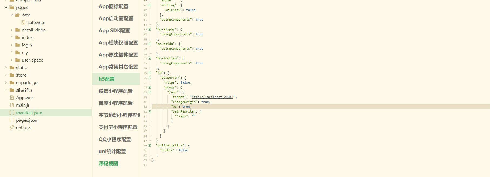

# 全局配置

## 全局配置

- 引入官方样式uni.css,并且需要引入uni.ttf到static目录,以提供字体。

- 引入cilicili项目全局样式库

- 引入基于bootstrap的css样式库

  ```css
  text-[color] ：text-danger
  bg-[color]: bg-danger
  ml-2 
  ```

- 引入iconfont字体图标库

  - Font Class下载到本地

  - 使用iconfont.css和icontont.ttf。

    ```css
    //iconfont.css删除其他src,只留下大串图标的
    //如果是支付宝小程序，需要使用iconfont.ttf文件
    @font-face {font-family: "iconfont";
      src:url('data:application/x-font-woff2;charset=utf-............') format('woff2'),
    	url('/static/iconfont.ttf') format('truetype')
    }
    ```

  - ```html
    <view class='iconfont iconxxxx'>
    ```

- 引入全局动画库animate.css

  - ```html
    快速效果。
    <view class='animated fast' hover-class='rubberBand'></view>
    ```


## 配置tabbar

```json
"tabBar": {
    "borderStyle": "black",
    "selectedColor": "#FB7299",
    "color": "#444444",
    "list": [{
        "pagePath": "pages/index/index",
        "iconPath": "static/tabbar/find.png",
        "selectedIconPath": "static/tabbar/find-selected.png",
        "text": "首页"
    }, {
        "pagePath": "pages/cate/cate",
        "iconPath": "static/tabbar/cate.png",
        "selectedIconPath": "static/tabbar/cate-selected.png",
        "text": "分类"
    }, {
        "pagePath": "pages/my/my",
        "iconPath": "static/tabbar/my.png",
        "selectedIconPath": "static/tabbar/my-selected.png",
        "text": "我的"
    }]
}
```

## 封装api接口文件

- post(url,data)

```js
import $store from '../store/index.js';
export default {
	// 全局配置
	common: {
		// #ifndef H5 非h5端后端域名配置
		baseUrl: "xxxxxxxxxxx",
		// #endif
		// #ifdef H5 h5端配合proxy进行配置
		baseUrl: "/api",
		// #endif
		
		header: {
			'Content-Type': 'application/json;charset=UTF-8',
		},
		data: {},
		method: 'GET',
		dataType: 'json',
		token: false
	},
	// 请求 返回promise
	request(options = {}) {
		// 组织参数   'http://cilicili.cchenzw.top' + '/reg'
		options.url = this.common.baseUrl + options.url
		options.header = options.header || this.common.header
    //body体数据
		options.data = options.data || this.common.data
		options.method = options.method || this.common.method
		options.dataType = options.dataType || this.common.dataType
    //token是否传入
		options.token = options.token === true ? true : this.common.token

		// 请求
		return new Promise((res, rej) => {
			// 请求之前验证...
			// 如果需要token验证
			if (options.token) {
				let token = $store.state.token
				// 往header头中添加token
				options.header.token = token
				if (!token && options.noJump!==true) {
					uni.showToast({
						title: '请先登录',
						icon: 'none'
					})
					uni.navigateTo({
						url: '/pages/login/login',
					});
					return rej("请先登录")
				}

				// 二次验证
			}

			// if (options.token) {
			// 	let token = uni.getStorageSync('token')
			// 	// 二次验证
			// 	if (!token && options.noJump !== true) {
			// 		uni.showToast({
			// 			title: '请先登录',
			// 			icon: 'none'
			// 		});
			// 		// token不存在时跳转
			// 		uni.navigateTo({
			// 			url: '/pages/login/login',
			// 		});
			// 		return rej("请先登录")
			// 	}
			// 	// 往header头中添加token
			// 	options.header.token = token
			// }

			// 请求中...
			uni.request({
				...options,
				success: (result) => {
					// 返回原始数据
					if (options.native) {
						return res(result)
					}
					// 服务端失败
					if (result.statusCode !== 200) {
						if (options.toast !== false) {
							uni.showToast({
								title: result.data.data || '服务端失败',
								icon: 'none'
							});
						}
						// token不合法，直接退出登录
						// if(result.data.data === 'Token 令牌不合法!'){
						// 	$store.dispatch('logout')
						// }
						return false
					}
					// 其他验证...
					// 成功
					let data = result.data.data
					res(data)
				},
				fail: (error) => {
					uni.showToast({
						title: error.errMsg || '请求失败',
						icon: 'none'
					});
					return rej(error)
				}
			});
		})
	},
	// get请求
	get(url, options = {}) {
		options.url = url
		options.data = {}
		options.method = 'GET'
		return this.request(options)
	},
	// post请求
	post(url, data = {}, options = {}) {
		options.url = url
		options.data = data
		options.method = 'POST'
		return this.request(options)
	},
	// delete请求
	del(url, data = {}, options = {}) {
		options.url = url
		options.data = data
		options.method = 'DELETE'
		return this.request(options)
	},
	// 上传文件
	upload(url, data, onProgress = false) {
		return new Promise((result, reject) => {
			// 上传之前验证
			let token = uni.getStorageSync('token')
			if (!token) {
				uni.showToast({
					title: '请先登录',
					icon: 'none'
				});
				// token不存在时跳转
				return uni.navigateTo({
					url: '/pages/login/login',
				});
			}

			const uploadTask = uni.uploadFile({
				url: this.common.baseUrl + url,
				filePath: data.filePath,
				name: data.name || "files",
				header: {
					token
				},
				success: (res) => {
					if (res.statusCode !== 200) {
						result(false)
						return uni.showToast({
							title: '上传失败',
							icon: 'none'
						});
					}
					let message = JSON.parse(res.data)
					result(message.data);
				},
				fail: (err) => {
					console.log(err);
					reject(err)
				}
			})

			uploadTask.onProgressUpdate((res) => {
				if (typeof onProgress === 'function') {
					onProgress(res.progress)
				}
			});

		})
	}
}

```

## H5端交互跨域问题

manifest.json



利用webpack devServer,通过/api代理这个域名

```json
"h5" : {
  "devServer" : {
    "https" : false,
    "proxy" : {
      "/api" : {
        "target" : "http://localhost:7001/",//上线后改为线上域名
        "changeOrigin" : true,
        "ws" : true,
        "pathRewrite" : {
          "^/api" : ""
        }
      }
    }
  }
}
```

## vuex配置

```js
//store/index.js
import Vue from 'Vue';
import Vuex from 'vuex'
Vue.use(Vuex)

export default new Vuex.Store({
	state:{

	},
	actions:{
	
	}
})
```

```js
//main.js
import store from './store/index.js'
Vue.prototype.$store = store
const app = new Vue({
  store,
  //....
})
```

