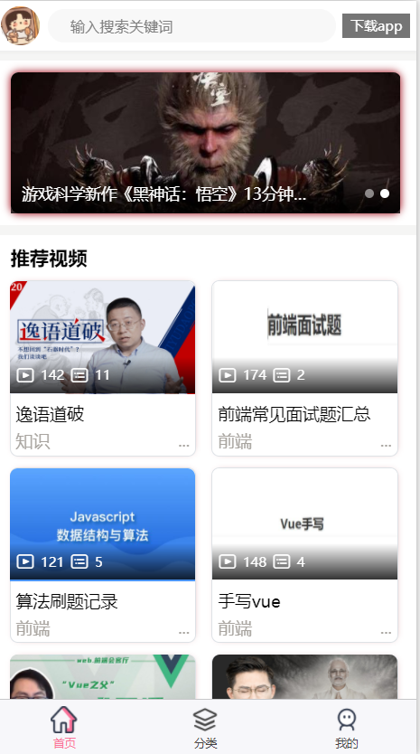
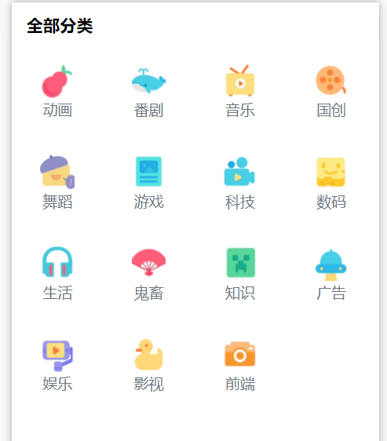
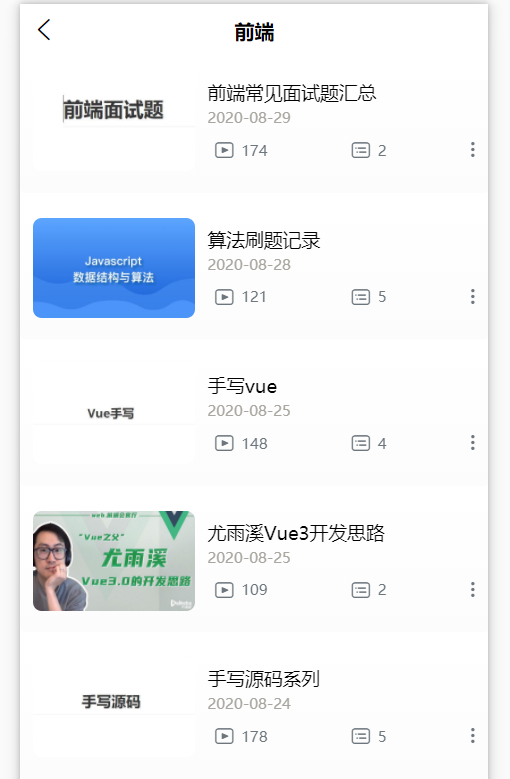

# 首页分类页开发

## 首页开发



- 导航栏
- 轮播组件
- 推荐视频
- 排行榜

```html
<template>
    <view class="animated fadeIn">
        <scroll-view scroll-y="true">
            <!-- 导航栏 -->
            <index-nav-bar :statusBar="statusBar"></index-nav-bar>
            <view class="f-divider"></view>
            <!-- 轮播图组件 -->
            <index-swiper :swipers="swipers" @goDetailVideo="goDetailVideo"></index-swiper>
            <view class="f-divider"></view>
            <!-- 推荐视频  -->
            <!-- @refresh刷新 goDetailVideo跳转 -->
            <index-card-comment @refresh="refresh" @goDetailVideo="goDetailVideo" :list="list"></index-card-comment>
            <view class="f-divider"></view>
            <!-- 排行榜 -->
            <index-ranking-list :Numlist="Numlist" @goDetailVideo="goDetailVideo"></index-ranking-list>
        </scroll-view>
    </view>
</template>
```

### 自定义轮播

- 通过@change事件获取currentIndex,然后传递到自己写的swiper-dot组件里。

```html
<swiper-dot :info="swipers" :current="current">
  <swiper :current="current" circular :autoplay="true" :interval="3000" :duration="150" style="height: 250rpx;" @change="changeSwiper">
    <swiper-item v-for="(item, index) in swipers" :key="index">
      <image @click="goDetailVideo(item.video_id)" :src="item.cover" mode="aspectFill" style="height: 250rpx;width: 100%;" class="rounded-lg"></image>
    </swiper-item>
  </swiper>
</swiper-dot>
```

```js
changeSwiper(e) {
  this.current = e.detail.current;
}
```

swiper-dot

```html
<template>
    <view class="position-relative ">
        <slot></slot>
        <view style="height: 70rpx;position: absolute;bottom: 0;left: 0;right: 0;background-image: linear-gradient(to bottom,rgba(0,0,0,0),rgba(0,0,0,0.8));" class=" flex align-center text-white  px-2">
            <view  style="width: 80%;" class="text-ellipsis">
                {{info[current].title}}
            </view>
            <view style="width: 20%;" class="flex align-center justify-end flex-shrink">
                <view v-for="(item,index) in info" :key="index" style="width: 16rpx;height: 16rpx;" :style="index === current ? 'background-color: rgba(255,255,255,1);' : 'background-color: rgba(255,255,255,0.5);'" class="rounded-circle ml-1"></view>
            </view>
        </view>
    </view>
</template>

<script>
    export default {
        props: {
            info:Array,
            current:{
                type:Number,
                default:0
            }
        },
        onLoad() {

        },

    }
</script>

<style>
</style>

```

## 分类页开发(略)



```js
getData(){
    uni.showLoading()
    return this.$H.get('/category').then(res=>{
        this.list = res;

        uni.hideLoading()
    }).catch(err=>{
        uni.hideLoading()
    })
}
```

## 选择投稿类型页(略)




## 搜索页

```vue
<template>
<view>
    <!-- #ifndef MP -->
    <uni-nav-bar left-icon="back" left-text="返回" status-bar="true" :fixed="true" right-text="搜索" @clickLeft="goBack" @clickRight="search">
        <view class="input-view"><input v-model="keyword" :focus="focus" confirm-type="search" class="nav-bar-input" type="text" placeholder="输入搜索关键词" /></view>
    </uni-nav-bar>
    <!-- #endif -->

    <!-- #ifdef MP -->
    <view class="flex justify-center align-center">
        <input type="text" value="搜索"	style="background-color: #f8f8f8;padding: 10upx;width: 70%;border-radius: 15upx;"  />
        <button type="default" @click="search"></button>
    </view>

    <!-- #endif -->

    <media-list v-for="(item, index) in list" :key="index" :item="item" :index="index"></media-list>

    <!-- 默认提示 -->
    <view v-if="list.length === 0" class="flex align-center justify-center text-secondary" style="height: 200rpx;">{{listStatus}}</view>
    <!-- 上拉加载更多 -->
    <view v-else-if="list.length > 10" class="flex align-center justify-center font-md text-secondary" style="height: 80rpx;" hover-class="bg-light">{{ loadText }}</view>
    </view>
</template>

<script>
    import uniNavBar from '@/components/uni-ui/uni-nav-bar/uni-nav-bar.vue';
    import mediaList from '@/components/common/media-list.vue';
    export default {
        data() {
            return {
                keyword: '',
                page: 1,
                list: [],
                focus: false,
                loadText: '上拉加载更多',
                listStatus:''
            };
        },
        onLoad() {
            setTimeout(() => {
                this.focus = true;
            }, 100);
        },
        onReachBottom() {
            if (this.loadText !== '上拉加载更多') {
                return;
            }
            this.loadText = '正在加载中...';
            this.page++;
            this.getData();
        },
        methods: {
            goBack() {
                uni.navigateBack({
                    delta: 1
                });
            },
            search() {
                if (this.keyword === '') {
                    return uni.showToast({
                        title: '关键词不能为空',
                        icon: 'none'
                    });
                }
                this.page = 1;
                this.getData();
            },
            getData() {
                let page = this.page;
                this.listStatus='搜索中'
                this.$H
                    .get(`/video_search/${this.page}?keyword=${this.keyword}`)
                    .then(res => {

                    this.list = page === 1 ? res : [...this.list, ...res];
                    this.loadText = res.length === 10 ? '上拉加载更多' : '没有更多了';
                    if(this.list.length===0){
                        this.listStatus='什么也没找到'
                    }else{
                        this.listStatus=''
                    }
                })
                    .catch(err => {
                    if (page > 1) {
                        this.page--;
                        this.loadText = '上拉加载更多';
                    }
                });
            }
        },
        components: {
            uniNavBar,
            mediaList
        }
    };
</script>

<style></style>

```

