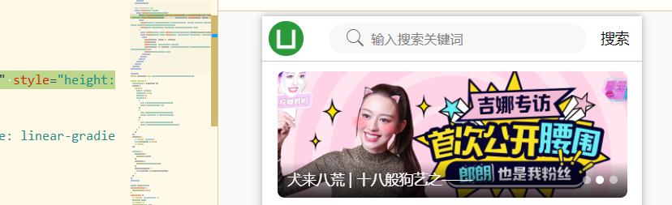
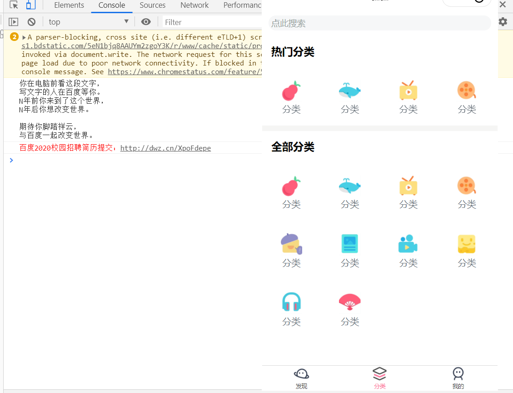
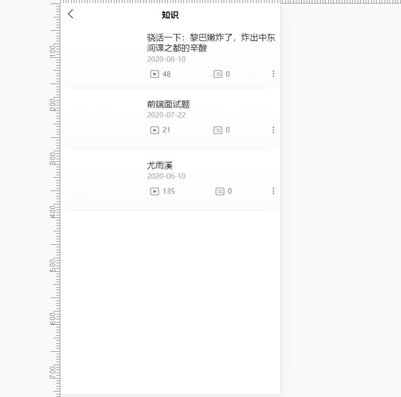

# 首页分类页开发

## 首页开发

- 导航栏
- 轮播组件
- 推荐视频
- 排行榜

### 自定义轮播

- 通过@change事件获取currentIndex,然后传递到自己写的swiper-dot组件里。



```html
<swiper-dot :info="swipers" :current="current">
  <swiper :current="current" circular :autoplay="true" :interval="3000" :duration="150" style="height: 250rpx;" @change="changeSwiper">
    <swiper-item v-for="(item, index) in swipers" :key="index">
      <image @click="goDetailVideo(item.video_id)" :src="item.cover" mode="aspectFill" style="height: 250rpx;width: 100%;" class="rounded-lg"></image>
    </swiper-item>
  </swiper>
</swiper-dot>
```

```js
changeSwiper(e) {
  this.current = e.detail.current;
}
```

### 卡片部分

- 布尔传参必须要使用:xx='true'

## 分类页开发(略)



## 分类->选择投稿类型(略)

