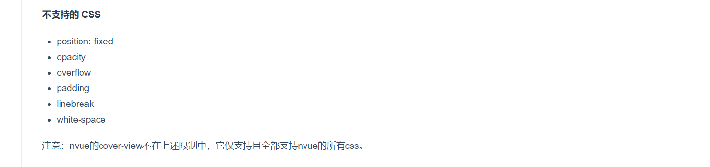
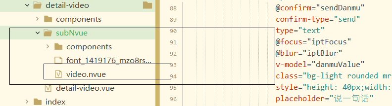

# subNvue自定义播放器(重点)

- nvue代替video,因为video属于高级组件，会覆盖自己编写的内容。并且video组件的层级关系很高，我们如果想做一些点击侧边弹出抽屉等效果是无法实现的。subNvue只支持app端

- `cover-view`限制很多，支持的css较少，故而不使用它

  

- nvue默认全部flex布局。

- 原生子窗体subNvue

subNvue，是 vue 页面的原生子窗体，把weex渲染的原生界面当做 vue 页面的子窗体覆盖在页面上。它不是全屏页面，它给App平台vue页面中的层级覆盖和原生界面自定义提供了更强大和灵活的解决方案。它也不是组件，就是一个原生子窗体。

**他是某一小块的页面**

https://uniapp.dcloud.io/api/window/subNVues

## 原生子窗体样式

- 是某一小块的页面，如果使用viedo组件，我们有个抽屉弹出，是无法覆盖video的
- 只适用于app端

[原生子窗体样式表](https://uniapp.dcloud.io/collocation/pages?id=app-subnvuesstyle)

[video](https://uniapp.dcloud.io/component/video)

子窗体位置：



````html
<video
       id="video"
       ref="video"
       :src="src"  
       :poster="poster"
       :controls="false"  //控制条
       :show-center-play-btn="false" //是否显示中间按钮
       :show-fullscreen-btn="false" //是否显示全屏
       :show-progress="false" //显示进度条
       :enable-progress-gesture="false"
       style="width: 750rpx;height: 225px;"
       @fullscreenchange="fullscreenchange" 
       @timeupdate="timeupdate"
       @play="isplay = true" //是否播放
       @pause="isplay = false" //是否暂停
       :danmu-list="danmuList"
       enable-danmu
       ></video>
````

## pages.json修改和条件编译	

https://uniapp.dcloud.io/collocation/pages?id=app-subnvues                                                                                                                                                                                                                                                                                                                                                                                                                                                                                

```json
{
    "path": "pages/detail-video/detail-video",
    "style": {
        "app-plus": {
            "titleNView": false,
            "subNVues": [{
                "id": "top",
                "path": "pages/detail-video/subNvue/video",
                "style": {
                    "position": "dock",
                    "dock": "top",
                    "width": "100%",
                    "height": "245px"
                }
            }]
        }
    }
},
```

```vue
//detail.vue
<!-- #ifndef APP-PLUS -->
<!-- #ifndef MP -->
<view @@click.stop="goBack" class="position-absolute iconfont iconfanhui ml-1" style="z-index: 999; color:#FFFFFF;font-size: 50upx;"></view>
<!-- #endif -->
<!-- 非app端 -->
<video :src="src" :poster="poster" style="height: 225px;width: 750rpx;" controls id="myVideo" @timeupdate='timeupdate'></video>
<!-- #endif -->

```

## nvue引入方法图标

- 不显示bug已经修复

```js
const d = weex.requireModule('dom');
export default {
  created() {
    // 引入图标
    d.addRule('fontFace', {
      'fontFamily': "iconfont",
      'src': "url('https://at.alicdn.com/t/font_1419176_mzo8rsjxi4c.ttf')"
    });
  }
}
```

## 顶部高度设置

```html
<view style="height: 44rpx;opacity: 0;"></view>
```

## 自定义的组件无法使用@click解决方法

```html
//自定义组件.vue
<view class="video-btn" @click="$emit('click')">
//父组件
<xx @click='xx'></xx>
```

## 暂停播放

```html
<video ref="video"></video>

<f-icon-btn v-if="!isplay" :icon="'\ue63a'" size="22" @click="playOrPause"></f-icon-btn>
<f-icon-btn v-else :icon="'\ue605'" size="22" @click="playOrPause"></f-icon-btn>
```

```js
mounted() {
		videoCTX = this.$refs.video;
	},
playOrPause() {
  if (this.isplay) {
    videoCTX.pause();
  } else {
    videoCTX.play();
  }
}
```

## 进度条

### 获取video的时间


```js
<video @timeupdate="timeupdate"
timeupdate(e) {
  this.currentTime = parseInt(e.detail.currentTime);
  this.duration = parseInt(e.detail.duration);
},
```

```js
filters: {
  formatTime(result) {
    var h = Math.floor(result / 3600) < 10 ? '0'+Math.floor(result / 3600) : Math.floor(result / 3600);
    var m = Math.floor((result / 60 % 60)) < 10 ? '0' + Math.floor((result / 60 % 60)) : Math.floor((result / 60 % 60));
    var s = Math.floor((result % 60)) < 10 ? '0' + Math.floor((result % 60)) : Math.floor((result % 60));
    return result = result > 3600 ? (h + ":" + m + ":" + s) : m + ":" + s;
  }
},
```

```html
{{ currentTime|formatTime }}/{{ duration|formatTime }} //	00:00/07:02
```

```html
<view class="flex-1">
  <ciProgress></ciProgress>
</view>
```

### 进度条移动

```html
//父组件传入当前时间和总时长
<ciProgress  :duration="duration" :currentTime="currentTime"></ciProgress>
```

```js
//注入父组件实例
provide(){
  return {
    v:this
  }
},
```

```html
//进度条左侧
<view class="bg-main" style="height: 3px;" :style="activeStyle"></view>

	<view class="position-absolute rounded bg-main-hover  flex align-center" style="width: 15px;height: 10px;justify-content: space-around"  :style="activeDotStyle">
```


```js
//获取父组件实例
inject: ['v'],
created() {
  //计算进度条宽度
  this.width = this.v.windowWidth - 88 - 80;
  this.active(); //修改当前进度宽度
},
active() {
   //获取当前进度宽度
   this.activeWidth = this.duration == 0 ? 0 : (this.currentTime / this.duration) * this.width;
}
watch: {
  //监听currentTime变化，从而实时改变当前进度宽度
		currentTime(newVal, oldVal) {
			this.active();
		}
	},
computed: {
  //修改进度条左侧宽度和进度点宽度
		activeStyle() {
			return `width:${this.activeWidth}px`
		},
		activeDotStyle() {
			return `left:${this.activeWidth}px`
		}
	},    
    
```

### 参照b站-进度条拖拽配合小电视动画

- 拖拽时停止进度条变化

  ```js
  touchstart(e) {
  			this.moveStatus = true;
  }
  ```

  ```js
  watch: {
    //监听当前事件，改变当前进度条宽度
    currentTime(newVal, oldVal) {
      //如果不是处于移动状态就改变
      if (!this.moveStatus) {
        this.active();//改变当前进度
      }
    }
  },
  ```


```js
computed: {
  current(){
    //当前时间
    return this.width===0?0:(this.activeWidth/this.width)*this.duration
  }
},
```

```js
export default {
  touchstart(e) {
    if (this.duration === 0) return;
    this.moveStatus = true;

    this.activeWidth = e.changedTouches[0].screenX - 44;
  },
  touchmove(e) {
    if (this.duration === 0) return;
    let d = e.changedTouches[0].screenX - 44;
    if (d <= 0) {
      this.activeWidth = 0;
    } else if (d >= this.width) {
      this.activeWidth = this.width;
    } else {
      if (this.activeWidth > d) {
        this.tvemoji = '左看看';
      } else if (this.activeWidth < d) {
        console.log('右瞅瞅');
        this.tvemoji = '右瞅瞅';
      } else {
        this.tvemoji = '';
      }
     
      this.activeWidth = d;
    }
  },
  touchend(e) {
    this.tvemoji = '';
    if (this.duration === 0) return;
    this.moveStatus = false;
    this.$emit('change', this.current);
  }
}
```

```js
@change =	progressChange(e){
  videoCTX.seek(e)
}
```

```js
export default={
    methods:{
        handleLR(e) {
            let currentX = e.touches[0].pageX;
            let tx = currentX - this.lastX;
            if (tx < -10) {
                this.flag = '左看看';

            } else if (tx > 10) {
                this.flag = '右瞅瞅';

            }
            this.lastX = currentX;
        },
        touchMove(e) {    
            this.handleLR(e);
        },
        touchEnd(e) {
            // 
            this.lastX  =0
        }
    }
```


## 视频提升框

### 进度条拖动后video中心显示

```html
<video>
  <view class="position-absolute flex align-center justify-center" :style="videoBox">
    <!-- 提示框 -->
    <view v-if="showToast" class="p-2 rounded" style="background-color: rgba(0,0,0,0.2);">
      <text class="font text-white">{{ currentTime | formatTime }}/{{ duration | formatTime }}</text>
    </view>
  </view>
</video>
```

```html
<video>
  <view class="position-absolute flex align-center justify-center" :style="videoBox">
    <!-- 提示框 -->
    <view v-if="showToast" class="p-2 rounded" style="background-color: rgba(0,0,0,0.2);">
      <text class="font text-white">{{ currentTime | formatTime }}/{{ duration | formatTime }}</text>
    </view>
  </view>
</video>
```

### 暂停

```html
<view class="position-absolute flex align-center justify-center" :style="videoBox">
				<!-- 提示框 -->
				<view v-if="showToastStatus" class="p-2 rounded" style="background-color: rgba(0,0,0,0.3);">
					<text v-if="toast.type === 'progress'" class="font text-white">{{currentTime|formatTime}}/{{duration|formatTime}}</text>
					<text v-if="toast.type === 'msg'" class="font text-white">{{toast.msg}}</text>
				</view>
			</view>
```

## 控制条隐藏显示

```html
<!-- 顶部 -->
<view class="video-bg-top position-fixed top-0 left-0 right-0" >
<!-- 底部控制条 -->
<view class="video-bg-bottom position-fixed bottom-0 left-0 right-0" v-if="showStatusBarStatus"> 
```

```js
let timer = null
export default{
  data(){
    return {
      showStatusBarStatus:false
    }
  },
  methods:{
    // 显示控制条
    showStatusBar(){
      this.showStatusBarStatus = true
      timer = timer ? clearTimeout(timer) : null
      timer = setTimeout(()=>{
        this.hideStatusBar()
        timer = null
      },3000)
    },
    // 隐藏控制条
    hideStatusBar(){
      this.showStatusBarStatus = false
    },
    // 播放/暂停
    playOrPause(){
     //....
      if(this.isplay){
        videoCTX.pause()
      } else {
        this.showStatusBar()
        videoCTX.play()
      }
    },
  }
}
```

## 单点双击事件

```html
<view class="position-absolute left-0 right-0" :style="modalStyle"  @touchend="touchEnd"></view>
```

```js
data(){
  return {
    dbCount:0
  }
}
```

```js
touchEnd(e){
  if(this.dbCount === 1 || this.dbCount === 0 ){
    this.dbCount++
  }
  if(this.dbCount > 0){//说明
    setTimeout(()=>{
      // 单击
      if(this.dbCount === 1){
        this.showOrHideStatusBar()//显示隐藏控制条
      }
      // 双击
      if(this.dbCount === 2){
        this.playOrPause() //暂停
      }
      this.dbCount = 0
    },250)
  }
}

```

## 左右滑动控制进度

```html
<view class="position-absolute left-0 right-0" :style="modalStyle"  @touchend="touchEnd"
@touchstart="touchStart" @touchmove="touchMove"      
></view>
```

```js
data(){
  return {
    	// 单机双击，左滑右划
			oldTouchs: {},
			oldValue: {},
			dbCount: 0,
			touchType:null
  }
}
```

```js
touchStart(e){
    this.oldTouchs = e.changedTouches[0]
},
touchMove(e){

},
```

## 参照B站-初始暂停封面解决初始无进度时间问题

```html
	<!-- 初始暂停 -->
		<view class="position-absolute left-0 right-0 bottom-0 pl-4 " style="height: 60px;" v-if="startParse" >
			<f-icon-btn :icon="'\ue63a'" size="60" @click="hideStartParse"></f-icon-btn>
		</view>
```

## 全屏ios端兼容写法

```js
touchMove(e) {
  let newTouchs = e.changedTouches[0];

  if (!this.touchType) {
    this.touchType = Math.abs(newTouchs.pageX - this.oldTouchs.pageX) > 3 ? 'currentTime' : null;
    //如果是全屏下的ios
    if (this.fullScreenStatus && this.plantform === 'ios') {
      this.touchType = Math.abs(newTouchs.pageY - this.oldTouchs.pageY) > 3 ? 'currentTime' : null;
    }
    if (this.touchType === 'currentTime') {
      videoCTX.pause();
    }
  } else if (this.touchType === 'currentTime') {
    this.showToast({
      type: 'progress',
      autoClose: false
    });
    this.showStatusBar();
    let newCurrentTime = ((newTouchs.pageX - this.oldTouchs.pageX) / 250) * this.duration * 2 + this.oldValue.currentTime * 1;
    // 是否ios
    if (this.fullScreenStatus && this.platform === 'ios') {
      newCurrentTime = ((newTouchs.pageY - this.oldTouchs.pageY) / 250) * this.duration * 2 + this.oldValue.currentTime * 1;
    }

    newCurrentTime = newCurrentTime > this.duration ? this.duration : newCurrentTime;
    newCurrentTime = newCurrentTime < 0 ? 0 : newCurrentTime;
    this.currentTime = newCurrentTime;
  }
},
```

## (核心)全屏和取消全屏

requestFullScreen：[uni-app全屏](https://uniapp.dcloud.io/api/media/video-context)

```js
fullOrExitScreen() {
  if (this.fullScreenStatus) { //如果是全屏状态就退出
    videoCTX.exitFullScreen();
  } else {
    videoCTX.requestFullScreen();
  }
},
//进入退出全屏
fullscreenchange(e) {
  this.fullScreenStatus= e.detail.fullScreen
},
```

```html
<video @fullscreenchange="fullscreenchange"></video>

```

## (核心)控制速度-全屏后

核心代码

https://uniapp.dcloud.io/api/media/video-context

| **方法**     | **参数** | 说明                                                         |
| ------------ | -------- | ------------------------------------------------------------ |
| playbackRate | rate     | 设置倍速播放，支持的倍率有 0.5/0.8/1.0/1.25/1.5。微信基础库2.6.3 起支持 2.0 倍速 |

```js
<video id="video" ref="video">
mounted() {
  videoCTX = this.$refs.video;
},
changeRate(item) {
  this.rate = item;
  videoCTX.playbackRate(this.rate);
  uni.showToast({
    title: '速度切换为：' + this.rate,
    icon: 'none'
  });
  this.showDrawer = false;
},
```

## 切换视频

```html
<view v-if="fullScreenStatus && showDrawer">				
					<view v-else-if="drawerType === 'video'"@click.stop="closeDrawer"></view>
					<view>
						<!-- 速度 -->

						<!-- 选集 -->
						<view v-else-if="drawerType === 'video'" class="flex-1 flex flex-column p-2" style="width: 300px;">
							<scroll-view scroll-y="true" class="flex-1">
								<view @click="changeVideo(item, index)" class="border p-2 flex rounded mb-2" v-for="(item, index) in videoList">
									<text class="text-white" style="font-size: 14px;lines: 1;" :class="videoIndex === index ? 'text-main' : 'text-white'">{{ item.title }}</text>
								</view>
							</scroll-view>
						</view>
					</view>
				</view>
```

```js
data:{
  videoIndex:0,
  videoList:[]
}
```

```js
created(){
  this.videoList = demoList
}
```

```js
//全屏选集列表
changeVideo(item,index){
  this.videoIndex = index;
  // 暂停
  videoCTX.stop()
  let list  = this.videoList[index].list
  let i = list.findIndex(v=>v.value===this.quality)
  if(i===-1){
    if(list.length>0){
      this.src = list[0].url
    }else{
      uni.showToast({
        title:'视频链接不存在',
        icon:'none'
      })
    }
  }else{
    this.src = list[i].url
  }
  setTimeout(()=>{
    videoCTX.seek(0);//进度变0
    videoCTX.play()
    this.showDrawer = false;
    this.showStatusBar()
  },300)
}
```

## 清晰度

```js
computed: {
		qualityList(){
			return this.videoList[this.videoIndex]? this.videoList[this.videoIndex].list:[]
		}
	},
```


```js
 videoList = [
	{
		index: 0,
		title: '优化空数据默认显示',
		list: [
			{
				name: '标清',
				value: 'SD',
				url: 'https://douyinzcmcss.oss-cn-shenzhen.aliyuncs.com/%E8%AF%BE%E6%97%B61.%20%E9%A1%B9%E7%9B%AE%E4%BB%8B%E7%BB%8D.mp4'
			},
			{
				name: '高清',
				value: 'HD',
				url: 'https://douyinzcmcss.oss-cn-shenzhen.aliyuncs.com/%E8%AF%BE%E6%97%B61.%20%E9%A1%B9%E7%9B%AE%E4%BB%8B%E7%BB%8D.mp4'
			},
			{
				name: '超清',
				value: 'FHD',
				url: 'https://douyinzcmcss.oss-cn-shenzhen.aliyuncs.com/%E8%AF%BE%E6%97%B61.%20%E9%A1%B9%E7%9B%AE%E4%BB%8B%E7%BB%8D.mp4'
			}
		]
	},
	{
		index: 0,
		title: '2018年平昌冬',
		list: [
			{
				name: '标清',
				value: 'SD',
				url: 'https://douyinzcmcss.oss-cn-shenzhen.aliyuncs.com/%E8%AF%BE%E6%97%B61.%20%E9%A1%B9%E7%9B%AE%E4%BB%8B%E7%BB%8D.mp4'
			}
		]
	}
];
```

## bug处理-首次进入黑屏问题解决

- 一开始播放，10ms后暂停播放，这样就不会显示黑屏


