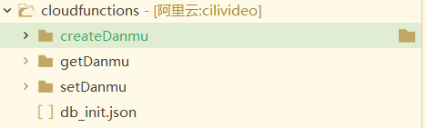

# 后续更新

## 对接dcloud云




```json
// 在本文件中可配置云数据库初始化，数据格式见：https://uniapp.dcloud.io/uniCloud/cf-database?id=db_init
// 编写完毕后对本文件点右键，可按配置规则创建表和添加数据
{
	"danmu_table": { //表名
		"data": [{
			"videoid": 0,
			"danmuList": [{
					"text": "正在观看1",
					"color": "#ff0000",
					"time": 1
				},
				{
					"text": "正在观看2",
					"color": "#ff0000",
					"time": 3
				}
			]
		}]
	}

}

```

## 创建弹幕

```js
'use strict';

const db = uniCloud.database()

// 集合
const danmuCollection = db.collection('danmu_table')
// const dbCmd = db.command


exports.main = async (event, context) => {
    //event为客户端上传的参数

    let { id } = event;

    let res = await danmuCollection.add({
        "videoid": id,
        "danmuList": [{
            "text": '即将有一大波弹幕来临~',
            "color": "#ff0000",
            "time": 1
        }
                     ]
    })

    //返回数据给客户端
    return res
};
```

```js
uniCloud.callFunction({
    name: 'createDanmu',
    data: {
        id
    },
    success: res => {
        console.log(res);
    },
    fail: err => {
        console.log(err);
    }
});
```

## 获取弹幕

```js
'use strict';

const db = uniCloud.database()

// 集合
const danmuCollection = db.collection('danmu_table')
exports.main = async (event, context) => {
    //event为客户端上传的参数
    let {videoid} = event
    let res = await danmuCollection.where({
        videoid
    }).get()

    //返回数据给客户端
    return res
};

```

## 发送弹幕

```js
'use strict';


const db = uniCloud.database()

// 集合
const danmuCollection = db.collection('danmu_table')
const dbCmd = db.command


exports.main = async (event, context) => {
    //event为客户端上传的参数
    let {videoid,danmuItem} = event

    let res = await danmuCollection.where({
        videoid
    }).update({
        danmuList: dbCmd.push([danmuItem])
    })
    console.log(res);
    //返回数据给客户端
    let data = await danmuCollection.where({
        videoid
    }).get()
    return data
};

```

在创建视频时

```js
uniCloud.callFunction({
    name: 'createDanmu',
    data: {
        id
    },
    success: res => {
        console.log(res);
    },
    fail: err => {
        console.log(err);
    }
});
```

## 弹幕功能实现

因为原后端数据已经部署，所以如果再次修改比较麻烦(不太懂运维)。所以才用dcloud存储弹幕。

### 自定义弹幕显示隐藏


