# 作品相关

## 数据表设计和迁移

[点击进入视频教程地址](https://study.163.com/provider/480000001892585/index.htm?share=2&shareId=480000001892585)

创建数据迁移文件

```js
npx sequelize migration:generate --name=video_play		//记录播放量，记录ip地址，作品id，每个用户增加一个播放量
```

```js
// video_play
'use strict';
module.exports = {
  up: (queryInterface, Sequelize) => {
    const { INTEGER, STRING, DATE, ENUM, TEXT } = Sequelize;
    return queryInterface.createTable('video_play', {
      id: {
        type: INTEGER(20),
        primaryKey: true,
        autoIncrement: true
      },
      ip: {
        type: STRING(50),
        allowNull: false,
        defaultValue: 0,
        comment: 'ip地址'
      },
      video_id: {
        type: INTEGER,
        allowNull: false,
        defaultValue: 0,
        comment: '视频id',
        references: {
          model: 'video',
          key: 'id'
        },
        onDelete: 'cascade',
        onUpdate: 'restrict', // 更新时操作
      },
      created_time: DATE,
      updated_time: DATE
    });
  },

  down: (queryInterface, Sequelize) => {
    return queryInterface.dropTable('video_play');
  }
};
```

执行 migrate 进行数据库变更 npx sequelize db:migrate 模型创建

```js

// app/model/video_play.js
module.exports = app => {
    const { STRING, INTEGER, DATE,ENUM,TEXT } = app.Sequelize;

    const VideoPlay = app.model.define('video_play', {
        id: {
            type:INTEGER(20),
            primaryKey:true,
            autoIncrement:true
          },
          ip:{
            type:STRING(50),
            allowNull:false,
            defaultValue:0,
            comment:'ip地址'
          },
          video_id:{
            type:INTEGER,
            allowNull:false,
            defaultValue:0,
            comment:'视频id'
          },
          created_time: DATE,
          updated_time: DATE
    });

    return VideoPlay;
};
```

### video表

关联关系：

- 多个video对应一个user

- 一个video里可能有多个子视频

  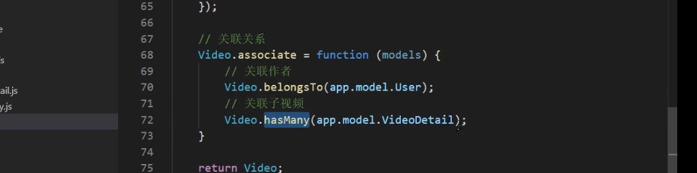

| 字段         | 类型         | 空   | 默认   | 链接到         | 注释       |
| ------------ | ------------ | ---- | ------ | -------------- | ---------- |
| id *(主键)*  | int(20)      | 否   |        |                |            |
| title        | varchar(100) | 否   |        |                | 视频标题   |
| cover        | varchar(255) | 是   |        |                | 视频封面   |
| category_id  | int(11)      | 否   | 0      | category -> id | 视频分类id |
| user_id      | int(11)      | 否   | 0      | user -> id     | 用户id     |
| duration     | int(11)      | 否   | 0      |                | 总时长     |
| desc         | text         | 否   |        |                | 视频简介   |
| play_count   | int(11)      | 否   | 0      |                | 播放量     |
| danmu_count  | int(11)      | 否   | 0      |                | 弹幕量     |
| created_time | datetime     | 是   | *NULL* |                |            |
| updated_time | datetime     | 是   | *NULL* |                |            |
索引

| 键名        | 类型  | 唯一 | 紧凑 | 字段        | 基数 | 排序规则 | 空   | 注释 |
| ----------- | ----- | ---- | ---- | ----------- | ---- | -------- | ---- | ---- |
| PRIMARY     | BTREE | 是   | 否   | id          | 0    | A        | 否   |      |
| category_id | BTREE | 否   | 否   | category_id | 0    | A        | 否   |      |
| user_id     | BTREE | 否   | 否   | user_id     | 0    | A        | 否   |      |

创建数据迁移文件

```bash
npx sequelize migration:generate --name=video 
```

执行完命令后，会在database / migrations / 目录下生成数据表迁移文件，然后定义

```js
// video
'use strict';
module.exports = {
  up: (queryInterface, Sequelize) => {
    const { INTEGER, STRING, DATE, ENUM, TEXT } = Sequelize;
    return queryInterface.createTable('video', {
      id: {
        type: INTEGER(20),
        primaryKey: true,
        autoIncrement: true
      },
      title: {
        type: STRING(100),
        allowNull: false,
        defaultValue: '',
        comment: '视频标题'
      },
      cover: {
        type: STRING,
        allowNull: true,
        defaultValue: '',
        comment: '视频封面'
      },
      category_id: {
        type: INTEGER,
        allowNull: false,
        defaultValue: 0,
        comment: '分类id',
        references: {
          model: 'category',
          key: 'id'
        },
        onDelete: 'cascade',
        onUpdate: 'restrict', // 更新时操作
      },
      user_id: {
        type: INTEGER,
        allowNull: false,
        defaultValue: 0,
        comment: '用户id',
        references: {
          model: 'user',
          key: 'id'
        },
        onDelete: 'cascade',
        onUpdate: 'restrict', // 更新时操作
      },
      duration: {
        type: INTEGER,
        allowNull: false,
        defaultValue: 0,
        comment: '总时长'
      },
      desc: {
        type: TEXT,
        allowNull: false,
        defaultValue: '',
        comment: '视频描述',
      },
      play_count: {
        type: INTEGER,
        allowNull: false,
        defaultValue: 0,
        comment: '播放量'
      },
        danmu_count: {
        type: INTEGER,
        allowNull: false,
        defaultValue: 0,
        comment: '弹幕量'
      },
      created_time: DATE,
      updated_time: DATE,
    });
  },

  down: (queryInterface, Sequelize) => {
    return queryInterface.dropTable('video');
  }
};
```

执行 migrate 进行数据库变更 npx sequelize db:migrate 模型创建

```js
// app/model/video.js
module.exports = app => {
  const { STRING, INTEGER, DATE, ENUM, TEXT } = app.Sequelize;

  const Video = app.model.define('video', {
    id: {
      type: INTEGER(20),
      primaryKey: true,
      autoIncrement: true
    },
    title: {
      type: STRING(100),
      allowNull: false,
      defaultValue: '',
      comment: '视频标题'
    },
    cover: {
      type: STRING,
      allowNull: true,
      defaultValue: '',
      comment: '视频封面'
    },
    category_id: {
      type: INTEGER,
      allowNull: false,
      defaultValue: 0,
      comment: '分类id'
    },
    user_id: {
      type: INTEGER,
      allowNull: false,
      defaultValue: 0,
      comment: '用户id'
    },
    duration: {
      type: INTEGER,
      allowNull: false,
      defaultValue: 0,
      comment: '总时长'
    },
    desc: {
      type: TEXT,
      allowNull: false,
      defaultValue: '',
      comment: '视频描述',
    },
    created_time: {
      type: DATE,
      get() {
        return (new Date(this.getDataValue('created_time'))).getTime();
      }
    },
    play_count: {
      type: INTEGER,
      allowNull: false,
      defaultValue: 0,
      comment: '播放量'
    },
    danmu_count: {
      type: INTEGER,
      allowNull: false,
      defaultValue: 0,
      comment: '弹幕量'
    },
    updated_time: DATE,
  });

  // 关联关系
  Video.associate = function (models) {
    // 关联作者
    Video.belongsTo(app.model.User);
    // 关联子视频
    Video.hasMany(app.model.VideoDetail);
  }

  return Video;
};

```

### video_detail表

```js
// 关联关系
VideoDetail.associate = function (models) {
  // 关联视频
  VideoDetail.belongsTo(app.model.Video);
}
```


这个表对应的数据是我的作品下每个作品的视频列表

| 字段         | 类型         | 空   | 默认   | 链接到      | 注释         |
| ------------ | ------------ | ---- | ------ | ----------- | ------------ |
| id *(主键)*  | int(20)      | 否   |        |             |              |
| title        | varchar(100) | 否   |        |             | 子标题       |
| video_id     | int(11)      | 否   | 0      | video -> id | 关联的视频id |
| url          | varchar(255) | 是   |        |             | 视频链接     |
| desc         | text         | 否   |        |             | 子描述       |
| created_time | datetime     | 是   | *NULL* |             |              |
| updated_time | datetime     | 是   | *NULL* |             |              |

创建数据迁移文件

```bash
npx sequelize migration:generate --name=video_detail	//作品对应视频链接
```

执行完命令后，会在database / migrations / 目录下生成数据表迁移文件，然后定义

```js
// video_detail
'use strict';

module.exports = {
  up: (queryInterface, Sequelize) => {
    const { INTEGER, STRING, DATE, ENUM, TEXT } = Sequelize;
    return queryInterface.createTable('video_detail', {
      id: {
        type: INTEGER(20),
        primaryKey: true,
        autoIncrement: true
      },
      title: {
        type: STRING(100),
        allowNull: false,
        defaultValue: '',
        comment: '子标题'
      },
      video_id: {
        type: INTEGER,
        allowNull: false,
        defaultValue: 0,
        comment: '视频id',
        references: {
          model: 'video',
          key: 'id'
        },
        onDelete: 'cascade',
        onUpdate: 'restrict', // 更新时操作
      },
      url: {
        type: STRING,
        allowNull: true,
        defaultValue: '',
        comment: '视频链接'
      },
      desc: {
        type: TEXT,
        allowNull: false,
        defaultValue: '',
        comment: '子描述',
      },
      created_time: DATE,
      updated_time: DATE,
    });
  },

  down: (queryInterface, Sequelize) => {
    return queryInterface.dropTable('video_detail');
  }
};
```

执行 migrate 进行数据库变更 npx sequelize db:migrate 模型创建

```js
// app/model/video_detail.js
module.exports = app => {
  const { STRING, INTEGER, DATE, ENUM, TEXT } = app.Sequelize;

  const VideoDetail = app.model.define('video_detail', {
    id: {
      type: INTEGER(20),
      primaryKey: true,
      autoIncrement: true
    },
    title: {
      type: STRING(100),
      allowNull: false,
      defaultValue: '',
      comment: '子标题'
    },
    video_id: {
      type: INTEGER,
      allowNull: false,
      defaultValue: 0,
      comment: '视频id'
    },
    url: {
      type: STRING,
      allowNull: true,
      defaultValue: '',
      comment: '视频链接'
    },
    desc: {
      type: TEXT,
      allowNull: false,
      defaultValue: '',
      comment: '子描述',
    },
    created_time: DATE,
    updated_time: DATE,
  });

  // 关联关系
  VideoDetail.associate = function (models) {
    // 关联视频
    VideoDetail.belongsTo(app.model.Video);
  }

  return VideoDetail;
};
```

### video_play表

对应的ip地址

| 字段         | 类型        | 空   | 默认   | 链接到      | 注释   |
| ------------ | ----------- | ---- | ------ | ----------- | ------ |
| id *(主键)*  | int(20)     | 否   |        |             |        |
| ip           | varchar(50) | 否   | 0      |             | ip地址 |
| video_id     | int(11)     | 否   | 0      | video -> id | 视频id |
| created_time | datetime    | 是   | *NULL* |             |        |
| updated_time | datetime    | 是   | *NULL* |             |        |

创建数据迁移文件

```js
npx sequelize migration:generate --name=video_play		//记录播放量，记录ip地址，作品id，每个用户增加一个播放量
```

```js
// video_play
'use strict';

module.exports = {
  up: (queryInterface, Sequelize) => {
    const { INTEGER, STRING, DATE, ENUM, TEXT } = Sequelize;
    return queryInterface.createTable('video_play', {
      id: {
        type: INTEGER(20),
        primaryKey: true,
        autoIncrement: true
      },
      ip: {
        type: STRING(50),
        allowNull: false,
        defaultValue: 0,
        comment: 'ip地址'
      },
      video_id: {
        type: INTEGER,
        allowNull: false,
        defaultValue: 0,
        comment: '视频id',
        references: {
          model: 'video',
          key: 'id'
        },
        onDelete: 'cascade',
        onUpdate: 'restrict', // 更新时操作
      },
      created_time: DATE,
      updated_time: DATE
    });
  },

  down: (queryInterface, Sequelize) => {
    return queryInterface.dropTable('video_play');
  }
};
```

执行 migrate 进行数据库变更 npx sequelize db:migrate 模型创建

```js
// app/model/video_play.js
module.exports = app => {
    const { STRING, INTEGER, DATE,ENUM,TEXT } = app.Sequelize;

    const VideoPlay = app.model.define('video_play', {
        id: {
            type:INTEGER(20),
            primaryKey:true,
            autoIncrement:true
          },
          ip:{
            type:STRING(50),
            allowNull:false,
            defaultValue:0,
            comment:'ip地址'
          },
          video_id:{
            type:INTEGER,
            allowNull:false,
            defaultValue:0,
            comment:'视频id'
          },
          created_time: DATE,
          updated_time: DATE
    });

    return VideoPlay;
};
```

## 创建作品功能实现

控制器：app/controller/video.js

```js
const rules = {
    title: {
        type: 'string',
        required: true,
        desc: '视频标题'
    },
    cover: {
        type: 'string',
        required: true,
        desc: '封面'
    },
    category_id: {
        type: 'int',
        required: true,
        desc: '分类ID'
    },
    desc: {
        type: 'string',
        required: true,
        desc: '描述'
    },
};
    // 创建作品
    async save() {
        let { ctx, app } = this;
        let currentUser = ctx.authUser;
				//参数验证
        ctx.validate(rules);
		
        let {
            title,
            cover,
            category_id,
            desc,
        } = ctx.request.body;

        let video = await app.model.Video.create({
            title,
            cover,
            category_id,
            desc,
            user_id: currentUser.id
        });

        ctx.apiSuccess(video);
    }
```

需要匹配验证中间件

```js
egg-video\config\config.default.js
config.auth={
  '/video',
}
```

路由：app/router.js 

```js
// 添加视频
router.post('/video', controller.video.save);
```

postman测试:

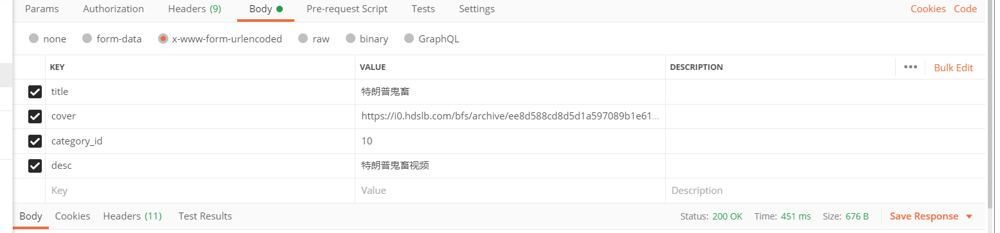

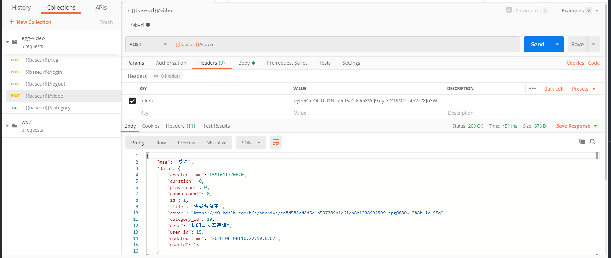

## 上传文件功能实现

安装

```js
npm install await-stream-ready
npm install stream-wormhole
npm install dayjs
```

配置：config/config.default.js

```js
config.multipart = {
    fileSize: '50mb',//上传50m以内
    mode: 'stream', //流形式上传
    fileExtensions: ['.xls', '.txt', '.jpg', '.JPG', '.png', '.PNG', '.gif', '.GIF', '.jpeg', '.JPEG'], // 扩展几种上传的文件格式
  };
```

控制器：app/controller/file.js

```js
'use strict';

const Controller = require('egg').Controller;
const fs = require('fs');
const path = require('path');
//故名思意 异步二进制 写入流
const awaitWriteStream = require('await-stream-ready').write;
//管道读入一个虫洞。
const sendToWormhole = require('stream-wormhole');
const dayjs = require('dayjs');

class FileController extends Controller {

    async upload() {
        const stream = await this.ctx.getFileStream();
        // 基础的目录
        const uploadBasePath = 'app/public/uploads';
        // 生成文件名
        const filename = `${Date.now()}${Number.parseInt(
            Math.random() * 1000,
        )}${path.extname(stream.filename).toLocaleLowerCase()}`;
        // 生成文件夹
        const dirname = dayjs(Date.now()).format('YYYY/MM/DD');
        function mkdirsSync(dirname) {
            if (fs.existsSync(dirname)) {
                return true;
            } else {
                if (mkdirsSync(path.dirname(dirname))) {
                    fs.mkdirSync(dirname);
                    return true;
                }
            }
        }
        mkdirsSync(path.join(uploadBasePath, dirname));
        // 生成写入路径
        const target = path.join(uploadBasePath, dirname, filename);
        // 写入流
        const writeStream = fs.createWriteStream(target);
        try {
            //异步把文件流 写入
            await awaitWriteStream(stream.pipe(writeStream));
        } catch (err) {
            //如果出现错误，关闭管道
            await sendToWormhole(stream);
            this.ctx.throw(500, err);
        }
        const { protocol, host } = this.ctx.request;
        let url = path.join('/public/uploads', dirname, filename).replace(/\\|\//g, '/');
        url = protocol + '://' + host + url
        this.ctx.apiSuccess({ url });
    }
}

module.exports = FileController;
```

路由：app/router.js

```js
// 上传文件
router.post('/upload', controller.file.upload);
```

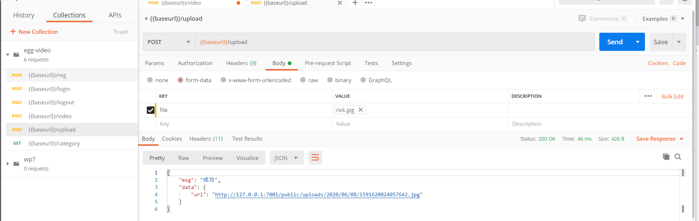

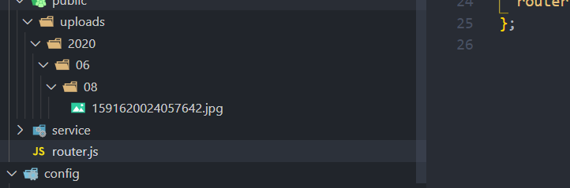

## 作品列表查询接口实现

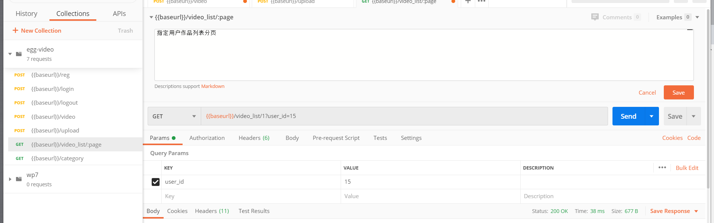

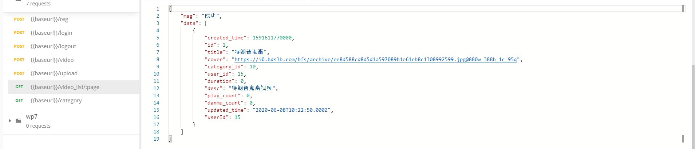

控制器：app/controller/video.js

```js
    // 当前用户的视频列表
    async index() {
        let { ctx, app } = this;
        let currentUser = ctx.authUser;
        ctx.validate({
            page: {
                required: true,
                desc: "页码",
                type: "int"
            },
            user_id: {
                required: true,
                desc: "用户id",
                type: "int"
            }
        });
        let user_id = ctx.query.user_id;
        let rows = await ctx.page(app.model.Video, {
            user_id
        });
        ctx.apiSuccess(rows);
    }
```

扩展：app/extend/context.js

```js
    // 分页
    async page(model, where, options = {}) {
        let page = this.params.page ? parseInt(this.params.page) : 1;
        let limit = this.query.limit ? parseInt(this.query.limit) : 10;
        let offset = (page - 1) * limit;

        if (!options.order) {
            options.order = [
                ['id', 'DESC']
            ];
        }

        return await model.findAll({
            where,
            offset,
            limit,
            ...options
        });
    }
```

路由：app/router.js

```js
router.get('/video_list/:page', controller.video.index);
```

## 更新作品

控制器：app/controller/video.js

```js
    // 更新作品
    async update() {
        let { ctx, app } = this;
        let currentUser = ctx.authUser;

        ctx.validate({
            id: {
                type: "int",
                required: true,
                desc: "视频ID"
            },
            ...rules
        });

        let {
            title,
            cover,
            category_id,
            desc,
        } = ctx.request.body;

        let video = await app.model.Video.findOne({
            where: {
                id: ctx.params.id,
                user_id: currentUser.id
            }
        });

        if (!video) {
            return ctx.throw(404, '该记录不存在');
        }

        let res = await video.update({
            title,
            cover,
            category_id,
            desc,
        });

        ctx.apiSuccess(res);
    }
```

路由：app/router.js

```js
// 更新视频
router.post('/video/:id', controller.video.update);
```

config.default.js

```js
config.auth = {
    match: [
      '/video',
```

postman调试

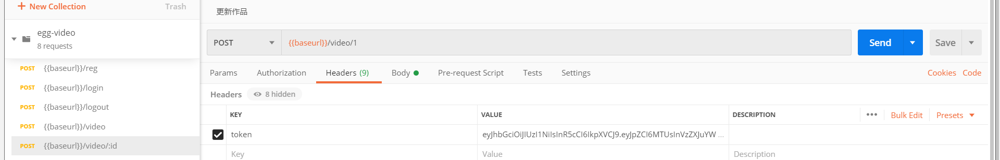

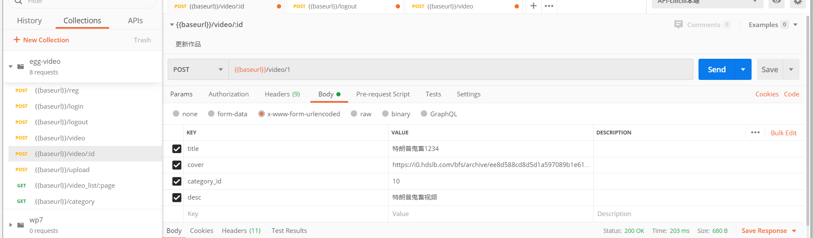

## 创建视频

点击添加新章节后进行视频创建

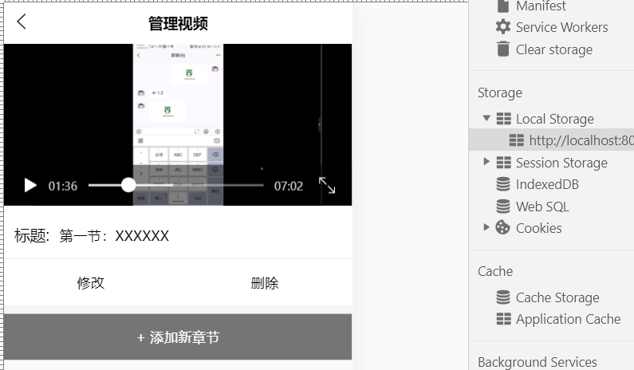

控制器：app/controller/video_detail.js

创建视频需要用到视频标题，地址，所属作品Id和描述，并且需要传入用户id

```js
let rules = {
  title: {
    type: 'string',
    required: true,
    desc: '视频标题'
  },
  url: {
    type: 'string',
    required: true,
    desc: '视频地址'
  },
  video_id: {
    type: 'int',
    required: true,
    desc: '所属作品ID'
  },
  desc: {
    type: 'string',
    required: true,
    desc: '描述'
  },
}
// 创建视频
async save() {
  let { ctx, app } = this;
  let currentUser = ctx.authUser;

  ctx.validate(rules);
	//从请求体里拿到
  let {
    title,
    url,
    video_id,
    desc,
  } = ctx.request.body;

  // 查找对应的视频
  let video = await app.model.Video.findOne({
    where: {
      id: video_id,
      user_id: currentUser.id
    }
  });
  //如果对应作品不存在，就抛出作品不存在
  if (!video) {
    ctx.throw(404, '所属作品不存在');
  }
	//向对应作品添加该视频章节
  let vd = await app.model.VideoDetail.create({
    title,
    url,
    video_id,
    desc,
  });

  ctx.apiSuccess(vd);
}
```

路由：app/router.js

```
router.post('/video_detail', controller.videoDetail.save);
```

## 上传视频-腾讯云点播签名

```
参考文档：
https://cloud.tencent.com/document/product/266/10638#node.js-.E7.AD.BE.E5.90.8D.E7.A4.BA.E4.BE.8B
npm install querystring --save
```

控制器：app/controller/vod.js

```js
var querystring = require("querystring");
var crypto = require('crypto');

    // 签名
    async sign() {
        // 确定 app 的云 API 密钥
        var { secret_id, secret_key } = this.app.config.tencentVod;

        // 确定签名的当前时间和失效时间
        var current = parseInt((new Date()).getTime() / 1000)
        var expired = current + 86400;  // 签名有效期：1天

        // 向参数列表填入参数
        var arg_list = {
            secretId: secret_id,
            currentTimeStamp: current,
            expireTime: expired,
            random: Math.round(Math.random() * Math.pow(2, 32)),
            oneTimeValid: 1,
            vodSubAppId: 1500000131,
        }

        // 计算签名
        var orignal = querystring.stringify(arg_list);
        var orignal_buffer = new Buffer(orignal, "utf8");

        var hmac = crypto.createHmac("sha1", secret_key);
        var hmac_buffer = hmac.update(orignal_buffer).digest();

        var signature = Buffer.concat([hmac_buffer, orignal_buffer]).toString("base64");

        this.ctx.apiSuccess(signature);
    }
```

配置：config/config.default.js

```js
// 腾讯云vod
  config.tencentVod = {
    secret_id: "AKIDZuynvmegm33xb7ws9AuNbYv161gX2SVM",
    secret_key: "jEXbYJnKdgW7UbS3oI2YonMddMpAF2FK"
  }
```

路由：app/router.js

```js
// vod签名
router.post('/vod/sign', controller.vod.sign);
```

中间件token验证config/config.js

```js
//哪些路由需要验证
config.auth = {
  // 不需要验证的
  //ignore: ['/reg', '/login']
  match: [
    '/vod/sign',
```

uni-app前端部分，使用前端上传而不是服务端上传方式：

```
参考文档：
小程序和app端：
https://cloud.tencent.com/document/product/266/18177
H5端：
https://cloud.tencent.com/document/product/266/9239
import VodUploader from '@/common/vod-wx-sdk-v2.js';

uni.chooseVideo({
    count: 1,
    sourceType: ['camera', 'album'],
    success: (res)=> {
        // 获取签名
        // #ifndef H5
        let getSignature = (callback) => {
            this.$H.post('/vod/sign',{
                token:true
            }).then(res=>{
                callback(res);
            })
        }
        // #endif
        // #ifdef H5
        let getSignature = (callback) => {
            return this.$H.post('/vod/sign',{
                token:true
            }).then(res=>{
                return res
            })
        }
        // #endif
        // 生成唯一名称
        let mediaName = this.genID(12)
        uni.showLoading({
            title: '上传中...',
            mask: false
        });
        // #ifdef H5
        const tcVod = new TcVod.default({
          getSignature: getSignature
        })
        const uploader = tcVod.upload({
          mediaFile: res.tempFile,
        })
        uploader.on('media_progress',(info)=> {
          console.log(info.percent) // 进度
        })
        uploader.done().then((doneResult)=>{
            // 上传后的视频链接
            console.log(doneResult.video.url);
            uni.hideLoading()
        }).catch((err)=>{
            uni.hideLoading()
            uni.showToast({
                title: '上传失败',
                icon: 'none'
            });
        })
        // #endif

        // #ifndef H5
        VodUploader.start({
            mediaFile: res, 
            getSignature: getSignature,
            mediaName: mediaName,
            success: (result)=>{
                console.log('success');
                console.log(result);
            },
            error:(result)=> {
                console.log(result);
                uni.showModal({
                    title: '上传失败',
                    content: JSON.stringify(result),
                    showCancel: false
                });
            },
            progress:(result)=> {
                console.log('progress');
                console.log(result);
            },
            finish: (result)=>{
                // 上传后视频链接
                console.log(result.videoUrl);
                uni.hideLoading()
            }
        });
        // #endif
    }
});
```

## 修改视频

控制器：app/controller/video_detail.js

```js
async update() {
  let { ctx, app } = this;
  //拿到当前user
  let currentUser = ctx.authUser;
	//权限验证
  ctx.validate({
    id: {
      type: "int",
      required: true,
      desc: "视频ID"
    },
    ...rules
  });

  let {
    title,
    url,
    video_id,
    desc,
  } = ctx.request.body;
	
  let { id } = ctx.params;

  // 验证所属作品是否存在
  let video = await app.model.Video.findOne({
    where: {
      id: video_id,
      user_id: currentUser.id
    }
  });
  //如果没有对应的作品
  if (!video) {
    ctx.throw(404, '所属作品不存在');
  }
  //向对应作品添加该视频章节
  let vd = await app.model.VideoDetail.findOne({
    where: {
      id,
      video_id
    }
  });

  if (!vd) {
    ctx.throw(404, '当前记录不存在');
  }

  let res = await vd.update({
    title,
    url,
    video_id,
    desc,
  });

  ctx.apiSuccess(res);
}
```

路由：app/router.js

```js
router.post('/video_detail/:id', controller.videoDetail.update);
```

## 删除视频

>步骤
>
>1. 拿到用户id
>2. 拿到需要删除的视频id,注意是post所以在body里获取
>3. 验证视频是否是对应的用户id。由于视频关联了所属作品，所以可以

控制器：app/controller/video_detail.js

```js
    // 删除
    async destroy() {
        let { ctx, app } = this;
        let currentUser = ctx.authUser;

        ctx.validate({
            id: {
                type: "int",
                required: true,
                desc: "视频ID"
            }
        });

        let { id } = ctx.request.body;

        let video = await app.model.VideoDetail.findOne({
            where: {
                id,
            },
            include: [{
                model: app.model.Video,
                where: {
                    user_id: currentUser.id
                }
            }]
        });

        if (!video) {
            return ctx.throw(404, '该记录不存在');
        }

        await video.destroy();

        ctx.apiSuccess('ok');
    }
```

路由：app/router.js **注意路由优先级**

```js
// 添加视频
router.post('/video_detail', controller.videoDetail.save);
// 删除视频 注意优先级
router.post('/video_detail/distory', controller.videoDetail.distory);
// 修改视频
router.post('/video_detail/:id', controller.videoDetail.update);
```

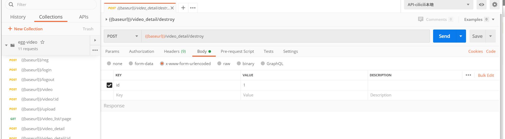

## 删除作品

控制器：app/controller/video.js

```js
    async destroy() {
        let { ctx, app } = this;
        let currentUser = ctx.authUser;

        ctx.validate({
            id: {
                type: "int",
                required: true,
                desc: "作品ID"
            }
        });

        let { id } = ctx.request.body;

        let video = await app.model.Video.findOne({
            where: {
                id,
                user_id: currentUser.id
            }
        });

        if (!video) {
            return ctx.throw(404, '该记录不存在');
        }

        await video.destroy();

        ctx.apiSuccess('ok');
    }
```

路由：app/router.js

```js
// 删除视频
router.post('/video/destroy', controller.video.destroy);
```

## 指定分类下的视频分页

>步骤
>
>1. 验证传入的参数：页数和分类id
>
>2. 获取get请求的category_id参数
>
>3. 使用extend/context里的page方法page(模型,查询的条件)
>
>   ```js
>   let rows = await ctx.page(app.model.Video, {
>       category_id
>   });
>   ```
>
>4. 返回获取的结果rows

点击分类里对应的分类会跳转到对应视频列表

控制器：app/controller/video.js

```js
//鬼畜分类 下的视频列表
async list() {
  let { ctx, app } = this;
  ctx.validate({
    category_id: {
      type: "int",
      required: true,
      desc: "分类ID"
    },
    page: {
      type: "int",
      required: true,
      desc: "分页"
    }
  });

  let { category_id } = ctx.params;

  let rows = await ctx.page(app.model.Video, {
    category_id
  });
  ctx.apiSuccess(rows);
}
```

路由：app/router.js

```js
router.get('/category/:category_id/video/:page', controller.video.list);
```

请求格式

```js
127.0.0.1:7001/category/1/video/2
```

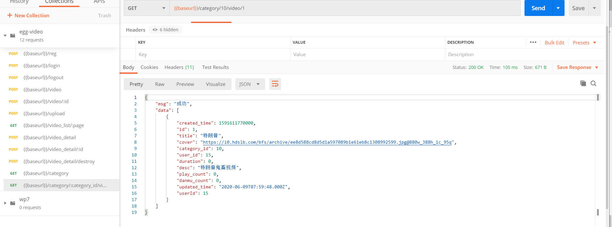

## 视频详情

[点击进入视频教程地址](https://study.163.com/provider/480000001892585/index.htm?share=2&shareId=480000001892585)

控制器：app/controller/video.js

```js
async read() {
  let { ctx, service, app } = this;
  let currentUser = ctx.authUser;

  ctx.validate({
    id: {
      type: "int",
      required: true,
      desc: "作品ID"
    },
  });

  let { id } = ctx.params;

  let video = await app.model.Video.findOne({
    where: {
      id
    },
    include: [{
      model: app.model.VideoDetail
    }, {
      model: app.model.User,
      attributes: ['id', 'username', 'nickname', 'avatar']
    }]
  });

  let hot = await this.hot()

  // 是否已收藏
  let fava = false
  // 是否关注
  let follow = false
  if (currentUser) {
    fava = !!(await app.model.Fava.findOne({
      where: {
        video_id: video.id,
        user_id: currentUser.id
      }
    }))

    follow = await service.user.isFollow(currentUser.id, video.user_id);
  }

  ctx.apiSuccess({
    video,
    hot,
    fava,
    follow
  });
}

// 热门视频
async hot() {
  let { ctx, app } = this;

  let rows = await app.model.Video.findAll({
    order: [
      ['id', 'DESC'],
      ['play_count', 'DESC']
    ],
    limit: 5
  });

  return rows
}
```

服务：app/service/user.js

```js
// 当前用户是否关注某用户
async isFollow(user_id, follow_id) {
  return !!(await this.app.model.Follow.findOne({
    where: {
      user_id,
      follow_id
    }
  }));
}
```

中间件：app/middleware/getuser.js

```js
module.exports = (option, app) => {
    return async (ctx, next) => {
        //1. 获取 header 头token
        let token = ctx.header.token || ctx.query.token;
        if (token) {
            let user = {};
            try {
                user = app.jwt.verify(token, app.config.jwt.secret)
            } catch (error) {
                console.log(error)
            }
            //3. 判断当前用户是否登录
            if (user && user.id) {
                let t = await ctx.service.cache.get('user_' + user.id);
                if (t && t === token) {
                    user = await app.model.User.findByPk(user.id);
                    ctx.authUser = user;
                }
            }
        }
        await next();
    }
}
```

配置：config/config.default.js

```js
config.middleware = [
    // ...
    'getuser'
    // ...
];
```

路由：app/router.js

```js
// 查看视频详情
router.get('/video_read/:id', controller.video.read);
```

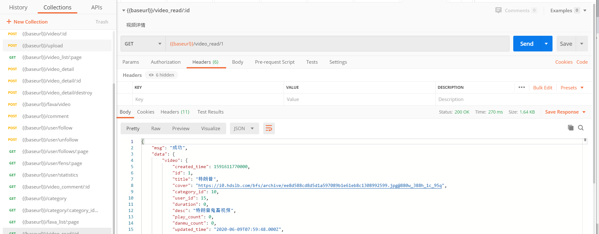

## 搜索功能

