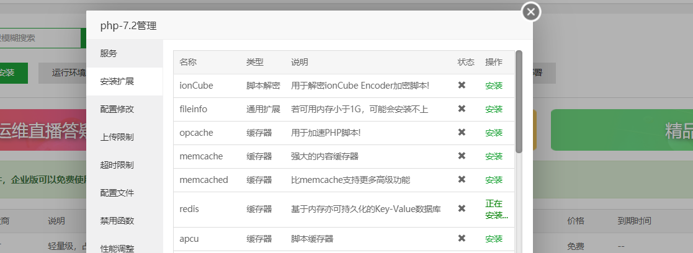

## 安装创建elementui

```js
vue create vue-el-admin
vue add element
全局安装Fully import
csss	yes
```

vue.config.js

```js
module.exports={
    lintOnSave:false
}
```


## 配置高效代码块

## BootStrap4使用

https://v4.bootcss.com/docs/utilities/borders/

- 部分element-ui库性能较慢

引入bootstrap库并使用

```html
//public/index.html
<link rel="stylesheet" href="https://cdn.jsdelivr.net/npm/bootstrap@4.5.0/dist/css/bootstrap.min.css" integrity="sha384-9aIt2nRpC12Uk9gS9baDl411NQApFmC26EwAOH8WgZl5MYYxFfc+NcPb1dKGj7Sk" crossorigin="anonymous">

```

```html
<div class="card mt-5 bg-danger">
    <div class="card-header"></div>
    <div class="card-body"></div>
    <div class="card-footer"></div>
</div>
```

## 路由封装

### 路由重定向和错误路由配置

```js
 const routes = [{
		path: '/',
		name: 'layout',
		component: () => import('../../views/layout.vue'),
		redirect:'/index',
		children: [{
			path: 'index',
			name: 'index',
			component: () => import('../../views/index/index.vue')
		}]
	},
	{
		path: '/login',
		name: 'login',
		component: () => import('../../views/login/index.vue')
	},
	{
		path:'*',
		redirect:{name:'index'}
	}
]

export default routes;
```

### 封装路由函数

- 自动生成path
- 自动生成name
- 自动生成路由

```js
let routes = [
	{
		path:'/',
		name:'layout',
		redirect:{name:'index'},
		component:()=>import('../../views/layout.vue'),
		children:[
			{
				path:'/a',
				name:'a',
				component:()=>import('../../views/a/index.vue')
			},
            {
				path:'/shop/goods/list',
				name:'shop_goods_list',
                meta:{title:'商品列表'}
				component:()=>import('../../views/shop/goods/list.vue')
			},
		]
	}
]
```

```js
let routes = [
	{
		path:'/',
		name:'layout',
		redirect:{name:'index'},
		component:'layout'
		children:[
			{
				path:'/xx',   
				name:'xx',   
				component:'xx/index'
			},
            {
				path:'/shop/goods/list',
				name:'shop_goods_list',
                meta:{title:'商品列表'}
				component:'shop/goods/list'
			},
		]
	}
]
```

```js
/**
 * 规则：
 * 一、例如：index/index，shop/index以index结尾的，path和name默认去除index。
 * 二、例如：shop/list，默认生成name为shop_list（如果结尾为index，例如shop/index则是shop）
 * 三、填写后不会自动生成
 * **/
let routes = [
	{
		path:'/',
		name:'layout',
		redirect:{name:'index'},
		//component:()=>import('../../views/layout.vue'),
		component:'layout',
		children:[
			{
				// path:'/index',
				// name:'index',
				//component:()=>import('../../views/index/index.vue')
				component:'index/index'
			},
			{
				// name:'shop_goods_list'
				// path:'/shop/goods/list',
				component:'shop/goods/list'
			}
		]
	},
	{
		// path:'/login',
		// name:'login',
		// component:()=>import('../../views/login/index.vue')
		component:'login/index'
	},
	{
		path:'*',
		redirect:{name:'index'},
	}
]

// 获取路由信息方法
let getRoutes = function(){
	// 自动生成路由
	createRoute(routes)
	return routes
}

// 自动生成路由
function createRoute(arr){
	for (let i = 0; i < arr.length; i++) {
        //如果没有component属性就返回
		if (!arr[i].component) return
		// 去除index
		let val = getValue(arr[i].component)
		// 生成name
		arr[i].name = arr[i].name || val.replace(/\//g,'_')
		// 生成path
		arr[i].path = arr[i].path || `/${val}`
		// 自动生成component
        
		arr[i].component = ()=>import(`../../views/${arr[i].component}.vue`);
        //如果此项有children并且
		if (arr[i].children && arr[i].children.length > 0) {
			createRoute(arr[i].children)
		}
	}
}

// 去除index.vue结尾的index
function getValue(str) {
	// str = login/index
	// 获取最后一个/的索引   
	let index = str.lastIndexOf('/')
	// 获取最后一个/后面的值
	let val = str.substring(index+1,str.length)
	// 判断是不是index结尾
	if (val === 'index') {
		return str.substring(index,-1)
	}
	return str
}

export default getRoutes()
```

### 路由封装完整版代码

```js
/**
 * 规则：
 * 一、例如：index/index，shop/index以index结尾的，path和name默认去除index
 * 二、例如：shop/list，默认生成name为shop_list（如果结尾为index，例如shop/index则是shop）
 * 三、填写后不会自动生成
 * **/
let routes = [
	{
		path:'/',
		name:'layout',
		redirect:{name:'index'},
		//component:()=>import('../../views/layout.vue'),
		component:'layout',
		children:[
			{
				// path:'/index',
				// name:'index',
				//component:()=>import('../../views/index/index.vue')
				meta:{title:'后台首页'},
				component:'index/index'
			},
			{
				// name:'shop_goods_list'
				// path:'/shop/goods/list',
				meta:{title:'商品列表'},
				component:'shop/goods/list'
			}
		]
	},
	{
		// path:'/login',
		// name:'login',
		// component:()=>import('../../views/login/index.vue')
		meta:{title:'登录页'},
		component:'login/index'
	},
	{
		path:'*',
		redirect:{name:'index'},
	}
]

// 获取路由信息方法
let getRoutes = function(){
	// 自动生成路由
	createRoute(routes)
	return routes
}

// 自动生成路由
function createRoute(arr){
	for (let i = 0; i < arr.length; i++) {
		if (!arr[i].component) return
		// 去除index
		let val = getValue(arr[i].component)
		// 生成name
		arr[i].name = arr[i].name || val.replace(/\//g,'_')
		// 生成path
		arr[i].path = arr[i].path || `/${val}`
		// 自动生成component
		let componentFun = import(`../../views/${arr[i].component}.vue`)
		arr[i].component = ()=>componentFun
		if (arr[i].children && arr[i].children.length > 0) {
			createRoute(arr[i].children)
		}
	}
}

// 去除index
function getValue(str) {
	// str = login/index
	// 获取最后一个/的索引
	let index = str.lastIndexOf('/')
	// 获取最后一个/后面的值
	let val = str.substring(index+1,str.length)
	// 判断是不是index结尾
	if (val === 'index') {
		return str.substring(index,-1)
	}
	return str
}

export default getRoutes()
```

## 404页面

```js
error/404.vue
```

## vuex引入和分模块

```js
// src/store/index.js
import Vue from "vue"
import Vuex from "vuex"

import goods_create from "./modules/goods_create.js"

Vue.use(Vuex)

export default new Vuex.Store({
	modules:{
		goods_create
	}
})
```

```js
//	src/store/modules/goods_create.js
export default {
	state:{
		ceshi:123
	},
	getters:{
		
	},
	mutations:{
		
	},
	actions:{
		
	}
}
```

```js
import {mapState} from "vuex"
computed: {
    ...mapState({
        ceshi:state=>state.goods_create.ceshi
    }),
},
```

## 依赖注入实现全局弹出层

```html
<template>
  <div id="app">
    
	<router-view></router-view>
	
	<el-dialog title="标题" :visible.sync="imageModel">
		
		<div slot="footer" class="dialog-footer">
			<el-button @click="hide">取 消</el-button>
			<el-button type="primary" @click="confirm">确 定</el-button>
		</div>
	</el-dialog>
	
	
  </div>
</template>

<script>
export default {
  name: 'app',
  // 依赖注入
  provide(){
	return {
		app:this
	}  
  },
  components: {
    
  },
  data() {
  	return {
  		imageModel:false
  	}
  },
  methods: {
	// 打开弹出层
	show(){
		this.imageModel = true
	},
	// 确定
	confirm(){
		// 选中的图片url
		// 隐藏
		this.hide()
	},
	hide(){
		this.imageModel = false
	}``
  },
}
</script>

<style>
::-webkit-scrollbar-track
{
  background: rgba(0,0,0,.1);
  border-radius: 0;
}

::-webkit-scrollbar
{
  -webkit-appearance: none;
  width: 10px;
  height: 10px;
}

::-webkit-scrollbar-thumb
{
    cursor: pointer;
    border-radius: 5px;
    background: rgba(0,0,0,.25);
    transition: color .2s ease;
}
</style>

```

```html
<template>

    <span class="btn btn-light border mr-2" 
          v-else @click="chooseImage">
    </span>

</template>

<script>
    export default {
        inject:['app'],

        methods: {

            chooseImage(){
                this.app.show()
            }
        },
    }
</script>

<style>
</style>

```

## axios安装和跨域配置

https://cli.vuejs.org/zh/config/#devserver-proxy

```js
vue add axios
```

```js
module.exports = {
    lintOnSave: false,
    devServer: {
        host: "localhost",
        port: 8080, // 端口号
        https: false, // https:{type:Boolean}
        open: true, //配置自动启动浏览器
        proxy: {
            '/admin': { //代理api
                target: 'http://ceshi3.dishait.cn/admin',//服务器api地址
                ws: true,// proxy websockets
                changeOrigin: true,//是否跨域
                pathRewrite: { //重写路径
                    '^/admin': ''
                }
            }
        }
    }
}

```

```js
this.axios.post('/admin/login',this.form).then(res=>{
    console.log(res);
}).catch(err=>{
    console.log(err);
})
```

## 全局响应错误拦截器

```js
import './plugins/axios'
import {Message} from 'element-ui'

// 添加响应拦截器
axios.interceptors.response.use((response) => {
	// 对响应数据做点什么
	return response;
}, (err) => {
	// 全局错误提示
	if (err.response && err.response.data && err.response.data.errorCode) {
		Message.error(err.response.data.msg)
	}
	// 对响应错误做点什么
	return Promise.reject(err);
});
```

## 全局请求拦截器token添加

```js
// 添加请求拦截器
axios.interceptors.request.use((config)=>{
    // 添加header头的token
    let token = window.sessionStorage.getItem('token')
    if(config.token === true){
        config.headers['token'] = token
    }
    // 在发送请求之前做些什么
    return config;
}, (error)=> {
    // 对请求错误做些什么
    return Promise.reject(error);
});
```

请求拦截使用方法

```js
this.axios.post('xxx',{},{token:true}).then(res=>{....})
```

## 全局路由守卫-登录验证

- to:去
- from:从
- next:进行下一个钩子

步骤：

1. 获取token

2. 如果token有值

   1. to为login,要防止重复登录，执行下个钩子，如果跳转到的地址为错误地址，默认跳回index页。
   2. 如果to不是login,就执行Next

3. 如果token没有值

   1. 当前是在登录页，执行下个钩子
   2. 当前在非登录页，提示登录，跳转到登录页

   

```js
// router.js
// 全局前置守卫
router.beforeEach((to, from, next) => {
	// 获取token
	let token = window.sessionStorage.getItem('token')
	
	if(token){ // 已登录
		// 防止重复登录
		if(to.path === '/login'){
			Vue.prototype.$message.error('请不要重复登录');
			return next({name:from.name ? from.name : 'index'})
		}
		// 其他验证...
		
		next();
	} else {
		// 跳过登录页验证
		if(to.path === '/login'){
			return next();
		}
		// 未登录
		Vue.prototype.$message.error('请先登录');
		next({ path:'/login' })
	}
})
```

## 全局loading

使用：

```js
logout(){
    this.axios.post('/admin/logout',{},{
        token:true,
        loading:true
    })
}
```

配置：

```js
let loading = null
let requestCount = 0
// 显示loading
function showLoading(){
    if(requestCount === 0){
        loading = Message({
            message: '加载中...',
            duration:0
        });
    }
    requestCount++
}
// 隐藏loading
function hideLoading(){
    if(requestCount > 0){
        requestCount--
    }
    if(loading && requestCount === 0){
        loading.close()
    }
}

// 添加请求拦截器
axios.interceptors.request.use((config)=>{
    // 添加header头的token
    let token = window.sessionStorage.getItem('token')
    if(config.token === true){
        config.headers['token'] = token
    }
    // 显示loading
    if(config.loading === true){
        showLoading()
    }
    // 在发送请求之前做些什么
    return config;
}, (error)=> {
    // 隐藏loading
    hideLoading()
    // 对请求错误做些什么
    return Promise.reject(error);
});

// 添加响应拦截器
axios.interceptors.response.use((response)=>{
    console.log('响应拦截器 成功');
    // 隐藏loading
    hideLoading()
    // 对响应数据做点什么
    return response;
},(err)=> {
    // 全局错误提示
    if(err.response && err.response.data && err.response.data.errorCode){
        Message.error(err.response.data.msg)
    }
    // 隐藏loading
    hideLoading()
    // 对响应错误做点什么
    return Promise.reject(err);
});
```

## 依赖注入实现公共请求加载动画

```vue
<el-main class="bg-light" style="padding-bottom: 60px;position: relative;" v-loading="loading">
</el-main>

<script>
    export default {
        provide(){
            return {
                layout:this
            }
        },
        data() {
            return {
                bran: [],
                loading: false
            }
        },

    }
</script>
```

```vue
//子代组件
inject:['layout'],

this.layout.loading = true
//axios...
this.layout.loading = false

```


## 根据权限生成菜单

- 登录后返回的菜单存在tree字段。

vuex生成menu模块，state参考config里的navbar。

### 菜单对象模型

```js
/**
		 {
			 "id": 5,
			 "rule_id": 0,
			 "status": 1,
			 "create_time": "2020-08-11 13:36:09",
			 "update_time": "2020-08-11 13:36:09",
			 "name": "首页",
			 "desc": "index",
			 "condition": null,
			 "menu": 1,
			 "order": 21,
			 "icon": null,
			 "method": "GET",
			 "pivot": {
				 "id": 43,
				 "role_id": 3,
				 "rule_id": 5
			 },
			 "child": [
				 {
					 "id": 10,
					 "rule_id": 5,
					 "status": 1,
					 "create_time": "2020-08-11 13:37:02",
					 "update_time": "2020-08-11 13:37:02",
					 "name": "后台首页",
					 "desc": "index",
					 "condition": null,
					 "menu": 1,
					 "order": 20,
					 "icon": "el-icon-s-home",
					 "method": "GET",
					 "pivot": {
						 "id": 46,
						 "role_id": 3,
						 "rule_id": 10
					 },
					 "child": []
				 },
				 {
					 "id": 12,
					 "rule_id": 5,
					 "status": 1,
					 "create_time": "2020-12-28 13:39:36",
					 "update_time": "2020-12-28 13:39:36",
					 "name": "商品列表",
					 "desc": "shop_goods_list",
					 "condition": null,
					 "menu": 1,
					 "order": 20,
					 "icon": "el-icon-s-claim",
					 "method": "GET",
					 "pivot": {
						 "id": 47,
						 "role_id": 3,
						 "rule_id": 12
					 },
					 "child": []
				 }
			 ]
		 } 
		 * **/
```

### vuex配置

- 登录时获取到菜单信息

- 需要把菜单存到vuex，并且存入storage里。

```js
export default {
    state:{
        navBar: {
            active: '0',
            list: []
        }
    },
    mutations:{
        // 创建菜单
        createNavBar(state,menus){
            let list = menus.map(item=>{
                let submenu = item.child.map(v=>{
                    return {
                        icon:v.icon,
                        name:v.name,
                        pathname:v.desc
                    }
                })
                return {
                    name: item.name,
                    subActive: '0',
                    submenu:submenu
                }
            })
            state.navBar.list = list;
            //存储到本地存储里
            window.sessionStorage.setItem('navBar',JSON.stringify(state.navBar))
        }
    },
    actions:{

    }
}
```

### 登录配置

```js
submit() {
    this.$refs.ruleForm.validate((e)=>{
        if (!e) return;
        // 提交表单
        this.loading = true
        this.axios.post('/admin/login',this.form).then(res=>{
            // 存储到vuex
            // 存储到本地存储
            this.$store.commit('login',res.data.data)
            // 生成后台菜单
            this.$store.commit('createNavBar',res.data.data.tree)
            // 成功提示
            this.$message('登录成功')
            this.loading = false
            // 跳转后台首页
            this.$router.push({name:'index'})
        }).catch(err=>{
            this.loading = false
        })
    })
}
```

### layout配置

```js
data() {
    return {
        bran:[]
    }
},
```

```js
created() {
    // 获取面包屑导航
    this.getRouterBran()
    // 初始化选中菜单
    this.__initNavBar()
},
```

```js
{
    computed: {
        ...mapState({
            user:state=>state.user.user,
            navBar:state=>state.menu.navBar
        }),
        slideMenuActive:{
            get(){
                let item = this.navBar.list[this.navBar.active]
                return item ? item.subActive : '0'
            },
            set(val){
                let item = this.navBar.list[this.navBar.active]
                if(item){
                    item.subActive = val
                }
            }
        },
        slideMenus() {
            let item = this.navBar.list[this.navBar.active]
            return item ? item.submenu : []
        }
    },
}
```

### 初始化

```js
initNavBar(state){
    let navBar = window.sessionStorage.getItem('navBar')
    navBar = navBar ? JSON.parse(navBar) : {
        active: '0',
        list: []
    }
    state.navBar = navBar
}
```


```js
this.$store.commit('initNavBar')
```

## 验证页面权限

- 存储权限规则

  ```js
  getters:{
      // 首页
      adminIndex(state){
          if(state.navBar.list.length === 0){
              return 'error_404'
          }
          let item = state.navBar.list[0].submenu[0]
          if(item){
              return item.pathname
          }
      }
  },
  ```

  

  ```json
  //login/index.vue
  let ms = []
  import { mapGetters } from 'vuex'
  export default {
      data() {
          return {
              loading:false,
              form:{
                  username:"",
                  password:""
              },
  
          }
      },
      computed: {
          ...mapGetters([
              'adminIndex'
          ])
      },
      methods: {
          submit() {
              this.$refs.ruleForm.validate((e)=>{
                  if (!e) return;
                  // 提交表单
                  this.loading = true
                  this.axios.post('/admin/login',this.form).then(res=>{
                      // 存储到vuex
                      // 存储到本地存储
                      // 存储权限规则
                      // 生成后台菜单
                      // 成功提示
  
                      // 跳转后台首页
                      this.$router.push({name:this.adminIndex})
                  }).catch(err=>{
                      this.loading = false
                  })
              })
          }
      },
  ```

- 验证

  - rule.id必须大于0并且desc要和to的name相等

  - 如果此页面是不允许该用户跳转的。  

    ```js
    router.beforeEach((to, from, next) => {
        // 获取token
        let token = window.sessionStorage.getItem('token')
    
        if(token){ // 已登录
            // 防止重复登录
    
            // 其他验证...
            if(to.name !== 'error_404'){
                let rules = window.sessionStorage.getItem('rules')
                rules = rules ? JSON.parse(rules) : []
    
                let index = rules.findIndex(item=>{
                    return item.rule_id > 0 && item.desc === to.name
                })
                
                if(index === -1){
                    Vue.prototype.$message.error('没有权限访问此网页')
                    return next({name:from.name ? from.name : 'error_404'})
                }
            }
            next();
        } else {
            // 跳过登录页验证
    
            // 未登录
    
        }
    })
    ```

## 自定义指令实现权限验证

- api接口登录之后会有权限名字，根据名称就知道这个按钮的权限是什么。如果你没有相应的权限，就不会显示这个按钮

- 比如当前管理员有如下的12个权限，那么我们使用自定义指令把相应的功能名称传入验证，如果不在这12个权限内，就不会显示。

  

- 逻辑

  >- 获取到本地存储的user
  >  - 如果user是有super属性，说明是超级管理员，所有按钮都允许点击
  >  - 否则获取到user的ruleNames,find一下ruleNames里是否有传入的binding的value
  >  - 如果没有，就把绑定自定义属性的节点移除

```html
<el-button type="primary" size="mini"	v-auth="'添加角色'">添加角色</el-button>
```

```js
//bind：只调用一次，指令第一次绑定到元素时调用。在这里可以进行一次性的初始化设置。
//inserted：被绑定元素插入父节点时调用 (仅保证父节点存在，但不一定已被插入文档中)。
Vue.directive('auth',{
    inserted(el,binding,vnode,oldVnode){
        let user = window.sessionStorage.getItem('user')
        user = user ? JSON.parse(user) : {}
        if(!user.super){
            let rules = user.ruleNames ? user.ruleNames : []

            let v = rules.find(item=> item === binding.value)
            if(!v){
                el.parentNode.removeChild(el)
            }
        }
    }
})
```


## 后端部署

http://cilishop.cmsapi.cchenzw.top/

- 域名配置：解析并添加域名
  - 宝塔-网站-添加站点
    - 域名
    - mysql
    - utf8 mb4 存储表情包
    - php7.2
    - 提交

部署

- 解压

- 绑定域名到Public目录

  - 

- 修改数据库信息，导入数据库

  - 

    

- 设置伪静态

  - 

- 修改config/cms.php

- 安装redis和redis扩展

  

- 开启任务队列

  - php禁用函数里删除singal

    

    

  - 阿里云终端进入后端api目录

    - php think queue:work