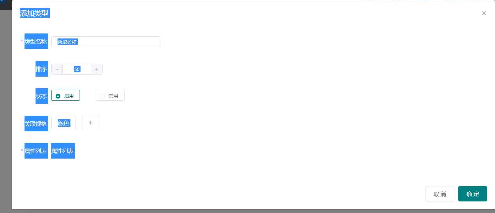

# 商品类型

## 基本布局

```html
<template>
    <div class="bg-white px-3" style="margin: -20px;margin-top: -1rem;margin-bottom: 0!important;">
        <button-search class="pt-3" :showSearch="false">
            <!-- 左边 -->
            <template #left>
                <el-button size="mini" type="success" @click="openModel(false)">添加规格</el-button>
                <el-button size="mini" type="danger" @click="deleteAll()">批量删除</el-button>
            </template>
        </button-search>


        <el-table border class="mt-3"
                  :data="tableData"
                  style="width: 100%"
                  @selection-change="handleSelectionChange">
            <el-table-column
                             type="selection"
                             width="45"
                             align="center">
            </el-table-column>

            <el-table-column
                             label="类型名称"
                             prop="name">
            </el-table-column>
            <el-table-column
                             prop="value" 
                             align="center"
                             width="380"
                             label="属性标签">
            </el-table-column>
            <el-table-column
                             align="center"
                             prop="order"
                             label="排序">
            </el-table-column>
            <el-table-column
                             prop="status"
                             align="center"
                             label="状态">
                <template slot-scope="scope">
                    <el-button
                               :type="scope.row.status ? 'success' : 'danger'" 
                               size="mini"
                               @click="changeStatus(scope.row)"
                               plain>{{scope.row.status ? '启用' : '禁用'}}
                    </el-button>
                </template>
            </el-table-column>
            <el-table-column
                             align="center"
                             label="操作"
                             width="150">
                <template slot-scope="scope">
                    <el-button-group>
                        <el-button type="primary" size="mini" 
                                   plain @click="openModel(scope)">修改</el-button>
                        <el-button type="danger" size="mini" 
                                   plain @click="deleteItem(scope)"
                                   >删除</el-button>
                    </el-button-group>
                </template>
            </el-table-column>
        </el-table>
        <div style="height: 60px;"></div>
        <el-footer class="border-top d-flex align-items-center px-0 position-fixed bg-white" style="bottom: 0;left: 200px;right: 0;z-index: 100;">
            <div style="flex: 1;" class="px-2">
                <el-pagination
                               :current-page="currentPage"
                               :page-sizes="[100, 200, 300, 400]"
                               :page-size="100"
                               layout="total, sizes, prev, pager, next, jumper"
                               :total="400">
                </el-pagination>
            </div>
        </el-footer>
        <!-- 新增/修改模态框 -->
        <el-dialog title="添加规格" :visible.sync="createModel" top="5vh">
            <!-- 表单内容 -->
            <el-form :rules="rules" ref="form" :model="form" label-width="80px">
                <el-form-item label="规格名称" prop="name">
                    <el-input v-model="form.name" placeholder="规格名称" size="mini" style="width: 25%;"></el-input>
                </el-form-item>
                <el-form-item label="排序">
                    <el-input-number size="mini" v-model="form.order" :min="0"></el-input-number>
                </el-form-item>
                <el-form-item label="状态">
                    <el-radio-group v-model="form.status" size="mini">
                        <el-radio :label="1" v border>启用</el-radio>
                        <el-radio :label="0" border>禁用</el-radio>
                    </el-radio-group>
                </el-form-item>
                <el-form-item label="类型">
                    <el-radio-group v-model="form.type" size="mini">
                        <el-radio :label="0" v border>文字</el-radio>
                        <el-radio :label="1" border>颜色</el-radio>
                        <el-radio :label="2" border>图片</el-radio>
                    </el-radio-group>
                </el-form-item>
                <el-form-item label="规格值" prop="value">
                    <el-input
                              type="textarea"
                              :rows="3"
                              placeholder="一行为一个规格项，多个规格项用换行输入"
                              v-model="form.value">
                    </el-input>
                </el-form-item>
            </el-form>


            <div slot="footer" class="dialog-footer">
                <el-button @click="createModel = false">取 消</el-button>
                <el-button type="primary" @click="submit">确 定</el-button>
            </div>
        </el-dialog>


    </div>
</template>

<script>
    import buttonSearch from "@/components/common/button-search.vue"
    export default {
        components: {
            buttonSearch
        },
        data() {
            return {
                tableData: [{
                    id:1,
                    name:"鞋子",
                    order:50,
                    status:1,
                    sku_list:[
                        { id:1,name:"颜色" },
                        { id:2,name:"尺寸" }
                    ],
                    value_list:[{
                        order:50,
                        name:"特性",
                        type:'input',		
                        value:""
                    }]
                }],
                currentPage:1,
                multipleSelection: [],
                createModel:false,
                editIndex:-1,

                form:{
                    name:"",
                    order:50,
                    status:1,
                    type:0,
                    value:""
                },
                rules:{
                    name:[{ 
                        required:true,
                        message:"规格名称不能为空",
                        trigger:'blur' ,
                    }],
                    value:[{
                        required:true,
                        message:"规格值不能为空",
                        trigger:'blur' ,
                    }],
                }
            }
        },
        created() {

        },
        methods: {
            // 批量删除
            deleteAll(){
                this.$confirm('是否要删除选中规格?', '提示', {
                    confirmButtonText: '删除',
                    cancelButtonText: '取消',
                    type: 'warning'
                }).then(() => {
                    this.multipleSelection.forEach(item=>{
                        let index = this.tableData.findIndex(v=>v.id === item.id)
                        if (index !== -1) {
                            this.tableData.splice(index,1)
                        }
                    })
                    this.multipleSelection = []
                    this.$message({
                        message: '删除成功',
                        type: 'success'
                    });
                })
            },
            // 打开模态框
            openModel(e = false){
                // 增加
                if (!e) {
                    // 初始化表单
                    this.form = {
                        name:"",
                        order:50,
                        status:1,
                        type:0,
                        value:""
                    }
                    this.editIndex = -1
                } else {
                    // 修改
                    this.form = {
                        name:e.row.name,
                        order:e.row.order,
                        status:e.row.status,
                        type:e.row.type,
                        value:e.row.value.replace(/,/g,'\n')
                    }
                    this.editIndex = e.$index
                }
                // 打开dialog
                this.createModel = true
            },
            // 添加规格
            submit(){
                this.$refs.form.validate(res=>{
                    if (res) {
                        var msg = "添加"
                        this.form.value = this.form.value.replace(/\n/g,',')
                        console.log(this.form.value);
                        if (this.editIndex === -1) {
                            this.tableData.unshift(this.form)
                        } else {
                            let item = this.tableData[this.editIndex]
                            item.name = this.form.name
                            item.value = this.form.value
                            item.status = this.form.status
                            item.type = this.form.type
                            item.order = this.form.order
                            msg = "修改"
                        }
                        // 关闭模态框
                        this.createModel = false
                        this.$message({
                            message: msg + '成功',
                            type: 'success'
                        });
                    }
                })
            },
            // 修改状态
            changeStatus(item){
                // 请求服务端修改状态
                item.status = !item.status
                this.$message({
                    message: item.status ? '启用' : '禁用',
                    type: 'success'
                });
            },
            // 选中
            handleSelectionChange(val) {
                this.multipleSelection = val;
            },
            // 删除单个
            deleteItem(scope){
                this.$confirm('是否要删除该规格?', '提示', {
                    confirmButtonText: '删除',
                    cancelButtonText: '取消',
                    type: 'warning'
                }).then(() => {
                    this.tableData.splice(scope.$index,1)
                    this.$message({
                        message: '删除成功',
                        type: 'success'
                    });
                })
            }
        },
    }
</script>

<style>
</style>

```

## 增加弹框



## 添加类型表单

```html
/src/views/shop/type/list.vue
```

## 属性列表完善

## 自定义验证规则

```js
submit(){
    this.$refs.form.validate(res=>{
        // 验证属性列表
        var result = true
        var message = []
        this.value_list.forEach((item,index)=>{
            let no = index + 1
            if (item.order == '') {
                result = result && false
                message.push('第'+no+'行：排序不能为空')
            }
            if (item.name == '') {
                result = result && false
                message.push('第'+no+'行：属性名称不能为空')
            }
            if (item.type !== 'input' && item.value == '') {
                result = result && false
                message.push('第'+no+'行：属性值不能为空')
            }
        })
        if (!result) {
            var temp ='';
            message.forEach(v=>{
                temp += `<li>${v}</li>`;
            })
            return this.$notify({
                title: '属性列表提示',
                dangerouslyUseHTMLString: true,
                type: 'warning',
                duration:3000,
                message: `<ul>${temp}</ul>`
            });
        }
        if (res) {
            var msg = "添加"
            if (this.editIndex === -1) {
                this.tableData.unshift({
                    ...this.form,
                    value_list:[...this.value_list]
                })
            } else {
                let item = this.tableData[this.editIndex]
                item.name = this.form.name
                item.sku_list = this.form.sku_list
                item.status = this.form.status
                item.type = this.form.type
                item.order = this.form.order
                item.value_list = this.value_list
                msg = "修改"
            }
            // 关闭模态框
            this.createModel = false
            this.$message({
                message: msg + '成功',
                type: 'success'
            });
        }
    })
},
```

