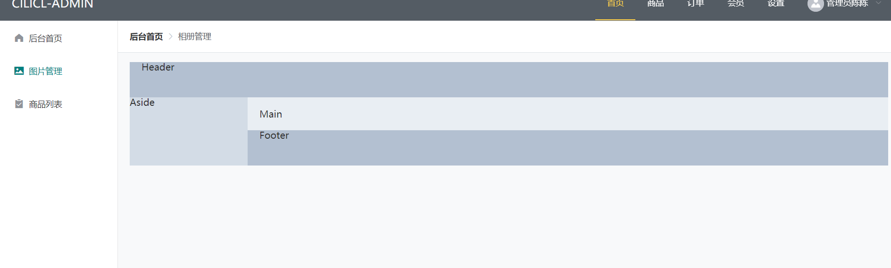
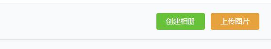
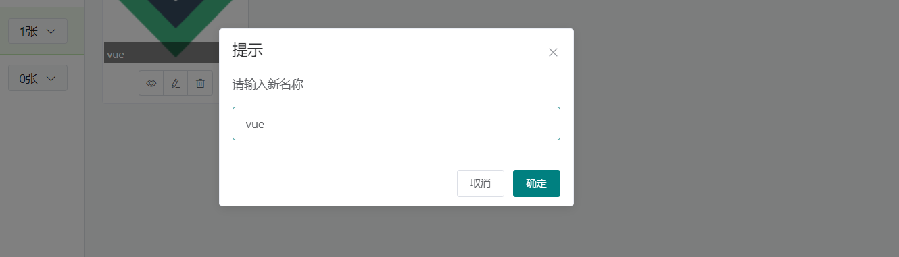

# 相册管理

## 路由配置

```js
let routes = [
    {
        path:'/',
        name:'layout',
        redirect:{name:'index'},
        component:'layout',
        children:[
            {
                meta:{title:'后台首页'},
                component:'index/index'
            },
            {
                meta:{title:'商品列表'},
                component:'shop/goods/list'
            },
            {
                meta:{title:'相册管理'},
                component:'image/index'
            }
        ]
    },
]
```

```js
{
    icon: "el-icon-picture",
    name: "图片管理",
    pathname: "image"
},
```

## 页面整体布局

- 需要在layout给容器添加相对定位



```html
<el-container style="position: absolute;top: 55px;bottom: 0;left: 0;right: 0;">
    <el-header>Header</el-header>
    <el-container>
        <el-aside width="200px" style="position: absolute;top: 60px;left: 0;bottom: 60px;">
            <div style="height: 1000px;"></div>
        </el-aside>
        <el-container>
            <el-main style="position: absolute;top: 60px;left:200px;bottom: 60px;right: 0;">
                <div style="height: 1000px;"></div>
            </el-main>
        </el-container>
    </el-container>
    <el-footer>Footer</el-footer>
</el-container>
```

```sty
.el-header,
.el-footer {
	background-color: #b3c0d1;
	color: #333;

}

.el-aside {
	background-color: #d3dce6;
	color: #333;

}

.el-main {
	background-color: #e9eef3;
	color: #333;

}
```

## 数据获取

```js
data:{
    albumPage:1,
    albums:[],
}
```

```js
computed:{
    albumModelTitle() {
        return this.albumEditIndex > -1 ? '修改相册' : '创建相册' 
    },
    // 当前选中
    image_class_id(){
        let current = this.albums[this.albumIndex]
        return current ? current.id : 0
    },
    imageListUrl(){
        let id = this.image_class_id
        let other = ''
        if(this.searchForm.keyword != ''){
            other = `&keyword=${this.searchForm.keyword}`
        }
        return `/admin/imageclass/${id}/image/${this.currentPage}?limit=${this.pageSize}&order=${this.searchForm.order}${other}`
    }
},
```


```js
__init() {
    //获取相册列表
    this.axios.get(`/admin/imageclass/${this.albumPage}`, { token: true }).then(({data})=>{
        let res = data.data;
        this.albums = res.list;
        console.log(this.albums);
    })
},
```


## 相册导航按钮

```html
<el-header class="d-flex align-items-center border-bottom">
    <!-- 头部 -->
    <div class="d-flex mr-auto">
        <el-select class="mr-2" placeholder="请选择活动区域" 
                   size="medium"
                   style="width: 150px;">
            <el-option label="区域一" value="shanghai"></el-option>
            <Ael-option label="区域二" value="beijing"></el-option>
        </el-select>
        <el-input class="mr-2" size="medium" 
                  style="width: 150px;"></el-input>
        <el-button type="success" size="medium">搜索</el-button>
    </div>
    <el-button type="success" size="medium">创建相册</el-button>
    <el-button type="warning" size="medium">上传图片</el-button>
</el-header>

```

## 左相册列表开发

### 组件分离

- 左侧列表点击后内部可以修改删除。

```html
<album-item
            v-for="(item, index) in albums"
            :key="index"
            :item="item"
            :index="index"
            :active="albumIndex === index"
            @change="albumChange"
            @edit="openAlbumModel"
            @del="albumDel"
            ></album-item>
```

```html
/image/album-item.vue
<template>
    <li class="list-group-item list-group-item-action d-flex align-items-center" style="cursor: pointer;" 
        :class="{'active sum-active':active}"
        @click.stop="$emit('change',index)">
        {{item.name}}  

        <span class="btn btn-light btn-sm border ml-auto" v-if="!showOptions">
            {{item.images_count}}
        </span>
        <el-dropdown class="ml-auto" v-else>
            <span class="btn btn-light btn-sm border">
                {{item.images_count}}
                <i class="el-icon-arrow-down el-icon--right"></i>
            </span>
            <el-dropdown-menu slot="dropdown">
                <el-dropdown-item
                                  @click.stop.native="$emit('edit',{item,index})"
                                  >修改</el-dropdown-item>
                <el-dropdown-item
                                  @click.stop.native="$emit('del',index)">
                    删除</el-dropdown-item>
            </el-dropdown-menu>
        </el-dropdown>
    </li>
</template>

<script>
    export default {
        props: {
            active:{
                type:Boolean,
                default:false
            },
            item:Object,
            index:Number,
            showOptions:{
                type:Boolean,
                default:true
            }
        }
    }
</script>

<style>
</style>

```

### 分页逻辑

- 如果当前处于第一页，上一页就处于disabled

```vue
// image/index.vue
<el-button size="mini" :disabled='albumPage<2'>上一页</el-button>
<el-button size="mini">下一页</el-button>
```

### 修改相册分类

```js
albumEdit() {
    let item = this.albums[this.albumEditIndex];
    let { order, name } = this.albumForm;
    this.axios
        .post(
        '/admin/imageclass/' + item.id,
        { order, name },
        {
            token: true
        }
    )
        .then(res => {
        if (res.data.data) {
            this.$message({
                message: '修改成功',
                type: 'success'
            });
            this.__init();
        }
    });
},
```


## 相册增删改查

切换相册逻辑

```js
// 切换相册
albumChange(index){
    this.albumIndex = index
},
```

创建逻辑

```js
openAlbumModel(obj){
    // 修改
    if (obj) {
        let {item,index} = obj
        // 初始化表单
        this.albumForm.name = item.name
        this.albumForm.order = item.order
        this.albumEditIndex = index
        // 打开模态框
        return this.albumModel = true
    }
    // 创建
    this.albumForm = {
        name:"",
        order:0
    }
    this.albumEditIndex = -1
    this.albumModel = true
},
```


修改相册逻辑

```js
albumEdit(){
    this.albums[this.albumEditIndex].name = this.albumForm.name
    this.albums[this.albumEditIndex].order = this.albumForm.order
},
```


删除逻辑

```js
albumDel(index){
    this.$confirm('是否删除该相册', '提示', {
        confirmButtonText: '确定',
        cancelButtonText: '取消',
        type: 'warning'
    }).then(() => {
        this.albums.splice(index,1)
        this.$message({
            message: '删除成功',
            type: 'success'
        });
    })
}
```



```html
<el-button type="success" size="mini"	@click="openAlbumModel(false)">创建相册</el-button>
```

```js

```

## 图片列表

### 布局

- 图片列表自适应
- 图片间隔为10，总共24分，lg每个占4份，md每个站6份，sm每个占8份。

```html
<el-container>
    <el-main style="position: absolute;top: 60px;left:200px;bottom: 60px;right: 0;">
        <!-- 主内容 -->
        <el-row :gutter="10">
            
            <el-col :span="24" :lg="4" :md="6" :sm="8"
                    v-for="i in 10" :key="i">
                <el-card class="box-card mb-3 position-relative" 
                         style="cursor: pointer;"
                         :body-style="{'padding':'0'}" shadow="hover">
                    
                    <div class="w-100 text-white" style="background: rgba(0,0,0,0.5);margin-top: -25px;position: absolute;">
                        123
                    </div>

                    <div class="p-2 text-center">
                        <el-button-group>
                            <el-button icon="el-icon-view" size="mini" class="p-2"></el-button>
                            <el-button icon="el-icon-edit" size="mini" class="p-2"></el-button>
                            <el-button icon="el-icon-delete" size="mini" class="p-2"></el-button>
                        </el-button-group>
                    </div>

                </el-card>
            </el-col>
        </el-row>

    </el-main>
</el-container>
```

### 数据

```js

```

## 分页

https://element.eleme.cn/#/zh-CN/component/pagination#fu-jia-gong-neng

完整功能

```html
<el-footer class="border-top d-flex align-items-center px-0">
    <!-- 底部 -->
    <div style="width: 200px; flex-shrink: 0;" class="h-100 d-flex align-items-center justify-content-center border-right">
        <el-button-group>
            <el-button size="mini">上一页</el-button>
            <el-button size="mini">下一页</el-button>
        </el-button-group>
    </div>
    <div style="flex: 1;" class="px-2">
        <el-pagination
                       @size-change="handleSizeChange"
                       @current-change="handleCurrentChange"
                       :current-page="currentPage"
                       :page-sizes="[100, 200, 300, 400]"
                       :page-size="100"
                       layout="total, sizes, prev, pager, next, jumper"
                       :total="400">
        </el-pagination>
    </div>
</el-footer>
```

```js
//
```


## 预览图片

```html
<el-button icon="el-icon-view" size="mini" class="p-2" @click="previewImage"></el-button>
```

```html
<!-- 预览图片 -->
<el-dialog :visible.sync="previewModel" width="60vw" top="5vh">
    <div style="margin: -60px -20px -30px -20px;">
        
    </div>
</el-dialog>
```

## 图片选中

```html
<div class="border" 
     :class="{'border-danger':item.ischeck}">
    <span class="badge badge-danger"
          style="position: absolute;right: 0;top: 0;"
          v-if="item.ischeck">
        {{item.checkOrder}}</span>


    
</div>
```

```js
choose(item){
				// 选中
				if (!item.ischeck) {
					// 加入选中
					this.chooseList.push({ id:item.id,url:item.url})
					// 计算序号
					item.checkOrder = this.chooseList.length
					// 修改状态
					item.ischeck = true
					return;
				}
				// 取消选中
				// 找到在chooseList中的索引，
				let i = this.chooseList.findIndex(v=>v.id === item.id)
				if(i===-1) return;
				// 重新计算序号
				let length = this.chooseList.length
				// 取消选中中间部分
				if (i+1 < length) {
					// 重新计算imageList选中序号
					for (let j = i; j < length; j++) {
						let no = this.imageList.findIndex(v=>v.id === this.chooseList[j].id)
						if (no > -1) {
							this.imageList[no].checkOrder--
						}
					}
				}
				// 删除
				this.chooseList.splice(i,1)
				// 修改状态
				item.ischeck = false
				// 重置序号
				item.checkOrder = 0
			},
```

## 取消全选

```html
<el-button type="warning" size="mini"
           @click="unChoose" v-if="chooseList.length">
    取消选中</el-button>
```

```js
unChoose(){
    this.imageList.forEach(img=>{
        // 找到所有选中的图片
        let i = this.chooseList.findIndex(item=>{
            return item.id === img.id
        })
        if (i > -1) {
            // 取消选中样式，选中排序归零
            img.ischeck = false
            img.checkOrder = 0
            // 从chooseList中移除
            this.chooseList.splice(i,1)
        }
    })
},
```

## 修改删除图片弹框逻辑

https://element.eleme.cn/#/zh-CN/component/message-box#messagebox-dan-kuang

```html
<el-button type="danger" size="mini"
           @click="imageDel({all:true})" v-if="chooseList.length">
    批量删除</el-button>
```

```js
// 修改图片名称
imageEdit(item,index){
    this.$prompt('请输入新名称', '提示', {
        confirmButtonText: '确定',
        cancelButtonText: '取消',
        inputValue:item.name,
        inputValidator(val){
            if (val === '') {
                return '图片名称不能为空'
            }
        }
    }).then(({ value }) => {
        item.name = value
        this.$message({
            message: '修改成功',
            type: 'success'
        });
    })
},
    // 删除当前图片
    imageDel(index){
        this.$confirm('是否删除该图片?', '提示', {
            confirmButtonText: '确定',
            cancelButtonText: '取消',
            type: 'warning'
        }).then(() => {
            this.imageList.splice(index,1)
            this.$message({
                message: '删除成功',
                type: 'success'
            });
        })
    }

```

## 删除图片

```js
imageDel(obj){
    this.$confirm(obj.all?'是否删除选中图片?':'是否删除该图片?',
                  '提示', {
        confirmButtonText: '确定',
        cancelButtonText: '取消',
        type: 'warning'
    }).then(() => {
        if (obj.all) {
            return this.axios.post('/admin/image/delete_all',{
                ids:this.chooseList.map(v=>v.id)
            },{
                token:true
            }).then(res=>{
                this.chooseList = []
                this.__init()
                this.$message({
                    message: '删除成功',
                    type: 'success'
                });
            })
        }

        this.axios.delete('/admin/image/'+obj.item.id,{
            token:true
        }).then(res=>{
            this.__init()
            this.$message({
                message: '删除成功',
                type: 'success'
            });
        })

    })
},
```

## 修改图片名称



```js
imageEdit(item, index) {
    this.$prompt('请输入新名称', '提示', {
        confirmButtonText: '确定',
        cancelButtonText: '取消',
        inputValue: item.name,
        inputValidator(val) {
            if (val === '') {
                return '图片名称不能为空';
            }
        }
    }).then(({ value }) => {
        item.name = value;
        this.axios
            .post(
            '/admin/image/' + item.id,
            {
                name: value
            },
            {
                token: true
            }
        )
            .then(res => {
            this.__init();
            this.$message({
                message: '修改成功',
                type: 'success'
            });
        });
    });
},
```

## 上传图片

- action是上传的api接口
- drag开启拖拽
- multiple多图
- actions上传api
- 

```html
<el-dialog title="上传图片" :visible.sync="uploadModel" @close="__init">
    <div class="text-center">
        <el-upload
                   class="upload-demo w-100"
                   drag
                   action="/admin/image/upload"
                   :headers="{ token: $store.state.user.token }"
                   :data="{ image_class_id: image_class_id }"
                   name="img"
                   :on-success="uploadSuccess"
                   :on-error="uploadError"
                   list-type="picture"
                   multiple
                   >
            <i class="el-icon-upload"></i>
            <div class="el-upload__text">
                将文件拖到此处，或
                <em>点击上传</em>
            </div>
            <div class="el-upload__tip" slot="tip">只能上传jpg/png文件，且不超过500kb</div>
        </el-upload>
    </div>
</el-dialog>
```

## 