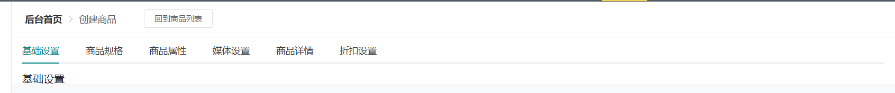
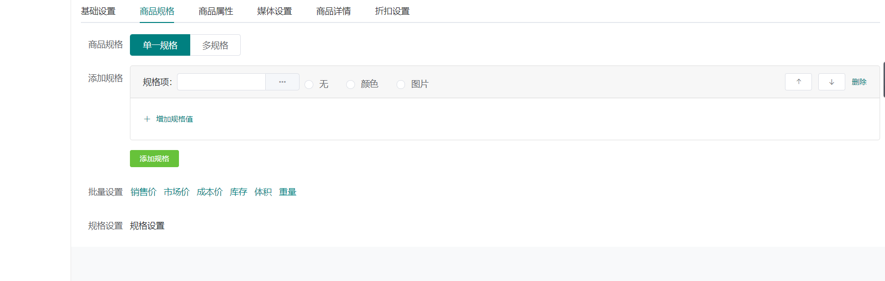
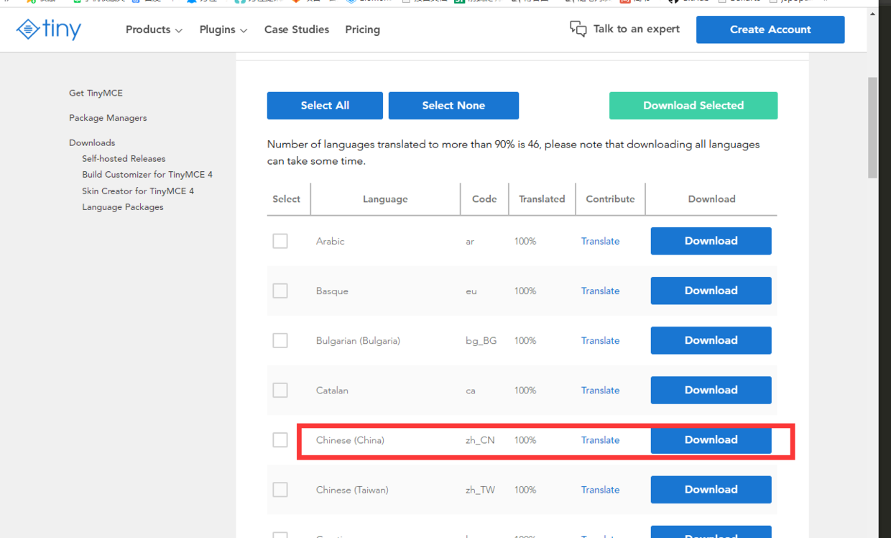
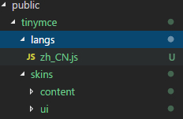

# 发布商品页开发

## 页面整体逻辑

6个选项卡：

- 基础设置
- 商品规格：选择颜色，尺寸，类型等等。会有一些排列组合和编码(仓库发货使用)，颜色选中后会提供一个颜色值。
- 商品属性：关联商品类型页，比如鞋子，手机等等。。。。
- 媒体设置：可以选中已经选好的图片，复用图片
- 商品详情：富文本框
- 折扣设置

## 选项卡



```html
<template>
	<div class="bg-white px-3" style="margin: -20px;margin-top: -1rem;margin-bottom: 0!important;">
		<router-link :to="{name:'shop_goods_list'}" style="position: absolute;top: 12px;left: 200px;">
			<el-button size="mini">回到商品列表</el-button>
		</router-link>
		<el-tabs v-model="tabIndex" @tab-click="handleClick">
		    <el-tab-pane label="基础设置">基础设置</el-tab-pane>
		    <el-tab-pane label="商品规格">商品规格</el-tab-pane>
		    <el-tab-pane label="商品属性">商品属性</el-tab-pane>
		    
		    <el-tab-pane label="媒体设置">媒体设置</el-tab-pane>
		    <el-tab-pane label="商品详情">商品详情</el-tab-pane>
			<el-tab-pane label="折扣设置">折扣设置</el-tab-pane>
		</el-tabs>
	</div>
</template>

<script>
	export default {
		data() {
			return {
				tabIndex: 0
			}
		},
		methods: {
			// 加载数据
			handleClick(tab,event) {
				console.log(tab.index);
			},
		},
	}
</script>

<style>
</style>

```

## 基础设置表单样式

- 多列选择cascader
- 单选
- 下拉框

```css
.goods_create .el-form-item{
    margin-bottom: 15px;
}
```

```html
<el-tab-pane label="基础设置">
    <el-form ref="form" label-width="80px">
        <el-form-item label="商品名称">
            <el-input v-model="form.title" placeholder="请输入商品名称，不能超过50个字符" class="w-50"></el-input>
        </el-form-item>
        <el-form-item label="商品分类">
            <el-cascader v-model="form.category" :options="options"></el-cascader>
        </el-form-item>
        <el-form-item label="商品描述">
            <el-input  type="textarea" v-model="form.desc" placeholder="选填，商品卖点简述，例如：此款商品美观大方 性价比较高 不容错过" class="w-50"></el-input>
        </el-form-item>
        <el-form-item label="商品单位">
            <el-input v-model="form.unit" placeholder="请输入商品单位" class="w-50"></el-input>
        </el-form-item>
        <el-form-item label="总库存">
            <el-input type="number" v-model="form.stock" placeholder="" class="w-25">
                <template slot="append">件</template>
            </el-input>
        </el-form-item>
        <el-form-item label="库存预警">
            <el-input type="number" v-model="form.min_stock" placeholder="" class="w-25">
                <template slot="append">件</template>
            </el-input>
        </el-form-item>
        <el-form-item label="库存显示">
            <el-radio-group v-model="form.display_stock">
                <el-radio :label="1" border>是</el-radio>
                <el-radio :label="0" border>否</el-radio>
            </el-radio-group>
        </el-form-item>
        <el-form-item label="是否上架">
            <el-radio-group v-model="form.status">
                <el-radio :label="0" border>放入仓库</el-radio>
                <el-radio :label="1" border>立即上架</el-radio>
            </el-radio-group>
        </el-form-item>
        <el-form-item label="运费模板">
            <el-select v-model="form.express" 
                       placeholder="请选择运费模板">
                <el-option label="区域一" 
                           value="shanghai"></el-option>
                <el-option label="区域二" 
                           value="beijing"></el-option>
            </el-select>
        </el-form-item>
    </el-form>

</el-tab-pane>
```

```js
form: {
	title: "",
	category: [],
	desc:"",
	unit:"",
	stock:0,
	min_stock:0,
	display_stock:0,
	status:0,
	express:""
},
```

## sku商品规格样式



```html
<el-tab-pane label="商品规格">

    <!-- 规格选项 -->
    <el-form ref="form" label-width="80px">
        <el-form-item label="商品规格">
            <el-radio-group :value="skus_type" 
                            @input="vModel('skus_type',$event)" 
                            size="medium">
                <el-radio-button :label="0">
                    单一规格</el-radio-button>
                <el-radio-button :label="1">
                    多规格</el-radio-button>
            </el-radio-group>
        </el-form-item>
    </el-form>

    <!-- 单规格 -->
    <template v-if="skus_type === 0">
        <el-form ref="form" label-width="80px">
            <el-form-item label="市场价格">
                <el-input type="number" v-model="stock" 
                          class="w-25">
                    <template slot="append">元</template>
                </el-input>
            </el-form-item>
            <el-form-item label="销售价格">
                <el-input type="number" v-model="stock" 
                          class="w-25">
                    <template slot="append">元</template>
                </el-input>
            </el-form-item>
            <el-form-item label="成本价格">
                <el-input type="number" v-model="stock" 
                          class="w-25">
                    <template slot="append">元</template>
                </el-input>
            </el-form-item>
            <el-form-item label="商品重量">
                <el-input type="number" v-model="stock" 
                          class="w-25">
                    <template slot="append">公斤</template>
                </el-input>
            </el-form-item>
            <el-form-item label="商品体积">
                <el-input type="number" v-model="stock" 
                          class="w-25">
                    <template slot="append">立方米</template>
                </el-input>
            </el-form-item>
        </el-form>
    </template>
    <!-- 多规格 -->
    <template v-else>
        <el-form ref="form" label-width="80px">
            <el-form-item label="添加规格">
                <div class="card" style="line-height: 1.2;">
                    <div class="card-header d-flex align-items-center">
                        规格项：
                        <el-input size="mini" style="width: 200px;">
                            <el-button slot="append" 
                                       icon="el-icon-more"></el-button>
                        </el-input>
                        <el-radio-group size="mini" style="margin-bottom: -10px;" class="ml-2">
                            <el-radio label="无"></el-radio>
                            <el-radio label="颜色"></el-radio>
                            <el-radio label="图片"></el-radio>
                        </el-radio-group>
                        <el-button size="mini" class="ml-auto" 
                                   icon="el-icon-top"></el-button>
                        <el-button size="mini"
                                   icon="el-icon-bottom"></el-button>
                        <el-button size="mini"
                                   type="text">删除</el-button>
                    </div>
                    <div class="card-body">
                        <div>
                            <el-button type="text" size="mini"
                                       icon="el-icon-plus">
                                增加规格值
                            </el-button>
                        </div>
                    </div>
                </div>
                <el-button class="mt-3" type="success"
                           size="mini">添加规格</el-button>
            </el-form-item>
            <el-form-item label="批量设置">
                <el-button type="text">销售价</el-button>
                <el-button type="text">市场价</el-button>
                <el-button type="text">成本价</el-button>
                <el-button type="text">库存</el-button>
                <el-button type="text">体积</el-button>
                <el-button type="text">重量</el-button>
            </el-form-item>
            <el-form-item label="规格设置">
                规格设置
            </el-form-item>
        </el-form>
    </template>

</el-tab-pane>
```

### vuex配置

```js
export default {
	state:{
		skus_type:0,
		title: "",// 商品名称
		category: [],
		desc:"",
		unit:"",
		stock:0,
		min_stock:0,
		display_stock:0,
		status:0,
		express:"",
		
		oprice:0, // 市场价格
		pprice:0, // 销售价格
		cprice:0, // 成本价格
		weight:0, // 重量
		volume:0, // 体积
	},
	getters:{
		
	},
	mutations:{
		// 修改state
		vModelState(state,{key,value}){
			state[key] = value
		}
	},
	actions:{
		
	}
}
```

```html
<!-- 规格选项 -->
<el-form ref="form" label-width="80px">
    <el-form-item label="商品规格">
        <el-radio-group :value="skus_type" 
                        @input="vModel('skus_type',$event)" 
                        size="medium">
            <el-radio-button :label="0">
                单一规格</el-radio-button>
            <el-radio-button :label="1">
                多规格</el-radio-button>
        </el-radio-group>
    </el-form-item>
</el-form>
```


```js
import {mapState,mapMutations} from "vuex"

computed: {
    ...mapState({
        skus_type:state=>state.goods_create.skus_type,
        title: state=>state.goods_create.title,
        category: state=>state.goods_create.category,
        desc:state=>state.goods_create.desc,
        unit:state=>state.goods_create.unit,
        stock:state=>state.goods_create.stock,
        min_stock:state=>state.goods_create.min_stock,
        display_stock:state=>state.goods_create.display_stock,
        status:state=>state.goods_create.status,
        express:state=>state.goods_create.express,
    }),
        // 其他计算属性
},
methods: {
	...mapMutations(['vModelState']),
	// 修改表单的值
	vModel(key,value){
		this.vModelState({ key,value })
	},
	// 加载数据
	handleClick(tab, event) {
		console.log(tab.index);
	},
},
  
```

### 添加规格

>每个商品都有自己的规格，通过直接操作规格可以进行规格组合，组合成一个新的sku，就像淘宝，不同规格组合会有不同的价格

```js
//vuex
export default {
    state:{
        // 规格卡片
        sku_card:[
            {
                name:"颜色",
                type:0,  // 规格类型 0无 1颜色 2图片
                list:[]
            }
        ]
    },

    mutations:{
        // 增加规格卡片
        addSkuCard(state){
            state.sku_card.push({
                name:"规格名称",
                type:0,
                list:[]
            })
        }
    },
}
```

### 删除修改规格

```js
// 删除规格卡片
delSkuCard(state, index) {
    state.sku_card.splice(index, 1)
},
    // 修改规格卡片
    vModelSkuCard(state, {
        key,
        index,
        value
    }) {
        state.sku_card[index][key] = value
    }
```

### 规格排序

```js
//util.js
export default {
	// sku排列算法
	cartesianProductOf() {
		return Array.prototype.reduce.call(arguments,function(a, b) {
			var ret = [];
			a.forEach(function(a) {
				b.forEach(function(b) {
					ret.push(a.concat([b]));
				});
			});
			return ret;
		}, [[]]);
	},
	swapArray(arr, index1, index2) {
      arr[index1] = arr.splice(index2, 1, arr[index1])[0];
      return arr;
    },
    // 上移 将当前数组index索引与后面一个元素互换位置，向数组后面移动一位
    moveUp(arr, index) {
      this.swapArray(arr, index, index - 1);
    },
    // 下移 将当前数组index索引与前面一个元素互换位置，向数组前面移动一位
    moveDown(arr, index) {
      this.swapArray(arr, index, index + 1);
    },
}
```


```js
import $Util from '@/common/util.js';
export default {
    state:{

        sku_card:[
            {
                name:"颜色",
                type:0,  // 规格类型 0无 1颜色 2图片
                list:[]
            }
        ]
    },
    getters:{

    },
    mutations:{

        // 规格卡片排序
        sortSkuCard(state,{action,index}){
            // 上移
            $Util[action](state.sku_card,index)
        }
    },

}
```

```html
<!-- 上移 -->
<el-button size="mini" class="ml-auto" 
           :disabled="index === 0"
           icon="el-icon-top" @click="sortCard('moveUp',index)"
           ></el-button>
<!-- 下移 -->
<el-button size="mini" 
           :disabled="skuCardTotal === (index+1)"
           icon="el-icon-bottom"  @click="sortCard('moveDown',index)"
           ></el-button>
```

```js
computed: {
    ...mapState({
        sku_card:state=>state.goods_create.sku_card
    }),
        // 规格卡片总数
        skuCardTotal(){
        return this.sku_card.length
    }
},
```

```js
...mapMutations(['addSkuCard','delSkuCard','vModelSkuCard','sortSkuCard']),
sortCard(action,index){
    this.sortSkuCard({action,index})
}
```

### 规格属性列表

- 颜色选择器
- 

```html
<div class="d-flex align-items-center flex-wrap">

    <sku-card-children :type="item.type"></sku-card-children>

</div>
```

```js
<template>
	<div class="border py-1 px-2 rounded mr-2 position-relative d-flex align-items-center">
		<div v-if="type != 0">
			<!-- 颜色选择器 -->
			<el-color-picker size="mini"
			v-if="type === 1"></el-color-picker>
			<!-- 图片选择 -->
			<span class="btn btn-light border mr-2" 
			v-else>
				<i class="el-icon-plus"></i>
			</span>
		</div>
		
		<input value="内容" class="form-control text-center border-0" style="width: 80px;font-size: 15px;" />
		
		<span class="btn btn-light p-0 position-absolute" 
		style="line-height: 1;right: -10px;top: -10px;">
			<i class="el-icon-circle-close"></i>
		</span>
	</div>
</template>

<script>
	export default {
		props: {
			type: {
				type: Number,
				default: 0
			},
		},
	}
</script>

<style>
</style>

```

## 富文本编辑器

#### 安装tinymce

> cnpm install tinymce -S

##### 安装tinymce-vue

cnpm install @tinymce/tinymce-vue -S

#### 下载中文语言包

地址：<https://www.tiny.cloud/get-tiny/language-packages/>



###### 下载完后放到静态文件public目录下

1、在public目录下新建tinymce，将上面下载的语言包解压到该目录
2、在node_modules里面找到tinymce,将skins目录复制到public/tinymce里面



#### tinymce使用

##### 封装成组件

```vue
<template>
    <div class="tinymce-box">
        <editor v-model="myValue"
          :init="init"
          :disabled="disabled"
          @onClick="onClick">
        </editor>
    </div>
</template>

<script>
import tinymce from 'tinymce/tinymce' //tinymce默认hidden，不引入不显示
import Editor from '@tinymce/tinymce-vue'
import 'tinymce/themes/silver'
// 编辑器插件plugins
// 更多插件参考：https://www.tiny.cloud/docs/plugins/
import 'tinymce/plugins/image'// 插入上传图片插件
import 'tinymce/plugins/media'// 插入视频插件
import 'tinymce/plugins/table'// 插入表格插件
import 'tinymce/plugins/lists'// 列表插件
import 'tinymce/plugins/wordcount'// 字数统计插件
export default {
    components:{
        Editor
    },
    name:'tinymce',
    props: {
        value: {
          type: String,
          default: ''
        },
        disabled: {
          type: Boolean,
          default: false
        },
        plugins: {
          type: [String, Array],
          default: 'lists image media table wordcount'
        },
        toolbar: {
          type: [String, Array],
          default: 'undo redo |  formatselect | bold italic forecolor backcolor | alignleft aligncenter alignright alignjustify | bullist numlist outdent indent | lists image media table | removeformat'
        }
    },
    data(){
        return{
            init: {
                language_url: '/tinymce/langs/zh_CN.js',
                language: 'zh_CN',
                skin_url: '/tinymce/skins/ui/oxide',
                // skin_url: 'tinymce/skins/ui/oxide-dark',//暗色系
                height: 300,
                plugins: this.plugins,
                toolbar: this.toolbar,
                branding: false,
                menubar: false,
                // 此处为图片上传处理函数，这个直接用了base64的图片形式上传图片，
                // 如需ajax上传可参考https://www.tiny.cloud/docs/configure/file-image-upload/#images_upload_handler
                images_upload_handler: (blobInfo, success, failure) => {
                  const img = 'data:image/jpeg;base64,' + blobInfo.base64()
                  success(img)
                }
              },
              myValue: this.value
        }
    },
    mounted () {
        tinymce.init({})
    },
    methods: {
        // 添加相关的事件，可用的事件参照文档=> https://github.com/tinymce/tinymce-vue => All available events
        // 需要什么事件可以自己增加
        onClick (e) {
          this.$emit('onClick', e, tinymce)
        },
        // 可以添加一些自己的自定义事件，如清空内容
        clear () {
          this.myValue = ''
        }
    },
    watch: {
        value (newValue) {
          this.myValue = newValue
        },
        myValue (newValue) {
          this.$emit('input', newValue)
        }
    }
}
    
</script>
<style scoped>
    
</style>
```

##### 组件引用

```vue
<template>
  <div class="home">
    <tinymce
        ref="editor"
        v-model="msg"
        :disabled="disabled"
        @onClick="onClick"
    />
    <button @click="clear">清空内容</button>
    <button @click="disabled = true">禁用</button>
  </div>
</template>
<script>
import tinymce from '@/components/tinymce.vue'

export default {
    name: 'home',
    components: {
        tinymce
    },
    data(){
        return{
            msg: 'Welcome to Use Tinymce Editor',
                    disabled: false
        }
    },
    methods: {
        // 鼠标单击的事件
        onClick (e, editor) {
            console.log('Element clicked')
            console.log(e)
            console.log(editor)
        },
        // 清空内容
        clear () {
            this.$refs.editor.clear()
        }
    }
}
</script>
```

## 商品详情


