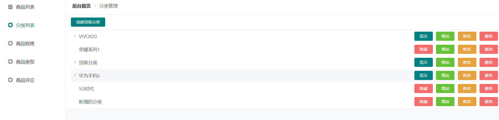

# 商品分类页



## 页面和路由配置

```js
//	src/common/config/router.js
{
    meta:{title:'分类管理'},
    component:'shop/category/list'
}
```

https://element.eleme.cn/#/zh-CN/component/tree

```vue
// src/views/shop/category/list.vue
<template>
<div class="bg-white px-3" style="margin: -20px;margin-top: -1rem;margin-bottom: 0!important;">

    <el-tree :data="data" :props="defaultProps" @node-click="handleNodeClick"></el-tree>

    </div>
</template>

<script>
    export default {
        data(){
            return {
                data: [{
                    label: '一级 1',
                    children: [{
                        label: '二级 1-1',
                        children: [{
                            label: '三级 1-1-1'
                        }]
                    }]
                }, {
                    label: '一级 2',
                    children: [{
                        label: '二级 2-1',
                        children: [{
                            label: '三级 2-1-1'
                        }]
                    }, {
                        label: '二级 2-2',
                        children: [{
                            label: '三级 2-2-1'
                        }]
                    }]
                }, {
                    label: '一级 3',
                    children: [{
                        label: '二级 3-1',
                        children: [{
                            label: '三级 3-1-1'
                        }]
                    }, {
                        label: '二级 3-2',
                        children: [{
                            label: '三级 3-2-1'
                        }]
                    }]
                }],
                defaultProps: {
                    children: 'children',
                    label: 'label'
                }
            };
        },
        methods: {
            handleNodeClick(data) {
                console.log(data);
            }
        }
    }
</script>

<style>
</style>

```

## 自定义节点内容


- default-expand-all默认展开所有
- 

```vue
<template>
	<div class="bg-white px-3" style="margin: -20px;margin-top: -1rem;margin-bottom: 0!important;">
		
		<el-tree :data="data" :props="defaultProps" @node-click="handleNodeClick"
		default-expand-all>
			
			<span class="custom-tree-node" slot-scope="{ node, data }">
				<span>{{ node.label }}</span>
				<span>
				  <el-button type="primary" size="mini">显示</el-button>
				  <el-button type="success" size="mini">增加</el-button>
				  <el-button type="warning" size="mini">修改</el-button>
				  <el-button type="danger" size="mini">删除</el-button>
				</span>
			  </span>
			
		</el-tree>
		
	</div>
</template>

<script>
	export default {
		data(){
			return {
				data: [{
				  label: '一级 1',
				  children: [{
					label: '二级 1-1',
					children: [{
					  label: '三级 1-1-1'
					}]
				  }]
				}, {
				  label: '一级 2',
				  children: [{
					label: '二级 2-1',
					children: [{
					  label: '三级 2-1-1'
					}]
				  }, {
					label: '二级 2-2',
					children: [{
					  label: '三级 2-2-1'
					}]
				  }]
				}, {
				  label: '一级 3',
				  children: [{
					label: '二级 3-1',
					children: [{
					  label: '三级 3-1-1'
					}]
				  }, {
					label: '二级 3-2',
					children: [{
					  label: '三级 3-2-1'
					}]
				  }]
				}],
				defaultProps: {
				  children: 'children',
				  label: 'label'
				}
			};
		},
		methods: {
		  handleNodeClick(data) {
			console.log(data);
		  }
		}
	}
</script>

<style>
.custom-tree-node {
    flex: 1;
    display: flex;
    align-items: center;
    justify-content: space-between;
    font-size: 14px;
    padding-right: 8px;
}
.el-tree-node__content{
	padding: 20px 0;
}
</style>

```

## 显示隐藏切换

```html
<el-button :type="data.status ? 'primary' : 'danger'" 
           size="mini" @click.stop="showOrHide(data)">
    {{data.status ? '显示' : '隐藏'}}
</el-button>
```

```js
showOrHide(data){
    data.status = data.status ? 0 : 1
}
```

## 分类昵称修改

- 点击按钮后判断当前节点编辑状态并进行切换

```html
<el-tree :data="data" :props="defaultProps" @node-click="handleNodeClick"
         default-expand-all :expand-on-click-node="false">
    <span class="custom-tree-node" slot-scope="{ node, data }">
        <div>
            <el-input v-if="data.editStatus" v-model="data.label" size="mini"></el-input>
            <span v-else>{{ node.label }}</span>
        </div>
        <el-button :type="data.editStatus ? 'default':'warning'" size="mini" @click="edit(data)">{{data.editStatus ? '完成':'修改'}}</el-button>
    </span>
    </span>

</el-tree>
```

```js
每一项添加一个是否编辑的状态
editStatus:false
{
    label: '一级 1',
    status:1,
    editStatus:false,
    children: [{
        label: '二级 1-1',
        status:1,
        editStatus:false,
        children: [{
            label: '三级 1-1-1',
            status:1,
            editStatus:false,
        }]
    }]
}, 
```

```js
// 编辑|提交
edit(data){
    data.editStatus = !data.editStatus
}
```

## 分类删除

- 因为是多及分类删除，所以要删除父节点对应的children子节点

```html
<el-tree :data="data" :props="defaultProps" @node-click="handleNodeClick"
         default-expand-all :expand-on-click-node="false">
    <span class="custom-tree-node" slot-scope="{ node, data }">
        <el-button type="danger" size="mini" @click="remove(node,data)">删除</el-button>
    </span>
    </span>

</el-tree>
```

```js
remove(node,data){
    this.$confirm('此操作将删除该分类, 是否继续?', '提示', {
        confirmButtonText: '删除',
        cancelButtonText: '取消',
        type: 'warning'
    }).then(() => {
        let parent = node.parent;
        //如果是根节点就取data,否则取data.children
        let children = parent.data.children || parent.data
        //找到根节点
        let index = children.findIndex(v=>{
            return v.id === data.id
        })
        children.splice(index,1)
    })

}
```

## 子分类增加

```html
<el-button type="success" size="mini"
           @click="append(data)">增加</el-button>
```

```js
append(data){
    let newObj = {
        id:2,
        label: '二级 1-1',
        status:1,
        editStatus:true,
        children:[]
    }
    data.children.push(newObj)
}
```

## 同级拖拽排序


## 增加顶级分类

## 数据初始化-递归tree

```js
__init() {
    this.layout.showLoading()
    this.axios.get('/admin/category',{
        token:true
    }).then(res=>{
        let data = res.data.data
        let addEditStatus = function(arr){
            arr.forEach(item=>{
                item.editStatus = false
                if(item.child.length){
                    addEditStatus(item.child)
                }
            })
        }
        addEditStatus(data)
        this.data = data
        this.layout.hideLoading()
    }).catch(err=>{
        this.layout.hideLoading()
    })
},
```

