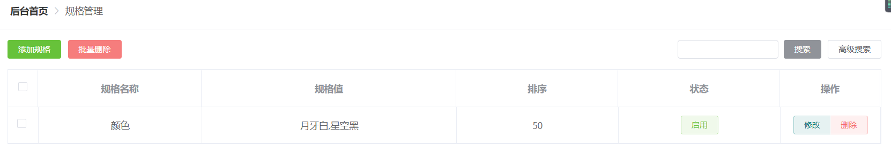
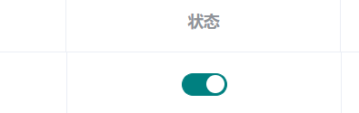

# 商品规格

## 基础样式搭建



- 本页面结构参考商品列表页。

```html
<div class="bg-white px-3" style="margin: -20px;margin-top: -1rem;margin-bottom: 0!important;">
    <button-search class="pt-3" :showSearch="false">
        <!-- 左边 -->
        <template #left>
            <el-button size="mini" type="success">添加规格</el-button>
            <el-button size="mini" type="danger">批量删除</el-button>
        </template>
    </button-search>


    <el-table border class="mt-3"
              :data="tableData"
              style="width: 100%"
              @selection-change="handleSelectionChange">
        <el-table-column
                         type="selection"
                         width="45"
                         align="center">
        </el-table-column>

        <el-table-column
                         label="商品"
                         width="380">
            <template slot-scope="scope">
                <div class="media">
                    
                    <div class="media-body">
                        <p class="mt-0">{{scope.row.title}}</p>
                        <p class="mb-0">分类：{{scope.row.category}}</p>
                        <p class="mb-0">时间：{{scope.row.create_time}}</p>
                    </div>
                </div>
            </template>
        </el-table-column>
        <el-table-column
                         prop="type" align="center"
                         label="商品类型">
        </el-table-column>
        <el-table-column
                         align="center"
                         prop="sale_count"
                         label="实际销量">
        </el-table-column>
        <el-table-column
                         align="center"
                         prop="order"
                         label="商品排序">
        </el-table-column>
        <el-table-column
                         prop="status"
                         align="center"
                         label="商品状态">
            <template slot-scope="scope">
                <el-button
                           type="success" size="mini"
                           @click="scope.row.ischeck = 1"
                           plain>审核通过
                </el-button>

                <el-button class="ml-0 mt-2"
                           type="danger" size="mini"
                           @click="scope.row.ischeck = 2"
                           plain>审核通过
                </el-button>

                <!-- <el-button 
:type="scope.row.status ? 'success' : 'danger'" 
size="mini"
@click="changeStatus(scope.row)"
plain>{{scope.row.status ? '上架' : '下架'}}
</el-button> -->
            </template>
        </el-table-column>
        <el-table-column
                         prop="stock"
                         align="center"
                         label="总库存">
        </el-table-column>
        <el-table-column
                         prop="pprice"
                         align="center"
                         label=" 价格(元)"
                         >
        </el-table-column>
        <el-table-column
                         align="center"
                         label="操作"
                         width="150">
            <template slot-scope="scope">
                <el-button-group>
                    <el-button type="primary" size="mini" 
                               plain>修改</el-button>
                    <el-button type="danger" size="mini" 
                               plain @click="deleteItem(scope.$index)"
                               >删除</el-button>
                </el-button-group>
            </template>
        </el-table-column>
    </el-table>
    <div style="height: 60px;"></div>
    <el-footer class="border-top d-flex align-items-center px-0 position-fixed bg-white" style="bottom: 0;left: 200px;right: 0;z-index: 100;">
        <div style="flex: 1;" class="px-2">
            <el-pagination
                           :current-page="currentPage"
                           :page-sizes="[100, 200, 300, 400]"
                           :page-size="100"
                           layout="total, sizes, prev, pager, next, jumper"
                           :total="400">
            </el-pagination>
        </div>
    </el-footer>


</div>
```

## 初始化

```js
// 获取列表
getList(){
    if(this.preUrl == '') return;
    this.showLoading()
    let url = `/admin/${this.preUrl}/${this.page.current}?limit=${this.page.size}`
    this.axios.get(url,{
        token:true
    }).then(res=>{
        let data = res.data.data
        this.page.total = data.totalCount

        this.getListResult(data)

        this.hideLoading()
    }).catch(err=>{
        this.hideLoading()
    })
},
```

## 分页

```js
handleSizeChange(val) {
    this.page.size = val
    this.getList()
},
```

## 启用禁用状态切换



```html
<el-switch v-model="scope.row.status" :active-value='status1' :inactive-value='status0' active-text='启用' inactive-text="禁用" @change='changeStatus(scope.row)'></el-switch>
```

```js
data() {
    return {
        preUrl: "skus",
        status1:1,
        status0:0,
    }
},
```

```js
changeStatus(item) {

    let status = item.status
    let msg = status === 1 ? '启用' : '禁用'
    this.showLoading()
    this.axios.post('/admin/' + this.preUrl + '/' + item.id + '/update_status', {
        status: status
    }, {
        token: true
    }).then(res => {
        item.status = status
        this.$message({
            message: msg + '成功',
            type: 'success'
        });
        this.hideLoading()
    }).catch(err => {
        this.hideLoading()
    })
},
```

## 选中

```html
<el-table border class="mt-3" :data="tableData" style="width: 100%" @selection-change="handleSelectionChange">
```

```js
handleSelectionChange(e) {
    this.multipleSelection = e;
}
```

## 添加和添加验证

- `:visible.sync`决定是否显示

```html
<el-button size="mini" type="success" @click="createModel = true">添加规格</el-button>
```

```html
<el-dialog title="添加规格" :visible.sync="createModel" top="5vh">
    <!-- 表单内容 -->
    <el-form :rules="rules" ref="form" :model="form" label-width="80px">
        <el-form-item label="规格名称" prop="name"><el-input v-model="form.name" placeholder="规格名称" size="mini" style="width: 25%;"></el-input></el-form-item>
        <el-form-item label="排序"><el-input-number size="mini" v-model="form.order" :min="0"></el-input-number></el-form-item>
        <el-form-item label="状态">
            <el-radio-group v-model="form.status" size="mini">
                <el-radio :label="1" v border>启用</el-radio>
                <el-radio :label="0" border>禁用</el-radio>
            </el-radio-group>
        </el-form-item>
        <el-form-item label="类型">
            <el-radio-group v-model="form.type" size="mini">
                <el-radio :label="0" v border>文字</el-radio>
                <el-radio :label="1" border>颜色</el-radio>
                <el-radio :label="2" border>图片</el-radio>
            </el-radio-group>
        </el-form-item>
        <el-form-item label="规格值" prop="value">
            <el-input type="textarea" :rows="3" placeholder="一行为一个规格项，多个规格项用换行输入" v-model="form.value"></el-input>
        </el-form-item>
    </el-form>

    <div slot="footer" class="dialog-footer">
        <el-button @click="createModel = false">取 消</el-button>
        <el-button type="primary" @click="submit">确 定</el-button>
    </div>
</el-dialog>
```

```js
data() {
    return {
        createModel: false,
        rules: {
            name: [
                {
                    required: true,
                    message: '规格名称不能为空',
                    trigger: 'blur'
                }
            ],
            value: [
                {
                    required: true,
                    message: '规格值不能为空',
                    trigger: 'blur'
                }
            ]
        }
    };
},

```

```js
openModel(){
    // 初始化表单
    this.form = {
        name:"",
        order:50,
        status:1,
        type:0,
        value:""
    }
    // 打开dialog
    this.createModel = true
},
// 添加规格
submit() {
  this.$refs.form.validate((res) => {
    if (res) {
      this.form.default = this.form.default.replace(/\n/g, ",");
      let id = 0;
      if (this.editIndex !== -1) {
        id = this.tableData[this.editIndex].id;
      }
      this.addOrEdit(this.form, id);
      // 关闭模态框
      this.createModel = false;
    }
  });
},
```

```js
// 添加/编辑
addOrEdit(data, id = 0) {
    this.showLoading()
    let msg = id > 0 ? '修改' : '增加'
    let url = id > 0 ? '/admin/' + this.preUrl + '/' + id : '/admin/' + this.preUrl
    this.axios.post(url, data, {
        token: true
    }).then(res => {
        this.$message({
            message: msg + '成功',
            type: 'success'
        });
        this.getList()
        this.hideLoading()
    }).catch(err => {
        this.hideLoading()
    })
},
```

## 删除单个

```html
<el-button type="danger" size="mini" 
           plain @click="deleteItem(scope)"
           >删除</el-button>
```

```js
data:{        preUrl: "skus",
     }
deleteItem(item) {
    this.$confirm('是否要删除该规格?', '提示', {
        confirmButtonText: '删除',
        cancelButtonText: '取消',
        type: 'warning'
    }).then(() => {
        this.showLoading()
        this.axios.post('/admin/' + this.preUrl + '/' + item.id + '/delete', {}, {
            token: true
        }).then(res => {
            this.$message({
                message: '删除成功',
                type: 'success'
            });
            this.getList()
            this.hideLoading()
        }).catch(err => {
            this.hideLoading()
        })
    })
},
```

## 超级管理员权限验证

- 获取到session存储的token和user
- 如果user.super===1,执行

```js
router.beforeEach((to, from, next) => {
    // 获取token
    let token = window.sessionStorage.getItem('token')
    let user = window.sessionStorage.getItem('user')
    if(token){ // 已登录
        // 防止重复登录
        if(to.path === '/login'){
            Vue.prototype.$message.error('请不要重复登录');
            return next({name:from.name ? from.name : 'index'})
        }
        // 其他验证...
        if(to.name !== 'error_404'){
            // 超级管理员跳过验证
            if(user){
                user = JSON.parse(user)
                if(user.super === 1){
                    return next()
                }
            }
            // 验证
            let rules = window.sessionStorage.getItem('rules')
            rules = rules ? JSON.parse(rules) : []

            let index = rules.findIndex(item=>{
                return item.rule_id > 0 && item.desc === to.name
            })
            if(index === -1){
                Vue.prototype.$message.error('你没有权限')
                return next({name:from.name ? from.name : 'error_404'})
            }
        }
        next();
    } else {
        // 跳过登录页验证
        if(to.path === '/login'){
            return next();
        }
        // 未登录
        Vue.prototype.$message.error('请先登录');
        next({ path:'/login' })
    }
})
```


## 修改

```html
<el-button size="mini" type="success" @click="openModel(false)">添加规格</el-button>
<el-button type="primary" size="mini" 
				  plain @click="openModel(scope)">修改</el-button>
```

```js
openModel(e = false){
    // 增加
    if (!e) {
        // 初始化表单
        this.form = {
            name:"",
            order:50,
            status:1,
            type:0,
            value:""
        }
        this.editIndex = -1
    } else {
        // 修改
        this.form = {
            name:e.row.name,
            order:e.row.order,
            status:e.row.status,
            type:e.row.type,
            value:e.row.value.replace(/,/g,'\n')
        }
        this.editIndex = e.$index
    }
    // 打开dialog
    this.createModel = true
},
```

## 批量删除

```js
computed: {
// 选中记录id组成的数组
ids() {
	return this.multipleSelection.map(item => {
		return item.id
	})
}
},
```

```js
deleteAll(){
    this.$confirm('是否要删除选中规格?', '提示', {
        confirmButtonText: '删除',
        cancelButtonText: '取消',
        type: 'warning'
    }).then(() => {
        this.multipleSelection.forEach(item=>{
            let index = this.tableData.findIndex(v=>v.id === item.id)
            if (index !== -1) {
                this.tableData.splice(index,1)
            }‘
        })
        this.multipleSelection = []
        this.$message({
            message: '删除成功',
            type: 'success'
        });
    })
},
// 选中
handleSelectionChange(val) {
	this.multipleSelection = val;
},    
```

## 混入代码复用

商品类型和商品评论都需要用到商品规格的一些方法。可以使用mixin进行代码复用