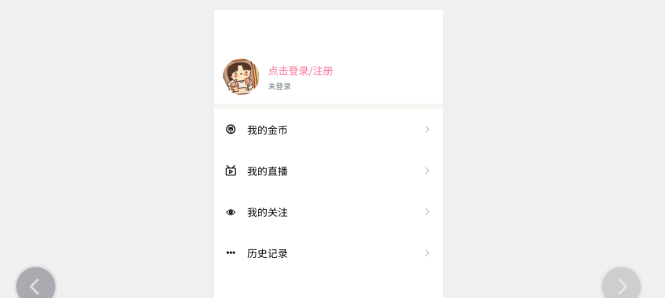

# 个人中心

## 基本模板



```html
<template>
	<view >
		<view style="height: 130rpx;"></view>

		<view @click="goLogin" class="my-head p-3 flex align-center">
			<image src="../../static/info/title.jpg" mode="" class="rounded-circle bg-light flex-shrink"></image>
			<view class="flex flex-column pl-3 flex-1">
				<view class="font-md cili-text-main">点击登录/注册</view>
				<text class="font-sm text-muted">未登录</text>
			</view>
		</view>
		
		<!-- <view class="my-head p-3 pr-0 flex align-center" >
			<image src="../../static/info/title.jpg" mode="" class="rounded-circle bg-light flex-shrink"></image>
			<view class="flex flex-column pl-3 flex-1">
				<view class="font-md text-dark">
					犬来八荒
					<text class="font-sm text-light-muted ml-2">男</text>
				</view>
				<view class="vip"><text class="rounded">正式会员</text></view>
			</view>
			<view class="text-muted text-center flex justify-center align-center font-sm">
				<text>空间</text>
				<text class="pr-1   iconfont  font-md ">1</text>
			</view>
		</view> -->
		
		<view class="f-divider"></view>
		<ci-list-item icon="iconBbi_ font-weight-bold" title="我的金币" ></ci-list-item>
		<ci-list-item icon="icon02 font-weight-bold" title="我的直播" ></ci-list-item>
		<ci-list-item icon="iconguanzhu01 font-weight-bold" title="我的关注" ></ci-list-item>
		<ci-list-item icon="icongengduo font-weight-bold" title="历史记录" ></ci-list-item>
		
		
		
		

		
	</view>
</template>

<script>
import ciListItem from '@/components/common/ci-list-item.vue';

export default {
	components: {
		ciListItem
		

	},
	data() {
		return {
			
			
			
		};
	},
	methods:{
		goLogin(){
			uni.navigateTo({
				url:'../login/login',
				animationType: 'pop-in',
				animationDuration: 200
			})
		}
	}
	
	
	
};
</script>

<style lang="scss">
.my-head {
	image {
		width: 120upx;
		height: 120upx;
	}
	.vip {
		text {
			border: 1px solid #f57498;
			color: #f77398;
			font-weight: 600;
			font-size: 25upx;
		}
	}
}
.headBlock {
	height: var(--status-bar-height);
}
</style>

```

## 获取用户最新数据

```js
import {mapState} from 'vuex'
export default {
    computed:{
        ...mapState(['user'])
    },
    onShow() {
        this.$store.dispatch('getUserInfo')
    },
};
```

```js
export default new Vuex.Store({
    actions:{
        getUserInfo({
            state
        }) {
            $H.get('/user/info', {
                token: true,
                noJump: true,
                toast: false
            }).then(res => {
                state.user = res
                uni.setStorage({
                    key: "user",
                    data: JSON.stringify(state.user)
                })
            })
        },
    }
})

```

## 退出登录

```js
async logout() {
    await this.$store.dispatch('logout');
    uni.showToast({
        title: '退出成功',
        icon: 'none'
    });
},
```

```js
logout({
    state,
    dispatch
}) {
    $H.post('/logout', {}, {
        token: true,
        toast: false
    });
    state.user = false
    state.token = false
    // clear是清除所有 我们后面有可能有需要用到的其他内容
    console.log('断开socket')
    dispatch('closeSocket')
    uni.removeStorageSync('user')
    uni.removeStorageSync('token')
},
```

## 权限验证进入充值页

```html
<div  @click="authJump({url:'/pages/pay/pay'})">
    金币充值
    余额：{{user?user.coin:0}}金币
</div>
```

```js
//main.js
Vue.prototype.authJump = (options)=>{
    if(!store.state.token){
        uni.showToast({
            title: '请先登录',
            icon: 'none'
        });
        return uni.navigateTo({
            url: '/pages/login/login'
        });
    }
    uni.navigateTo(options);
}
```


