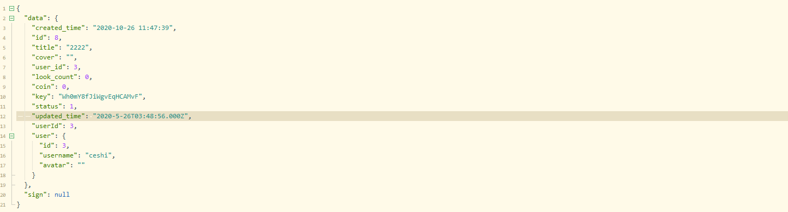
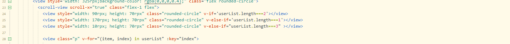

# 拉流直播间

https://zhuanlan.zhihu.com/p/187338996

## nvue注意

- 必须在text组件内写文字!!
- 无法获取main.js里添加的全局属性方法，需要import

## 直播间数据获取

>获取礼物
>
>获取主播信息

1. 数据格式



2. 引入request.js

   拉流地址格式为
   
   ```
   baseurl/live/key.flv?sign=signval
   ```
   
   

```js
import $H from '../../common/request.js';
import $C from '../../common/config.js';
export default {
    data(){
        return {
            streamerInfo:{},
            sign:undefined,
        }
    },
    async onLoad(e) {
        let { sign, info } = await $H.get('/live/read/' + this.id);
        this.streamerInfo = info;
    },
    computed:{
        src() {
            if (this.streamerInfo.key == '' || this.sign == '') {
                return '';
            }
            return `${$C.livePlayBaseUrl}/live/${this.streamerInfo.key}.flv?sign=${this.sign}`
        }
    }
}
```

## bug-输入框高度问题

- 输入框使得页面自动上推，但是如果设置false后，自定义弹框就会不显示。
- 需要监听键盘事件并获取键盘高度，当输入框弹出后，自定义弹框定位到高于输入框高度的位置即可。

```html
<view class="bg-white flex align-center px-3" style="height: 120rpx;">
    <input
           auto-focus="true"//自动聚焦
           adjust-position="false"//不上推页面
           type="text"
           v-model="content"
           class="border rounded flex-1 px-3 font-md"
           placeholder="说点什么..."
           style="height: 80rpx;"
           />
    <view class="bg-main flex align-center justify-center py-2 px-2 ml-3 rounded" @click="submit"><text class="font text-white">发送</text></view>
</view>
<view :style="'height:' + KeyboardHeight + 'rpx'"></view>
```

```js
mounted() {
    // 监听键盘
    uni.onKeyboardHeightChange(res => {
        this.KeyboardHeight = res.height * 2 + 5;
    });
}
```


## 接收礼物

- 需要实现自动聚焦底部，自动消失。

```html
<LiveGift></LiveGift>
```

- 自动聚焦到底部

  ```html
  <cell  v-for="(item,index) in gifts" :key="index" :ref="'item'+index">
  ```

  ```js
  toBottom() {
      this.$nextTick(()=>{
          let index = this.gifts.length - 1
          let ref = 'item' + index
          if(this.$refs[ref]){
              dom.scrollToElement(this.$refs[ref][0],{})
          }
      })
  }
  ```

- 自动消失

- 为了性能好，把`scroll-view`替换成[list]()组件

  ```vue
  <template>
      <list style="width: 520rpx;height: 500rpx;" :show-scrollbar="false" :bounce="false">
          <cell class="flex align-center px-3 pt-3" v-for="(item,index) in gifts" :key="index" insert-animation="default" delete-animation="default" :ref="'item'+index">
              <view style="width: 325rpx;background-image: linear-gradient(to right, #BCABB1 , #65AAF0);" class="flex rounded-circle">
                  <view class="p">
                      <image :src="item.avatar || '/static/tabbar/min.png'" style="width: 70rpx;height: 70rpx;" class="rounded-circle"></image>
                  </view>
                  <view class="flex-1 flex flex-column justify-center">
                      <text class="text-white font">{{item.username}}</text>
                      <text class="text-white font-sm">送{{item.gift_name}}</text>
                  </view>
                  <view class="p">
                      <image :src="item.gift_image" style="width: 70rpx;height: 70rpx;" class="rounded-circle"></image>
                  </view>
              </view>
  
              <text class="text-warning font-lg ml-1">X {{item.num}}</text>
          </cell>
      </list>
  </template>
  
  <script>
      const dom = weex.requireModule('dom')
      export default {
          data() {
              return {
  
                  gifts: []
              }
          },
          created(){
              setInterval(()=>{
                  this.gifts.push({
                      username:"发送人",
                      avatar:"",
                      gift_name:"蛋糕",
                      gift_image:"/static/gift/3.png",
                      num:1
                  })
                  this.toBottom()
              },3000)
          },
          methods: {
              // 置于底部
              toBottom() {
                  this.$nextTick(()=>{
                      let index = this.gifts.length - 1
                      let ref = 'item' + index
                      if(this.$refs[ref]){
                          dom.scrollToElement(this.$refs[ref][0],{})
                      }
                  })
              }
          },
      }
  </script>
  
  <style>
  </style>
  
  ```

## 底部

```html
<view style="position: fixed;left: 0;bottom: 0;right: 0;height: 120rpx;" class="flex align-center justify-between">
    <view class="px-2">
        <view class="btn px-3" style="width: 300rpx;"><text class="text-white font ">说点什么...</text></view>
    </view>
    <!-- 右侧按钮 -->
    <view class="flex align-center">
        <view class="btn btn-icon">
            <text class="iconfont text-white" style="font-size: 40px;">&#xe626;</text>
        </view>
        <view class="btn btn-icon  align-center" style="background-color: rgba(255, 255, 0, 0.3);">
            <text class="iconfont text-white" style="font-size: 25px;">&#xe600;</text>
        </view>
        <view class="btn btn-icon  align-center">
            <text class="iconfont text-white" >&#xe614;</text>
        </view>
        <view class="btn btn-icon  align-center">
            <text class="iconfont text-white" style="">&#xe71d;</text>
        </view>
    </view>
</view>
```

## 弹幕

- 如果未登录，需要进行登录

```js
openInput() {
    this.$store.dispatch('authMethod', () => {
        this.$refs.input.open();
    });
},
```

```js
submit() {
    if (this.content === '') {
        uni.hideKeyboard();
        return;
    }
    this.$refs.danmu.send({
        id: Math.random() * 100,
        name: '昵称',
        content: this.content
    });
    this.content = '';
    this.$refs.input.close();
    uni.hideKeyboard();
}
```

live-danmu.vue

```html
<template>
    <view style="position: fixed;bottom: 120rpx;left: 0;right: 0;">
        <scroll-view scroll-y="true" style="width: 520rpx;height: 300rpx;" scroll-with-animation class="pl-3" :scroll-into-view="scrollInToView"  :show-scrollbar="false">
            <view :id="'danmu'+item.id" class="flex justify-start align-start rounded p-2 mb-2" style="background-color: rgba(255,255,255,0.125);" v-for="(item,index) in list" :key="index">
                <text class="font-md text-danger">{{item.name}}：</text>
                <text class="font-md text-white">{{item.content}}</text>
            </view>
        </scroll-view>
    </view>
</template>

<script>
    export default {
        data() {
            return {
                scrollInToView:"",
                list: []
            }
        },
        mounted() {
            // let id = 1
            // setInterval(()=>{
            // 	this.list.push({
            // 		id:id,
            // 		name:"昵称" + id,
            // 		content:"帝莎编程学院" + id
            // 	})
            // 	// 置于底部
            // 	this.toBottom()
            // 	id++
            // },1000)
        },
        methods: {
            // 发送弹幕
            send(data){
                this.list.push(data)
                // 置于底部
                this.toBottom()
            },
            toBottom() {
                setTimeout(()=>{
                    let length= this.list.length
                    if(length > 0 && this.list[length - 1]){
                        this.scrollInToView = 'danmu' + this.list[length - 1].id
                    }
                },200)
            }
        },
    }
</script>

<style>
</style>

```

## nvue弹幕换行问题

## 礼物

## 加入直播间(重)

```js
//App.vue
onLaunch: function() {
    this.$store.dispatch('connectSocket');
}
```

live.nvue编写进入直播间的方法，

```js
//live.nvue
import $C from '../../common/config.js';
import { mapState } from 'vuex'	;
computed: {
		...mapState(['socket','token'])
}
// live.nvue
mounted() {
	// 加入直播间
	this.joinOrLeaveLive('join')
},
joinOrLeaveLive(type){
    if(this.socket && this.token){
        this.socket.emit( type + 'Live',{
            live_id:this.id,
            token:this.token
        })
    }
},
```

socket调用策略

```js
import Vue from 'vue'
import Vuex from 'vuex'
import $C from '../common/config.js';
import io from '../common/uni-socket.io.js';
Vue.use(Vuex)
export default new Vuex.Store({
	state:{
		user:null,
		token:null,
		socket:null
	},
	actions:{
		// 连接socket
		connectSocket({ state,dispatch }){
			const S = io($C.socketUrl,{
				query:{},
				transports:['websocket'],
				timeout:5000
			})
			// 监听连接
			S.on('connect',()=>{
				console.log('已连接')
				state.socket = S
				// socket.io唯一的链接id，可以监控这个id实现点对点通讯
				const { id } = S
				S.on(id,(e)=>{
					let d = e.data
					if(d.action === 'error'){
						let msg = d.payload
                        //当前直播间的状态
						return uni.showToast({
							title: msg,
							icon: 'none'
						});
					}
				})
			})
			// 监听失败
			S.on('error',()=>{
				state.socket = null
				console.log('连接失败')
			})
			// 监听断开
			S.on('disconnect',()=>{
				state.socket = null
				console.log('已断开')
			})
		},

	}
})
```

## 离开直播间

```js
// 离开直播间
async leaveLive(){
    const { ctx,app,service,helper } = this
    const nsp = app.io.of('/')
    // 接收参数
    const message = ctx.args[0] || {}

    // 当前连接
    const socket = ctx.socket
    const id = socket.id

    let { live_id,token } = message

    // 验证用户token
    let user = await this.checkToken(token)
    if(!user){
        return
    }
    // 验证当前直播间是否存在或是否处于直播中
    let msg = await service.live.checkStatus(live_id)
    if(msg){
        socket.emit(id,ctx.helper.parseMsg('error',msg,{
            notoast:true
        }))
        return
    }

    const room = 'live_' + live_id
    // 用户离开房间
    socket.leave(room)
    const rooms = [ room ]

    // 更新在线用户列表
    nsp.adapter.clients(rooms,(err,clients)=>{
        nsp.to(room).emit('online',{
            clients,
            action:"leave",
            user:{
                id:user.id,
                name:user.username,
                avatar:user.avatar,
            }
        })
    })

    // 更新redis存储
    let list = await service.cache.get('userList_'+room)
    if(list){
        list = list.filter(item => item.id !== user.id)
        service.cache.set('userList_'+room,list)
    }
}
```

页面destoryed

```js
destroyed() {
    // 离开直播间
    this.joinOrLeaveLive('leave');
    // 
},
```

## 直播间在线用户列表

```js
// 连接socket
connectSocket({ state,dispatch }){
    const S = io($C.socketUrl,{
        query:{},
        transports:['websocket'],
        timeout:5000
    })

    //定义监听在线用户回调
    let onlineEvent = (e)=>{
        uni.$emit('live',{
            type:"online",
            data:e
        })
    }

    S.on('connect',()=>{
        console.log('已连接')
        state.socket = S
        const { id } = S
        S.on(id,(e)=>{
            let d = e.data
            if(d.action === 'error'){
                let msg = d.payload
                if(e.meta.notoast){
                    return
                }
                return uni.showToast({
                    title: msg,
                    icon: 'none'
                });
            }
        })

        // 监听在线用户信息
        S.on('online',onlineEvent)

    })

    // 移除监听事件
    const removeListener = ()=>{
        if(S){
            S.removeListener('online',onlineEvent)
        }
    }

    S.on('error',()=>{
        removeListener()
        state.socket = null
        console.log('连接失败')
    })
    S.on('disconnect',()=>{
        removeListener()
        state.socket = null
        console.log('已断开')
    })
},
```

- 建立socket连接后，移除监听事件。

```js
//live.nvue
export default {
    data(){
        return {
            userList:[],
        }
    },
    onLoad(e) {
        //...........

        // 监听全局事件
        uni.$on('live', this.handleLiveEvent);
    },
    destroyed() {
        //........

        // 移除全局事件
        uni.$off('live', this.handleLiveEvent);
    },
    methods: {
        handleLiveEvent(e){
            let d = e.data
            switch (e.type){
                case 'online':
                    if(d.action === 'join'){
                        this.userList = d.data
                    }
                    break;
                default:
                    break;
            }
        },
    }
}


```

```js

```

live.nvue

```js

```

## 在线用户低量处理

当用户数量过低时，滑动模块会有个明显距离:


解决方法：

数量较少时，使用空白块添加在头像列表前侧。




## 实时弹幕

### 后端

app\io\controller\nsp.js

```js
io.of('/').route('comment', io.controller.nsp.comment)
```

```js
// 直播间发消息
async comment() {
    const { app, ctx, service, helper } = this;
    // 拿到命名空间
    const nsp = app.io.of('/')
    // 接受参数
    const message = ctx.args[0] || {}

    // 当前连接
    const socket = ctx.socket
    const id = socket.id
    //接受前端传入的消息 data就是发送的消息内容
    let { live_id, token, data } = message;

    // data没内容
    if (!data) {
        socket.emit(id, ctx.helper.parseMsg('error', '请输入内容后发送'))
        return
    }
    //验证token
    let user = await this.checkToken(token)
    if (!user) {
        return
    }

    // 验证当前直播间是否存在或是否处于直播中
    let msg = await service.live.checkStatus(live_id)
    if (msg) {
        socket.emit(id, ctx.helper.parseMsg('error', msg))
        return
    }

    // 发送弹幕所有观众都能看见
    const room = 'live_' + live_id

    // 推送消息到直播间
    nsp.to(room).emit('comment', {
        user: {
            id: user.id,
            name: user.nickname || user.username,
            avatar: user.avatar
        },
        id:randomString(10),//这个id用于前端接受后聚焦对应的div块
        content: data
    })

    // 写入数据库
    await app.model.Comment.create({
        content: data,
        live_id,
        user_id: user.id
    })
    console.log(object)
}
```

### 前端

```vue
<script>
    export default {
        data() {
            return {

            };
        },
        computed: {
            ...mapState(['socket', 'token'])
        },
        methods: {
            //发送弹幕
            sendDanmu() {
                if (this.content === '') {
                    uni.hideKeyboard();
                    return;
                }

                // 如果没有token或者没有socket就登陆
                if (!this.token && !this.socket) {
                    uni.navigateTo({
                        url: '../login/login'
                    });
                    return uni.showToast({
                        title: '请先登录',
                        icon: 'none'
                    });
                }

                // 发送到后端
                if (this.socket) {
                    this.socket.emit('comment', {
                        live_id: this.id,
                        data: this.content,
                        token: this.token
                    });
                }

                // this.$refs.danmu.send({
                // 	id: Math.random() * 100,
                // 	name: '昵称',
                // 	content: this.content
                // });
            },
            handleLiveEvent(e) {
                console.log(e);
                let d = e.data;
                switch (e.type) {
                    case 'online':
                        if (d.action === 'join') {
                            // 在线列表
                            this.userList = d.data;
                        }
                        break;
                    case 'comment':
                        this.$refs.danmu.send({
                            id: d.id,
                            name: d.user.name,
                            content: d.content
                        });

                        this.content = '';
                        this.$refs.input.close();
                        uni.hideKeyboard();
                        break;
                    default:
                        break;
                }
            },


        }
    };
</script>
```

```js
connectSocket({
    state,
    dispatch
}) {
    const S = io($C.socketUrl, {
        query: {},
        transports: ['websocket'],
        timeout: 5000
    })
    let commentEvent = (e) => {
        uni.$emit('live', {
            type: "comment",
            data: e
        })
    }


    // 监听连接
    S.on('connect', () => {
        console.log('已连接')
        state.socket = S
        const {
            id
        } = S
        S.on(id, (e) => {
            let d = e.data
            if (d.action === 'error') {
                let msg = d.payload
                if (e.meta.notoast) {//退出时没有提示
                    return
                }
                return uni.showToast({
                    title: msg,
                    icon: 'none'
                });
            }
        })
        // 监听评论
        S.on('comment', commentEvent)
    })

    // 移除监听事件
    const removeListener = () => {
        if (S) {
            S.removeListener('comment', commentEvent)
        }
    }

    // 监听失败
    S.on('error', () => {
        removeListener()
        state.socket = null
        console.log('连接失败')
    })
    // 监听断开
    S.on('disconnect', () => {
        removeListener()
        state.socket = null
        console.log('已断开')
    })
},
```

## 后续补充

- 充值完毕后进入直播间变卡顿

```
CCTV-1综合:rtmp://58.200.131.2:1935/livetv/cctv1

CCTV-2财经:rtmp://58.200.131.2:1935/livetv/cctv2

CCTV-3综艺:rtmp://58.200.131.2:1935/livetv/cctv3

CCTV-4中文国际:rtmp://58.200.131.2:1935/livetv/cctv4

CCTV-5体育:rtmp://58.200.131.2:1935/livetv/cctv5

CCTV-6电影:rtmp://58.200.131.2:1935/livetv/cctv6

CCTV-7军事农业:rtmp://58.200.131.2:1935/livetv/cctv7

CCTV-8电视剧:rtmp://58.200.131.2:1935/livetv/cctv8

CCTV-9记录:rtmp://58.200.131.2:1935/livetv/cctv9

CCTV-10科教:rtmp://58.200.131.2:1935/livetv/cctv10

CCTV-11戏曲:rtmp://58.200.131.2:1935/livetv/cctv11

CCTV-12社会与法:rtmp://58.200.131.2:1935/livetv/cctv12

CCTV-13新闻:rtmp://58.200.131.2:1935/livetv/cctv13

CCTV-14少儿:rtmp://58.200.131.2:1935/livetv/cctv14

CCTV-15音乐:rtmp://58.200.131.2:1935/livetv/cctv15

安徽卫视:rtmp://58.200.131.2:1935/livetv/ahtv

兵团卫视:rtmp://58.200.131.2:1935/livetv/bttv

重庆卫视:rtmp://58.200.131.2:1935/livetv/cqtv

东方卫视:rtmp://58.200.131.2:1935/livetv/dftv

东南卫视:rtmp://58.200.131.2:1935/livetv/dntv

广东卫视:rtmp://58.200.131.2:1935/livetv/gdtv

广西卫视:rtmp://58.200.131.2:1935/livetv/gxtv

甘肃卫视:rtmp://58.200.131.2:1935/livetv/gstv

贵州卫视:rtmp://58.200.131.2:1935/livetv/gztv

湖北卫视:rtmp://58.200.131.2:1935/livetv/hbtv

湖南卫视:rtmp://58.200.131.2:1935/livetv/hunantv

河北卫视:rtmp://58.200.131.2:1935/livetv/hebtv

河南卫视:rtmp://58.200.131.2:1935/livetv/hntv

黑龙江卫视:rtmp://58.200.131.2:1935/livetv/hljtv

江苏卫视:rtmp://58.200.131.2:1935/livetv/jstv

江西卫视:rtmp://58.200.131.2:1935/livetv/jxtv

吉林卫视:rtmp://58.200.131.2:1935/livetv/jltv

辽宁卫视:rtmp://58.200.131.2:1935/livetv/lntv

内蒙古卫视:rtmp://58.200.131.2:1935/livetv/nmtv

宁夏卫视:rtmp://58.200.131.2:1935/livetv/nxtv

青海卫视:rtmp://58.200.131.2:1935/livetv/qhtv

四川卫视:rtmp://58.200.131.2:1935/livetv/sctv

山东卫视:rtmp://58.200.131.2:1935/livetv/sdtv

山西卫视:rtmp://58.200.131.2:1935/livetv/sxrtv

陕西卫视:rtmp://58.200.131.2:1935/livetv/sxtv

山东教育:rtmp://58.200.131.2:1935/livetv/sdetv

中国教育-1:rtmp://58.200.131.2:1935/livetv/cetv1

中国教育-3:rtmp://58.200.131.2:1935/livetv/cetv3

中国教育-4:rtmp://58.200.131.2:1935/livetv/cetv4

CCTV-第一剧场:rtmp://58.200.131.2:1935/livetv/dyjctv

CCTV-国防军事:rtmp://58.200.131.2:1935/livetv/gfjstv

CCTV-怀旧剧场:rtmp://58.200.131.2:1935/livetv/hjjctv

CCTV-风云剧场:rtmp://58.200.131.2:1935/livetv/fyjctv

CCTV-风云足球:rtmp://58.200.131.2:1935/livetv/fyzqtv

CCTV-风云音乐:rtmp://58.200.131.2:1935/livetv/fyyytv

CCTV-世界地理:rtmp://58.200.131.2:1935/livetv/sjdltv

CCTV-1HD:rtmp://58.200.131.2:1935/livetv/cctv1hd

CCTV-2HD:rtmp://58.200.131.2:1935/livetv/cctv2hd

CCTV-3HD:rtmp://58.200.131.2:1935/livetv/cctv3hd

CCTV-4HD:rtmp://58.200.131.2:1935/livetv/cctv4hd

CCTV-5HD:rtmp://58.200.131.2:1935/livetv/cctv5hd

CCTV5+HD:rtmp://58.200.131.2:1935/livetv/cctv5phd

CCTV-6HD:rtmp://58.200.131.2:1935/livetv/cctv6hd

CCTV-7HD:rtmp://58.200.131.2:1935/livetv/cctv7hd

CCTV-8HD:rtmp://58.200.131.2:1935/livetv/cctv8hd

CCTV-9HD:rtmp://58.200.131.2:1935/livetv/cctv9hd

CCTV-10HD:rtmp://58.200.131.2:1935/livetv/cctv10hd

CCTV-12HD:rtmp://58.200.131.2:1935/livetv/cctv12hd

CCTV-14HD:rtmp://58.200.131.2:1935/livetv/cctv14hd

CGTN-新闻:rtmp://58.200.131.2:1935/livetv/cctv16

CETV-1:rtmp://58.200.131.2:1935/livetv/cetv1

CETV-3:rtmp://58.200.131.2:1935/livetv/cetv3

CETV-4:rtmp://58.200.131.2:1935/livetv/cetv4

北京卫视高清:rtmp://58.200.131.2:1935/livetv/btv1hd

北京影视高清:rtmp://58.200.131.2:1935/livetv/btv4hd

北京体育高清:rtmp://58.200.131.2:1935/livetv/btv6hd

北京新闻高清:rtmp://58.200.131.2:1935/livetv/btv9hd

北京纪实高清:rtmp://58.200.131.2:1935/livetv/btv11hd

北京卫视:rtmp://58.200.131.2:1935/livetv/btv1

北京文艺:rtmp://58.200.131.2:1935/livetv/btv2

北京科教:rtmp://58.200.131.2:1935/livetv/btv3

北京影视:rtmp://58.200.131.2:1935/livetv/btv4

北京财经:rtmp://58.200.131.2:1935/livetv/btv5

北京体育:rtmp://58.200.131.2:1935/livetv/btv6


北京生活:rtmp://58.200.131.2:1935/livetv/btv7

北京青年:rtmp://58.200.131.2:1935/livetv/btv8

北京新闻:rtmp://58.200.131.2:1935/livetv/btv9

北京卡酷:rtmp://58.200.131.2:1935/livetv/btv10

北京文艺高清:rtmp://58.200.131.2:1935/livetv/btv2hd

安徽卫视高清:rtmp://58.200.131.2:1935/livetv/ahhd

重庆卫视高清:rtmp://58.200.131.2:1935/livetv/cqhd

东方卫视高清:rtmp://58.200.131.2:1935/livetv/dfhd

天津卫视高清:rtmp://58.200.131.2:1935/livetv/tjhd

东南卫视高清:rtmp://58.200.131.2:1935/livetv/dnhd

江西卫视高清:rtmp://58.200.131.2:1935/livetv/jxhd

河北卫视高清:rtmp://58.200.131.2:1935/livetv/hebhd

湖南卫视高清:rtmp://58.200.131.2:1935/livetv/hunanhd

湖北卫视高清:rtmp://58.200.131.2:1935/livetv/hbhd

辽宁卫视高清:rtmp://58.200.131.2:1935/livetv/lnhd

四川卫视高清:rtmp://58.200.131.2:1935/livetv/schd

江苏卫视高清:rtmp://58.200.131.2:1935/livetv/jshd

浙江卫视高清:rtmp://58.200.131.2:1935/livetv/zjhd

山东卫视高清:rtmp://58.200.131.2:1935/livetv/sdhd

广东卫视高清:rtmp://58.200.131.2:1935/livetv/gdhd

深圳卫视高清:rtmp://58.200.131.2:1935/livetv/szhd

黑龙江卫视高清:rtmp://58.200.131.2:1935/livetv/hljhd

CHC高清电影:rtmp://58.200.131.2:1935/livetv/chchd

上海纪实高清:rtmp://58.200.131.2:1935/livetv/docuchina

金鹰纪实高清:rtmp://58.200.131.2:1935/livetv/gedocu

全纪实高清:rtmp://58.200.131.2:1935/livetv/documentaryhd

凤凰卫视中文台:rtmp://58.200.131.2:1935/livetv/fhzw

凤凰卫视资讯台:rtmp://58.200.131.2:1935/livetv/fhzx

凤凰卫视电影台:rtmp://58.200.131.2:1935/livetv/fhdy

星空卫视:rtmp://58.200.131.2:1935/livetv/startv

Star Sports:rtmp://58.200.131.2:1935/livetv/starsports

Channel[V]:rtmp://58.200.131.2:1935/livetv/channelv

探索频道:rtmp://58.200.131.2:1935/livetv/discovery

国家地理频道:rtmp://58.200.131.2:1935/livetv/natlgeo

CHC家庭影院:rtmp://58.200.131.2:1935/livetv/chctv

CHC动作电影:rtmp://58.200.131.2:1935/livetv/chcatv
```

