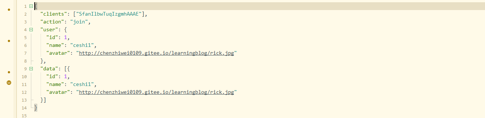
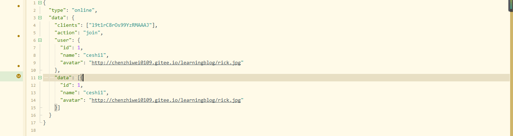
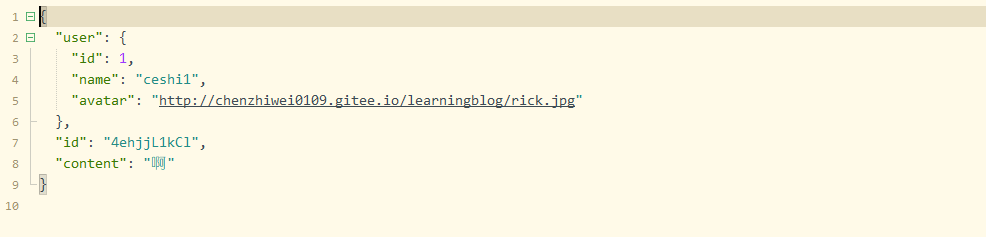

# 实时通信

## sockit.io基本用法

### 前端当前连接收发

- uni-sockit.io文档:https://ext.dcloud.net.cn/plugin?id=1461
- egg-sockit.io文档:https://eggjs.org/zh-cn/tutorials/socketio.html#client

url配置

```js
// export default {
// 	baseUrl:"http://liveapi.cchenzw.top",
// 	socketUrl:"http://liveapi.cchenzw.top",
// 	imageUrl:"http://liveapi.cchenzw.top",
// 	// 拉流前缀
// 	livePlayBaseUrl:"http://liveapi.cchenzw.top:23481",
// 	// 推流前缀
// 	livePushBaseUrl:"rtmp://liveapi.cchenzw.top:23480",
// }


export default {
    baseUrl: "http://192.168.101.10:7001",
    socketUrl: "http://192.168.101.10:7001",
    imageUrl: "http://192.168.101.10:7001",
    livePlayBaseUrl: "http://192.168.101.10:7001:23481",
    livePushBaseUrl: "rtmp://192.168.101.10:7001:23480",
}
```

```js
//store/index.js
import Vue from 'vue'
import Vuex from 'vuex'
Vue.use(Vuex)

import $H from '../common/request.js'
import io from '../common/uni-socket.io.js'
import $C from '../common/config.js'

export default new Vuex.Store({
    state:{
        user: null,
        token: null,
        socket: null
    },
    actions: {
        connectSocket({state,dispatch}) {
            //这里的url是后端地址,如果是本地服务器需要使用内网ip
            const socket = io($C.socketUrl, {  //
                query: {},
                transports: [ 'websocket'],
                timeout: 5000,
            });
            
            //监听连接
            socket.on('connect',()=>{
                console.log('已连接')
                
                //发送信息
                socket.emit('test','123456')
                
                //接收信息  
                socket.on(socket.id,e=>{
                    console.log(e) //'啊啊啊'
                })
            })
            
            //监听失败
            socket.on('error',()=>{
                console.log('连接失败')
            })
            
            //监听断开
            socket.on('disconnet',()=>{
                console.log('连接断开')
            })
        }
    }
})
```

```js
this.$store.dispatch('connectSocket')
```

### 后端当前连接收发

socket.io插件控制器：app/io/controller/nsp.js

```js
'use strict';

const Controller = require('egg').Controller;

class NspController extends Controller {
    async test() {
        const { ctx, app } = this;
        
        //接受信息
        const message = ctx.args[0] || {};
        console.log(message)//123456
        
		//发送信息
        const socket = ctx.socket
        socket.emit(socket.id,'啊啊啊')
    }
}

module.exports = NspController;
```

```js
//app\router.js
module.exports = app => {
    const { router, controller,io } = app;
	//命名空间of  test1必须和前端的一致
    io.of('/').route('test1',io.controller.nsp.test)
};
```

## 加入直播间后端

进入直播间的人都要归类到一个房间，这样一个人发送评论，后端就推送给每一位成员。

>前端传入token和直播间id

### 消息提示扩展helper.js

egg官网的案例https://eggjs.org/zh-cn/tutorials/socketio.html#helper

app\extend\helper.js

```js
module.exports = {
    parseMsg(action, payload = {}, metadata = {}) {
        const meta = {
            timestamp: Date.now(),
            ...metadata
        };

        return {
            meta,
            data: {
                action,
                payload,
            },
        };
    },
}
```

使用方法

```js
socket.emit(socket.id, ctx.helper.parseMsg('error', msg,{notoast:true}))
```

```js
socket.on(socket.id,e=>{
    let d = e.data;
    if(d.action==='error'){
        if(e.meta.notoast){
            return 
        }else{
            return uni.showToast({
                title: d.payload,
                icon: 'none'
            });
        }

    }
})
```

### 验证token方法

- 这个方法会对前端传入的token进行校验，然后把对应的user信息返回,如果错误就返回false并把错误信息传给前端

app\io\controller\nsp.js

```js
'use strict';

const Controller = require('egg').Controller;

class NspController extends Controller {
    async checkToken(token){
        const { ctx,app,service,helper } = this
        // 当前连接
        const socket = ctx.socket
        const id = socket.id
        // 用户验证
        if(!token){
            // 通知前端 您没有访问该接口的权限
            socket.emit(id,ctx.helper.parseMsg('error','您没有权限访问该接口'))
            return false
        }
        // 根据token解密，换取用户信息
        let user = {}
        try {
            user = ctx.checkToken(token)
        } catch (error) {
            let fail = error.name === 'TokenExpiredError' ? 'token 已过期! 请重新获取令牌' : 'Token 令牌不合法!';
            socket.emit(id,ctx.helper.parseMsg('error',fail))
            return false
        }
        // 判断用户是否登录
        let t = await ctx.service.cache.get('user_' + user.id)
        if(!t || t !== token){
            socket.emit(id,ctx.helper.parseMsg('error','Token 令牌不合法!'))
            return false
        }
        // 4.判断用户是否存在
        user = await app.model.User.findOne({
            where:{
                id:user.id
            }
        })
        if(!user){
            socket.emit(id,ctx.helper.parseMsg('error','用户不存在'))
            return false
        }
        return user
    }
}

module.exports = NspController;
```

### 验证直播间存在方法

app\service\live.js

- 如果直播间

```js
'use strict';

const Service = require('egg').Service;

class LiveService extends Service {
    // 直播间是否存在
    async exist(id) {
        const { app } = this
        return await app.model.Live.findOne({
            where: {
                id
            }
        })
    }
    //验证状态
    async checkStatus(id) {
        let live = await this.exist(id)
        if (!live) {
            return '直播间不存在'
        }

        if (live.status == 0) {
            return '直播间未开播'
        }

        if (live.status == 3) {
            return '直播间已结束'
        }
        // 1和2都说明直播间正在直播。
        return '直播间直播中'
    }
}

module.exports = LiveService;

```

### 加入直播间逻辑

>1. 获取到前端传递的观众token和直播间id
>2. 验证token和直播间
>3. 把当前用户的socket链接加入到这个直播间,直播间名为live_6
>4. 获取当前直播间的在线用户列表userList_live_6，这里需要删除掉当前用户，并把当前用户添加到列表头部，这样才能保证当前用户是最新进入直播间的人

```js
module.exports = app => {
    const { router, controller, io } = app;
    //加入实时直播间
    io.of('/').route('joinLive', io.controller.nsp.joinLive)
}
```

app\io\controller\nsp.js

```js
//观众进入直播间
async joinLive(){
    //解构
    const {ctx,app,service,helper} = this;
    //拿到当前命名空间
    const nsp = app.io.of('/')
    //拿到前端数据
    const message = ctx.args[0]||{}
    //拿到当前连接
    const socket = ctx.socket;
    //我们需要拿到前端传入的直播间id
    let {live_id,token} = message;
    //验证用户的token,如果没有，就直接return 
    let user = await this.checkToken(token);
    if(!user) {
        return
    }    
    // 验证当前直播间是否存在或是否处于直播中
    let liveStatus = await service.live.checkStatus(live_id);

    //如果未直播,就退出并把未直播的状态传入
    if(liveStatus!=='直播间直播中'){
        socket.emit(socket.id,ctx.helper.parseMsg('error',liveStatus))
        return
    }

    //直播间的房间
    const room = 'live_'+live_id;
    // 当前用户socket加入房间
    socket.join(room)


    // 获取当前房间redis里的的用户列表
    let list = await service.cache.get('userList_' + room);
    // 如果没有列表就创建列表
    list = list?list:[];
    // ** 新进入直播间的用户要追加到头部，所以要先把列表里这个用户删除然后追加到头部
    list = list.filter(item=>item.id !== user.id);
    //追加到头部
    list.unshift({
        id:user.id,
        name:user.username,
        avatar:user.avatar,
    })
    //把当前list缓存到userList
    service.cache.set('userList_' + room,list)

    //更新在线用户列表
    nsp.adapter.clients([room],(err,clients)=>{
        //到达房间
        nsp.to(room).emit('online',{
            clients,
            action:'join',
            user:{
                id:user.id
                name:user.username,
                avatar:user.avatar
            },
            data:list
        })
    })
    
    //加入直播间观看人数
    let liveUser = await app.model.LiveUser.findOne({
        where:{user_id:user.id,live_id}
    })
    if(!liveUser){
        app.model.LiveUser.create({
            user_id:user.id,live_id
        })
        //直播间观看人数+1
        let live =  await app.model.Live.findOne({
            where:{
                live_id
            }
        })
        if(live){
            //sequlize
            live.increment({
                look_count:1
            })
        }
    }
}
```

## 加入直播间前端

```js
import {mapState} from 'vuex';
export default {
    computed: {
        ...mapState(['socket', 'token', 'user']),
    },
    async onLoad(e) {
        //直播间id
        this.id = e.id;
    },
    mounted() {
        this.joinLive();
    },
    methods:{
        //定义加入直播间方法
        joinLive(){
            if(this.socket&&this.token){
                //调用后端joinLive接口
                this.socket.emit('joinLive',{
                    live_id:this.id,
                    token:this.token
                })
            }
        }
    }
}
```

监听当前socket连接的报错

```js
//store/index.js
connectSocket({
    state,
    dispatch
}) {
    const Socket = io($C.socketUrl, { //
        query: {},
        transports: ['websocket'],
        timeout: 5000,
    });

    Socket.on('connect', () => {	
        console.log('连接成功');
        state.socket = Socket;

        Socket.on(Socket.id, e => {
            let d = e.data;
            //监听报错
            if(d.action==='error'){
                return uni.showToast({
                    title: d.payload,
                    icon: 'none'
                });
            }
        })
    })

    Socket.on('error', () => {
        state.socket =null
        console.log('连接失败')
    })

    Socket.on('disconnet', () => {
        state.socket =null
        console.log('连接断开')
    })
},
```

## 离开直播间后端

离开直播间也需要验证用户的token。所以要传入token

```js
io.of('/').route('leaveLive', io.controller.nsp.leaveLive)
```

```js

//离开直播间
async leaveLive() {
    const { ctx, app, service, helper } = this;
    const nsp = app.io.of('/')
    const message = ctx.args[0] || {}
    const socket = ctx.socket;
    let { live_id, token } = message;
    let user = await this.checkToken(token);
    if (!user) {
        return
    }
    // 验证当前直播间是否存在或是否处于直播中
    let liveStatus = await service.live.checkStatus(live_id);

    //如果未直播,就退出并把未直播的状态传入
    if (liveStatus !== '直播间直播中') {
        socket.emit(socket.id, ctx.helper.parseMsg('error', liveStatus))
        return
    }

    //直播间的房间
    const room = 'live_' + live_id;
    // 当前socket连接离开房间
    socket.leave(room)


    //更新redis存储，拿到当前直播间的用户列表
    let list = await service.cache.get('userList_' + room)
    if (list) {
        // 筛选
        list = list.filter(item => item.id !== user.id)
        await service.cache.set('userList_' + room, list)

    }

    //更新在线用户列表
    nsp.adapter.clients([room], (err, clients) => {
        //通知其他用户
        nsp.to(room).emit('online', {
            clients,
            action: 'leave',
            user: { //移除掉
                id: user.id,
                name: user.username,
                avatar: user.avatar
            },
            data: list
        })
    })

}
```

## 离开直播间前端

```js
import {mapState} from 'vuex';
export default {
    computed: {
        ...mapState(['socket', 'token', 'user']),
    },
    destroyed() {
        this.leaveLive();
    },
    methods:{
        //定义加入直播间方法
        leaveLive(){
            if(this.socket&&this.token){
                //调用后端joinLive接口
                this.socket.emit('leaveLive',{
                    live_id:this.id,
                    token:this.token
                })
            }
        }
    }
}
```

## 获取直播间实时在线人数

后端会传递人数

```js
//更新在线用户列表
nsp.adapter.clients([room], (err, clients) => {
    //到达房间
    nsp.to(room).emit('online', {
        clients,
        action: 'join',
        user: {
            id: user.id,
            name: user.username,
            avatar: user.avatar
        },
        data: list
    })
})
```

传输格式e:



vuex配置

```js
connectSocket({
    state,
    dispatch
}) {
    const Socket = io($C.socketUrl, {
        query: {},
        transports: ['websocket'],
        timeout: 5000,
    });

    //在线用户事件
    let onlineEvent = (e)=>{
        uni.$emit('live',{
            type:"online",
            data:e
        })
    }
    Socket.on('connect', () => {
        console.log('连接成功');
        state.socket = Socket;
        Socket.on('online',onlineEvent)
    })
    //移除监听事件
    Socket.on('disconnect',()=>{
        if(Socket){Socket.removeListener('online',onlineEvent)}
        state.socket = null
        console.log('已断开')
    })
},
```

直播间页面

- 在mounted阶段监听live事件，在destoryed阶段移除live事件

- e参数内容

  

```js
export default = {
    mounted() {
        uni.$on('live', this.handleLiveEvent);  
    },
    destroyed() {
        uni.$off('live', this.handleLiveEvent);
    },
    methods:{
        handleLiveEvent({type,data}) {
            console.log(type, data);
            switch (type) {
                case 'online':
                    this.userList = data.data;
                    break;
            }
        },
    }
}
```

## 实时弹幕后端

```
io.of('/').route('comment',io.controller.nsp.comment)
```

需要知道是谁发的评论、直播间id、发送评论的人的token

```js
//发送消息
async comment() {
    const { ctx, app, service, helper } = this;
    const nsp = app.io.of('/')
    const message = ctx.args[0] || {}
    const socket = ctx.socket;
    let { live_id, token } = message;
    let user = await this.checkToken(token);
    if (!user) {
        return
    }
    // 验证当前直播间是否存在或是否处于直播中
    let liveStatus = await service.live.checkStatus(live_id);

    //如果未直播,就退出并把未直播的状态传入
    if (liveStatus !== '直播间直播中') {
        socket.emit(socket.id, ctx.helper.parseMsg('error', liveStatus))
        return
    }

    const room = 'live_' + live_id
    nsp.to(room).emit('comment',{
        user:{
            id:user.id,
            name:user.nickname || user.username,
            avatar:user.avatar,
        },
        id:ctx.randomString(10), //用于前端refs确定当前弹幕的唯一性,以便及时定位
        content:data
    })
    app.model.Comment.create({
        content:data,
        live_id,
        user_id:user.id
    })

}
```

## 实时弹幕前端

vuex配置

```js
connectSocket({
    state,
    dispatch
}) {
    const Socket = io($C.socketUrl, {
        query: {},
        transports: ['websocket'],
        timeout: 5000,
    });

    let commentEvent = (e) => {
        uni.$emit('live', {
            type: "comment",
            data: e
        })
    }
    Socket.on('connect', () => {
        console.log('连接成功');
        state.socket = Socket;
        Socket.on('comment', commentEvent)
    })
    const removeListener = () => {
        if (Socket) {
            Socket.removeListener('comment', commentEvent)
        }
    }
    //移除监听事件
    Socket.on('disconnect',()=>{
        if(Socket){Socket.removeListener('online',onlineEvent)}
        state.socket = null
        console.log('已断开')
    })
},
```

e的内容



```js
export default  {
    //live.nvue
    handleLiveEvent({
        type,
        data
    }) {
        switch (type) {
            case 'online':
                this.userList = data.data;
                break;
            case 'comment':
                this.getDanmu(data.id, data.user.name, data.content)
                break;
        }
    },
    //发送弹幕
    sendDanmu(id, name, content) {
        this.$refs.danmu.send({
            id,
            name,
            content
        });
        this.content = '';
        this.$refs.input.close();
        uni.hideKeyboard();
    },
    //发送弹幕信息到服务器
    submit() {
        if (this.content === '') {
                    this.$refs.input.close();
            uni.hideKeyboard();
            return;
        }
        // 如果没有token或者没有socket就登陆
        if (!this.token && !this.socket) {
            uni.navigateTo({
                url: '../login/login'
            });
            return uni.showToast({
                title: '请先登录',
                icon: 'none'
            });
        }
        // 发送到后端
        if (this.socket) {
            this.socket.emit('comment', {
                live_id: this.id,
                data: this.content,
                token: this.token
            });
        }
        uni.hideKeyboard();
        // this.$refs.danmu.send({
        // 	id: Math.random() * 100,
        // 	name: '昵称',
        // 	content: this.content
        // });
    },
}
```

## 实时礼物后端

```js
  io.of('/').route('gift',io.controller.nsp.gift)
```


```js
async gift() {
    const { ctx, app, service, helper } = this;
    const nsp = app.io.of('/')
    const message = ctx.args[0] || {}
    const socket = ctx.socket;
    let { live_id, token, gift_id } = message;
    let user = await this.checkToken(token);
    if (!user) {
        return
    }
    // 验证当前直播间是否存在或是否处于直播中
    let liveStatus = await service.live.checkStatus(live_id);

    //如果未直播,就退出并把未直播的状态传入
    if (liveStatus !== '直播间直播中') {
        socket.emit(socket.id, ctx.helper.parseMsg('error', liveStatus))
        return
    }

    //直播间的房间
    const room = 'live_' + live_id;

    // 验证礼物是否存在
    let gift = await app.model.Gift.findOne({
        where: {
            id: gift_id
        }
    })

    if (!gift) {
        socket.emit(id, ctx.helper.parseMsg('error', '该礼物不存在'))
        return
    }

    // 当前用户金币是否不足
    if (user.coin < gift.coin) {
        socket.emit(id, ctx.helper.parseMsg('error', '金币不足，请先充值'))
        return
    }
    // 扣除金币
    user.coin -= gift.coin
    await user.save()
    // 写入到礼物记录表
    app.model.LiveGift.create({
        live_id,
        user_id: user.id,
        gift_id
    })

    // 直播间总金币数
    let live = await app.model.Live.findOne({
        where: {
            id: live_id
        }
    })
    live.coin += gift.coin
    live.save()
    // 推送消息到直播间
    nsp.to(room).emit('gift', {
        avatar: user.avatar,
        username: user.nickname || user.username,
        gift_name: gift.name,
        gift_image: gift.image,
        gift_coin: gift.coin,
        num: 1,
    })

}
```

## 实时礼物前端


