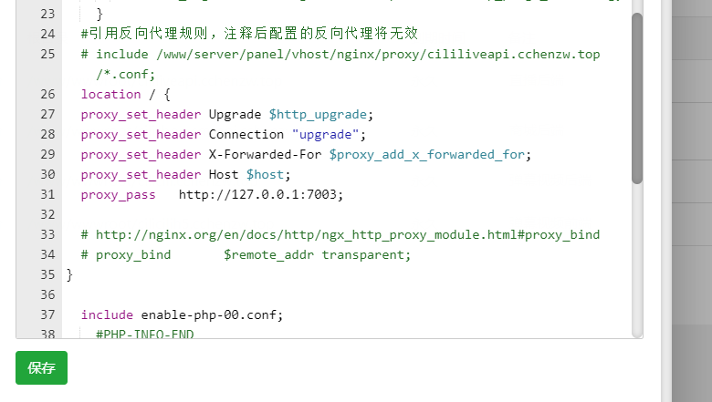

# 上线和后续更新

## 1.修改根路径

```js
export default {
    // 根路径
    baseUrl: "http://cililiveapi.cchenzw.top",
    // socket路径
    socketUrl: "http://cililiveapi.cchenzw.top",
    // 图片路径
    imageUrl: "http://cililiveapi.cchenzw.top",
    // 拉流前缀
    livePlayBaseUrl: "http://cililiveapi.cchenzw.top:23481/live",
    // 推流前缀
    livePushBaseUrl: "rtmp://cililiveapi.cchenzw.top:23480/live"
}

```

## 2. 登录页设为首页

```js
//login.vue
created() {
    let token = uni.getStorageSync('token')
    if(!token){

        return this.showLoading = false
    }
    // 用户已登录
    uni.switchTab({
        url:"../index/index"
    })
},
```

```json
//page.json把login放到第一个
{
    "path": "pages/login/login",
    "style": {
        "app-plus": {
            "titleNView": false,
            "animationType": "zoom-out",
            "animationDuration": 300
        }
    }
},
```

## 3.socket反向代理

https://eggjs.org/zh-cn/tutorials/socketio.html#%E9%83%A8%E7%BD%B2**Nginx 配置**



## 4.推流拉流地址修改

```js
export default{
    computed: {
        src() {
            if (this.detail.key == '' || this.sign == '') {
                return '';
            }
            return `${this.livePlayBaseUrl}/${this.detail.key}.flv?sign=${this.sign}`;
        }
    },
}
```

## 5.证书


