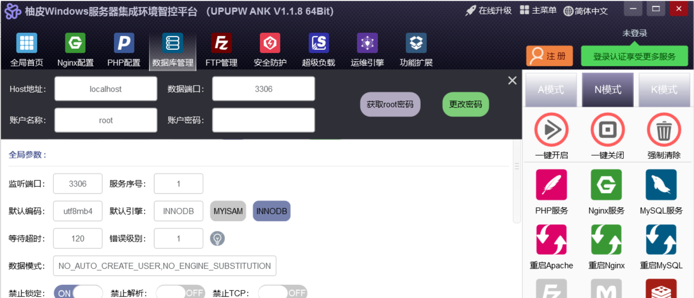
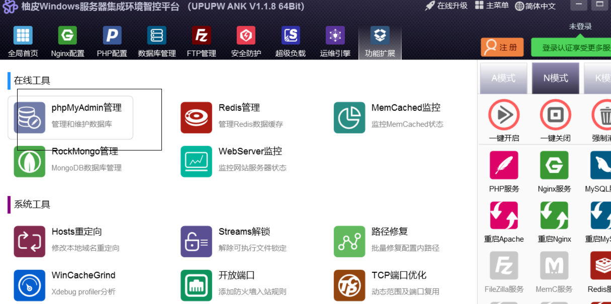

## 创建项目

```bash
全局切换镜像： 
npm config set registry https://registry.npm.taobao.org
```

我们推荐直接使用脚手架，只需几条简单指令，即可快速生成项目（`npm >=6.1.0`）:

```bash
mkdir egg-example && cd egg-example
npm init egg --type=simple --registry https://registry.npm.taobao.org
npm i
```

启动项目:

```bash
npm run dev
open http://localhost:7001
```

## egg-cors跨域

https://eggjs.org/zh-cn/core/security.html#%E5%AE%89%E5%85%A8%E5%A8%81%E8%83%81-csrf-%E7%9A%84%E9%98%B2%E8%8C%83

>CSRF的作用:页面渲染时会生成一个密钥，提交时如果

```bash
npm i egg-cors --save
```

- 配置插件

```js
// /config/plugin.js
cors:{
  enable: true,
  package: 'egg-cors',
},
```

- config / config.default.js 目录下配置

```js

// 允许跨域的方法
config.cors = {
    origin: '*',
    allowMethods: 'GET, PUT, POST, DELETE, PATCH'
};
```

## csrf跨站伪造处理

- 后台防止恶意伪造请求对网站进行攻击
- 以api作为开头的是客户端代码，不需要进行csrf验证，以/admin开通的需要进行scrf验证

```js
// /config/plugin.js
config.security = {
    // /api开头的不执行csrf验证
    csrf: {
        headerName: 'x-csrf-token',
        ignore: ctx => {
            return ctx.request.url.startsWith('/api')
        },
    },
    // 跨域白名单
    // domainWhiteList: ['http://localhost:3000'],
};
```

## 封装api返回格式函数

在app/extend目录下作为[扩展部分](https://eggjs.org/zh-cn/basics/extend.html)

```js
// app/extend/context.js
module.exports = {
    // 成功提示
    apiSuccess(data = '', msg = 'ok', code = 200) {
        this.body = { msg, data }; //json形式返回
        this.status = code;
    },
    // 失败提示
    apiFail(data = '', msg = 'fail', code = 400) {
        this.body = { msg, data };
        this.status = code;
    },
};
```

使用:

```js
'use strict';
const Controller = require('egg').Controller;
class HomeController extends Controller {
    //
    async index() {
        const { ctx } = this;
        ctx.body = {
            msg:'ok',
            data:'测试'
        }
        ctx.status = 200
    };
    //相当于
    async index2() {
        const { ctx } = this;
		ctx.apiSuccess('测试数据','ok',200)
    }
}
module.exports = HomeController;
```

## 全局错误处理中间件

每个中间件都是一个洋葱圈，数组顺序就是中间件加载顺序

- 加载中间件
  - 下划线改成驼峰

```js
// config/config.default.js
config.middleware = ['errorHandler'];
```

- 编写异常处理中间件

```js
// app/middleware/error_handler.js
module.exports = (option, app) => {
    return async function errorHandler(ctx, next) {
        try {
            //执行 
            await next(); 
            // 404 处理
            if(ctx.status === 404 && !ctx.body){
                ctx.body = { 
                    msg:"fail",
                    data:'404 not found'
                };
            }
        } catch (err) {//捕获异常
            // 记录一条错误日志
            app.emit('error', err, ctx);
            const status = err.status || 500;
            // 生产环境时 500 错误的详细错误内容不返回给客户端，因为可能包含敏感信息
            let error = status === 500 && app.config.env === 'prod'
            ? '内部服务器错误'
            : err.message;
            // 从 error 对象上读出各个属性，以json格式返回
            ctx.body = { 
                msg:"fail",
                data:error
            };
            ctx.status = status;
        }
    };
};
```

- 使用异常处理中间件

  ```js
  'use strict';
  const Controller = require('egg').Controller;
  class HomeController extends Controller {
      async index() {
          const { ctx } = this;
          ctx.throw('错误')
      }
  }
  module.exports = HomeController;
  
  ```

  

## sequelize数据库配置

安装并配置[egg-sequelize](https://github.com/eggjs/egg-sequelize)插件（它会辅助我们将定义好的 Model 对象加载到 app 和 ctx 上）和[mysql2](https://github.com/sidorares/node-mysql2)模块：

```js
npm install --save egg-sequelize mysql2
```

在`config/plugin.js`中引入 egg-sequelize 插件

```json
sequelize: {
    enable: true,
    package: 'egg-sequelize'
}
```

在`config/config.default.js`里配置数据库

```js
config.sequelize = {
    dialect: 'mysql',
    host: '127.0.0.1',
    username: "root",
    password: 'root',
    port: 3306,
    database: 'liveapi',//数据库名字
    // 中国时区
    timezone: '+08:00',
    define: {
      // 取消数据表名复数
      freezeTableName: true,
      // 自动写入时间戳 created_at updated_at
      timestamps: true,
      // 字段生成软删除时间戳 deleted_at
      // paranoid: true,
      createdAt: 'created_time',
      updatedAt: 'updated_time',
      // deletedAt: 'deleted_time',
      // 所有驼峰命名格式化
      underscored: true
    }
  };
```

## 迁移的好处

>Sequelize是Nodejs生态中一个比较出名的ORM框架。通过ORM框架，可以使用对象来操作数据库表数据，提高了开发效率和代码可读性，也方便后期维护。

迁移的好处，可以类比git。通过每次创建迁移文件，来支持更新，回滚数据库表结构，也方便协同开发，也避免人工手动去直接修改数据库，用代码自动管理。换个电脑，也不用去拷贝数据库，直接运行迁移就可以完全恢复开发环境，极大减轻了心智负担。

## 数据库迁移配置

sequelize 提供了[sequelize-cli](https://github.com/sequelize/cli)工具来实现[Migrations](http://docs.sequelizejs.com/manual/tutorial/migrations.html)，我们也可以在 egg 项目中引入 sequelize-cli。

```js
npm install --save-dev sequelize-cli
```

egg 项目中，我们希望将所有数据库 Migrations 相关的内容都放在`database`目录下，所以我们在项目根目录下新建一个.sequelizerc配置文件：

```js
'use strict';

const path = require('path');

module.exports = {
  config: path.join(__dirname, 'database/config.json'),
  'migrations-path': path.join(__dirname, 'database/migrations'),
  'seeders-path': path.join(__dirname, 'database/seeders'),
  'models-path': path.join(__dirname, 'app/model'),
};
```

初始化 Migrations 配置文件和目录

```js
npx sequelize init:config
npx sequelize init:migrations
// npx sequelize init:models
```

行完后会生成`database/config.json`文件和`database/migrations`目录，我们修改一下`database/config.json`中的内容，将其改成我们项目中使用的数据库配置：

```json
{
  "development": {
    "username": "root",
    "password": "root",
    "database": "liveapi",
    "host": "127.0.0.1",
    "dialect": "mysql",
    "timezone": "+08:00",
    "operatorsAliases": false
  }
}
```

创建数据库

```js
npx sequelize db:create
# 升级数据库
npx sequelize db:migrate
# 如果有问题需要回滚，可以通过 `db:migrate:undo` 回退一个变更
# npx sequelize db:migrate:undo
# 可以通过 `db:migrate:undo:all` 回退到初始状态
# npx sequelize db:migrate:undo:all
```

upupwank集成环境进入数据库





## 404处理

```js
return await ctx.pageFail('该记录不存在',404)
```

```js
module.exports = {
    async pageFail(data = '', code = 404) {
        return await this.render('admin/common/404.html', {
            data, code
        })
    },
}
```

## 参数验证

插件地址：

> https://www.npmjs.com/package/egg-valparams

安装

```
npm i egg-valparams --save
```

配置

```js
// config/plugin.js
valparams : {
  enable : true,
  package: 'egg-valparams'
},
// config/config.default.js
config.valparams = {
    locale    : 'zh-cn',
    throwError: true
};
```

中间件：app/middleware/error_handler.js

```
module.exports = (option, app) => {
    return async function errorHandler(ctx, next) {
        try {
            await next();
            // 404 处理
            if (ctx.status === 404 && !ctx.body) {
                ctx.body = {
                    msg: "fail",
                    data: '404 错误'
                };
            }
        } catch (err) {
            // 记录一条错误日志
            app.emit('error', err, ctx);

            let status = err.status || 500;
            // 生产环境时 500 错误的详细错误内容不返回给客户端，因为可能包含敏感信息
            let error = status === 500 && app.config.env === 'prod'
                ? 'Internal Server Error'
                : err.message;

            // 从 error 对象上读出各个属性，设置到响应中
            ctx.body = {
                msg: "fail",
                data: error
            };

            // 参数验证异常
            if (status === 422 && err.message === "Validation Failed") {
                if (err.errors && Array.isArray(err.errors)) {
                    error = err.errors[0].err[0] ? err.errors[0].err[0] : err.errors[0].err[1];
                }
                ctx.body = {
                    msg: "fail",
                    data: error
                };
            }

            ctx.status = status;
        }
    };
};
```

在控制器里使用

```js
class XXXController extends app.Controller {
  // ...
  async XXX() {
    const {ctx} = this;
    ctx.validate({
      xxxx	  :	{type: 'string', required: false, defValue: 'account', desc: '系统名称'},
      system  : {type: 'string', required: false, defValue: 'account', desc: '系统名称'},
      token   : {type: 'string', required: true, desc: 'token 验证'},
      redirect: {type: 'string', required: false, desc: '登录跳转'}
    });
    // if (config.throwError === false)
    if(ctx.paramErrors) {
      // get error infos from `ctx.paramErrors`;
    }
    let params = ctx.params;
    let {query, body} = ctx.request;
    // ctx.params        = validater.ret.params;
    // ctx.request.query = validater.ret.query;
    // ctx.request.body  = validater.ret.body;
    // ...
    ctx.body = query;
  }
  // ...
}
```

## ValParams API 说明

#### 参数验证处理

Valparams.setParams(req, params, options);

| Param                       | Type                                               | Description                                                  | Example                                                      |
| --------------------------- | -------------------------------------------------- | ------------------------------------------------------------ | ------------------------------------------------------------ |
| req                         | Object                                             | request 对象,这里我们就是取相应的三种请求的参数进行参数验证  | {params, query, body}                                        |
| params                      | Object                                             | 参数的格式配置 { pname: {alias, type, required, range: {in, min, max, reg, schema }, defValue, trim, allowEmptyStr, desc[, detail] } } | {sysID : {alias:'sid',type: 'int', required: true, desc: '所属系统id'}} |
| params[pname]               | String                                             | 参数名                                                       |                                                              |
| params[pname].alias         | String                                             | 参数别名，可以使用该参数指定前端使用的参数名称               |                                                              |
| params[pname].type          | String                                             | 参数类型                                                     | 常用可选类型有 int, string, json 等，其他具体可见下文或用 Valparams.vType 进行查询 |
| params[pname].required      | Boolean                                            | 是否必须                                                     |                                                              |
| params[pname].range         | Object                                             | 参数范围控制                                                 | {min: '112.80.248.10', max: '112.80.248.72'}                 |
| params[pname].range.min     | ALL                                                | 最小值、最短、最早（不同 type 参数 含义有所差异）            |                                                              |
| params[pname].range.max     | ALL                                                | 最大值、最长、最晚（不同 type 参数 含义有所差异）            |                                                              |
| params[pname].range.in      | Array                                              | 在XX中，指定参数必须为其中的值                               |                                                              |
| params[pname].range.reg     | RegExp                                             | 正则判断，参数需要符合正则                                   |                                                              |
| params[pname].range.schema  | Object                                             | jsonSchema，针对JSON类型参数有效，使用ajv对参数进行格式控制  |                                                              |
| params[pname].defValue      | ALL                                                | 默认值，没传参数或参数验证出错时生效，此时会将该值赋值到相应参数上 |                                                              |
| params[pname].trim          | Boolean                                            | 是否去掉参数前后空格字符，默认false                          |                                                              |
| params[pname].allowEmptyStr | Boolean                                            | 是否允许接受空字符串，默认false                              |                                                              |
| params[pname].desc          | String                                             | 参数含义描述                                                 |                                                              |
| options                     | Object                                             | 参数关系配置                                                 |                                                              |
| options.choices             | Array                                              | 参数挑选规则                                                 | [{fields: ['p22', 'p23', 'p24'], count: 2, force: true}] 表示'p22', 'p23', 'p24' 参数三选二 |
| options.choices[].fields    | Array                                              | 涉及的参数                                                   |                                                              |
| options.choices[].count     | Number                                             | 需要至少传 ${count} 个                                       |                                                              |
| options.choices[].force     | Boolean                                            | 默认 false，为 true 时，涉及的参数中只能传 ${count} 个, 为 false 时，可以多于 ${count} 个 |                                                              |
| options.equals              | Array                                              | 参数相等                                                     | [['p20', 'p21'], ['p22', 'p23']] 表示 'p20', 'p21' 两个值需要相等，'p22', 'p23' 两个值需要相等 |
| options.equals[]            | Array                                              | 涉及的参数(涉及的参数的值需要是相等的)                       |                                                              |
| options.compares            | Array                                              | 参数大小关系                                                 | [['p25', 'p26', 'p27']] 表示 'p25', 'p26', 'p27' 必须符合 'p25' <= 'p26' <= 'p27' |
| options.compares[]          | Array                                              | 涉及的参数(涉及的参数的值需要是按顺序从小到大的)             |                                                              |
| options.cases               | Object                                             | 参数条件判断                                                 | [{when: ['p30'], then: ['p31'], not: ['p32']}] 表示 当传了 p30 就必须传 p31 ,同时不能传p32 |
| options.cases.when          | Array                                              | 条件                                                         |                                                              |
| options.cases.when[]        | String                                             | 涉及的参数，（字符串）只要接收到的参数有这个字段即为真       |                                                              |
| options.cases.when[].field  | 涉及的参数的名（对象）                             | ---                                                          |                                                              |
| options.cases.when[].value  | 涉及的参数的值（对象）需要参数的值与该值相等才为真 | ---                                                          |                                                              |
| options.cases.then          | Array                                              | 符合when条件时，需要必传的参数                               |                                                              |
| options.cases.not           | Array                                              | 符合when条件时，不能接收的参数                               |                                                              |

```
const Valparams = require('path/to/Valparams[/index]');
Valparams.locale('zh-cn');

function list(req, res, next) {
  let validater = Valparams.setParams(req, {
    sysID : {alias:'sid',type: 'int', required: true, desc: '所属系统id'},
    page  : {type: 'int', required: false, defValue: 1, range:{min:0}, desc: '页码'},
    size  : {type: 'int', required: false, defValue: 30, desc: '页面大小'},
    offset: {type: 'int', required: false, defValue: 0, desc: '位移'}
  }, {
    choices : [{fields: ['sysID', 'page'], count: 1, force: false}],
  });
  if (validater.err && validater.err.length) {
    console.log(validater.err);
  }
  else {
    console.log(validater);
    //{ query: { page: 1, size: 30 },
    //  body: {},
    //  params: { sysID: 2 },
    //  all: { sysID: 2, page: 1, size: 30 },
    //  err: null }
    //  raw: { query: { page: 1, size: 30 },
    //         body: {},
    //         params: { sid: 2 },
    //       }
    //}
    //do something
  }
}
```

#### 返回支持的类型列表

```
Valparams.vType = {
  ALL        : 'all',
  STRING     : 'string',
  ARRAY      : 'array',
  DATE       : 'date',
  INT        : 'int',
  FLOAT      : 'float',
  LETTER     : 'letter',
  NUMBER     : 'number',
  IP         : 'ip',
  EMAIL      : 'email',
  PHONE      : 'phone',
  URL        : 'url',
  JSON       : 'json',
  BOOL       : 'bool',
  NULL       : 'null',
  RANGE      : 'range',
  DATERANGE  : 'dateRange',
  INTRANGE   : 'intRange',
  FLOATRANGE : 'floatRange',
  NUMBERRANGE: 'numberRange'
};
```

##### 自定义本地化文件

Valparams.defineLocale(key, value);

| Param | Type   | Description                                                  | Example |
| ----- | ------ | ------------------------------------------------------------ | ------- |
| key   | String | 语言标识                                                     | zh-cn   |
| value | Object | 本地化内容，可配置内容有 em_type, em_minmax, em_reg, em_in, em_schema, em_required, em_range_relation, em_choices, em_equals, em_compares, em_cases | ---     |

##### 更新已有本地化文件内容

Valparams.updateLocale(key, value);

参数含义同 defineLocale

##### 获取本地化文件内容

Valparams.localeData(key);

| Param | Type   | Description | Example |
| ----- | ------ | ----------- | ------- |
| key   | String | 语言标识    | zh-cn   |

##### 列出已加载的本地化文件

Valparams.locales(key);

目前已有 en 、 zh-cn

| Param | Type   | Description | Example |
| ----- | ------ | ----------- | ------- |
| key   | String | 语言标识    | zh-cn   |

##### 设置使用的本地化文件

Valparams.locale(locale); 如： `Valparams.locale('zh-cn')`;