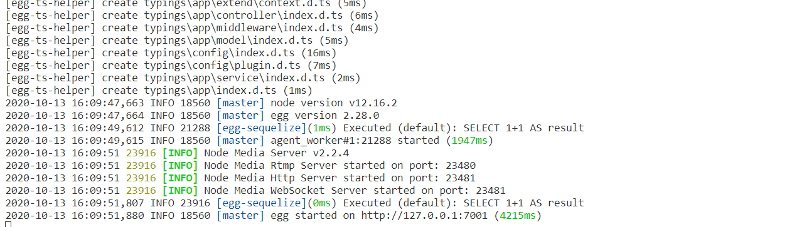
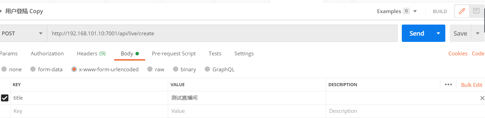
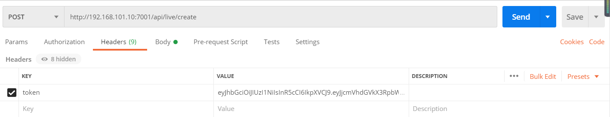
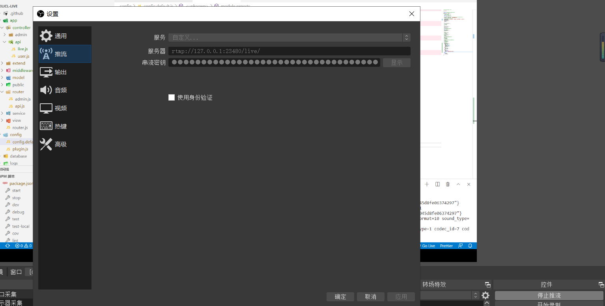
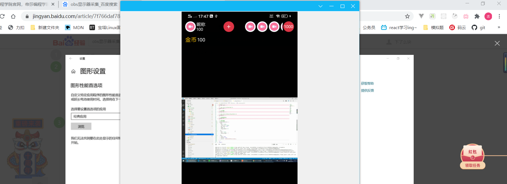
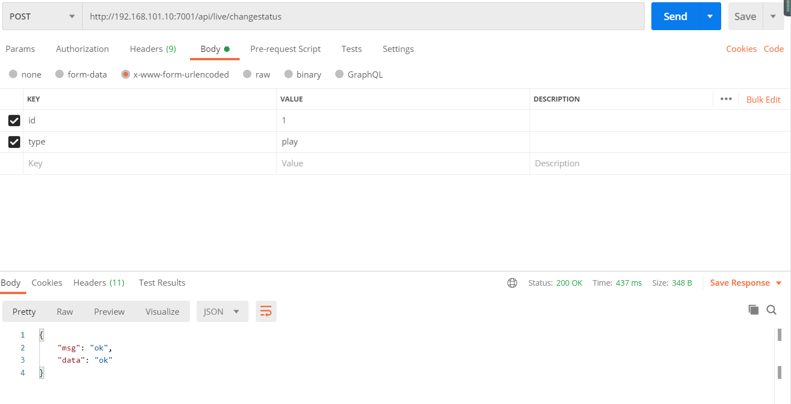

# 直播间

## rtmp协议

TMP协议是Real Time Message Protocol(实时信息传输协议)的缩写，它是由Adobe公司提出的一种应用层的协议，用来解决多媒体数据传输流的多路复用（Multiplexing）和分包（packetizing）的问题。

RTMP在收发数据的时候并不是以Message为单位的，而是把Message拆分成Chunk发送，而且必须在一个Chunk发送完成之后才能开始发送下一个Chunk。

## 直播服务器搭建

```
npm install node-media-server --save
```

文档：https://github.com/illuspas/Node-Media-Server/blob/master/README_CN.md

### 流媒体配置

配置：config/config.default.js

```js
// 流媒体配置
config.mediaServer = {
    rtmp: { //rtmp延时低，
        port: 23480,
        chunk_size: 60000,
        gop_cache: true,//快速播放，用于快速启动客户端，会缓存最近的gop并且派送到客户端
        ping: 30,
        ping_timeout: 60
    },
    http: {
        port: 23481,
        allow_origin: '*'
    },
    auth: {
        play: true,
        publish: true,
        secret: 'nodemedia2017privatekey',
    },
};
```

### didLoad生命周期启动流媒体服务

启动流媒体服务：app.js

- 根目录新建app.js,https://eggjs.org/zh-cn/basics/app-start.html

```
配置文件即将加载，这是最后动态修改配置的时机（configWillLoad）
配置文件加载完成（configDidLoad）
文件加载完成（didLoad）	(这里可以启动自定义服务，所以在这里写)
插件启动完毕（willReady）
worker 准备就绪（didReady）
应用启动完成（serverDidReady）  (http已经启动)
应用即将关闭（beforeClose）
```

- 事件回调,[文档地址](https://github.com/illuspas/Node-Media-Server/blob/master/README_CN.md#%E4%BA%8B%E4%BB%B6%E5%9B%9E%E8%B0%83)

```js
// app.js
// 引入
const NodeMediaServer = require('node-media-server');
class AppBootHook {
    constructor(app) {
        this.app = app;
    }

    configWillLoad() {
        // 此时 config 文件已经被读取并合并，但是还并未生效
        // 这是应用层修改配置的最后时机
        // 注意：此函数只支持同步调用
    }

    async didLoad() {
        // 所有的配置已经加载完毕
        // 可以用来加载应用自定义的文件，启动自定义的服务
        // 启动流媒体服务
        if (!this.app.nms) { //如果没有这个事件，就启动他
            //使用nms关键字接受 mediaServer配置
            this.app.nms = new NodeMediaServer(this.app.config.mediaServer)
            //运行
            this.app.nms.run();
			
            this.app.nms.on('preConnect', (id, args) => {
                console.log('[NodeEvent on preConnect]', `id=${id} args=${JSON.stringify(args)}`);
                // let session = nms.getSession(id);
                // session.reject();
            });

            this.app.nms.on('postConnect', (id, args) => {
                console.log('[NodeEvent on postConnect]', `id=${id} args=${JSON.stringify(args)}`);
            });

            this.app.nms.on('doneConnect', (id, args) => {
                console.log('[NodeEvent on doneConnect]', `id=${id} args=${JSON.stringify(args)}`);
            });

            this.app.nms.on('prePublish', (id, StreamPath, args) => {
                console.log('[NodeEvent on prePublish]', `id=${id} StreamPath=${StreamPath} args=${JSON.stringify(args)}`);
                // let session = nms.getSession(id);
                // session.reject();
            });

            this.app.nms.on('postPublish', (id, StreamPath, args) => {
                console.log('[NodeEvent on postPublish]', `id=${id} StreamPath=${StreamPath} args=${JSON.stringify(args)}`);
            });

            this.app.nms.on('donePublish', (id, StreamPath, args) => {
                console.log('[NodeEvent on donePublish]', `id=${id} StreamPath=${StreamPath} args=${JSON.stringify(args)}`);
            });

            this.app.nms.on('prePlay', (id, StreamPath, args) => {
                console.log('[NodeEvent on prePlay]', `id=${id} StreamPath=${StreamPath} args=${JSON.stringify(args)}`);
                // let session = nms.getSession(id);
                // session.reject();
            });

            this.app.nms.on('postPlay', (id, StreamPath, args) => {
                console.log('[NodeEvent on postPlay]', `id=${id} StreamPath=${StreamPath} args=${JSON.stringify(args)}`);
            });

            this.app.nms.on('donePlay', (id, StreamPath, args) => {
                console.log('[NodeEvent on donePlay]', `id=${id} StreamPath=${StreamPath} args=${JSON.stringify(args)}`);
            });
        }
    }

    async willReady() {
        // 所有的插件都已启动完毕，但是应用整体还未 ready
        // 可以做一些数据初始化等操作，这些操作成功才会启动应用
    }

    async didReady() {
        // 应用已经启动完毕
    }

    async serverDidReady() {
        // http / https server 已启动，开始接受外部请求
        // 此时可以从 app.server 拿到 server 的实例

        // this.app.server.on('timeout', socket => {
        //     // handle socket timeout
        // });
    }
}

module.exports = AppBootHook;
```

```sh
npm run dev
```



### 鉴权签名算法

文档地址:[地址](https://github.com/illuspas/Node-Media-Server/blob/master/README_CN.md#%E9%89%B4%E6%9D%83%E9%AA%8C%E8%AF%81)

加密后的 URL 形式:

>rtmp://hostname:port/appname/stream?sign=expires-HashValue 主播端
>http://hostname:port/appname/stream.flv?sign=expires-HashValue	观众端
>ws://hostname:port/appname/stream.flv?sign=expires-HashValue webSocket协议

1. 配置验证秘钥为: 'nodemedia2017privatekey'，同时打开播放和发布的鉴权开关

   ```js
   // 流媒体配置
   config.mediaServer = {
       rtmp: {
           port: 23480,
           chunk_size: 60000,
           gop_cache: true,
           ping: 30,
           ping_timeout: 60
       },
       http: {
           port: 23481,
           allow_origin: '*'
       },
       auth: {
           play: true,
           publish: true,
           secret: 'nodemedia2017privatekey',
       },
   };
   ```

2. 请求过期时间为: 2017/8/23 11:25:21 ,则请求过期时间戳为:

   >1503458721 parseInt((Date.now() + 10000000) / 1000)

3. md5计算结合“完整流地址-失效时间-密钥”的字符串:

   >HashValue = md5("/live/stream-1503458721-nodemedia2017privatekey”)
   >HashValue = 80c1d1ad2e0c2ab63eebb50eed64201a

4. 最终推流地址为

   >rtmp://192.168.0.10/live/stream?sign=1503458721-80c1d1ad2e0c2ab63eebb50eed64201a
   >注意：'sign' 关键字不能修改为其他的

5. 算法

   ```
   
   ```

   

   ```js
   npm i -S md5
   const md5 = require('md5');
   
   //随机数
   randomString=(length)=> {
       const chars = '0123456789abcdefghijklmnopqrstuvwxyzABCDEFGHIJKLMNOPQRSTUVWXYZ';
       var result = '';
       for (var i = length; i > 0; --i) result += chars[Math.floor(Math.random() * chars.length)];
       return result;
   }
   // 生成签名
   sign=(key)=> {
       let { ctx, app } = this
       const secret = 'nodemedia2017privatekey'
       //时间戳 两小时后失效 
       let expire = parseInt((Date.now() + 10000000) / 1000)
       let hashValue = md5(`/live/${key}-${expire}-${secret}`)
       return `${expire}-${hashValue}`
   }
   ```

## 图片上传

```js
  router.post('/api/upload', controller.api.common.upload);
```

app\controller\api\common.js

```js
'use strict';

const Controller = require('egg').Controller;
// 引入
const fs = require('fs');
const path = require('path');
//故名思意 异步二进制 写入流
const awaitWriteStream = require('await-stream-ready').write;
//管道读入一个虫洞。
const sendToWormhole = require('stream-wormhole');
const dayjs = require('dayjs');

class CommonController extends Controller {
    // 上传文件
    async upload() {
        const stream = await this.ctx.getFileStream();
        // 基础目录
        const uploadBasePath = 'app/public/uploads'
        // 生成唯一文件名
        const filename = `${Date.now()}${path.extname(stream.filename).toLocaleLowerCase()}`
        // 生成文件夹
        const dirname = dayjs(Date.now()).format('YYYY/MM/DD')
        function mkdirsSync(dirname) {
            if(fs.existsSync(dirname)){
                return true
            } else {
                if(mkdirsSync(path.dirname(dirname))){
                    fs.mkdirSync(dirname)
                    return true
                }
            }
        }

        mkdirsSync(path.join(uploadBasePath,dirname))

        // 生成写入路径
        const target = path.join(uploadBasePath,dirname,filename)

        // 写入流
        const writeStream = fs.createWriteStream(target);

        try {
            // 异步把文件流写入
            await awaitWriteStream(stream.pipe(writeStream))
        } catch (error) {
            // 出现错误，关闭管道
            await sendToWormhole(stream)
            this.ctx.throw(500,error)
        }

        let url = path.join('/public/uploads',dirname,filename).replace(/\\|\//g,'/')

        this.ctx.apiSuccess({ url })
    }
}

module.exports = CommonController;

```


## 创建一场直播api

### 推流地址和拉流地址示例

- 主播端进行推流

  ```
  rtmp://hostname:port/appname/stream?sign=expires-HashValue
  例子：
  rtmp://127.0.0.1:23480/live/key?sign=xxxxxxxxxxxxx
  协议 	 域名    	推流端口 地址 唯一key   签名加密
  ```

- 观众端进行拉流

  ```http
  拉流(观众)  
  http://hostname:port/appname/stream.flv?sign=expires-HashValue
  
  http://127.0.0.1:23481/live/key.flv?sign=expires-HashValue
  ```

### api创建

```
npm i md5 --save	
```

控制器：app/controller/api/live.js

```js
'use strict';

const Controller = require('egg').Controller;
// 引入模块
const md5 = require('md5');
class LiveController extends Controller {
    // 创建直播间
    async save() {
        let { ctx,app } = this;
        let user_id = ctx.authUser.id

        // 参数验证
        ctx.validate({
            title:{
                required:true,
                type:"string",
                desc:"直播间标题"
            },
            cover:{
                required:true,
                type:"string",
                desc:"直播间封面"
            }
        })

        let {
            title,cover
        } = ctx.request.body

        // 生成唯一id
        let key = ctx.randomString(20)

        let res = await app.model.Live.create({
            title,
            cover,
            key,
            user_id
        })

        // 生成签名
        let sign = this.sign(key)

        ctx.apiSuccess({
            data:res,
            sign
        })

    }

    // 生成签名
    sign(key){
        let { ctx,app } = this
        const secret = app.config.mediaServer.auth.secret
        //当前时间 +2个小时
        let expire = parseInt((Date.now() + 100000000) / 1000)
        let hashValue = md5(`/live/${key}-${expire}-${secret}`)
        return `${expire}-${hashValue}`
    }

}

module.exports = LiveController;

```

扩展：app/extend/context.js

```js
randomString(length) {
    const chars = '0123456789abcdefghijklmnopqrstuvwxyzABCDEFGHIJKLMNOPQRSTUVWXYZ';
    var result = '';
    for (var i = length; i > 0; --i) result += chars[Math.floor(Math.random() * chars.length)];
    return result;
},
```

路由：app/router.js

```js
// 创建直播间
router.post('/api/live/create', controller.api.live.save);
```

### obs推流拉流调试

在线调试

```
推流obs
服务器rtmp://liveapi.cchenzw.top:23480/live/
密钥
GJTXammmdbWJc7ZnrIdd?sign=1603632119-0ef8f0f7636d0829c5fd2d693e7e8765
```


```
推流(主播)

rtmp://127.0.0.1:7001/live/key?sign=xxxxxxxxxxxxx

拉流(观众)  
http://hostname:port/appname/stream.flv?sign=expires-HashValue

http://host:7001/live/key.flv?sign=expires-HashValue

```





```js
{
    "msg": "ok",
    "data": {
        "data": {
            "created_time": "2020-1-13 17:16:35",
            "cover": "",
            "look_count": 0,
            "coin": 0,
            "status": 0,
            "id": 1,
            "title": "测试直播间",
            "key": "L3V8KhRHin40gNug58zy",
            "user_id": 12,
            "updated_time": "2020-10-13T09:16:35.661Z",
            "userId": 12
        },
        "sign": "1602680596-95e13144c935f3fbb045d8fe06374297"
    }
}
```

替换

```
推流(主播)
rtmp://127.0.0.1:23480/live/L3V8KhRHin40gNug58zy?sign=1602680596-95e13144c935f3fbb045d8fe06374297
拉流(观众)  
http://127.0.0.1:23481/live/L3V8KhRHin40gNug58zy.flv?sign=1602680596-95e13144c935f3fbb045d8fe06374297
```

安装OBS

- 配置完毕服务器，开始推流
- 串流密钥就是live/后面的key



前端修改拉流链接

```html
<video class="flex-1" src="http://192.168.101.10:23481/live/L3V8KhRHin40gNug58zy.flv?sign=1602680596-95e13144c935f3fbb045d8fe06374297" autoplay :controls="false"></video>
```



## 修改直播状态api

本场直播总共有4个状态

- 0未开播

- 1直播中
- 2暂停直播
- 3停止直播

控制器:app/controller/api/live.js

使用方法:

```
//id:直播间id
//type:直播间状态
post('/api/live/changestatus',{id,type},{token:true})
```

```js
// 修改直播间状态
async changestatus() {
    let { ctx, app } = this;
    let user_id = ctx.authUser.id;
    // 参数验证
    ctx.validate({
        id: {
            type: 'int',
            required: true,
            desc: '直播间ID'
        },
        type: {
            type: 'string',
            required: true,
            range: {
                in: ['play', 'pause', 'stop']
            }
        }
    })
    let { id, type } = ctx.request.body

    let live = await app.model.Live.findOne({
        where: {
            id,
            user_id
        }
    });

    if (!live) {
        return ctx.apiFail('该直播间不存在');
    }

    if (live.status === 3) {
        return ctx.apiFail('该直播间已结束');
    }

    const status = {
        play: 1,
        pause: 2,
        stop: 3
    }

    live.status = status[type]
    await live.save()

    return ctx.apiSuccess('ok')
}
```

```js
// 修改直播间状态
router.post('/api/live/changestatus', controller.api.live.changestatus);
```

```js
config.userAuth = {
    match: [
        '/api/live/changestatus',
    ]
};
```



## 直播间列表api

控制器：app/controller/api/live.js

```js
async list() {
    let { ctx, app } = this;
    ctx.validate({
        page: {
            required: true,
            desc: "页码",
            type: "int"
        }
    });
	
    //一页十条
    let page = ctx.params.page
    let limit = 10
    let offset = (page - 1) * limit

    let rows = await app.model.Live.findAll({
        limit, offset
    })

    ctx.apiSuccess(rows)
}

```

```js
// 直播间列表
router.get('/api/live/list/:page', controller.api.live.list);
```

## 图片上传api

```js
config.userAuth = {
    match: [
        '/api/logout',
        '/api/live/create',
        '/api/live/changestatus',
        '/api/gift/wxpay',
        '/api/user/info',
        '/api/upload',
    ]
};
```

## 进入拉流直播间api

- 需要拿到拉流的key和签名组成链接

控制器：app/controller/api/live.js

```js
// 查看指定直播间
async read() {
    const { ctx, app } = this;
    // 参数验证
    ctx.validate({
        id: {
            required: true,
            desc: "直播间ID",
            type: "int"
        }
    })
	//获取指定直播间id
    const id = ctx.params.id;
	//查找到直播间和对应的主播信息
    let live = await app.model.Live.findOne({
        where: {
            id,
        },
        include: [{
            model: app.model.User,
            attributes: ['id', 'username', 'avatar']
        }]
    });
    
    //如果live没有，说明直播间不存在
    if (!live) {
        return ctx.apiFail('当前直播间不存在');
    }

    // 生成签名
    let sign =null;
    if(live.status!==3){//没有结束直播时，生成签名
       sign =  this.sign(live.key);
    }

    live = JSON.parse(JSON.stringify(live))

    ctx.apiSuccess({
        data: live,
        sign
    })

}
// 生成签名
sign(key){
    let { ctx,app } = this
    const secret = app.config.mediaServer.auth.secret
    let expire = parseInt((Date.now() + 100000000) / 1000)
    let hashValue = md5(`/live/${key}-${expire}-${secret}`)
    return `${expire}-${hashValue}`
}
```

```js
// 查看直播间
router.get('/api/live/read/:id', controller.api.live.read);
```

```
{
    "msg": "ok",
    "data": {
        "data": {
            "created_time": "1222-1-13 17:16:35",
            "id": 1,
            "title": "测试直播间",
            "cover": "",
            "user_id": 12,
            "look_count": 0,
            "coin": 0,
            "key": "L3V8KhRHin40gNug58zy",
            "status": 1,
            "updated_time": "1222-10-13T10:04:51.000Z",
            "userId": 12,
            "user": {
                "id": 12,
                "username": "ceshi1",
                "avatar": ""
            }
        },
        "sign": "1602691779-4c4cde8b52e829a17a6baf5b6c404ada"
    }
}
```

