# 后端部署

## 1.环境配置

1. 项目使用轻量应用服务器(已备案)

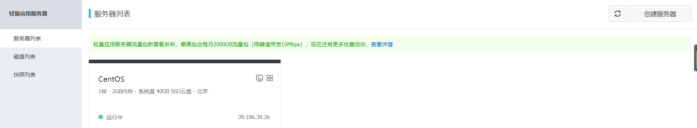

2. 开启安全端口80 443 22(HTTP,HTTPS,SSH) 23480 23481

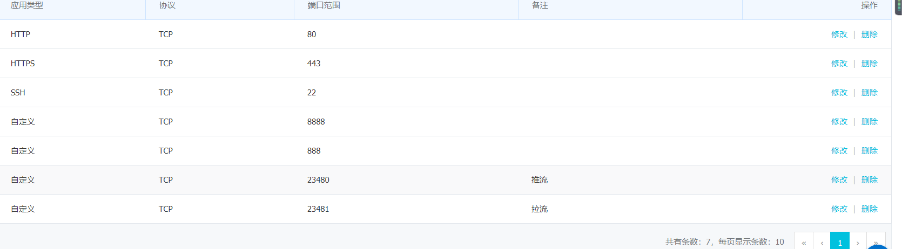

3. 进入宝塔面板,安装环境

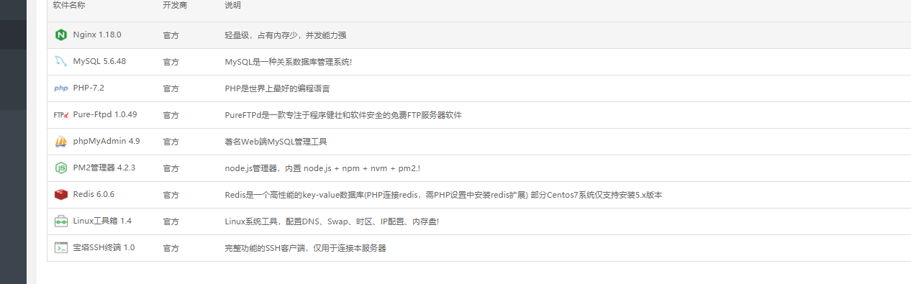

## 2.后端部署

1. 添加域名

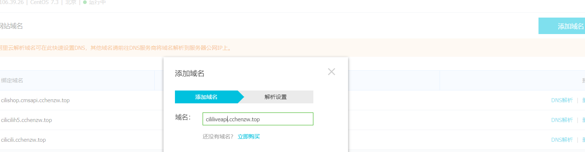

2. 宝塔面板添加站点

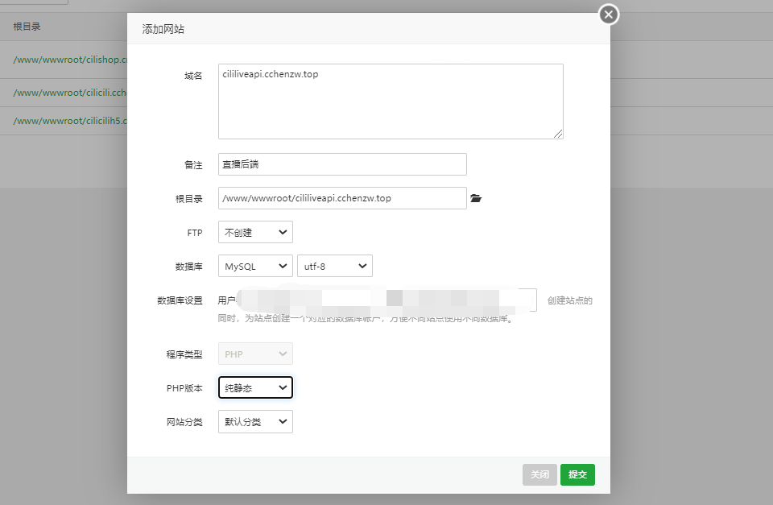

3. 文件上传
4. 安装pm2管理器和redis

5. 打开命令行切换根目录

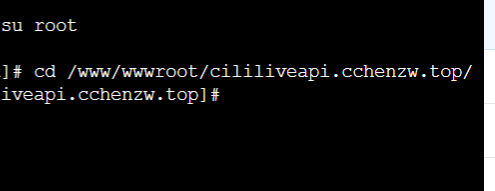

6. 国内服务器切换镜像

```
npm config set registry https://registry.npm.taobao.org
```

7. 安装node_modules

```
npm install --unsafe-perm
```

8. 导入sql文件到数据库中

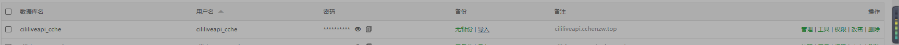

9. 修改配置信息：

config/config.default.js

- 数据库名称和密码对应宝塔数据库

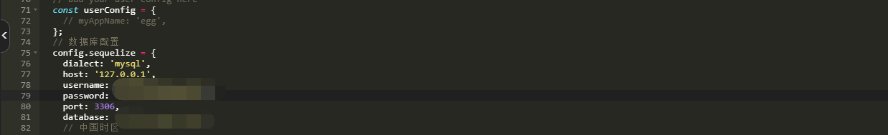

- 部署域名连接

```js
// 部署域名链接
config.webUrl = 'liveapi.cchenzw.top'
```

- 端口修改

```
"start": "egg-scripts start --daemon --title=egg-server-cilicl-live --sticky --port=7002",
```

10. npm start

    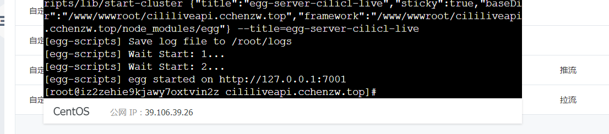

11. 反向代理

    项目端口并不是80端口而是7001端口，我们要把他代理到80端口。

    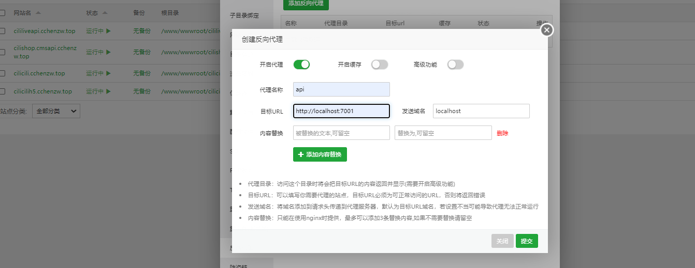

12. 修改首页ajax获取的域名

    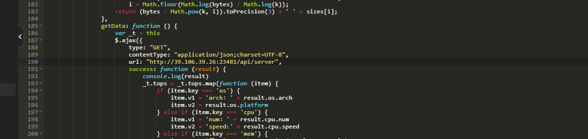

13. 宝塔放行

    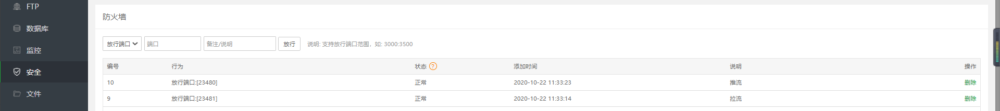

## 3.结束进程

```
netstat -tlnp|grep 7005

kill xxxxx
```

