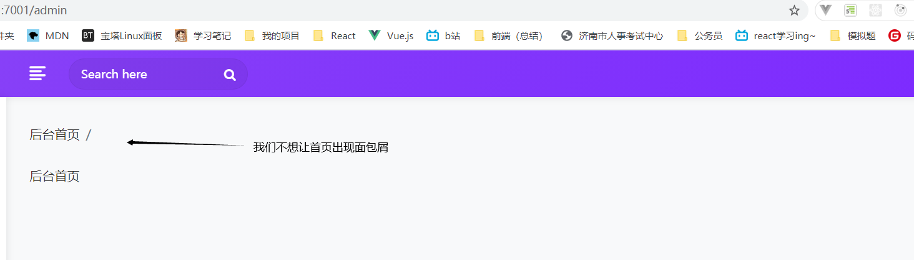

# 公共部分

## 后台首页

app\view\admin\home\index.html

```html

 后台首页 

后台首页

```



```html

<!-- 面包屑 -->
<div class="page-header">
    <div class="row align-items-center">
        <div class="col">
            <h3 class="page-title">{{ title }}</h3>
            <ul class="breadcrumb">
                <li class="breadcrumb-item"><a href="/admin">后台首页</a></li>
                <li class="breadcrumb-item active">{{ title }}</li>
            </ul>
        </div>
    </div>
</div>


```

代码:

```html
<!DOCTYPE html>
<html lang="en">

    <head>
        <meta charset="utf-8">
        <meta name="viewport" content="width=device-width, initial-scale=1.0, user-scalable=0">
        <title>直播后台 - </title>

        <!-- Favicon -->
        <link rel="shortcut icon" type="image/x-icon" href="/public/assets/img/favicon.png">

        <!-- Bootstrap CSS -->
        <link rel="stylesheet" href="http://cdn.bootstrapmb.com/bootstrap/4.3.1/css/bootstrap.min.css">

        <!-- Fontawesome CSS -->
        <link rel="stylesheet" href="/public/assets/css/font-awesome.min.css">

        <!-- Feathericon CSS -->
        <link rel="stylesheet" href="/public/assets/css/feathericon.min.css">

        <!-- Main CSS -->
        <link rel="stylesheet" href="/public/assets/css/style.css">

        <!--[if lt IE 9]>
<script src="/public/assets/js/html5shiv.min.js"></script>
<script src="/public/assets/js/respond.min.js"></script>
<![endif]-->
        <script src="/public/assets/js/vue.min.js"></script>
        <script src="/public/assets/js/vue.component.js"></script>
        <script>
            var Vueapp = new Vue({
                el: "#vueapp"
            })
        </script>
    </head>

    <body>

        <!-- Main Wrapper -->
        <div class="main-wrapper" id="vueapp">

            <toast ref="toast"></toast>
            <confirm ref="confirm"></confirm>

            <!-- 头部 -->
            
            <!-- /头部 -->

            <!-- 侧边栏 -->
            
            <!-- /侧边栏 -->

            <!-- Page Wrapper -->
            <div class="page-wrapper">
                <div class="content container-fluid">
                    
                    <!-- 面包屑 -->
                    <div class="page-header">
                        <div class="row align-items-center">
                            <div class="col">
                                <h3 class="page-title">{{ title }}</h3>
                                <ul class="breadcrumb">
                                    <li class="breadcrumb-item"><a href="/admin">后台首页</a></li>
                                    <li class="breadcrumb-item active">{{ title }}</li>
                                </ul>
                            </div>
                        </div>
                    </div>
                    


                    <div class="row">
                        <div class="col-sm-12">

                            

                            
                            
                            
                            
                            

                            

                        </div>
                    </div>
                </div>
            </div>
            <!-- /Page Wrapper -->

        </div>
        <!-- /Main Wrapper -->

        <!-- jQuery -->
        <script src="/public/assets/js/jquery-3.2.1.min.js"></script>

        <!-- Bootstrap Core JS -->
        <script src="/public/assets/js/popper.min.js"></script>
        <script src="http://cdn.bootstrapmb.com/bootstrap/4.3.1/js/bootstrap.min.js"></script>

        <!-- Slimscroll JS -->
        <script src="/public/assets/plugins/slimscroll/jquery.slimscroll.min.js"></script>

        <!-- Custom JS -->
        <script src="/public/assets/js/script.js"></script>

        
        <script>
            var toast = "{{ toast.msg }}"
            if (toast && Vueapp && Vueapp.$refs.toast) {
                Vueapp.$refs.toast.show({
                    msg: "{{ toast.msg }}",
                    type: "{{ toast.type }}"
                })
            }
        </script>
    </body>

</html>
```

## 后台菜单

中间件：app/middleware/admin_sidebar.js

- 刷新后要停留在主面板

```js
module.exports = (option, app) => {
    return async (ctx, next) => {
        let menus = [{
            name:"主面板",
            icon:"fe-home",
            url:"/admin"            
        },{
            name:"用户管理",
            icon:"fe-user-plus",
            url:"/admin/user"            
        },{
            name:"直播间管理",
            icon:"fe-document",
            url:"/admin/live"            
        },{
            name:"礼物管理",
            icon:"fe-vector",
            url:"/admin/gift"            
        },{
            name:"订单管理",
            icon:"fe-cart",
            url:"/admin/order"            
        },{
            name:"管理员管理",
            icon:"fe-table",
            url:"/admin/manager"            
        }]
		//挂载
        ctx.locals.sidebar = menus.map(item=>{
            //如果当前对象和请求url都是当前的admin
            //或者以 /admin/user 作为前缀的，都处于user这个url
            if((ctx.request.url === '/admin' && item.url === '/admin') || (ctx.request.url.startsWith(item.url) && ctx.request.url != '/admin') && item.url !== '/admin'){
                item.active = 'active'
            } 
            return item
        })

        await next();
    }
}
```

配置：config/config.default.js

```js
config.middleware = [
    // ...
    'adminSidebar'
    // ...
];
config.adminSidebar = {
    ignore: [
      '/api',
      '/admin/login',
      '/admin/loginevent',
      '/public'
    ]
  }
```

模板：app/view/admin/layout/ _slider.html

``` html
<div class="sidebar" id="sidebar">
    <div class="sidebar-inner slimscroll">
        <div id="sidebar-menu" class="sidebar-menu">
            <ul>
                
                <li class="{{ item.active }}">
                    <a href="{{item.url}}"><i class="fe {{item.icon}}"></i> <span>{{item.name}}</span></a>
                </li>
                
            </ul>
        </div>
    </div>
</div>
```


## 上传图片

注意：这一步是重复的，cv就可以

https://eggjs.org/zh-cn/basics/controller.html#%E8%8E%B7%E5%8F%96%E4%B8%8A%E4%BC%A0%E7%9A%84%E6%96%87%E4%BB%B6

使用流模式上传。

安装：

```js
npm i await-stream-ready stream-wormhole dayjs --save
```

配置：config/config.default.js

```js
config.multipart = {
    fileSize: '10mb',
    mode: 'stream',
    fileExtensions: ['.xls', '.txt', '.jpg', '.JPG', '.png', '.PNG', '.gif', '.GIF', '.jpeg', '.JPEG'], // 扩展几种上传的文件格式
  };
```

控制器：app/controller/admin/common.js

和控制器：app/controller/api/common.js

```js
'use strict';

const Controller = require('egg').Controller;
// 引入
const fs = require('fs');
const path = require('path');
//故名思意 异步二进制 写入流
const awaitWriteStream = require('await-stream-ready').write;
//管道读入一个虫洞。
const sendToWormhole = require('stream-wormhole');
const dayjs = require('dayjs');
const await = require('await-stream-ready/lib/await');

class CommonController extends Controller {
    // 上传文件
    async upload() {
        const stream = await this.ctx.getFileStream();
        // 基础目录
        const uploadBasePath = 'app/public/uploads'
        // 生成唯一文件名
        const filename = `${Date.now()}${path.extname(stream.filename).toLocaleLowerCase()}`
        // 生成文件夹
        const dirname = dayjs(Date.now()).format('YYYY/MM/DD')
        function mkdirsSync(dirname) {
            if (fs.existsSync(dirname)) {
                return true
            } else {
                if (mkdirsSync(path.dirname(dirname))) {
                    fs.mkdirSync(dirname)
                    return true
                }
            }
        }

        mkdirsSync(path.join(uploadBasePath, dirname))

        // 生成写入路径
        const target = path.join(uploadBasePath, dirname, filename)

        // 写入流
        const writeStream = fs.createWriteStream(target);

        try {
            // 异步把文件流写入
            await awaitWriteStream(stream.pipe(writeStream))
        } catch (error) {
            // 出现错误，关闭管道
            await sendToWormhole(stream)
            this.ctx.throw(500, error)
        }

        let url = path.join('/public/uploads', dirname, filename).replace(/\\|\//g, '/')

        this.ctx.apiSuccess({ url })
    }
}

module.exports = CommonController;

```

路由：app/router.js

```js
router.post('/admin/upload', controller.admin.common.upload);
```

## 判断移动端还是pc端

[点击进入视频教程地址](https://study.163.com/provider/480000001892585/index.htm?share=2&shareId=480000001892585)

扩展：app/extend/context.js

```js
ismobile(ctx){
    let userAgent = this.request.header['user-agent'].toLowerCase();
    let pat_phone = /ipad|iphone os|midp|rv:1.2.3.4|ucweb|android|windows ce|windows mobile/;
    return pat_phone.test(userAgent);
}
```

```
{
	"appid": "wxc559eade7d0a3bde",
	"partnerid": "1554108981",
	"prepayid": "wx1416254192489187cd62ceb67476dc0000",
	"package": "Sign=WXPay",
	"noncestr": "Sw1onEwYXvpQTUKN",
	"timestamp": "1602663943",
	"sign": "CA05B0EF28D3584A0D0A3087AA67EE6E"
}

```

```
{
	"appid": "wxc559eade7d0a3bde",
	"partnerid": "1554108981",
	"prepayid": "wx14173057511642375393b851b5ea6f0000",
	"package": "Sign=WXPay",
	"noncestr": "MIAq19oxCaOAH80A",
	"timestamp": "1602667858",
	"sign": "C2ECB4FF4C9A6B3BB436A39156D0A1BB"
}

```

```
{
	"appid": "wxc559eade7d0a3bde",
	"partnerid": "1554108981",
	"prepayid": "wx141745218844428a76f86f982abb770000",
	"package": "Sign=WXPay",
	"noncestr": "bEho7QklhQNAA3Ud",
	"timestamp": "1602668722",
	"sign": "CD4A13F2D69694BFA12CF8B80B2E803A"
}

```

