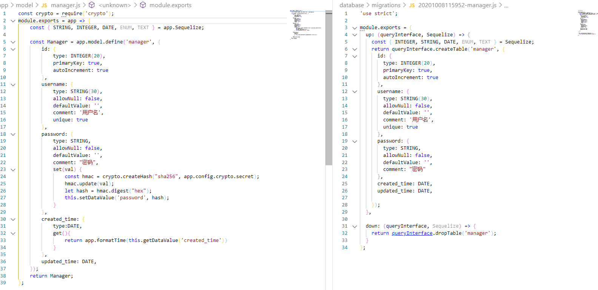
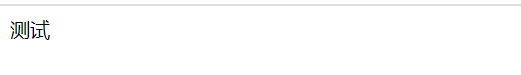
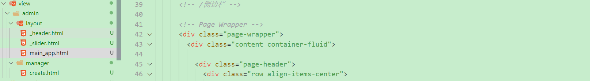
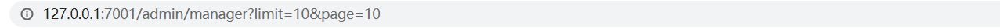
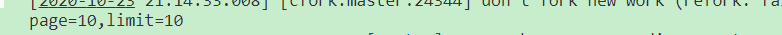
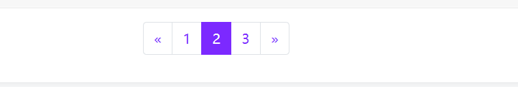

# 后台管理员模块

## 迁移文件和model文件对比



## 数据表设计和cypto加密

创建数据迁移表

```js
npx sequelize migration:generate --name=manager
```

执行完命令后，会在database / migrations / 目录下生成数据表迁移文件，然后定义

```js
'use strict';

module.exports = {
  up: (queryInterface, Sequelize) => {
    const { INTEGER, STRING, DATE, ENUM, TEXT } = Sequelize;
    return queryInterface.createTable('manager', {
      id: {
        type: INTEGER(20),
        primaryKey: true,
        autoIncrement: true
      },
      username: {
        type: STRING(30),
        allowNull: false,
        defaultValue: '',
        comment: '用户名',
        unique: true
      },
      password: {
        type: STRING,
        allowNull: false,
        defaultValue: '',
        comment: "密码"
      },
      created_time: DATE,
      updated_time: DATE,

    });
  },

  down: (queryInterface, Sequelize) => {
    return queryInterface.dropTable('manager');
  }
};
```

执行迁移

```js
npx sequelize db:migrate
```

安装 crypto 模块

```js
npm install crypto --save
```

配置文件配置 config / config.default.js

```js
config.crypto = {
    secret:  'qhdgw@45ncashdaksh2!#@3nxjdas*_672'
};
```

模型 app\model\manager.js

```js
const crypto = require('crypto');
module.exports = app => {
    const { STRING, INTEGER, DATE, ENUM, TEXT } = app.Sequelize;

    const Manager = app.model.define('manager', {
        id: {
            type: INTEGER(20),
            primaryKey: true,
            autoIncrement: true
        },
        username: {
            type: STRING(30),
            allowNull: false,
            defaultValue: '',
            comment: '用户名',
            unique: true
        },
        password: {
            type: STRING,
            allowNull: false,
            defaultValue: '',
            comment: "密码",
            set(val) {
                const hmac = crypto.createHash("sha256", app.config.crypto.secret);
                hmac.update(val);
                let hash = hmac.digest("hex");
                this.setDataValue('password', hash);
            }
        },
        created_time: {
            type:DATE,
            get(){ 
                return app.formatTime(this.getDataValue('created_time'))
            }
        },
        updated_time: DATE,
    });
    return Manager;
};
```

封装格式化时间方法：app\extend\application.js

```js
module.exports = {
    formatTime(time){
        let d = new Date(time);  
        const Month = (d.getMonth() + 1) >= 10 ? (d.getMonth() + 1) : '0'+(d.getMonth() + 1)
        const Day = d.getDate() >= 10 ? d.getDate() : '0' + d.getDate()
        const h = d.getHours() >= 10 ? d.getHours() : '0' + d.getHours()
        const m = d.getMinutes() >= 10 ? d.getMinutes() : '0' + d.getMinutes()
        const s = d.getSeconds() >= 10 ? d.getSeconds() : '0' + d.getSeconds()
        return d.getFullYear() + '-' + Month + '-' + Day + ' ' + h + ':' + m + ':' + s;
    }
};
```

## 创建管理员表单页

### 1.模板引擎使用

http://www.bootstrapmb.com/item/5781

- ```js
  npm i egg-view-nunjucks --save
  ```

- 文档：https://nunjucks.bootcss.com/templating.html

- 文档：https://eggjs.org/zh-cn/core/view.html

- 配置插件

```js
// {app_root}/config/plugin.js
nunjucks: {
    enable: true,
    package: 'egg-view-nunjucks',
  },
```

- config / config.default.js 目录下配置

```js
config.view = {
    mapping: {
        '.html': 'nunjucks',
    },
};
```

**使用方法:**

```html
//app/view/xx.html
<!DOCTYPE html>
<html lang="en">
<head>
<meta charset="UTF-8">
  <meta name="viewport" content="width=device-width, initial-scale=1.0">
  <title>Document</title>
</head>
<body>
  c
</body>
</html>
```

```js
async create() {
    const {ctx} = this;
    await ctx.render('1.html')
}
```

```js
//router.js
router.get('/admin/manager/create',controller.admin.manager)
```

输出结果:



### 2.管理员页api和模板渲染

在app/view下创建admin目录，admin目录里创建manager/create.html作为创建表单。

```html
<!DOCTYPE html>
<html lang="en">
<head>
  <meta charset="UTF-8">
  <meta name="viewport" content="width=device-width, initial-scale=1.0">
  <title>Document</title>
</head>
<body>
  ceshi
</body>
</html>
```

实现创建表单方法

```js
'use strict';
const Controller = require('egg').Controller;

class ManagerController extends Controller {
    // 创建管理员表单
    async create(){
        const { ctx } = this;
        await ctx.render('admin/manager/create.html');
    }
}
module.exports = ManagerController;
```

把form_user代码放到create.html并且引入静态资源

```html
<!DOCTYPE html>
<html lang="en">

<head>
  <meta charset="UTF-8">
  <meta name="viewport" content="width=device-width, initial-scale=1.0">
  <title>Document</title>
</head>

<body>
  <!-- 代码 -->
  <!-- 静态资源 -->

</body>

</html>
```

### 3.模板分离

侧边栏和导航栏可以使用模板继承进行抽离



公共部分抽离到main_app.html

- 使用[include](https://nunjucks.bootcss.com/templating.html#include)引入头部和侧边栏
- 使用``的方法引入其他区块

```html
<!DOCTYPE html>
<html lang="en">
	<head>
		<meta charset="utf-8">
		<meta name="viewport" content="width=device-width, initial-scale=1.0, user-scalable=0">
		<title>直播后台 - </title>
	</head>
	<body>

		<!-- Main Wrapper -->
		<div class="main-wrapper">

			<!-- 头部 -->
			
			<!-- /头部 -->

			<!-- 侧边栏 -->
			
			<!-- /侧边栏 -->

			<!-- Page Wrapper -->
			<div class="page-wrapper">
				<div class="content container-fluid">

					<div class="page-header">
						<div class="row align-items-center">
							<div class="col">
								<h3 class="page-title">创建管理员</h3>
								<ul class="breadcrumb">
									<li class="breadcrumb-item"><a href="index.html">后台首页</a></li>
									<li class="breadcrumb-item active">创建管理员</li>
								</ul>
							</div>
						</div>
					</div>

					<div class="row">
						<div class="col-sm-12">
							//非公共部分
							

						</div>
					</div>
				</div>
			</div>
			<!-- /Page Wrapper -->

		</div>
		<!-- /Main Wrapper -->

	</body>
</html>

```

create.html继承主布局,并实现表单部分

```html

 创建管理员 

<div class="card">
  <div class="card-body">
    <form action="#">
      <div class="form-group row">
        <label class="col-form-label col-md-2">用户名</label>
        <div class="col-md-10">
          <input type="text" class="form-control" placeholder="用户名...">
        </div>
      </div>
      <div class="form-group row">
        <label class="col-form-label col-md-2">密码</label>
        <div class="col-md-10">
          <input type="password" class="form-control" placeholder="密码...">
        </div>
      </div>
      <div class="text-right mt-3"> <button type="submit" class="btn btn-primary">提 交</button>
      </div>
    </form>
  </div>
</div>

```

_header.html抽离头部 _slider抽离侧边栏

## 创建管理员逻辑

### 1. 安装参数验证插件

插件地址：

> https://www.npmjs.com/package/egg-valparams

安装

```
npm i egg-valparams --save
```

配置

```js
// config/plugin.js
valparams : {
  enable : true,
  package: 'egg-valparams'
},
// config/config.default.js
config.valparams = {
    locale    : 'zh-cn',
    throwError: true
};
```

在控制器里使用

```js
class XXXController extends app.Controller {
  // ...
  async XXX() {
    const {ctx} = this;
    ctx.validate({
      xxxx	  :	{type: 'string', required: false, defValue: 'account', desc: '系统名称'},
      system  : {type: 'string', required: false, defValue: 'account', desc: '系统名称'},
      token   : {type: 'string', required: true, desc: 'token 验证'},
      redirect: {type: 'string', required: false, desc: '登录跳转'}
    });
    if(ctx.paramErrors) {
    }
    let params = ctx.params;
    let {query, body} = ctx.request;
    ctx.body = query;
  }
  // ...
}
```

中间件补充

```js
// app/middleware/error_handler.js
module.exports = (option, app) => {
    return async function errorHandler(ctx, next) {
        try {
            await next();
            if (ctx.status === 404 && !ctx.body) {
                ctx.body = {
                    msg: "fail",
                    data: '404 not found'
                };
            }
        } catch (err) {
            app.emit('error', err, ctx);
            const status = err.status || 500;
            let error = status === 500 && app.config.env === 'prod'
                ? '内部服务器错误'
                : err.message;
            ctx.body = {
                msg: "fail",
                data: error
            };

            // 参数验证异常
            if (status === 422 && err.message === "Validation Failed") {
                if (err.errors && Array.isArray(err.errors)) {
                    error = err.errors[0].err[0] ? err.errors[0].err[0] : err.errors[0].err[1];
                }
                ctx.body = {
                    msg: "fail",
                    data: error
                };
            }

            ctx.status = status;
        }
    };
};
```

路由：

```js
module.exports = app => {
  const { router, controller } = app;
  router.post('/admin/manager', controller.admin.manager.save);
};
```

创建管理员逻辑

```js
'use strict';

const Controller = require('egg').Controller;

class ManagerController extends Controller {
    // 创建管理员表单
    async save() {
        const { ctx, app } = this;

        let { username, password } = ctx.request.body

        let isExact = await app.model.Manager.findOne({
            where: {
                username
            }
        })

        if (isExact) {
            return ctx.apiFail('管理员已存在')
        }

        let manager = await app.model.Manager.create({
            username, password
        })
        ctx.apiSuccess(manager)
    }
}

module.exports = ManagerController;

```

修改表单

```html
<form action="/admin/manager" method='POST'></form>
  <div class="form-group row">
    <label class="col-form-label col-md-2">用户名</label>
    <div class="col-md-10">
      <input type="text" class="form-control" placeholder="用户名..." name='username'>
    </div>
  </div>
  <div class="form-group row">
    <label class="col-form-label col-md-2">密码</label>
    <div class="col-md-10">
      <input type="password" class="form-control" placeholder="密码..." name='password'>
    </div>
  </div>
  <div class="text-right mt-3"> <button type="submit" class="btn btn-primary">提 交</button>
  </div>
</form>
```

## 创建管理员列表页

### 1.创建管理员页逻辑

控制器：app/controller/admin/manager.js

```js
// 管理员列表
router.get('/admin/manager',controller.admin.manager.index);
```

```js
// 创建管理员列表页
async index(){
    const {ctx,app} = this
    let data = await app.model.Manager.findAll()
    await ctx.render('admin/manager/index.html',{
        data:JSON.stringify(data)
    })
}
```

返回到页面的数据内容：

```JS
[
    {
        created_time: '2020-10-23 19:28:13',
        id: 1,
        username: 'admin',
        password: '8c6976e5b5410415bde908bd4dee15dfb167a9c873fc4bb8a81f6f2ab448a918',
        avatar: '',
        signnum: 0,
        updated_time: '2020-10-23T11:28:13.000Z'
    }
]
```

### 2.管理员表格

[for循环](https://nunjucks.bootcss.com/templating.html#for)

```html

 管理员列表 


<div class="card card-table">
    <div class="card-header">
        <button type="button" class="btn btn-outline-primary">创建管理员</button>
    </div>
    <div class="card-body">
        <div class="table-responsive">
            <table class="table table-hover table-center mb-0">
                <thead>
                    <tr>
                        <th>管理员</th>
                        <th width="120">创建时间</th>
                        <th class="text-center" width="100">操作</th>
                    </tr>
                </thead>
                <tbody>
                    
                    <tr>
                        <td>
                            <h2 class="table-avatar">
                                <a>{{ item.username }}</a>
                            </h2>
                        </td>
                        <td>{{ item.created_time }}</td>
                        <td class="text-right">
                            <div class="actions">
                                <a href="#" class="btn btn-sm bg-success-light mr-2">
                                    <i class="fe fe-pencil"></i> 修改
                                </a>
                                <a href="#" class="btn btn-sm bg-danger-light">
                                    <i class="fe fe-trash"></i> 删除
                                </a>
                            </div>
                        </td>
                    </tr> 
                     

                </tbody>
            </table>
        </div>
    </div>

    <div class="card-footer d-flex justify-content-center">
        <ul class="pagination">
            <li class="page-item">
                <a class="page-link" href="#" aria-label="Previous">
                    <span aria-hidden="true">«</span>
                    <span class="sr-only">Previous</span>
                </a>
            </li>
            <li class="page-item"><a class="page-link" href="#">1</a></li>
            <li class="page-item"><a class="page-link" href="#">2</a></li>
            <li class="page-item"><a class="page-link" href="#">3</a></li>
            <li class="page-item">
                <a class="page-link" href="#" aria-label="Next">
                    <span aria-hidden="true">»</span>
                    <span class="sr-only">Next</span>
                </a>
            </li>
        </ul>
    </div>
</div>

```

### 3.管理员表格分页逻辑

```
/admin/manager?page=1&limit=5    query传参
/admin/manager/1/2   params传参
```



例子：

```js
async index() {
    const { ctx, app } = this

    let page = ctx.query.page ? parseInt(ctx.query.page) : 1
    let limit = ctx.query.limit ? parseInt(ctx.query.limit) : 1
    console.log(`page=${page},limit=${limit}`)
	let offset = (page-1)*limit
    await ctx.render('admin/manager/index.html', {
        offset,
        limit
    })
}
```



分页

```js
async index(){
    const { ctx,app } = this;
	//使用扩展
    let data = await ctx.page('Manager')

    await ctx.render('admin/manager/index.html',{
        data
    });
}
```

### 4.表格分页扩展和模板插入

分页代码



```html
<ul class="pagination">
    <li class="page-item">
        <a class="page-link" href="#" aria-label="Previous">
            <span aria-hidden="true">«</span>
            <span class="sr-only">Previous</span>
        </a>
    </li>
    <li class="page-item "><a class="page-link" href="#">1</a></li>
    <li class="page-item active"><a class="page-link" href="#">2</a></li>
    <li class="page-item"><a class="page-link" href="#">3</a></li>
    <li class="page-item">
        <a class="page-link" href="#" aria-label="Next">
            <span aria-hidden="true">»</span>
            <span class="sr-only">Next</span>
        </a>
    </li>
</ul>
```

扩展：app/extend/context.js

```js
// app\extend\context.js

// 分页
async page(modelName, where, options = {}) {
    let page = this.query.page ? parseInt(this.query.page) : 1
    let limit = this.query.limit ? parseInt(this.query.limit) : 5
    let offset = (page - 1) * limit
    let offset = (page - 1) * limit;

    //默认排序方式
    if (!options.order) {
        options.order = [
            ['id', 'DESC']
        ]
    }

    let res = await this.app.model[modelName].findAndCountAll({
        where,
        offset,
        limit,
        ...options
    })


    // 总页数
    let totalPage = Math.ceil(res.count / limit)


    
    
    let pageEl = ''

    //如果page和index为
    for (let index = 1; index <= totalPage; index++) {
        let active = ''
        if (page === index) {
            active = 'active'
        }
        pageEl += `
<li class="page-item ${active}">
<a class="page-link" href="?page=${index}&limit=${limit}">${index}</a></li>
`
    }


    //第一页和最后一页没有上一页和下一页
    const preDisabled = page <= 1 ? 'disabled' : ''
    const nextDisabled = page >= totalPage ? 'disabled' : ''

    //字符串
    let pageRender = `
                    <ul class="pagination">
                        <li class="page-item ${preDisabled}">
                        <a class="page-link" href="?page=${page - 1}&limit=${limit}" aria-label="Previous">
                        <span aria-hidden="true">«</span>
                        <span class="sr-only">Previous</span>
                        </a>
                        </li>

                    ${pageEl}

                    <li class="page-item ${nextDisabled}">
                    <a class="page-link" href="?page=${page + 1}&limit=${limit}" aria-label="Next">
                    <span aria-hidden="true">»</span>
                    <span class="sr-only">Next</span>
                    </a>
                    </li>
                    </ul>
`

    //挂载到locals https://eggjs.org/zh-cn/core/view.html#locals
    this.locals.pageRender = pageRender


    return res.rows
},
```

使用

```js
'use strict';

const Controller = require('egg').Controller;

class ManagerController extends Controller {
  async xx() {
    const { ctx, app } = this;
	//查询Manager 查询username为xxx的数据 查询是按最新的排序。
    let data = await ctx.page('Manager',{
        username:'xxx'
    },{
        order:[
            'id','DESC'
        ]
    })

    await ctx.render('admin/manager/index.html', {
      data
    });
  }
}

module.exports = ManagerController;

```

模板插入

```html
//app\view\admin\manager\index.html

 管理员列表 


<div class="card card-table">
    <div class="card-header">
        <button type="button" class="btn btn-outline-primary">管理员列表</button>
    </div>
    <div class="card-body">
    </div>
    
    <div class="card-footer d-flex justify-content-center">
        {{ ctx.locals.pageRender | safe }}
    </div>
</div>

```

###  5.表单query保存补充

```js
async page(modelName,where = {},options = {}){
    let page = this.query.page ? parseInt(this.query.page) : 1
    let limit = this.query.limit ? parseInt(this.query.limit) : 10
    let offset = (page - 1) * limit

    if(!options.order){
        options.order = [
            ['id','DESC']
        ]
    }

    let res = await this.app.model[modelName].findAndCountAll({
        where,
        offset,
        limit,
        ...options
    })

    // 总页数
    let totalPage = Math.ceil(res.count/limit)

    let query = { ...this.query }
    if (query.hasOwnProperty('page')) {
        delete query.page
    }
    if (query.hasOwnProperty('limit')) {
        delete query.limit
    }

    // 对象转&拼接字符串
    const urlEncode = (param, key, encode)=>{
        if (param==null) return '';
        var paramStr = '';
        var t = typeof (param);
        if (t == 'string' || t == 'number' || t == 'boolean') {
            paramStr += '&' + key + '='  + ((encode==null||encode) ? encodeURIComponent(param) : param); 
        } else {
            for (var i in param) {
                var k = key == null ? i : key + (param instanceof Array ? '[' + i + ']' : '.' + i)
                paramStr += urlEncode(param[i], k, encode)
            }
        }
        return paramStr;
    }

    query = urlEncode(query)

    let pageEl = ''
    for (let index = 1; index <= totalPage; index++) {
        let active = ''
        if(page === index){
            active = 'active'
        }
        pageEl += `
<li class="page-item ${active}">
<a class="page-link" href="?page=${index}&limit=${limit}${query}">${index}</a></li>
`
    }


    const preDisabled = page <= 1 ? 'disabled' : ''
    const nextDisabled = page >= totalPage ? 'disabled' : ''

    let pageRender = `
<ul class="pagination">
<li class="page-item ${preDisabled}">
<a class="page-link" href="?page=${page - 1}&limit=${limit}${query}" aria-label="Previous">
<span aria-hidden="true">«</span>
<span class="sr-only">Previous</span>
</a>
</li>

${pageEl}

<li class="page-item ${nextDisabled}">
<a class="page-link" href="?page=${page + 1}&limit=${limit}${query}" aria-label="Next">
<span aria-hidden="true">»</span>
<span class="sr-only">Next</span>
</a>
</li>
</ul>
`

    this.locals.pageRender = pageRender

    return res.rows
},
```

## 公共模板table开发

extend/context扩展渲染公共模板方法

```js
// app/extend/context.js
module.exports = {
    //渲染公共模板
    async renderTemplate(params={}){
        await this.render('admin/common/template.html',params);
    }
};
```

修改建管理员列表页方法

```js
'use strict';

const Controller = require('egg').Controller;

class ManagerController extends Controller {
  // 创建管理员列表页
    async index() {
        const { ctx, app } = this;
        let data = await ctx.page('Manager')
        await ctx.renderTemplate({
            title: "管理员管理",
            tempType: "table",
            table: {
                // 按钮 
                buttons: {
                    //新增操作
                    add: "/admin/manager/create"
                },
                // 表头
                columns: [{
                    title: '管理员',
                    fixed: 'left',
                    key: "username"
                }, {
                    title: '时间',
                    key: 'created_time',
                    width: 180,
                    fixed: 'center'
                }, {
                    title: "操作",
                    width: 200,
                    fixed: 'center',
                    action:{
                        edit:function(id){
                            return `/admin/manager/edit/${id}`
                        },
                        delete:function(id){
                            return `/admin/manager/delete/${id}`
                        },
                    }
                }],
                data
            }
        })
    }
}
module.exports = ManagerController;
```

创建app\view\admin\common\template.html文件

```html

 {{title}} 


<div class="card card-table">
    
    <div class="card-header">
        
        <a href="{{ table.buttons.add }}" class="btn btn-outline-primary">创建</a>
        
    </div>
    
    <div class="card-body">
        <div class="table-responsive">

            
            <table class="table table-hover table-center mb-0">
                <thead>
                    <tr>
                        
                        <th class="text-{{item.fixed}}" width="{{item.width}}">{{ item.title }}</th>
                        
                    </tr>
                </thead>
                <tbody>
                    
                    <tr>
                        
                        <td class="text-{{item2.fixed}}">
                            
                            {{ item[item2.key] }}
                            
                            <div class="actions">
                                
                                <a href="{{ item2.action.edit(item.id) }}" class="btn btn-sm bg-success-light mr-2">
                                    <i class="fe fe-pencil"></i> 修改
                                </a>
                                
                                
                                <a href="{{ item2.action.delete(item.id) }}" class="btn btn-sm bg-danger-light">
                                    <i class="fe fe-trash"></i> 删除
                                </a>
                                
                            </div>
                            
                        </td>
                        

                    </tr>
                    

                </tbody>
            </table>
            
        </div>
    </div>

    <div class="card-footer d-flex justify-content-center">
        {{ ctx.locals.pageRender | safe }}
    </div>
</div>

```

修改main_app

```html
<h3 class="page-title">{{title}}</h3>
<li class="breadcrumb-item active">{{title}}</li>
```

## 公共模板form开发

```js
async create(){
    const { ctx } = this;
    await ctx.renderTemplate({
        // 页面标题
        title: "创建管理员",
        // 模板类型 form表单，table表格分页
        tempType: "form",
        // 表单配置
        form: {
            // 提交地址
            action: "/admin/manager",
            // 字段配置
            fields:[{
                label: "用户名",
                type: "text",
                name: "username",
                placeholder: "用户名",
            }, {
                label: "密码",
                type: "text",
                name: "password",
                placeholder: "密码"
            }]
        },
    });
}
```

把template页内容放到main_app

```html
//app\view\admin\common\template.html

 {{title}} 
```

```html
// app\view\admin\layout\main_app.html
<div class="row">
    <div class="col-sm-12">
        
        
        
        
        
        
        
    </div>
</div>
```

创建form和table表单

app\view\admin\layout\_form.html

```html
<div class="card">
    <div class="card-body">
        
        <form action="{{form.action}}" method="POST">
            
            <div class="form-group row">
                <label class="col-form-label col-md-2">{{item.label}}</label>
                <div class="col-md-10">
                    <input name="{{item.name}}" type="{{item.type}}" class="form-control" placeholder="{{item.placeholder}}...">
                </div>
            </div>
            

            <div class="text-right mt-3">								<button type="submit" class="btn btn-primary">提 交</button>
            </div>
        </form> 
        
    </div>
</div>
```

app\view\admin\layout\_table.html

```html
<div class="card card-table">
    
    <div class="card-header">
        
        <a href="{{ table.buttons.add }}" class="btn btn-outline-primary">创建</a>
        
    </div>
    
    <div class="card-body">
        <div class="table-responsive">

            
            <table class="table table-hover table-center mb-0">
                <thead>
                    <tr>
                        
                        <th class="text-{{item.fixed}}" width="{{item.width}}">{{ item.title }}</th>
                        
                    </tr>
                </thead>
                <tbody>
                    
                    <tr>
                        
                            <td class="text-{{item2.fixed}}">
                            
                                {{ item[item2.key] }}
                            
                            <div class="actions">
                                
                                <a href="{{ item2.action.edit(item.id) }}" class="btn btn-sm bg-success-light mr-2">
                                    <i class="fe fe-pencil"></i> 修改
                                </a>  
                                
                                
                                <a href="{{ item2.action.delete(item.id) }}" class="btn btn-sm bg-danger-light">
                                    <i class="fe fe-trash"></i> 删除
                                </a>
                                
                            </div>
                            
                            </td>
                        
                        
                    </tr> 
                     
                    
                </tbody>
            </table>
            
        </div>
    </div>
    
    <div class="card-footer d-flex justify-content-center">
        {{ ctx.locals.pageRender | safe }}
    </div>
</div>
```

## 404页面

扩展：app/extend/context.js

```js
// 页面失败提示
async pageFail(data = '', code = 404){
    return await this.render('admin/common/404.html', {
        data, code
    })
},
```

模板：app/view/admin/common/404.html

```html

404

<div class="error-page">    
    <!-- Main Wrapper -->
    <div class="main-wrapper">
        <div class="error-box">
            <h1>{{ code }}</h1>
            <h3 class="h2 mb-3"><i class="fa fa-warning"></i> {{ data }} </h3>
            <a href="/admin" class="btn btn-primary">返回后台首页</a>
        </div>
    </div>
</body>

```

## 删除管理员

### 1.删除逻辑

路由：app/router.js

```js
router.get('/admin/manager/delete/:id', controller.admin.manager.delete);
```

控制器：app/controller/admin/manager.js

```js
//- get -params - id   
async delete(){
    const { ctx, app } = this;
    const id = ctx.params.id
    await app.model.Manager.destroy({
        where:{
            id
        }
    })
    ctx.toast('删除成功','success')

    ctx.redirect(`/admin/manager`);
}
```

### 2.消息提示扩展和公共模板扩展

扩展：app/extend/context.js

[cookie注意事项](https://eggjs.org/zh-cn/core/cookie-and-session.html)

- 如果想要 Cookie 在浏览器端不能被修改，不能看到明文。 encrypt: true, // 加密传输
- 中文内容也需要encrypt

```js
//存到cookie里，最多1.5s,加密，因为
toast(msg,type = 'danger'){
    this.cookies.set('toast',JSON.stringify({
        msg,type
    }),{
        maxAge: 1500, 
        encrypt: true
    });
}
```

```js
// 渲染公共模板
async renderTemplate(params = {}){
    // 获取cookie中的消息提示（闪存）
    let toast = this.cookies.get('toast',{
        // 中文需要解密
        encrypt: true
    });

    params.toast = toast ? JSON.parse(toast) : null

    await this.render('admin/common/template.html',params);
},
```

### 3.全局消息提示组件开发

```js
// /public/assets/js/vue.component.js
Vue.component('toast', {
    template:`
<div role="alert" class="alert" :class="c" style="position: fixed;right: 0;top: 70px;z-index: 10000;" v-if="toast">
{{ msg }}
</div>
`,
    data() {
        return {
            msg:"",
            toast:false,
            timer:null,
            type:"danger"
        }
    },
    computed: {
        c:function(){
            return 'alert-'+this.type
        }
    },
    methods: {
        show:function(options){
            this.msg = options.msg || '提示'
            this.type = options.type || 'danger'
            this.toast = true
            if(this.timer){
                clearTimeout(this.timer)
            }
            this.timer = setTimeout(() => {
                this.hide()
                this.timer = null
                if(options.success && typeof options.success === 'function'){
                    options.success()
                }
            }, options.delay || 1500);
        },
        hide:function(){
            this.toast = false
        }
    },
})
```

live-api\app\view\admin\layout\main_app.html 

```html
<div class="main-wrapper" id="vueapp">
    <toast ref="toast"></toast>
</div>
<script src="/public/assets/js/vue.min.js"></script>
<script src="/public/assets/js/vue.component.js"></script>

<script>
    var Vueapp = new Vue({
        el:"#vueapp"
    })
</script>

<script>
    var toast = "{{ toast.msg }}"
    if(toast && Vueapp && Vueapp.$refs.toast){
        Vueapp.$refs.toast.show({
            msg:"{{ toast.msg }}",
            type:"{{ toast.type }}"
        })
    }
</script>
```

### 4.全局确认提示框

编写组件

```html
//app\public\assets\js\vue.component.js
Vue.component('confirm',{
    template:`
    <div class="modal fade" id="exampleModalCenter" tabindex="-1" role="dialog" aria-labelledby="exampleModalCenterTitle" aria-hidden="true">
        <div class="modal-dialog modal-dialog-centered" role="document">
        <div class="modal-content">
            <div class="modal-header">
            <h5 class="modal-title" id="exampleModalCenterTitle">{{title}}</h5>
            <button type="button" class="close" data-dismiss="modal" aria-label="Close">
                <span aria-hidden="true">&times;</span>
            </button>
            </div>
            <div class="modal-body">
            {{content}}
            </div>
            <div class="modal-footer">
            <button type="button" class="btn btn-secondary" data-dismiss="modal" @click="hide">取消</button>
            <button type="button" class="btn btn-primary" @click="confirm">确定</button>
            </div>
        </div>
        </div>
    </div>
    `,
    data() {
        return {
            title:"提示",
            content:"",
            success:null
        }
    },
    methods: {
        show(options = {}){
            this.title = options.title || '提示'
            this.content = options.content
            this.success = options.success || null
            $('#exampleModalCenter').modal('show')
        },
        hide(){
            $('#exampleModalCenter').modal('hide')
        },
        confirm(){
            if(this.success && typeof this.success === 'function'){
                this.success()
            }
            this.hide()
        }
    },
})
```

挂载mainapp

```html
<confirm ref="confirm"></confirm>
```

table页面

```html
<a class="btn btn-sm bg-danger-light" @click="del('{{ item2.action.delete(item.id) }}')">
    <i class="fe fe-trash"></i> 删除
</a>
<script>
    Vueapp = new Vue({
        el:"#vueapp",
        methods: {
            del(url){
                this.$refs.confirm.show({
                    title:"提示",
                    content:"是否要删除该记录？",
                    success:function(){
                        //点击后跳转到当前
                        window.location.href = url
                        console.log('删除成功')
                    }
                })
            }
        },
    })
</script>

```

## 修改管理员页面

```js
router.get('/admin/manager/edit/:id', controller.admin.manager.edit);
```

控制器：app/controller/admin/manager.js

```js
'use strict';
const Controller = require('egg').Controller;
class ManagerController extends Controller {
    async edit() {
        const { ctx, app } = this
        const id = ctx.params.id

        let data = await app.model.Manager.findOne({
            where: {
                id
            }
        })
        if (!data) {
            return await ctx.pageFail('该记录不存在')
        }

        data = JSON.parse(JSON.stringify(data))
        delete data.password

        await ctx.renderTemplate({
            id,
            title: "修改管理员",
            tempType: "form",
            form: {
                // 提交地址
                action: "/admin/manager/" + id,
                // 字段配置
                fields: [{
                    label: "用户名",
                    type: "text",
                    name: "username",
                    placeholder: "用户名",
                }, {
                    label: "密码",
                    type: "text",
                    name: "password",
                    placeholder: "密码"
                }],
                // 默认值
                data
            }
        })
    }

}
module.exports = ManagerController;
```

app\view\admin\layout\_form.html

- url提交时要传入csrf的token,防止网站被恶意攻击

```html
<div class="card">
    <div class="card-body">
        
        <form action="{{form.action}}" method="POST">
            
            <div class="form-group row">
                <label class="col-form-label col-md-2">{{item.label}}</label>
                <div class="col-md-10">
                    <input
                           name="{{item.name}}"
                           type="{{item.type}}"
                           class="form-control"
                           placeholder="{{item.placeholder}}..."
                           v-model="form.{{item.name}}"
                           />
                </div>
            </div>
            

            <div class="text-right mt-3">
                <button
                        type="submit"
                        class="btn btn-primary"
                        @click.stop.prevent="submit"
                        >
                    提 交
                </button>
            </div>
        </form>
        
    </div>
</div>
<script>
    Vueapp = new Vue({
        el: "#vueapp",
        data() {
            return {
                form: {
                    
                { { item.name } }: "{{ form.data[item.name] if form.data[item.name] else item.default }}",
        
                     }
                     }
    },
        methods: {
            submit() {
                $.ajax({
                    type: "POST",
                    url: "{{ form.action }}?_csrf={{ctx.csrf|safe}}",
                    contentType: "application/json;chatset=UTF-8",
                    data: JSON.stringify(this.form),
                    success: function (result) {
                        //修改提示
                        Vueapp.$refs.toast.show({
                            msg: "{{ '修改' if id else '新增' }}成功",
                            type: "success",
                            success: function () {
                                window.location.href = "{{ successUrl }}"
                            }
                        })
                    },
                    error: function (e) {
                        Vueapp.$refs.toast.show({
                            msg: e.responseJSON.data,
                            type: "danger"
                        })
                    }
                })
            }
        },
    })
</script>

```

## 修改管理员逻辑

```js
router.post('/admin/manager/:id', controller.admin.manager.update);
```

```js

// 修改逻辑
async update() {
    const { ctx, app } = this;
    ctx.validate({
        id: {
            type: "int",
            required: true
        },
        username: {
            type: "string",
            required: true
        },
        password: {
            type: "string",
        },
    })
    const id = ctx.params.id
    const { username, password } = ctx.request.body
    // 用户名是否已存在
    const Op = app.Sequelize.Op;
    if (await app.model.Manager.findOne({
        where: {
            id: {
                [Op.ne]: id,
            },
            username
        }
    })) {
        return ctx.apiFail('该用户名已存在')
    }
    // 当前管理员是否存在
    let manager = await app.model.Manager.findOne({
        where: {
            id
        }
    })
    if (!manager) {
        return ctx.apiFail('该记录不存在')
    }

    manager.username = username
    if (password) {
        manager.password = password
    }
    ctx.apiSuccess(await manager.save())
}
```

