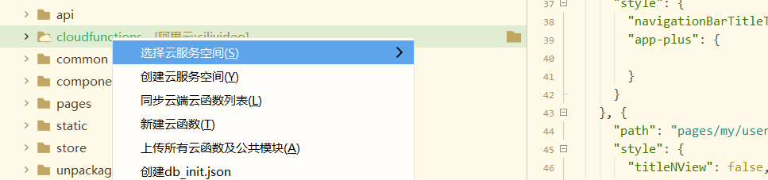

## 初始化数据库

[创建服务空间](https://unicloud.dcloud.net.cn/home)


项目里和服务空间关联



使用[dbinit](https://uniapp.dcloud.io/uniCloud/cf-database?id=db-init)

- 创建dbinit.json

```js
{
    "collection_test": { // 集合（表名）
        "data": [ // 数据
           {
                "_id": "da51bd8c5e37ac14099ea43a2505a1a5",
               "name": "tom"
           }
        ],
        "index": [{ // 索引
            "IndexName": "index_a", // 索引名称
            "MgoKeySchema": { // 索引规则
                "MgoIndexKeys": [{
                    "Name": "index", // 索引字段
                    "Direction": "1" // 索引方向，1：ASC-升序，-1：DESC-降序，2dsphere：地理位置
                }],
                "MgoIsUnique": false // 索引是否唯一
            }
        }]
    }
}
```

