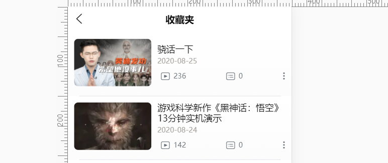

# 个人中心页开发

## 个人中心页


>- 页面onShow的时候，获取token,如果有token,获取用户的statistics信息。
>- 判断是否登录
>- 获取用户信息
>- 跳转到登录页
>- 跳转到个人空间页，判断token，携带个人id进行跳转
>- 跳转到收藏页
>- 跳转到设置页
>- 跳转到关注页
>- 跳转到我的作品页

## 注册登录退出和状态保存

注册接口

```js
export function registerApi(params) {
	return request.post('/reg', params)
}
```

```js
import { registerApi } from '@/api/user.js';

export default{
    methods:{
        submit(){
            registerApi(this.registerForm).then(res => {
                uni.showToast({
                    title: '注册成功',
                    duration: 1000
                });
                setTimeout(() => {
                    this.changeType();
                }, 1000);
            });
        }
    }
}
```

**登录交互**

>步骤
>
>1. 发送请求进行登录
>2. 拿到信息，存到vuex中，用于管理登录状态，并且需要实现[持久化存储](https://uniapp.dcloud.io/api/storage/storage?id=setstorage)

调用vuex异步发送请求

```js
//login.vue
this.$store.dispatch('login', this.loginForm).then(res=>{
    uni.showToast({
        title: '登录成功',
        icon: 'none'
    });
    uni.switchTab({
        url: '../my/my'
    });
})
```

```js
//user.js
//登录
export function login(params) {
	return request.post('/login', params)
}

// 登出
export function logout() {
	return request.post('/logout', {}, {
		token: true
	})
}

```

action里参数设置。

```js
//action
import {
    login,
    logout
} from '@/api/user'
export default {
    //登录
    login({
        commit
    }, loginForm) {
        return new Promise((resolve, reject) => {
            login(loginForm).then(res => {
                commit('setUser', res)
                commit('setToken', res.token)
                uni.setStorageSync('user', JSON.stringify(res))
                uni.setStorageSync('token', res.token)
                resolve(res)
            })
        })

    },
    //初始化登录状态,页面onLunch时执行此代码。
    initUser({
        state
    }) {
        let u = uni.getStorageSync('user')
        let token = uni.getStorageSync('token')
        if (u) {
            u = JSON.parse(u)
            state.user = u;
            state.token = u.token
        }
    },
    // 退出登录
    logout({
        state
    }) {
        // 传递第三个参数token
        logout()
        state.user = false
        state.token = false
        // clear是清除所有 我们后面有可能有需要用到的其他内容
        uni.removeStorageSync('user')
        uni.removeStorageSync('token')
    }
}
```

## 个人空间页开发

- 接收传入的id值并发送请求获取对应数据。
- 如果id不是当前用户id,显示关注按钮。
- scroll组件高度要确定，为页面高度-导航高度-tab切换高度。


```js
"app-plus": {
    "titleNView": {
        "type": "transparent",
            "buttons": [{
                "type": "menu",
                "float": "right"
            }]
    }
}
```

页面onLoad的时候获取到e.user_id

```js
onLoad(e) {
    if (!e.user_id) {
        uni.showToast({
            title: '非法访问',
            icon: 'none'
        });
        return uni.navigateBack({
            delta: 1
        });
    }
    this.user_id = e.user_id;
    this.getUserInfo(e.user_id);
    this.getProductionData();
},
```

- 滚动条高度


```html
<swiper :current="tabIndex" :duration="300" :style="'height:' + scrollHeight + 'px;'" @change="changeSwiper">
			<swiper-item v-for="(tab, tabI) in tabBars" :key="tabI">
				<scroll-view @scrolltolower="scrolltolower(tabI)" scroll-y="true" :style="'height:' + scrollHeight + 'px;'">				
				</scroll-view>
			</swiper-item>
		</swiper>
```

```js
created() {
    let res = uni.getSystemInfoSync();
    this.scrollHeight = res.windowHeight - 44 - 44 - res.statusBarHeight;
},
```

## 修改资料页

- 选择头像。
- 判断是否选择头像，如果选择头像就上传头像，否则把未修改之前的头像作为默认头像


选择头像

```js
uni.chooseImage({
    count: 1,
    sizeType: ['compressed'],
    sourceType: ['album', 'camera'], //相机或者相册
    success: res => {
        this.userData.avatar = res.tempFilePaths[0];
        uni.showToast({
            title: '图片添加成功',
            icon: 'none'
        });
    }
});
```

修改性别


```js
changeSex() {
    uni.showActionSheet({
        itemList: this.itemList,//['男', '女', '保密']
        success: res => {
            this.userData.sex = this.itemList[res.tapIndex];
        }
    });
},
```

发送逻辑

```js
async setUser() {
    let { nickname, email, phone, sex, desc, avatar } = this.userData;
    // 判断是否修改了头像
    if (this.userData.avatar !== this.user.avatar) {
        // 修改了
        let avatarRes = await addAvatar(this.userData.avatar);
        avatar = avatarRes.url;
    }
    let res = await updateUser({ nickname, email, phone, sex, desc, avatar });
    
    res.token = this.$store.state.token;
    uni.setStorageSync('user', JSON.stringify(res))
    this.$store.commit('setUser', res);
    this.userData = res;
    uni.showToast({
        title: '修改成功',
        icon: 'none'
    });
    setTimeout(() => {
        uni.switchTab({
            url: '../my'
        });
    }, 1000);
}
```

## 收藏页开发



```js

```

