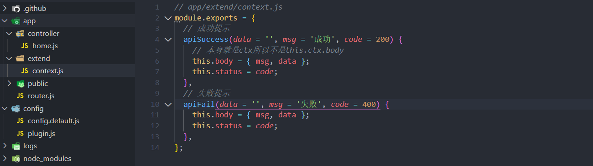
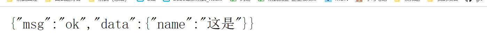
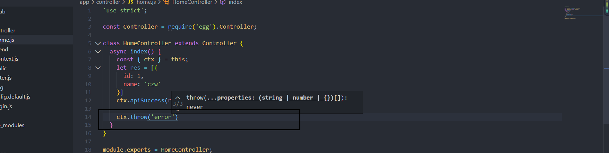
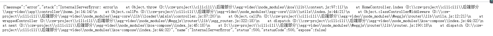
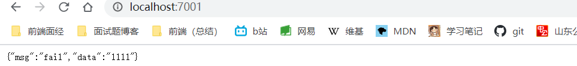

# 全局配置

## 创建项目

安装egg.js

```
全局切换镜像： 
npm config set registry https://registry.npm.taobao.org
```

我们推荐直接使用脚手架，只需几条简单指令，即可快速生成项目（`npm >=6.1.0`）:

```
mkdir egg-example && cd egg-example
npm init egg --type=simple --registry https://registry.npm.taobao.org
npm i
```

启动项目:

```
npm run dev
open http://localhost:7001
```

## 关闭csrf,开启跨域

跨站请求伪造

- 安装 npm i egg-cors --save
- 配置插件

```js
// {app_root}/config/plugin.js
cors:{
  enable: true,
  package: 'egg-cors',
},
```

- config / config.default.js 目录下配置

```js
  config.security = {
    // 关闭 csrf
    csrf: {
      enable: false,
    },
     // 跨域白名单
    domainWhiteList: [ 'http://localhost:3000' ],
  };
  // 允许跨域的方法
  config.cors = {
    origin: '*',
    allowMethods: 'GET, PUT, POST, DELETE, PATCH'
  };
```

## 统一api数据返回格式

>我们想增加一个ctx.foo()方法
>
>```js
>// app/extend/context.js
>module.exports = {
>    foo(param) {
>        // this 就是 ctx 对象，在其中可以调用 ctx 上的其他方法，或访问属性
>    },
>};
>```

[框架扩展](https://eggjs.org/zh-cn/basics/extend.html)



```js
// app/extend/context.js
module.exports = {
  // 成功提示,接收三个参数,
  apiSuccess(data = '', msg = 'ok', code = 200) {
    //他自身就是context,所以不需要ctx,直接用this
    this.body = { msg, data };
    this.status = code;
  },
  // 失败提示
  apiFail(data = '', msg = 'fail', code = 400) {
    this.body = { msg, data };
    this.status = code;
  },
};
```

```js
//home.js
'use strict';

const Controller = require('egg').Controller;

class HomeController extends Controller {
  async index() {
    const { ctx } = this;
    let res = [{
        id:1,
        name:'czw'
      }]
    
    //ctx.body = {msg:'提示',data:[{id:1,name:'陈志伟'}]}
		ctx.apiSuccess({ name: '这是' }, 'ok', 300)
  }
}

module.exports = HomeController;
```



## 全局抛出异常处理中间件

[https://eggjs.org/zh-cn/intro/egg-and-koa.html#%E5%BC%82%E5%B8%B8%E5%A4%84%E7%90%86](https://eggjs.org/zh-cn/intro/egg-and-koa.html#异常处理)


普通的抛出异常，异常会很多并且难以理解而且会用敏感信息，需要自己定义全局抛出的异常。





app新建middleware文件夹用来创建中间件。

```js
// app/middleware/error_handler.js

//
module.exports = (option, app) => {
    return async function errorHandler(ctx, next) {
      try {
        await next(); 
        // 404 处理
        if(ctx.status === 404 && !ctx.body){
           ctx.body = { 
               msg:"fail",
               data:'404 错误'
           };
        }
      } catch (err) {
        // 记录一条错误日志
        app.emit('error', err, ctx);

        const status = err.status || 500;
        // 生产环境时 500 错误的详细错误内容不返回给客户端，因为可能包含敏感信息
        const error = status === 500 && app.config.env === 'prod'
          ? 'Internal Server Error'
          : err.message;

        // 从 error 对象上读出各个属性，设置到响应中
        ctx.body = { 
            msg:"fail",
            data:error
        };
        ctx.status = status;
      }
    };
  };

// config/config.default.js
config.middleware = ['errorHandler'];
```

```js
//model/user.js
'use strict';

const Controller = require('egg').Controller;

class HomeController extends Controller {
  async index() {
    ctx.throw('1111')
  }
}

module.exports = HomeController;

```



## sequelize数据库配置

- 安装并配置[egg-sequelize](https://github.com/eggjs/egg-sequelize)插件（它会辅助我们将定义好的 Model 对象加载到 app 和 ctx 上）和[mysql2](https://github.com/sidorares/node-mysql2)模块：

```js
npm install --save egg-sequelize mysql2
```

- 在`config/plugin.js`中引入 egg-sequelize 插件

```
exports.sequelize = {
  enable: true,
  package: 'egg-sequelize',
};
```

- 在`config/config.default.js`

```js
config.sequelize = {
    dialect: 'mysql',
    host: '127.0.0.1',
    username: "root",
    password: 'root',
    port: 3306,
    database: 'egg-video',
    // 中国时区
    timezone: '+08:00',
    define: {
      // 取消数据表名复数
      freezeTableName: true,
      // 自动写入时间戳 created_at updated_at
      timestamps: true,
      // 字段生成软删除时间戳 deleted_at
      // paranoid: true,
      createdAt: 'created_time',
      updatedAt: 'updated_time',
      // deletedAt: 'deleted_time',
      // 所有驼峰命名格式化
      underscored: true
    }
  };
```

## 初始化数据库和 Migrations数据库迁移配置

- sequelize 提供了[sequelize-cli](https://github.com/sequelize/cli)工具来实现[Migrations](http://docs.sequelizejs.com/manual/tutorial/migrations.html)，我们也可以在 egg 项目中引入 sequelize-cli。

```js
npm install --save-dev sequelize-cli
```

- egg 项目中，我们希望将所有数据库 Migrations 相关的内容都放在`database`目录下，所以我们在项目根目录下新建一个`.sequelizerc`配置文件：

```js
'use strict';

const path = require('path');

module.exports = {
  config: path.join(__dirname, 'database/config.json'),
  'migrations-path': path.join(__dirname, 'database/migrations'),
  'seeders-path': path.join(__dirname, 'database/seeders'),
  'models-path': path.join(__dirname, 'app/model'),
};
```

- 初始化 Migrations 配置文件和目录

```js
npx sequelize init:config
npx sequelize init:migrations
// npx sequelize init:models
```

1. 行完后会生成`database/config.json`文件和`database/migrations`目录，我们修改一下`database/config.json`中的内容，将其改成我们项目中使用的数据库配置：

```json
{
  "development": {
    "username": "root",
    "password": "root",//这里要写密码！！！
    "database": "egg-video",
    "host": "127.0.0.1",
    "dialect": "mysql",
    "timezone": "+08:00"
  }
}
```

1. 创建数据库

```js
npx sequelize db:create
# 升级数据库
npx sequelize db:migrate
# 如果有问题需要回滚，可以通过 `db:migrate:undo` 回退一个变更
# npx sequelize db:migrate:undo
# 可以通过 `db:migrate:undo:all` 回退到初始状态
# npx sequelize db:migrate:undo:all
```

打开phpmyadmin