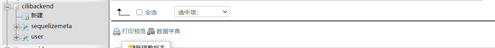
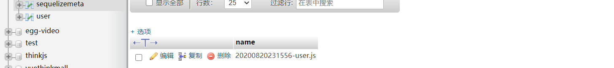
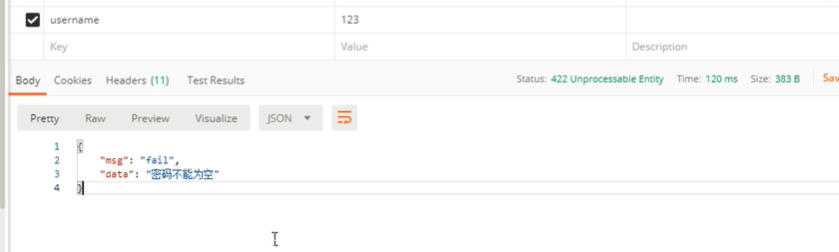
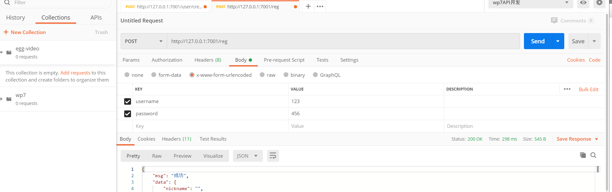
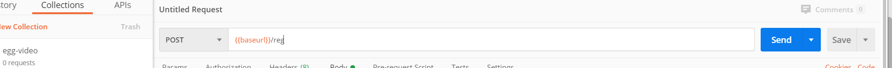
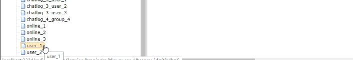
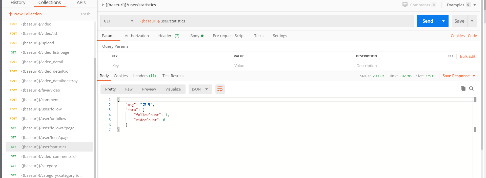
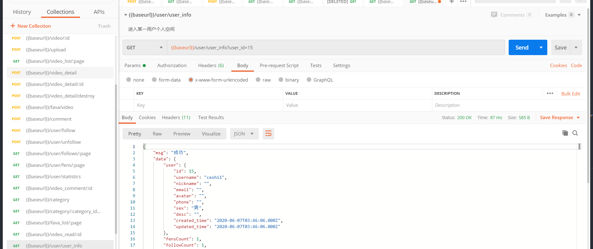

# 用户相关

>用户注册
>
>用户登录

## 数据表设计和迁移-数据模板

**创建数据迁移表**

```js
npx sequelize migration:generate --name=user
```

1.执行完命令后，会在database / migrations / 目录下生成数据表迁移文件，然后定义

```js
'use strict';

module.exports = {
  up: (queryInterface, Sequelize) => {
    const { INTEGER, STRING, DATE, ENUM, TEXT } = Sequelize;
    return queryInterface.createTable('user', {
      id: {
        type: INTEGER(20),
        primaryKey: true,
        autoIncrement: true
      },
      username: {
        type: STRING(30),
        allowNull: false,//不许null，不然会影响性能
        defaultValue: '',
        comment: '用户名',
        unique: true  //用户名是唯一的
      },
      nickname: {
        type: STRING(30),
        allowNull: false,
        defaultValue: '',
        comment: '昵称',
      },
      email: {
        type: STRING(160),
        allowNull: false,
        defaultValue: '',
        comment: '邮箱'
      },
      password: { //密码后期要加密所以不要限制长度
        type: STRING,
        allowNull: false,
        defaultValue: '',
        comment: "密码"
      },
      avatar: {
        type: STRING,
        allowNull: true,
        defaultValue: '',
        comment: '头像'
      },
      phone: {
        type: STRING(11),
        allowNull: false,
        defaultValue: '',
        comment: '手机'
      },
      sex: {  //枚举类型 三个值
        type: ENUM,
        values: ["男", '女', '保密'],
        allowNull: false,
        defaultValue: '男',
        comment: '性别'
      },
      desc: {
        type: TEXT,
        allowNull: false,
        defaultValue: '',
        comment: '个性签名',
      },
      created_time: DATE,
      updated_time: DATE,

    });
  },

  down: (queryInterface, Sequelize) => {
    //回滚
    return queryInterface.dropTable('user');
  }
};
```

- 执行 migrate 进行数据库变更

```js
npx sequelize db:migrate
```

- 数据库创建成功



- sequelizemeta表存放的内容是database/migrations里面的迁移文件名称。



**模型创建**

```js
// app/model/user.js
'use strict';
module.exports = app => {
    const { STRING, INTEGER, DATE, ENUM, TEXT } = app.Sequelize;  //只有这里有区别
    // 配置（重要：一定要配置详细，一定要！！！）
    const User = app.model.define('user',  {
      id: {
        type: INTEGER(20),
        primaryKey: true,
        autoIncrement: true
      },
      username: {
        type: STRING(30),
        allowNull: false,
        defaultValue: '',
        comment: '用户名',
        unique: true
      },
      nickname: {
        type: STRING(30),
        allowNull: false,
        defaultValue: '',
        comment: '昵称',
      },
      email: {
        type: STRING(160),
        allowNull: false,
        defaultValue: '',
        comment: '邮箱'
      },
      password: {
        type: STRING,
        allowNull: false,
        defaultValue: '',
        comment: "密码"
      },
      avatar: {
        type: STRING,
        allowNull: true,
        defaultValue: '',
        comment: '头像'
      },
      phone: {
        type: STRING(11),
        allowNull: false,
        defaultValue: '',
        comment: '手机'
      },
      sex: {
        type: ENUM,
        values: ["男", '女', '保密'],
        allowNull: false,
        defaultValue: '男',
        comment: '性别'
      },
      desc: {
        type: TEXT,
        allowNull: false,
        defaultValue: '',
        comment: '个性签名',
      },
      created_time: DATE,
      updated_time: DATE,

    });
    return User;
};
```

## egg-valparams参数验证

插件地址：

> https://www.npmjs.com/package/egg-valparams

安装

```
npm i egg-valparams --save
```

配置

```js
// config/plugin.js
valparams : {
  enable : true,
  package: 'egg-valparams'
},
  

```

```js
// config/config.default.js
config.valparams = {
    locale    : 'zh-cn',
  	//主动抛出异常
    throwError: true
};
```

中间件：app/middleware/error_handler.js

```js
module.exports = (option, app) => {
    return async function errorHandler(ctx, next) {
        try {
            await next();
            // 404 处理
            if (ctx.status === 404 && !ctx.body) {
                ctx.body = {
                    msg: "fail",
                    data: '404 错误'
                };
            }
        } catch (err) {
            // 记录一条错误日志
            app.emit('error', err, ctx);
            let status = err.status || 500;
            // 生产环境时 500 错误的详细错误内容不返回给客户端，因为可能包含敏感信息
            let error = status === 500 && app.config.env === 'prod'
                ? 'Internal Server Error'
                : err.message;
            // 从 error 对象上读出各个属性，设置到响应中
            ctx.body = {
                msg: "fail",
                data: error
            };
            // 参数错误验证异常
            if (status === 422 && err.message === "Validation Failed") {
                if (err.errors && Array.isArray(err.errors)) {
                    error = err.errors[0].err[0] ? err.errors[0].err[0] : err.errors[0].err[1];
                }
                ctx.body = {
                    msg: "fail",
                    data: error
                };
            }

            ctx.status = status;
        }
    };
};
```

在控制器里使用

```js
class XXXController extends app.Controller {
  // ...
  async XXX() {
    const {ctx} = this;
    ctx.validate({
      system  : {type: 'string', required: false, defValue: 'account', desc: '系统名称'},
      token   : {type: 'string', required: true, desc: 'token 验证'},
      redirect: {type: 'string', required: false, desc: '登录跳转'},
      password: {type: 'string',required: true, desc: '密码' },
    });
    // if (config.throwError === false)
    if(ctx.paramErrors) {
      // get error infos from `ctx.paramErrors`;
    }
    let params = ctx.params;
    let {query, body} = ctx.request;
    // ctx.params        = validater.ret.params;
    // ctx.request.query = validater.ret.query;
    // ctx.request.body  = validater.ret.body;
    // ...
    ctx.body = query;
  }
  // ...
}
```

错误提示



### ValParams API 说明

#### 参数验证处理

Valparams.setParams(req, params, options);

| Param                       | Type                                               | Description                                                  | Example                                                      |
| --------------------------- | -------------------------------------------------- | ------------------------------------------------------------ | ------------------------------------------------------------ |
| req                         | Object                                             | request 对象,这里我们就是取相应的三种请求的参数进行参数验证  | {params, query, body}                                        |
| params                      | Object                                             | 参数的格式配置 { pname: {alias, type, required, range: {in, min, max, reg, schema }, defValue, trim, allowEmptyStr, desc[, detail] } } | {sysID : {alias:'sid',type: 'int', required: true, desc: '所属系统id'}} |
| params[pname]               | String                                             | 参数名                                                       |                                                              |
| params[pname].alias         | String                                             | 参数别名，可以使用该参数指定前端使用的参数名称               |                                                              |
| params[pname].type          | String                                             | 参数类型                                                     | 常用可选类型有 int, string, json 等，其他具体可见下文或用 Valparams.vType 进行查询 |
| params[pname].required      | Boolean                                            | 是否必须                                                     |                                                              |
| params[pname].range         | Object                                             | 参数范围控制                                                 | {min: '112.80.248.10', max: '112.80.248.72'}                 |
| params[pname].range.min     | ALL                                                | 最小值、最短、最早（不同 type 参数 含义有所差异）            |                                                              |
| params[pname].range.max     | ALL                                                | 最大值、最长、最晚（不同 type 参数 含义有所差异）            |                                                              |
| params[pname].range.in      | Array                                              | 在XX中，指定参数必须为其中的值                               |                                                              |
| params[pname].range.reg     | RegExp                                             | 正则判断，参数需要符合正则                                   |                                                              |
| params[pname].range.schema  | Object                                             | jsonSchema，针对JSON类型参数有效，使用ajv对参数进行格式控制  |                                                              |
| params[pname].defValue      | ALL                                                | 默认值，没传参数或参数验证出错时生效，此时会将该值赋值到相应参数上 |                                                              |
| params[pname].trim          | Boolean                                            | 是否去掉参数前后空格字符，默认false                          |                                                              |
| params[pname].allowEmptyStr | Boolean                                            | 是否允许接受空字符串，默认false                              |                                                              |
| params[pname].desc          | String                                             | 参数含义描述                                                 |                                                              |
| options                     | Object                                             | 参数关系配置                                                 |                                                              |
| options.choices             | Array                                              | 参数挑选规则                                                 | [{fields: ['p22', 'p23', 'p24'], count: 2, force: true}] 表示'p22', 'p23', 'p24' 参数三选二 |
| options.choices[].fields    | Array                                              | 涉及的参数                                                   |                                                              |
| options.choices[].count     | Number                                             | 需要至少传 ${count} 个                                       |                                                              |
| options.choices[].force     | Boolean                                            | 默认 false，为 true 时，涉及的参数中只能传 ${count} 个, 为 false 时，可以多于 ${count} 个 |                                                              |
| options.equals              | Array                                              | 参数相等                                                     | [['p20', 'p21'], ['p22', 'p23']] 表示 'p20', 'p21' 两个值需要相等，'p22', 'p23' 两个值需要相等 |
| options.equals[]            | Array                                              | 涉及的参数(涉及的参数的值需要是相等的)                       |                                                              |
| options.compares            | Array                                              | 参数大小关系                                                 | [['p25', 'p26', 'p27']] 表示 'p25', 'p26', 'p27' 必须符合 'p25' <= 'p26' <= 'p27' |
| options.compares[]          | Array                                              | 涉及的参数(涉及的参数的值需要是按顺序从小到大的)             |                                                              |
| options.cases               | Object                                             | 参数条件判断                                                 | [{when: ['p30'], then: ['p31'], not: ['p32']}] 表示 当传了 p30 就必须传 p31 ,同时不能传p32 |
| options.cases.when          | Array                                              | 条件                                                         |                                                              |
| options.cases.when[]        | String                                             | 涉及的参数，（字符串）只要接收到的参数有这个字段即为真       |                                                              |
| options.cases.when[].field  | 涉及的参数的名（对象）                             | ---                                                          |                                                              |
| options.cases.when[].value  | 涉及的参数的值（对象）需要参数的值与该值相等才为真 | ---                                                          |                                                              |
| options.cases.then          | Array                                              | 符合when条件时，需要必传的参数                               |                                                              |
| options.cases.not           | Array                                              | 符合when条件时，不能接收的参数                               |                                                              |

```js
const Valparams = require('path/to/Valparams[/index]');
Valparams.locale('zh-cn');

function list(req, res, next) {
  let validater = Valparams.setParams(req, {
    sysID : {alias:'sid',type: 'int', required: true, desc: '所属系统id'},
    page  : {type: 'int', required: false, defValue: 1, range:{min:0}, desc: '页码'},
    size  : {type: 'int', required: false, defValue: 30, desc: '页面大小'},
    offset: {type: 'int', required: false, defValue: 0, desc: '位移'}
  }, {
    choices : [{fields: ['sysID', 'page'], count: 1, force: false}],
  });
  if (validater.err && validater.err.length) {
    console.log(validater.err);
  }
  else {
    console.log(validater);
    //{ query: { page: 1, size: 30 },
    //  body: {},
    //  params: { sysID: 2 },
    //  all: { sysID: 2, page: 1, size: 30 },
    //  err: null }
    //  raw: { query: { page: 1, size: 30 },
    //         body: {},
    //         params: { sid: 2 },
    //       }
    //}
    //do something
  }
}
```

#### 返回支持的类型列表

```js
Valparams.vType = {
  ALL        : 'all',
  STRING     : 'string',
  ARRAY      : 'array',
  DATE       : 'date',
  INT        : 'int',
  FLOAT      : 'float',
  LETTER     : 'letter',
  NUMBER     : 'number',
  IP         : 'ip',
  EMAIL      : 'email',
  PHONE      : 'phone',
  URL        : 'url',
  JSON       : 'json',
  BOOL       : 'bool',
  NULL       : 'null',
  RANGE      : 'range',
  DATERANGE  : 'dateRange',
  INTRANGE   : 'intRange',
  FLOATRANGE : 'floatRange',
  NUMBERRANGE: 'numberRange'
};
```

##### 自定义本地化文件

Valparams.defineLocale(key, value);

| Param | Type   | Description                                                  | Example |
| ----- | ------ | ------------------------------------------------------------ | ------- |
| key   | String | 语言标识                                                     | zh-cn   |
| value | Object | 本地化内容，可配置内容有 em_type, em_minmax, em_reg, em_in, em_schema, em_required, em_range_relation, em_choices, em_equals, em_compares, em_cases | ---     |

##### 更新已有本地化文件内容

Valparams.updateLocale(key, value);

参数含义同 defineLocale

##### 获取本地化文件内容

Valparams.localeData(key);

| Param | Type   | Description | Example |
| ----- | ------ | ----------- | ------- |
| key   | String | 语言标识    | zh-cn   |

##### 列出已加载的本地化文件

Valparams.locales(key);

目前已有 en 、 zh-cn

| Param | Type   | Description | Example |
| ----- | ------ | ----------- | ------- |
| key   | String | 语言标识    | zh-cn   |

##### 设置使用的本地化文件

Valparams.locale(locale); 如： `Valparams.locale('zh-cn')`;

## crypto数据加密 修改器

- 安装

```js
npm install crypto --save
```

- 配置文件配置 config / config.default.js

```js
config.crypto = {
    secret:  'qhdgw@45ncashdaksh2!#@3nxjdas*_672'
};
```

- egg-js修改器使用(查看文档)

  ```js
  //app/model/user.js
  'use strict';
  const crypto = require('crypto');
  
  module.exports = app => {
    const { STRING, INTEGER, DATE, ENUM, TEXT } = app.Sequelize;
    // 配置（重要：一定要配置详细，一定要！！！）
    const User = app.model.define('user', {
      //....
      password: {
        type: STRING,
        allowNull: false,
        defaultValue: '',
        comment: "密码",
        set(val) {
          // app.config.crypto.secret就是   secret:  'qhdgw@45ncashdaksh2!#@3nxjdas*_672'
          const hmac = crypto.createHash("sha256", app.config.crypto.secret);
          hmac.update(val);
          this.setDataValue('password', hmac.digest("hex"));
        }
      },
      
      
      //....
      
    });
    return User;
  };
  ```

- 其他使用方式

  ```js
  // 引入
  const crypto = require('crypto');
  
  // 加密
  async createPassword(password) {
      const hmac = crypto.createHash("sha256", this.app.config.crypto.secret);
      hmac.update(password);
      return hmac.digest("hex");
  }
  
  // 验证密码
  async checkPassword(password, hash_password) {
      // 先对需要验证的密码进行加密
      password = await this.createPassword(password);
      return password === hash_password;
  }
  ```

## 注册api实现

| 方法 | 路径 | body                |
| ---- | ---- | ------------------- |
| post | /reg | {username,password} |

控制器 app/conroller/user.js

- 数据库操作一定要加await

1. 获取请求体的用户名密码，参数验证。
2. 查询用户名是否存在,如果存在，抛出`400,用户名已存在`
3. 数据加密，添加数据。
4. 返回成功后统一。

```js
async reg() {
  let { ctx, app } = this;
  // 参数验证
  ctx.validate({
    username: {
      type: 'string',
      required: true,
      range: {
        min: 5,
        max: 20
      },
      //别名
      desc: '用户名'
    },
    password: {
      type: 'string',
      required: true,
      desc: '密码'
    },
    repassword: {
      type: 'string',
      required: true,
      desc: '确认密码'
    }
  }, {
    equals: [  //判断两者是否相等，可以不在这里判断
      //['password', 'repassword']
    ]
  });
  //前端传递的信息
  let { username, password,repassword} = ctx.request.body;
  //或者
  if (password !== repassword) {
    return ctx.throw(400, '密码和确认密码必须一致')
  }
  // 验证用户是否已经存在
  if (await app.model.User.findOne({
    where: {
      username,
    }
  })) {
    ctx.throw(400, '用户名已存在');
  }
  // 创建用户
  let user = await app.model.User.create({
    username,
    password
  });
  if (!user) {
    ctx.throw(400, '创建用户失败');
  }
  ctx.apiSuccess(user);
}
```

路由 app/router.js

```
// 用户注册
  router.post('/reg', controller.user.reg);
```

## postman测试接口



环境配置：替换


使用这个域名




## egg-jwt 加密鉴权

jwt就是用于登录时生成和验证token的包。

插件地址：

> https://www.npmjs.com/package/egg-jwt

安装

```
npm i egg-jwt --save
```

配置

```js
// {app_root}/config/plugin.js
jwt : {
  enable: true,
    package: "egg-jwt"
}
//或者
exports.jwt = {
  enable: true,
  package: "egg-jwt"
};


// {app_root}/config/config.default.js
exports.jwt = {
  secret: 'qhdgw@45ncashdaksh2!#@3nxjdas*_672'
};
```

### 生成token

```js
// 生成token
async getToken(value) {
    return this.app.jwt.sign(value, this.app.config.jwt.secret);
}
```

### 验证token

```js
try {
    user = app.jwt.verify(token, app.config.jwt.secret)
} catch (err) {
    let fail = err.name === 'TokenExpiredError' ? 'token 已过期! 请重新获取令牌' : 'Token 令牌不合法!';
    return ctx.apiFail(fail);
}
```

## redis 缓存插件和封装

>用户登录后要把这个token存到服务端方便后期匹配。
>
>redis就是一个持久化存储的非关系型数据库，适合小数据性能和运算

安装

```
npm i egg-redis --save
```

配置

```js
// config/plugin.js
exports.redis = {
  enable: true,
  package: 'egg-redis',
};

// /config/config.default.js	redis存储
config.redis = {
    client: {
        port: 6379,          // Redis port
        host: '127.0.0.1',   // Redis host
        password: '',  			 //密码默认没有
        db: 0,							 //数据库序号
    },
}
```

缓存库封装

```js
// app/service/cache.js
'use strict';

const Service = require('egg').Service;

class CacheService extends Service {
    /**
     * 获取列表
     * @param {string} key 键
     * @param {boolean} isChildObject 元素是否为对象
     * @return { array } 返回数组
     */
    async getList(key, isChildObject = false) {
        const { redis } = this.app
        let data = await redis.lrange(key, 0, -1)
        if (isChildObject) {
            data = data.map(item => {
                return JSON.parse(item);
            });
        }
        return data;
    }
    /**
     * 设置列表
     * @param {string} key 键
     * @param {object|string} value 值
     * @param {string} type 类型：push和unshift
     * @param {Number} expir 过期时间 单位秒
     * @return { Number } 返回索引
     */
    async setList(key, value, type = 'push', expir = 0) {
        const { redis } = this.app
        if (expir > 0) {
            await redis.expire(key, expir);
        }
        if (typeof value === 'object') {
            value = JSON.stringify(value);
        }
        if (type === 'push') {
            return await redis.rpush(key, value);
        }
        return await redis.lpush(key, value);
    }

    /**
     * 设置 redis 缓存
     * @param { String } key 键
     * @param {String | Object | array} value 值
     * @param { Number } expir 过期时间 单位秒
     * @return { String } 返回成功字符串OK
     */
    async set(key, value, expir = 0) {
        const { redis } = this.app
        if (expir === 0) {
            return await redis.set(key, JSON.stringify(value));
        } else {
            return await redis.set(key, JSON.stringify(value), 'EX', expir);
        }
    }

    /**
     * 获取 redis 缓存
     * @param { String } key 键
     * @return { String | array | Object } 返回获取的数据
     */
    async get(key) {
        const { redis } = this.app
        const result = await redis.get(key)
        return JSON.parse(result)
    }

    /**
     * redis 自增
     * @param { String } key 键
     * @param { Number } value 自增的值 
     * @return { Number } 返回递增值
     */
    async incr(key, number = 1) {
        const { redis } = this.app
        if (number === 1) {
            return await redis.incr(key)
        } else {
            return await redis.incrby(key, number)
        }
    }

    /**
     * 查询长度
     * @param { String } key
     * @return { Number } 返回数据长度
     */
    async strlen(key) {
        const { redis } = this.app
        return await redis.strlen(key)
    }

    /**
     * 删除指定key
     * @param {String} key 
     */
    async remove(key) {
        const { redis } = this.app
        return await redis.del(key)
    }

    /**
     * 清空缓存
     */
    async clear() {
        return await this.app.redis.flushall()
    }
}

module.exports = CacheService;
```

缓存库使用

```js
// 控制器 设置缓存。
await this.service.cache.set('key', 'value');
```

## 登录api实现

| 方法 | body体 |      |
| ---- | ------ | ---- |
| post |        |      |

验证成功会使用jwt在服务端生成用户唯一的token。代表用户登录过，并把token存到本地存储

控制器 app/conroller/user.js

>步骤：
>
>1. 获取请求的username和password
>
>2. 进行参数校验
>
>3. 验证用户名是否存在，如果存在，获取匹配到的数据库user
>
>4. 验证密码是否匹配
>
>5. 生成token
>
>   1. 把数据库匹配的user进行序列化反序列化转换，因为他不是纯粹对象
>
>   2. 生成token并添加到user下为他的属性
>
>   3. 加入缓存，服务端也要在redies存用户登录状态。  *user_拼接上当前用户id,*
>
>      

token生成

```js
// app/extend/context.js
module.exports = {
  //生成token
    getToken(value) {
      return this.app.jwt.sign(value, this.app.config.jwt.secret);
    }
};
```

```js
// 引入
const crypto = require('crypto');
class UserController extends Controller {
  // 登录
  async login() {
    const { ctx, app } = this;
    // 参数验证
    ctx.validate({
      username: {
        type: 'string',
        required: true,
        desc: '用户名'
      },
      password: {
        type: 'string',
        required: true,
        desc: '密码'
      },
    });
    let { username, password } = ctx.request.body;
    // 验证该用户是否存在
    let user = await app.model.User.findOne({
      where: {
        username,
      }
    });
    if (!user) {
      return ctx.apiFail('用户不存');
    }
    // 验证密码
    await this.checkPassword(password, user.password);
	
    //转换成单纯的对象
    user = JSON.parse(JSON.stringify(user));
    // 生成token
    let token = ctx.getToken(user);
    user.token = token;
    delete user.password;
    // 加入缓存中  无时间限制
    if (!await this.service.cache.set('user_' + user.id, token)) {
      ctx.throw(400, '登录失败');
    }
    // 返回用户信息和token
    return ctx.apiSuccess(user);
  }

  // 验证密码
  async checkPassword(password, hash_password) {
    // 先对需要验证的密码进行加密
    const hmac = crypto.createHash("sha256", this.app.config.crypto.secret);
    hmac.update(password);
    password = hmac.digest("hex"); //加密形式
    let res = password === hash_password;
    if (!res) {
      this.ctx.throw(400, '密码错误'); //throw不会往下走，但是apifFail会往下走。
    }
    return true;
  }
}
```

路由 app/router.js

```
// 用户登录
router.post('/login', controller.user.login);
```

## 全局权限验证中间件实现

有些功能是需要登录才能实现的，所以需要做权限验证。

中间件：app/middleware/auth.js

>步骤
>
>1. 获取header头的token，如果没有直接抛出没有权限
>2. 解密token得到用户信息，判断是否过期和合法
>3. 判断当前用户是否登录，调用cache里的get方法获取到存在redis的token是否和传入的token一样，否则令牌不合法
>4. 从model层find当前用户，如果查找到就把user信息挂载到全局ctx。

```js
module.exports = (option, app) => {
  return async (ctx, next) => {
    //1. 获取 header 头token
    const { token } = ctx.header;
    if (!token) {
      ctx.throw(400, '您没有权限访问该接口!');
    }
    //2. 根据token解密，换取用户信息
    let user = {};
    try {
      user = app.jwt.verify(token, app.config.jwt.secret)
    } catch (err) {
      let fail = err.name === 'TokenExpiredError' ? 'token 已过期! 请重新获取令牌' : 'Token 令牌不合法!';
      return ctx.apiFail(fail);
    }
    //3. 判断当前用户是否登录
    let t = await ctx.service.cache.get('user_' + user.id);
    if (!t || t !== token) {
      ctx.throw(400, 'Token 令牌不合法!');
    }

    //4. 获取当前用户，验证当前用户是否存在
    user = await app.model.User.findByPk(user.id);
    if (!user) {
      ctx.throw(400,'用户不存在');
    }
    // 5. 把 user 信息挂载到全局ctx上
    ctx.authUser = user;

    await next();
  }
}
```

配置：config/config.default.js

```js
config.middleware = [
    //...
    'auth',
    // ...
];

// 配置那些路由需要验证
config.auth = {
    //ignore: ['/reg', '/login']
    match: [
      '/logout',
      '/video',
      '/video_detail',
      '/vod/sign',
      '/comment',
      '/fava',
      '/user/follow',
      '/user/unfollow',
      '/user/follows',
      '/user/fens',
      '/user/statistics'
    ]
  };
```

## 退出登录功能实现

控制器：app/controller/user.js

>步骤:
>
>1. 获取当前ctx的用户id
>2. 移除缓存里的当前用户缓存信息

```js
    // 退出登录
    async logout() {
        const { ctx, service } = this;
        // 拿到当前用户id
        let current_user_id = ctx.authUser.id;
        // 移除redis当前用户信息
        if (!await service.cache.remove('user_' + current_user_id)) {
            ctx.throw(400, '退出登录失败');
        }
        ctx.apiSuccess('退出成功');
    }
```

路由：app/router.js

```js
// 退出登录
  router.post('/logout', controller.user.logout);
```

## 统计相关数据

在个人中心统计我的作品，收藏，关注

控制器：app/controller/user.js

```js
// 统计相关数据
async statistics() {
  const { ctx, service, app } = this;
  let user_id = ctx.authUser.id;

  let followCount = await service.user.getFollowCount(user_id);

  let videoCount = await service.user.getVideoCount(user_id);

  ctx.apiSuccess({
    followCount,
    videoCount
  });
}
```

服务：app/service/user.js

```js
// 指定用户关注人数
async getFollowCount(user_id) {
  return await this.app.model.Follow.count({
    where: {
      user_id
    }
  });
}

// 指定用户的作品量
async getVideoCount(user_id) {
  return await this.app.model.Video.count({
    where: {
      user_id
    }
  });
}
```

路由：app/router.js

```js
// 统计相关数据
router.get('/user/statistics', controller.user.statistics);
```

需要配置token



## 获取用户相关信息

接口用在用户的视频列表页面

控制器：app/controller/user.js

```js
// 获取用户相关信息
async user_info() {
  const { ctx, service, app } = this;
  let currentUser = ctx.authUser;

  ctx.validate({
    user_id: {
      required: true,
      desc: "用户id",
      type: "int"
    }
  });

  let user_id = ctx.query.user_id;

  let res = await service.user.getUserInfo(user_id);

  let fensCount = 0;

  let followCount = 0;

  if (res) {
    fensCount = await service.user.getFensCount(user_id);
    followCount = await service.user.getFollowCount(user_id);
  }

  let follow = false;

  if (currentUser) {
    follow = await service.user.isFollow(currentUser.id, user_id);
  }

  ctx.apiSuccess({
    user: res,
    fensCount,
    followCount,
    follow
  });
}
```

服务：app/service/user.js

```js
// 指定用户粉丝人数
async getFenCount(user_id) {
  return this.app.model.Follow.count({
    where: {
      follow_id: user_id
    }
  });
}
// 用户相关信息
async getUserInfo(user_id) {
  return await this.app.model.User.findOne({
    where: {
      id: user_id
    },
    attributes: {
      exclude: ['password']
    }
  });
}
```

路由：app/router.js

```js
// 获取用户相关信息
router.get('/user/user_info', controller.user.user_info);
```



## 修改头像

安装

```js
npm install await-stream-ready
npm install stream-wormhole
npm install dayjs
```

配置：config/config.default.js

```js
config.multipart = {
    fileSize: '50mb',//上传50m以内
    mode: 'stream', //流形式上传
    fileExtensions: ['.xls', '.txt', '.jpg', '.JPG', '.png', '.PNG', '.gif', '.GIF', '.jpeg', '.JPEG'], // 扩展几种上传的文件格式
  };
```

控制器：app/controller/file.js

```js
'use strict';

const Controller = require('egg').Controller;
const fs = require('fs');
const path = require('path');
//故名思意 异步二进制 写入流
const awaitWriteStream = require('await-stream-ready').write;
//管道读入一个虫洞。
const sendToWormhole = require('stream-wormhole');
const dayjs = require('dayjs');

class FileController extends Controller {
  async uploadavatar() {
    // 获取文件流
    const stream = await this.ctx.getFileStream();
    // 基础的目录
    const uploadBasePath = 'app/public/uploadavatar';
    // 生成文件名,
    //因为用户上传的文件如果同名的话会被覆盖
    const filename = `${Date.now()}${Number.parseInt(
      Math.random() * 1000,
    )}${path.extname(stream.filename).toLocaleLowerCase()}`;
    // 生成文件夹  app/public/uploadAvatar/20200101
    // 按照日期创建文件夹。
    const dirname = dayjs(Date.now()).format('YYYY/MM/DD');
    // 定义创建文件夹方法
    function mkdirsSync(dirname) {
      // 如果路径存在就返回，因为一天可能有多次
      if (fs.existsSync(dirname)) {
        return true;
      } else {
        // 如果不存在就没事
        if (mkdirsSync(path.dirname(dirname))) {
          fs.mkdirSync(dirname);
          return true;
        }
      }
    }
    mkdirsSync(path.join(uploadBasePath, dirname));
    // 生成写入路径
    const target = path.join(uploadBasePath, dirname, filename);
    // fs模块创建写入流
    const writeStream = fs.createWriteStream(target);

    // 异步写入
    try {
      //异步把文件流 写入
      await awaitWriteStream(stream.pipe(writeStream));
    } catch (err) {
      //如果出现错误，关闭管道
      await sendToWormhole(stream);
      this.ctx.throw(500, err);
    }
    //获取协议 域名
    const { protocol, host } = this.ctx.request;
    let url = path.join('/public/uploadavatar', dirname, filename).replace(/\\|\//g, '/');
    url = protocol + '://' + host + url
    //    url = protocol + '://' + 'cilicili.cchenzw.top' + url 
    
    this.ctx.apiSuccess({ url });
  }

}

module.exports = FileController;
```

路由：app/router.js

```js
// 上传文件
router.post('/upload', controller.file.upload);
```


