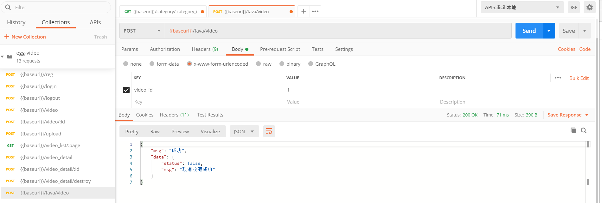
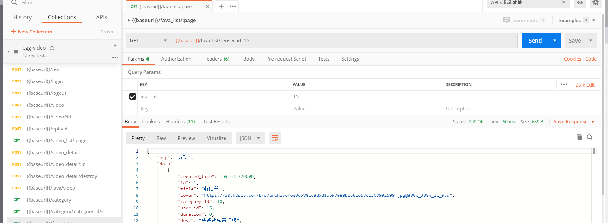

# 收藏相关

## 数据表设计和迁移

| 字段         | 类型     | 空   | 默认   | 链接到      | 注释   |
| ------------ | -------- | ---- | ------ | ----------- | ------ |
| id *(主键)*  | int(20)  | 否   |        |             |        |
| user_id      | int(11)  | 否   | 0      | user -> id  | 用户id |
| video_id     | int(11)  | 否   | 0      | video -> id | 视频id |
| created_time | datetime | 是   | *NULL* |             |        |
| updated_time | datetime | 是   | *NULL* |             |        |

创建数据迁移表

```js
npx sequelize migration:generate --name=fava
```

1.执行完命令后，会在database / migrations / 目录下生成数据表迁移文件，然后定义

```js
'use strict';

module.exports = {
  up: (queryInterface, Sequelize) => {
    const { INTEGER, STRING, DATE, ENUM, TEXT } = Sequelize;
    return queryInterface.createTable('fava', {
      id: {
        type: INTEGER(20),
        primaryKey: true,
        autoIncrement: true
      },
      user_id: {
        type: INTEGER,
        allowNull: false,
        defaultValue: 0,
        comment: '用户id',
        references: {
          model: 'user',
          key: 'id'
        },
        onDelete: 'cascade',
        onUpdate: 'restrict', // 更新时操作
      },
      video_id: {
        type: INTEGER,
        allowNull: false,
        defaultValue: 0,
        comment: '视频id',
        references: {
          model: 'video',
          key: 'id'
        },
        onDelete: 'cascade',
        onUpdate: 'restrict', // 更新时操作
      },
      created_time: DATE,
      updated_time: DATE
    });
  },

  down: (queryInterface, Sequelize) => {
    return queryInterface.dropTable('fava');
  }
};
```

- 执行 migrate 进行数据库变更

```js
npx sequelize db:migrate
```

模型创建

```js
// app/model/fava.js
module.exports = app => {
  const { STRING, INTEGER, DATE, ENUM, TEXT } = app.Sequelize;

  const Fava = app.model.define('fava', {
    id: {
      type: INTEGER(20),
      primaryKey: true,
      autoIncrement: true
    },
    user_id: {
      type: INTEGER,
      allowNull: false,
      defaultValue: 0,
      comment: '用户id'
    },
    video_id: {
      type: INTEGER,
      allowNull: false,
      defaultValue: 0,
      comment: '视频id'
    },
    created_time: DATE,
    updated_time: DATE
  });

  // 关联关系
  Fava.associate = function (models) {
    // 关联作者
    Fava.belongsTo(app.model.User);
    // 关联视频
    Fava.belongsTo(app.model.Video);
  }

  return Fava;
};
```

## 收藏/取消收藏视频

控制器：app/controller/fava.js

```js
// 收藏/取消收藏视频
async video() {
  const { ctx, app } = this;
  let currentUser = ctx.authUser;

  ctx.validate({
    video_id: {
      type: "int",
      required: true,
      desc: "视频ID"
    },
  });

  let {
    video_id,
  } = ctx.request.body;

  let fava = await app.model.Fava.findOne({
    where: {
      video_id,
      user_id: currentUser.id
    }
  });

  if (fava) {
    fava.destroy()
    return ctx.apiSuccess({
      status: false,
      msg: "取消收藏成功"
    });
  }

  let video = await app.model.Video.findOne({
    where: {
      id: video_id
    }
  });

  if (!video) {
    return ctx.apiFail('视频不存在');
  }

  await app.model.Fava.create({
    video_id,
    user_id: currentUser.id
  });

  ctx.apiSuccess({
    status: true,
    msg: "收藏成功"
  });
}
```

路由：app/router.js

```js
// 收藏/取消收藏视频
router.post('/fava/video', controller.fava.video);
```

权限验证

```js
//config/config.default.js
config.auth = {
  match: [
    '/fava',
```

postman调试:

需要传递token



## 指定用户的收藏列表

>fava数据包只包含video_id,所以我们需要借助模型管理拿到video的数据
>
>我们在用户的主页里也可以拿到收藏，但是可能是其他人的个人空间。
>
>步骤
>
>1. 验证分页和id是否匹配
>2. 使用query获取到
>3. 使用page方法

控制器：app/controller/fava.js

```js
127.0.0.1:7001/fava_list/1?userid=1 
```

```js
// 指定收藏列表
async list() {
  const { ctx, app } = this;
  let currentUser = ctx.authUser;

  ctx.validate({
    //拿到分页
    page: {
      required: true,
      desc: "页码",
      type: "int"
    },
    //拿到用户id
    user_id: {
      required: true,
      desc: "用户id",
      type: "int"
    }
  });
	//get形式
  let user_id = ctx.query.user_id;
	
  //匹配userId的，并关联Video模型
  let rows = await ctx.page(app.model.Fava, {
    user_id
  }, {
    include: [{
      model: app.model.Video,
    }]
  });
	
  //
  rows = rows.map(item => {
    return {
      created_time: item.video.created_time,
      id: item.video.id,
      title: item.video.title,
      cover: item.video.cover,
      category_id: item.video.category_id,
      user_id: item.video.user_id,
      duration: item.video.duration,
      desc: item.video.desc,
      play_count: item.video.play_count,
      danmu_count: item.video.danmu_count,
      updated_time: item.video.updated_time,
    }
  });

  ctx.apiSuccess(rows);
}
```

路由：app/router.js

```js
// 收藏列表
router.get('/fava_list/:page', controller.fava.list);
```

postman调试

