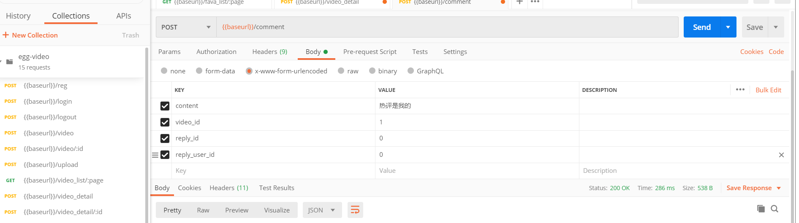
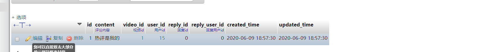
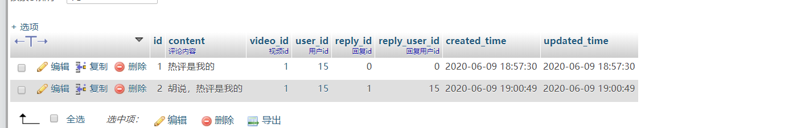
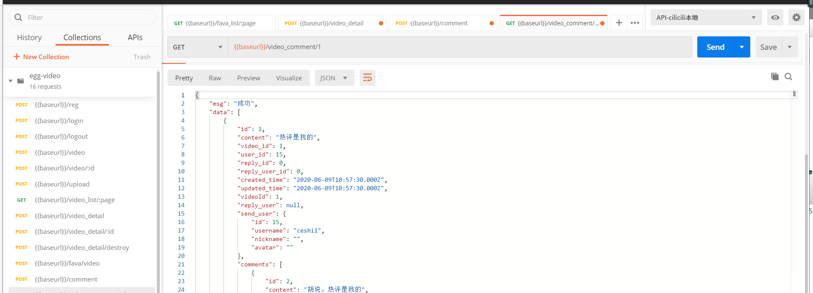

# 评论相关

## comment数据表设计和迁移

| 字段          | 类型     | 空   | 默认   | 链接到      | 注释       |
| ------------- | -------- | ---- | ------ | ----------- | ---------- |
| id *(主键)*   | int(20)  | 否   |        |             |            |
| content       | text     | 否   |        |             | 评论内容   |
| video_id      | int(11)  | 否   | 0      | video -> id | 作品id     |
| user_id       | int(11)  | 否   | 0      | user -> id  | 用户id     |
| reply_id      | int(11)  | 否   | 0      |             | 回复id     |
| reply_user_id | int(11)  | 否   | 0      |             | 回复用户id |
| created_time  | datetime | 是   | *NULL* |             |            |
| updated_time  | datetime | 是   | *NULL* |             |            |

创建数据迁移表

```js
npx sequelize migration:generate --name=comment
```

1.执行完命令后，会在database / migrations / 目录下生成数据表迁移文件，然后定义

```js
'use strict';
module.exports = {
  up: (queryInterface, Sequelize) => {
    const { INTEGER, STRING, DATE, ENUM, TEXT } = Sequelize;
    return queryInterface.createTable('comment', {
      id: {
        type: INTEGER(20),
        primaryKey: true,
        autoIncrement: true
      },
      content: {
        type: TEXT,
        allowNull: false,
        defaultValue: '',
        comment: '评论内容'
      },
      video_id: {
        type: INTEGER,
        allowNull: false,
        defaultValue: 0,
        comment: '视频id',
        references: {
          model: 'video',
          key: 'id'
        },
        onDelete: 'cascade',
        onUpdate: 'restrict', // 更新时操作
      },
      user_id: {
        type: INTEGER,
        allowNull: false,
        defaultValue: 0,
        comment: '用户id',
        references: {
          model: 'user',
          key: 'id'
        },
        onDelete: 'cascade',
        onUpdate: 'restrict', // 更新时操作
      },
      reply_id: {
        type: INTEGER,
        allowNull: false,
        defaultValue: 0,
        comment: '回复id',
      },
      reply_user_id: {
        type: INTEGER,
        allowNull: false,
        defaultValue: 0,
        comment: '回复用户id'
      },
      created_time: DATE,
      updated_time: DATE,
    });
  },
  down: (queryInterface, Sequelize) => {
    return queryInterface.dropTable('comment');
  }
};
```

- 执行 migrate 进行数据库变更

```js
npx sequelize db:migrate
```

模型创建

```js
// app/model/comment.js
module.exports = app => {
    const { STRING, INTEGER, DATE, ENUM, TEXT } = app.Sequelize;
    const Comment = app.model.define('comment', {
        id: {
            type: INTEGER(20),
            primaryKey: true,
            autoIncrement: true
        },
        content: {
            type: TEXT,
            allowNull: false,
            defaultValue: '',
            comment: '评论内容'
        },
        video_id: {
            type: INTEGER,
            allowNull: false,
            defaultValue: 0,
            comment: '视频id',
            references: {
                model: 'video',
                key: 'id'
            },
            onDelete: 'cascade',
            onUpdate: 'restrict', // 更新时操作
        },
        user_id: {
            type: INTEGER,
            allowNull: false,
            defaultValue: 0,
            comment: '用户id',
            references: {
                model: 'user',
                key: 'id'
            },
            onDelete: 'cascade',
            onUpdate: 'restrict', // 更新时操作
        },
        reply_id: {
            type: INTEGER,
            allowNull: false,
            defaultValue: 0,
            comment: '回复id',
        },
        reply_user_id: {
            type: INTEGER,
            allowNull: false,
            defaultValue: 0,
            comment: '回复用户id'
        },
        created_time: DATE,
        updated_time: DATE,
    });

    // 关联关系
    Comment.associate = function (models) {
        // 关联作者
        Comment.belongsTo(app.model.User, {
            foreignKey: 'user_id',
            as: "send_user"
        });
        // 关联被回复人
        Comment.belongsTo(app.model.User, {
            foreignKey: 'reply_user_id',
            as: "reply_user"
        });
        // 关联视频
        Comment.belongsTo(app.model.Video);

        // 关联回复
        Comment.hasMany(app.model.Comment, {
            foreignKey: 'reply_id',
        });
    }

    return Comment;
};
```

## 发表评论

[点击进入视频教程地址](https://study.163.com/provider/480000001892585/index.htm?share=2&shareId=480000001892585)

控制器：app/controller/comment.js

```js
async save() {
  let { ctx, app } = this;
  let currentUser = ctx.authUser;

  ctx.validate({
    content: {
      type: 'string',
      required: true,
      desc: '评论内容'
    },
    video_id: {
      type: 'int',
      required: true,
      desc: '视频ID'
    },
    reply_id: {
      type: 'int',
      required: true,
      desc: '回复id'
    },
    reply_user_id: {
      type: 'int',
      required: true,
      desc: '回复用户id'
    },
  });

  let {
    content,
    video_id,
    reply_id,
    reply_user_id,
  } = ctx.request.body;

  if (reply_id > 0) {
    if (reply_user_id === 0) {
      return ctx.apiFail('回复用户id参数错误');
    }
    // 判断被回复评论是否存在
    let c = await app.model.Comment.findOne({
      where: {
        id: reply_id
      }
    });

    if (!c) {
      return ctx.apiFail('被回复的评论不存在');
    }
  }

  // 视频是否存在
  let video = await app.model.Video.findOne({
    where: {
      id: video_id
    }
  });

  if (!video) {
    return ctx.apiFail('视频不存在');
  }

  let res = await app.model.Comment.create({
    content,
    video_id,
    user_id: currentUser.id,
    reply_id,
    reply_user_id
  });

  ctx.apiSuccess(res);
}
```

路由：app/rouer.js

```js
// 发表评论
router.post('/comment', controller.comment.save);
```

token验证

```js
// config\config.default.js
config.auth = {
  // 不需要验证的
  //ignore: ['/reg', '/login']
  match: [
    '/logout',
    '/video',
    '/video_detail',
    '/vod/sign',
    '/comment',
```

postman测试



我们添加了一条id为1的评论，他是id为15的用户说的，因为他的回复id是0，所以他是外层评论:



我们又添加了一条id为2的评论，他是用户id为15的用户写的，这条评论的回复id是1，所以他是楼中楼，他回复了id为15的用户的楼层。



## 视频评论列表

控制器：app/controller/video.js

```js
// 评论列表
async comment() {
  const { app, ctx } = this;

  ctx.validate({
    id: {
      type: "int",
      required: true,
      desc: "视频ID"
    },
  });

  let { id } = ctx.params;

  let rows = await app.model.Comment.findAll({
    where: {
      video_id: id,
      reply_id: 0 //先查一级评论
    },
    include: [{
      model: app.model.User,
      as: "reply_user", //关联被回复的人
      attributes: ['id', 'username', 'nickname', 'avatar'],
    }, {
      model: app.model.User,
      as: "send_user",	//关联评论发送者
      attributes: ['id', 'username', 'nickname', 'avatar']
    }, {
      model: app.model.Comment,
      include: [{ //关联子评论
        model: app.model.User,
        as: "reply_user",
        attributes: ['id', 'username', 'nickname', 'avatar'],
      }, {
        model: app.model.User,
        as: "send_user",
        attributes: ['id', 'username', 'nickname', 'avatar']
      }]
    }],
  });

  return ctx.apiSuccess(rows);
}
```

路由：app/router.js

```
// 视频评论列表
router.get('/video_comment/:id', controller.video.comment);
```

