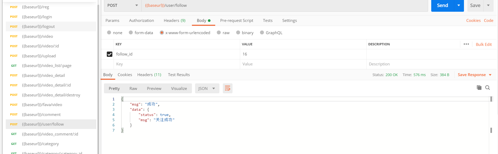
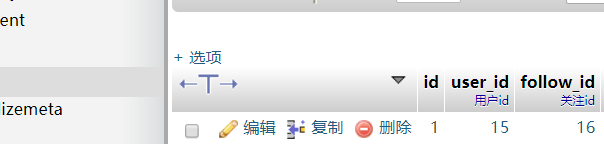
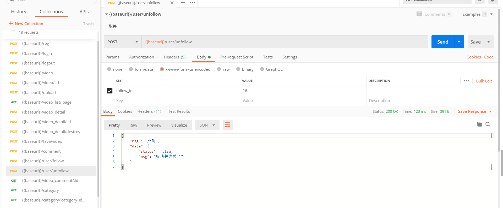
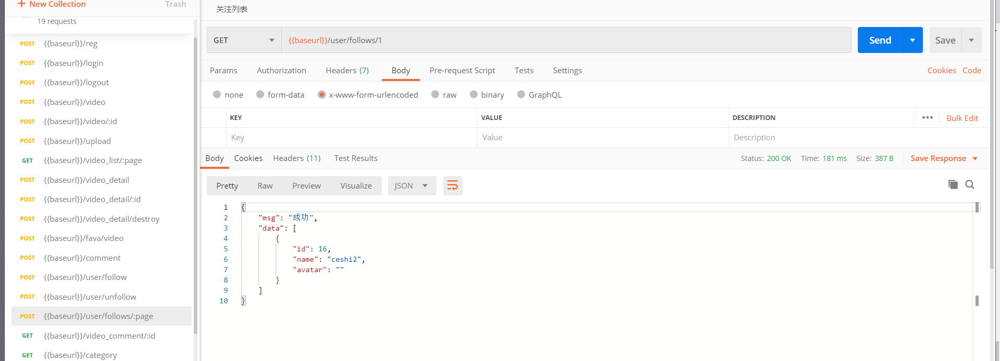

# 关注相关

## 数据表设计和迁移

| 字段         | 类型     | 空   | 默认   | 链接到     | 注释   |
| ------------ | -------- | ---- | ------ | ---------- | ------ |
| id *(主键)*  | int(20)  | 否   |        |            |        |
| user_id      | int(11)  | 是   | *NULL* | user -> id | 用户id |
| follow_id    | int(11)  | 是   | *NULL* | user -> id | 关注id |
| created_time | datetime | 是   | *NULL* |            |        |
| updated_time | datetime | 是   | *NULL* |            |        |

创建数据迁移表

```js
npx sequelize migration:generate --name=follow
```

1.执行完命令后，会在database / migrations / 目录下生成数据表迁移文件，然后定义

```js
'use strict';

module.exports = {
  up: (queryInterface, Sequelize) => {
    const { INTEGER, STRING, DATE, ENUM, TEXT } = Sequelize;
    return queryInterface.createTable('follow', {
      id: {
        type: INTEGER(20),
        primaryKey: true,
        autoIncrement: true
      },
      user_id: {
        type: INTEGER,
        allowNull: true,
        comment: '用户id',
        references: {
          model: 'user',
          key: 'id'
        },
        onDelete: 'cascade',
        onUpdate: 'restrict', // 更新时操作
      },
      follow_id: {
        type: INTEGER,
        allowNull: true,
        comment: '关注id',
        references: {
          model: 'user',
          key: 'id'
        },
        onDelete: 'cascade',
        onUpdate: 'restrict', // 更新时操作
      },
      created_time: DATE,
      updated_time: DATE
    });
  },

  down: (queryInterface, Sequelize) => {
    return queryInterface.dropTable('follow');
  }
};
```

- 执行 migrate 进行数据库变更

```js
npx sequelize db:migrate
```

模型创建

```js
// app/model/follow.js
module.exports = app => {
    const { STRING, INTEGER, DATE, ENUM, TEXT } = app.Sequelize;

    const Follow = app.model.define('follow', {
        id: {
            type: INTEGER(20),
            primaryKey: true,
            autoIncrement: true
        },
        user_id: {
            type: INTEGER,
            allowNull: true,
            comment: '用户id'
        },
        follow_id: {
            type: INTEGER,
            allowNull: true,
            defaultValue: 0,
            comment: '关注id'
        },
        created_time: DATE,
        updated_time: DATE
    });

    // 关联关系
    Follow.associate = function (models) {
        // 关联粉丝
        Follow.belongsTo(app.model.User, {
            as: 'user_follow',
            foreignKey: 'follow_id'
        });
        // 关联粉丝
        Follow.belongsTo(app.model.User, {
            as: 'user_fen',
            foreignKey: 'user_id'
        });
    }

    return Follow;
};
```

## 关注用户

控制器：app/controller/user.js

```js
// 关注
async follow() {
  const { ctx, service, app } = this;
  let currentUser = ctx.authUser;

  ctx.validate({
    follow_id: {
      type: 'int',
      required: true,
      desc: '用户ID'
    },
  });

  let { follow_id } = ctx.request.body;
	
  let where = {
    user_id: currentUser.id,
    follow_id
  }

  let follow = await app.model.Follow.findOne({ where });

  if (follow) {
    return ctx.apiFail('你已经关注过了');
  }

  // 调用serice/user的exist方法判断用户是否存在
  if (!await service.user.exist(follow_id)) {
    return ctx.apiFail('对方不存在');
  }

  // 不能关注自己
  if (currentUser.id === follow_id) {
    return ctx.apiFail('不能关注自己');
  }

  let res = await app.model.Follow.create({ ...where });

  ctx.apiSuccess({
    status: true,
    msg: "关注成功"
  });
}
```

服务：app/service/user.js

```js
'use strict';

const Service = require('egg').Service;

class UserService extends Service {
  // 用户是否存在
  async exist(user_id) {
    const { app } = this;
    return await app.model.User.findOne({
      where: {
        id: user_id
      }
    });
  }
}

module.exports = UserService;

```

路由：app/router.js

```js
// 关注
router.post('/user/follow', controller.user.follow);
```





## 取消关注

[点击进入视频教程地址](https://study.163.com/provider/480000001892585/index.htm?share=2&shareId=480000001892585)

控制器：app/controller/user.js

```js
// 取消关注
async unfollow() {
  const { ctx, service, app } = this;
  let currentUser = ctx.authUser;

  ctx.validate({
    follow_id: {
      type: 'int',
      required: true,
      desc: '用户ID'
    },
  });

  let { follow_id } = ctx.request.body;

  let where = {
    user_id: currentUser.id,
    follow_id
  }

  let follow = await app.model.Follow.findOne({ where });

  if (!follow) {
    return ctx.apiFail('你还没关注对方');
  }

  let res = await follow.destroy();

  ctx.apiSuccess({
    status: false,
    msg: "取消关注成功"
  });
}
```

路由：app/router.js

```js
// 取消关注
router.post('/user/unfollow', controller.user.unfollow);
```



## 我的关注列表

控制器：app/controller/user.js

```js
// 我的关注列表
async follows() {
  const { ctx, service, app } = this;
  let currentUser = ctx.authUser;

  let rows = await ctx.page(app.model.Follow, {
    user_id: currentUser.id
  }, {
    include: [{
      model: app.model.User,
      as: "user_follow",
      attributes: ['id', 'username', 'nickname', 'avatar']
    }]
  });

  rows = rows.map(item => {
    return {
      id: item.user_follow.id,
      name: item.user_follow.nickname || item.user_follow.username,
      avatar: item.user_follow.avatar
    }
  });

  ctx.apiSuccess(rows);
}
```

路由：app/router.js

```js
// 我的关注列表
router.get('/user/follows/:page', controller.user.follows);
```



## 我的粉丝列表

控制器：app/controller/user.js

```js
// 我的粉丝列表
async fens() {
  const { ctx, service, app } = this;
  let currentUser = ctx.authUser;

  let rows = await ctx.page(app.model.Follow, {
    follow_id: currentUser.id
  }, {
    include: [{
      model: app.model.User,
      as: "user_fen",
      attributes: ['id', 'username', 'nickname', 'avatar']
    }]
  });

  rows = rows.map(item => {
    return {
      id: item.user_fen.id,
      name: item.user_fen.nickname || item.user_fen.username,
      avatar: item.user_fen.avatar
    }
  });

  ctx.apiSuccess(rows);
}
```

路由：app/router.js

```js
// 我的粉丝列表
router.get('/user/fans/:page', controller.user.fens);
```